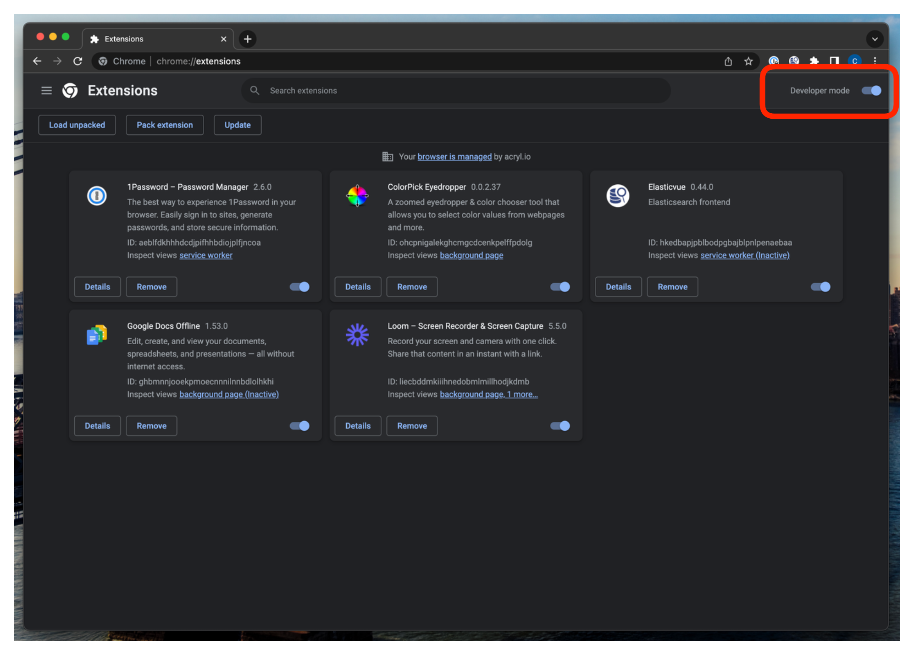
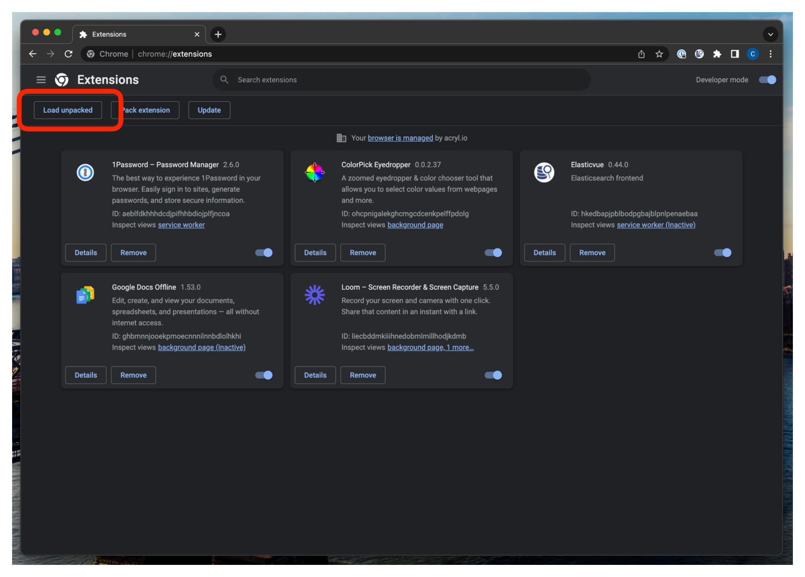
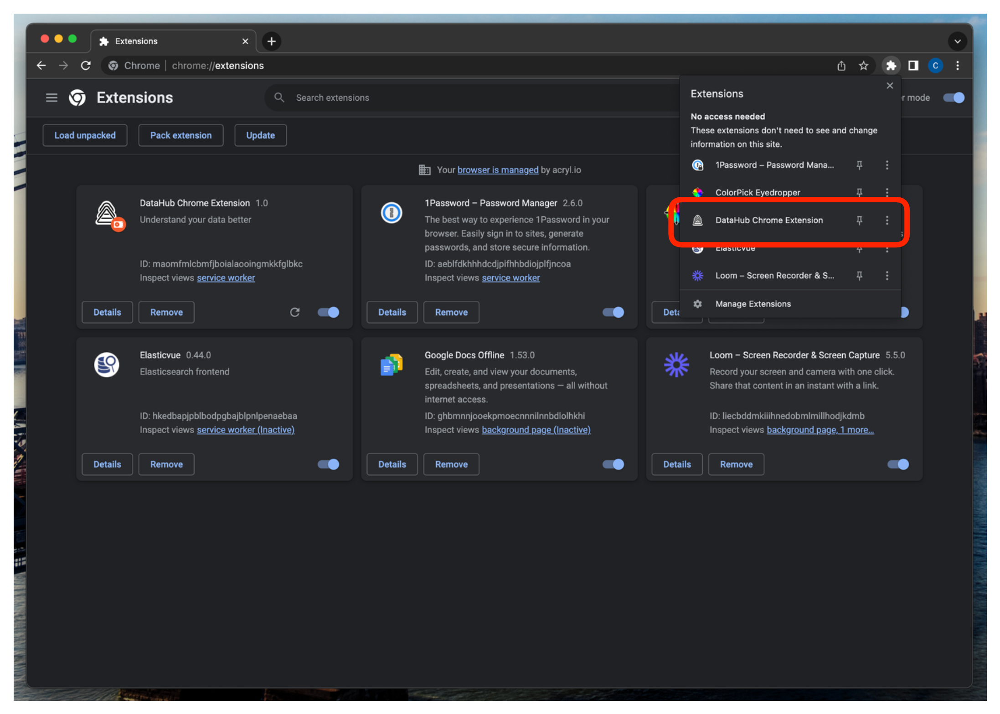
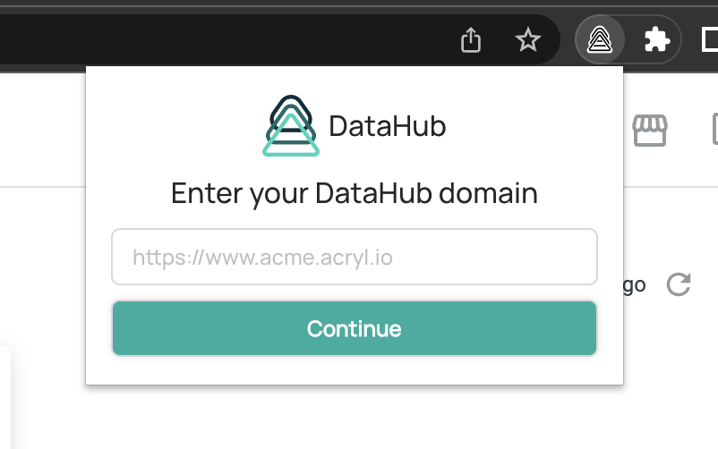
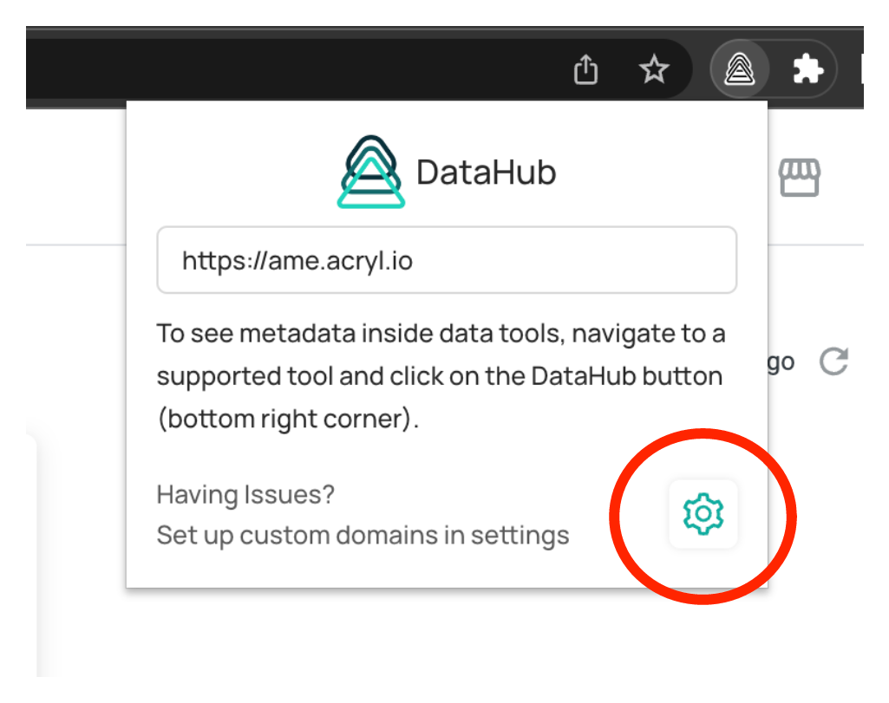
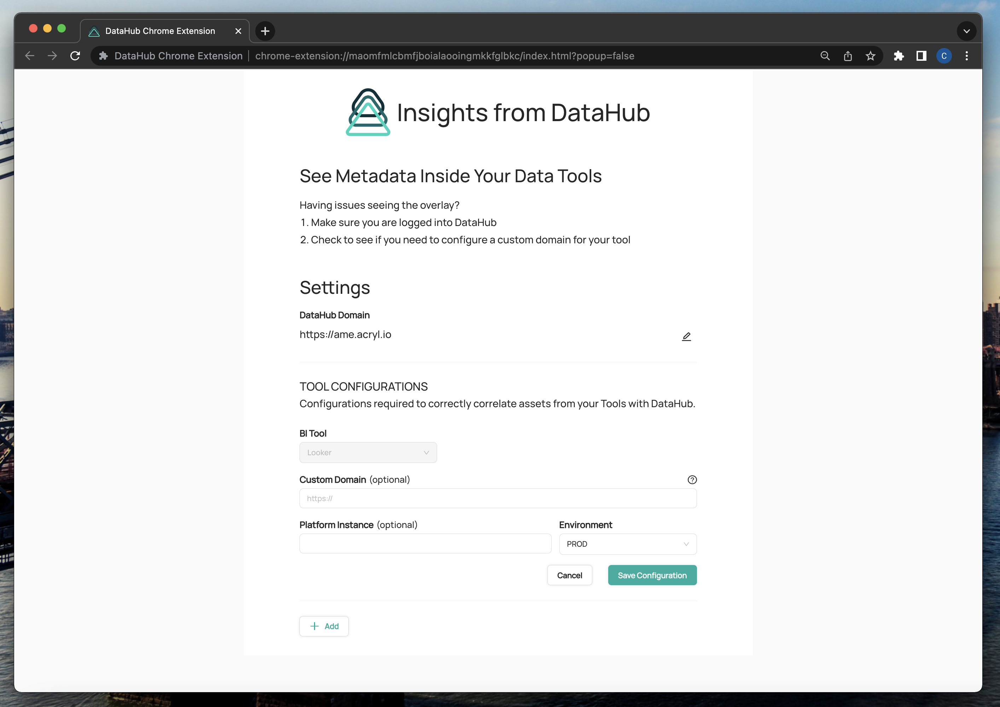
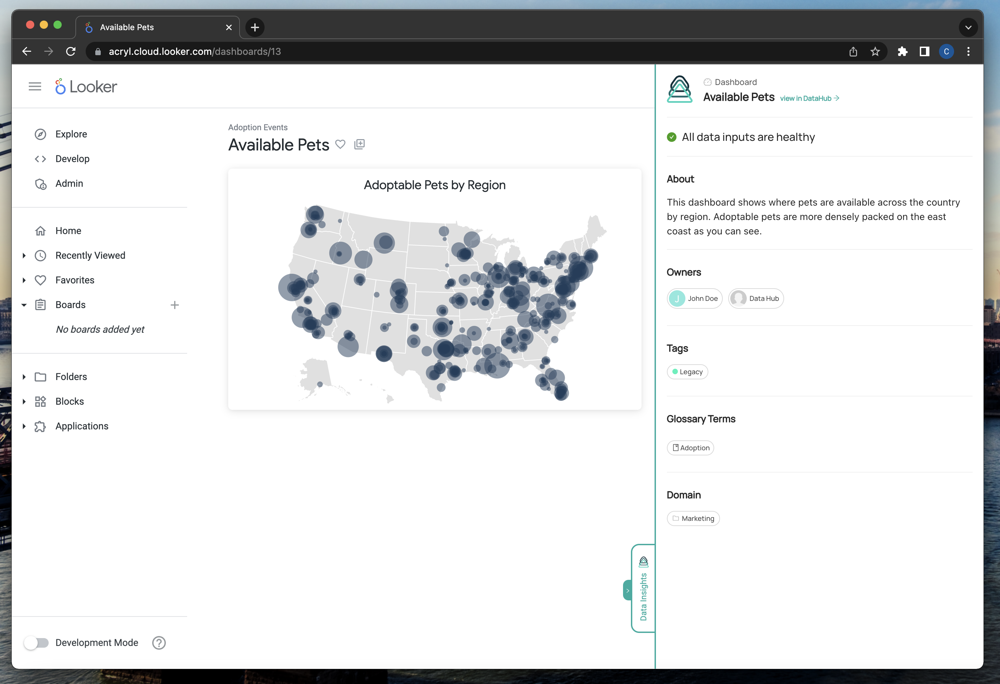

import FeatureAvailability from '@site/src/components/FeatureAvailability';

# Local Chrome Extension
<FeatureAvailability saasOnly />

## Installing the Extension

In order to use the Acryl DataHub Chrome extension before it's available on the Chrome store, you'll need to upload the same folder we're providing to the Chrome store on your own browser. The steps involved are:

1. In Chrome, open a new tab and navigate to `chrome://extensions/`

2. Enable developer mode by clicking the toggle on the top right of the page

3. Click **Load unpacked** on the top left of the page and choose the folder that we provided you

Now you have the Acryl DataHub Chrome extension installed on your browser!

## Configuring the Extension

Once you have your extension installed, you'll need to configure it to work with your Acryl DataHub deployment.

1. Click the extension button on the right of your browser's address bar to view all of your installed extensions. Click on the newly installed DataHub extension.

2. Fill in your DataHub domain and click "Continue" in the extension popup that appears.

If your organization uses standard SaaS domains for Looker, you should be ready to go!

### Additional Configurations

Some organizations have custom SaaS domains for Looker and some Acryl DataHub deployments utilize **Platform Instances** and set custom **Environments** when creating DataHub assets. If any of these situations applies to you, please follow the next few steps to finish configuring your extension.

1. Click on the extension button and select your DataHub extension to open the popup again. Now click the settings icon in order to open the configurations page.

2. Fill out any and save custom configurations you have in the **TOOL CONFIGURATIONS** section. Here you can configure a custom domain, a Platform Instance associated with that domain, and the Environment set on your DataHub assets. If you don't have a custom domain but do have a custom Platform Instance or Environment, feel free to leave the field domain empty.

## Using the Extension

Once you have everything configured on your extension, it's time to use it!

1. First ensure that you are logged in to your Acryl DataHub instance.

2. Navigate to Looker and log in to view your data assets.

3. Navigate to a page where DataHub can provide insights on your data assets (Dashboards and Explores).

4. Click the Acryl DataHub extension button on the bottom right of your page to open a drawer where you can now see additional information about this asset right from your DataHub instance.

