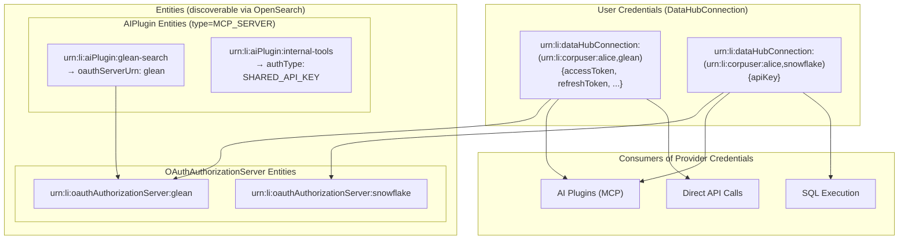
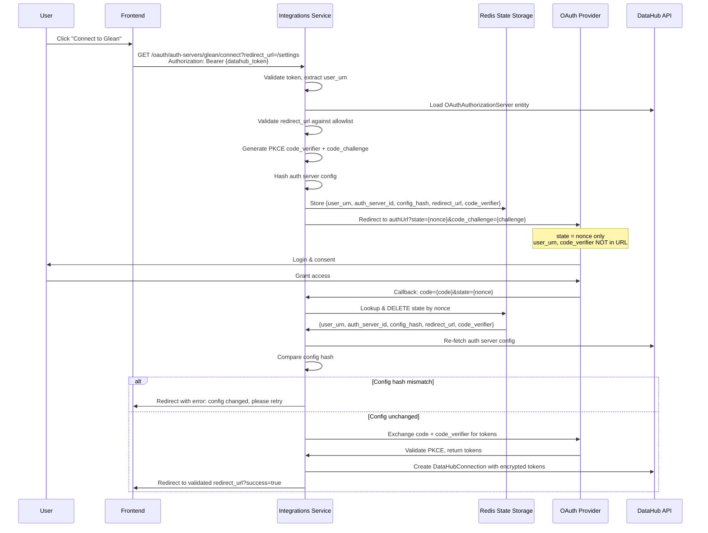

# Provider OAuth and AI Plugin Integration - Implementation Plan

> **Object Model**: See [AI Plugins and Provider OAuth - Object Model](./ai-plugins-object-model.md) for the definitive entity definitions, ERD, and design rationale.

## Overview

Two separate but connected features:

1. **Generic Provider OAuth** - User-level authentication with external providers (Snowflake, Glean, GitHub, etc.)
2. **AI Plugin Configuration** - Admin-configured AI plugins (currently MCP servers, extensible to other protocols)

**Key Entities:**

- `OAuthAuthorizationServer` - Entity for OAuth provider configuration
- `AIPlugin` - Entity with common properties + type-specific aspects (e.g., `mcpServerProperties`)
- `DataHubConnection` - User credentials for each authorization server (encrypted JSON payload)

## Implementation Tasks

| ID                    | Task                                                                        | Status  |
| --------------------- | --------------------------------------------------------------------------- | ------- |
| redis-infra           | Add Redis to Helm chart and Docker Compose                                  | pending |
| pdl-oauth-auth-server | Create OAuthAuthorizationServer entity (key + properties PDL)               | pending |
| pdl-ai-plugin         | Create AIPlugin entity (key + aiPluginProperties + mcpServerProperties PDL) | pending |
| entity-registry       | Register OAuthAuthorizationServer and AIPlugin in entity-registry.yml       | pending |
| oauth-endpoints       | Implement OAuth endpoints for auth server entities                          | pending |
| oauth-state-storage   | Implement secure server-side OAuth state storage (Redis)                    | pending |
| credential-storage    | Implement credential storage using DataHubConnection                        | pending |
| token-refresh         | Implement token refresh with distributed locks (Redis)                      | pending |
| mcp-manager           | Update ExternalMCPManager to load AIPlugin entities from OpenSearch         | pending |
| chat-integration      | Integrate external MCP tools into chat session                              | pending |
| graphql-auth-servers  | Add GraphQL API for OAuthAuthorizationServer entities                       | pending |
| graphql-ai-plugins    | Add GraphQL API for AIPlugin entities                                       | pending |
| admin-ui-auth-servers | Build admin UI for OAuth auth server configuration                          | pending |
| admin-ui-ai-plugins   | Build admin UI for AI plugin configuration                                  | pending |
| user-ui-connections   | Build user UI for auth server connections                                   | pending |

## Architecture



---

## Part 1: Generic Provider OAuth System

### Data Models

> **See Object Model**: [OAuthAuthorizationServer Entity](./ai-plugins-object-model.md#oauthauthorizationserver-entity)

**OAuthAuthorizationServer** is a first-class entity (not stored in GlobalSettings):

- URN format: `urn:li:oauthAuthorizationServer:<id>`
- Key aspect: `oauthAuthorizationServerKey`
- Properties aspect: `oauthAuthorizationServerProperties`

Key fields: `displayName`, `supportedCredentialTypes` (API_KEY, OAUTH), `clientId`, `clientSecretUrn` (DataHubSecret), `authorizationUrl`, `tokenUrl`, `scopes` (array), `tokenAuthMethod`, `additionalTokenParams`, `additionalAuthParams`

**Token Endpoint Behavior by Provider:**

| Provider        | tokenAuthMethod | additionalTokenParams | Refresh Token Rotation |
| --------------- | --------------- | --------------------- | ---------------------- |
| Google          | POST_BODY       | -                     | No                     |
| Microsoft/Azure | POST_BODY       | resource or scope     | Yes                    |
| Auth0           | POST_BODY       | audience              | Configurable           |
| Okta            | BASIC           | -                     | Configurable           |
| GitHub          | POST_BODY       | -                     | No                     |

**Important**: Always store the `refresh_token` from token responses if present - some providers rotate refresh tokens on every refresh.

**Scope Merging:**

```python
def get_effective_scopes(auth_server_urn: str) -> List[str]:
    """Compute effective scopes for OAuth flow."""
    auth_server = load_entity(auth_server_urn)
    scopes = set(auth_server.scopes or [])

    # Add required scopes from all AI plugins using this auth server
    for ai_plugin in search_ai_plugins_by_oauth_server(auth_server_urn):
        mcp_props = ai_plugin.mcp_server_properties
        if mcp_props and mcp_props.required_scopes:
            scopes.update(mcp_props.required_scopes)

    return sorted(scopes)  # Sort for consistent hashing
```

**UI Considerations for Scopes:**

- Auth server config: render base scopes as editable chips
- AI plugin config: render requiredScopes as chips, show which auth server they'll be added to
- User connect flow: show merged scope list before OAuth redirect

### User Credentials (DataHubConnection)

> **See Object Model**: [User Credentials](./ai-plugins-object-model.md#user-credentials-datahubconnection)

**DataHubConnection** stores user credentials (following Slack/Teams pattern):

- URN format: `urn:li:dataHubConnection:(<userUrn>,<authServerId>)`
- JSON payload encrypted internally (no separate DataHubSecret for tokens)

**OAuth credential payload:**

```json
{
  "type": "OAUTH",
  "accessToken": "encrypted_token",
  "refreshToken": "encrypted_refresh_token",
  "expiresAt": 1705276800000,
  "providerUserId": "alice@company.com",
  "providerUserDisplayName": "Alice Smith"
}
```

**API key credential payload:**

```json
{
  "type": "API_KEY",
  "apiKey": "encrypted_api_key"
}
```

### Backend: Provider OAuth Endpoints

```python
# datahub_integrations/oauth/auth_servers.py

@router.get("/oauth/auth-servers")
def list_auth_servers() -> List[AuthServerInfo]:
    """List all OAuthAuthorizationServer entities (via OpenSearch)."""

@router.get("/oauth/auth-servers/{auth_server_id}")
def get_auth_server(auth_server_id: str) -> AuthServerInfo:
    """Get a specific auth server's public config (no secrets)."""

@router.get("/oauth/auth-servers/{auth_server_id}/status")
def get_user_connection_status(
    auth_server_id: str,
    authorization: str = Header(...)
) -> ConnectionStatus:
    """Check if user has DataHubConnection for this auth server."""
    user_urn = get_user_from_token(authorization)
    # Load DataHubConnection entity

@router.get("/oauth/auth-servers/{auth_server_id}/connect")
def start_oauth(
    auth_server_id: str,
    redirect_url: str,
    authorization: str = Header(...)  # User must be authenticated
) -> RedirectResponse:
    """Initiate OAuth flow - redirects to provider's authorization URL.

    SECURITY: User identity comes from authenticated DataHub token,
    stored server-side with nonce. Never passed in URL.
    """
    user_urn = get_user_from_token(authorization)
    # Load OAuthAuthorizationServer entity
    # See "Secure OAuth State Management" section below

@router.get("/oauth/callback")
async def oauth_callback(code: str, state: str) -> RedirectResponse:
    """Handle OAuth callback from provider.

    SECURITY: User identity retrieved from server-side state storage,
    NOT from URL parameters.
    """
    # See "Secure OAuth State Management" section below

@router.post("/oauth/auth-servers/{auth_server_id}/api-key")
async def save_api_key(
    auth_server_id: str,
    api_key: str,
    authorization: str = Header(...)
) -> None:
    """Save user's API key - creates DataHubConnection entity."""
    user_urn = get_user_from_token(authorization)
    # Create/update DataHubConnection with API_KEY payload

@router.delete("/oauth/auth-servers/{auth_server_id}/credentials")
async def disconnect(
    auth_server_id: str,
    authorization: str = Header(...)
) -> None:
    """Remove user's credentials - deletes DataHubConnection entity."""
    user_urn = get_user_from_token(authorization)
    # Delete DataHubConnection entity
```

### Secure OAuth State Management

**Problem**: OAuth callbacks come via browser redirect. We need to:

1. Know which user initiated the flow (without passing `user_urn` in URL)
2. Store PKCE `code_verifier` securely (not in cookies)
3. Validate redirect URLs against allowlist (prevent open redirects)
4. Detect mid-flight admin config changes

**Solution**: Server-side state storage with cryptographic nonce using Redis.

**See RFC**: [Redis as Shared Infrastructure](../../rfcs/active/000-redis-infrastructure.md)

```python
# datahub_integrations/oauth/state_storage.py

# Allowlist of valid redirect URL prefixes
ALLOWED_REDIRECT_PREFIXES = [
    "/settings/",
    "/integrations/",
]

class OAuthStateStorage:
    """Server-side storage for OAuth state and PKCE verifier.

    SECURITY:
    - user_urn is NEVER passed in URLs - stored server-side
    - code_verifier stored server-side (not in cookies)
    - redirect_url validated against allowlist
    - Single-use nonces prevent replay attacks
    - Auth server config hash prevents mid-flight admin edits from causing issues
    """

    def __init__(self, redis: Redis):
        self._redis = redis
        self._state_ttl = 600  # 10 minutes

    def create_state(
        self,
        user_urn: str,
        auth_server_id: str,
        auth_server_props: OAuthAuthorizationServerProperties,
        redirect_url: str,
    ) -> tuple[str, str]:
        """Create OAuth state with PKCE.

        Args:
            user_urn: Authenticated user (from DataHub token)
            auth_server_id: OAuthAuthorizationServer entity ID
            auth_server_props: Current auth server properties (for versioning)
            redirect_url: Where to redirect after OAuth

        Returns:
            Tuple of (state_nonce, code_challenge)

        Raises:
            ValueError: If redirect_url not in allowlist
        """

        # SECURITY: Validate redirect URL against allowlist
        if not self._is_valid_redirect(redirect_url):
            raise ValueError(f"Invalid redirect_url: {redirect_url}")

        # Generate cryptographic nonce for state
        nonce = secrets.token_urlsafe(32)

        # Generate PKCE code_verifier and code_challenge
        code_verifier = secrets.token_urlsafe(64)
        code_challenge = base64.urlsafe_b64encode(
            hashlib.sha256(code_verifier.encode()).digest()
        ).decode().rstrip("=")

        # SECURITY: Capture auth server config hash to detect mid-flight changes
        config_hash = self._hash_auth_server_config(auth_server_props)

        # Store everything server-side (nothing sensitive in URL)
        self._redis.setex(
            f"oauth_state:{nonce}",
            self._state_ttl,
            json.dumps({
                "user_urn": user_urn,
                "auth_server_id": auth_server_id,
                "config_hash": config_hash,
                "redirect_url": redirect_url,
                "code_verifier": code_verifier,
                "created_at": time.time(),
            })
        )

        return nonce, code_challenge

    def consume_state(self, nonce: str, current_auth_server_props: OAuthAuthorizationServerProperties) -> Optional[dict]:
        """Retrieve and DELETE state (single-use).

        SECURITY:
        - Single-use prevents replay attacks
        - user_urn comes from server storage, not URL
        - code_verifier retrieved for PKCE token exchange
        - Auth server config hash validated to detect mid-flight changes
        - Returns None if state doesn't exist or expired

        Raises:
            AuthServerConfigChangedError: If auth server config changed since flow started
        """
        key = f"oauth_state:{nonce}"

        # Atomic get-and-delete (single-use)
        pipe = self._redis.pipeline()
        pipe.get(key)
        pipe.delete(key)
        data, _ = pipe.execute()

        if not data:
            return None

        state = json.loads(data)

        # Verify not expired
        if time.time() - state["created_at"] > self._state_ttl:
            return None

        # SECURITY: Verify auth server config hasn't changed mid-flight
        current_hash = self._hash_auth_server_config(current_auth_server_props)
        if state["config_hash"] != current_hash:
            raise AuthServerConfigChangedError(
                f"Auth server config changed during OAuth flow. Please restart connection."
            )

        return state

    def _hash_auth_server_config(self, props: OAuthAuthorizationServerProperties) -> str:
        """Hash security-relevant fields of auth server config.

        Changes to these fields invalidate in-flight OAuth flows:
        - clientId: Different OAuth app
        - authorizationUrl: User may have authorized wrong endpoint
        - tokenUrl: Token exchange would go to wrong endpoint
        - scopes: Token may have different permissions than expected
        - tokenAuthMethod: Token exchange would use wrong auth method
        - additionalTokenParams: Token exchange would have wrong params
        - additionalAuthParams: Auth request would have wrong params

        NOT included (changes are safe mid-flight):
        - displayName, description, iconUrl: Cosmetic only
        """
        relevant_fields = {
            "clientId": props.client_id,
            "authorizationUrl": props.authorization_url,
            "tokenUrl": props.token_url,
            "scopes": sorted(props.scopes or []),  # Sort for consistent hashing
            "tokenAuthMethod": props.token_auth_method,
            "additionalTokenParams": props.additional_token_params,
            "additionalAuthParams": props.additional_auth_params,
        }
        return hashlib.sha256(
            json.dumps(relevant_fields, sort_keys=True).encode()
        ).hexdigest()[:16]

    def _is_valid_redirect(self, redirect_url: str) -> bool:
        """Validate redirect URL against allowlist.

        SECURITY: Prevents open redirect attacks.
        """
        if redirect_url.startswith(("http://", "https://")):
            return False

        return any(
            redirect_url.startswith(prefix)
            for prefix in ALLOWED_REDIRECT_PREFIXES
        )

class AuthServerConfigChangedError(Exception):
    """Raised when auth server config changed during OAuth flow."""
    pass
```

**Provider Config Hash** (security-relevant fields only):

- `clientId`, `authorizationUrl`, `tokenUrl`, `scopes`, `tokenAuthMethod`, `additionalTokenParams`, `additionalAuthParams`

**OAuth Flow with Secure State + PKCE:**



**Security Properties:**

| Attack                                 | Mitigation                                               |
| -------------------------------------- | -------------------------------------------------------- |
| Attacker forges user_urn in URL        | user_urn never in URL - comes from server storage        |
| Attacker replaces nonce with their own | Their nonce maps to their user_urn, not victim's         |
| Attacker intercepts authorization code | PKCE: can't exchange without code_verifier (server-side) |
| Attacker replays old nonce             | Single-use: nonce deleted after first use                |
| Attacker guesses nonce                 | 256-bit cryptographic randomness                         |
| State sits unused forever              | 10-minute TTL auto-expiry                                |
| Open redirect attack                   | redirect_url validated against allowlist                 |
| Admin changes config mid-flow          | config_hash validated on callback                        |

### Token Storage and Refresh

**Refresh Strategy:**

- **Primary**: On-demand refresh in `get_access_token()` - this is the correctness path
- **Secondary**: Background refresh - optimization to reduce latency spikes

**Why Blocking Locks Are Required:**

Some providers (Azure AD, Auth0) **rotate refresh tokens** on each refresh. Concurrent refresh attempts can permanently lose the refresh token:

```
Request A: refresh(R1) → Provider invalidates R1, returns R2
Request B: refresh(R1) → Provider rejects R1 (already invalidated) → FAIL
User loses access (refresh token gone forever)
```

**Solution**: Per-(user,auth_server) distributed lock using Redis before any refresh operation.

```python
# datahub_integrations/oauth/credential_storage.py

# Refresh buffer: refresh if token expires within this many seconds
# Accounts for clock skew and request latency
REFRESH_BUFFER_SECONDS = 300  # 5 minutes

class CredentialStorage:
    """Credential storage using DataHubConnection entities.

    DataHubConnection stores credentials as encrypted JSON payload (internal encryption).
    No separate DataHubSecret entities needed for user tokens.

    Token refresh strategy:
      1. On-demand refresh (primary): get_access_token() checks expiry and refreshes if needed
      2. Background refresh (optimization): reduces latency spikes but not relied on for correctness

    Concurrency: Uses per-(user,auth_server) Redis lock to prevent concurrent refresh races.
    """

    def __init__(self, graph: DataHubGraph, lock_provider: LockProvider):
        self._graph = graph
        self._lock_provider = lock_provider

    async def store_oauth_tokens(
        self, user_urn: str, auth_server_id: str,
        access_token: str, refresh_token: Optional[str],
        expires_at: Optional[int], user_info: Optional[dict]
    ) -> None:
        """Store OAuth tokens in DataHubConnection entity.

        Creates/updates DataHubConnection with encrypted JSON payload:
        {type: "OAUTH", accessToken, refreshToken, expiresAt, providerUserId, ...}
        """
        connection_urn = f"urn:li:dataHubConnection:({user_urn},{auth_server_id})"
        payload = {
            "type": "OAUTH",
            "accessToken": access_token,
            "refreshToken": refresh_token,
            "expiresAt": expires_at,
            "providerUserId": user_info.get("id") if user_info else None,
            "providerUserDisplayName": user_info.get("name") if user_info else None,
        }
        # DataHubConnection encrypts payload internally
        await self._graph.upsert_connection(connection_urn, payload)

    async def store_api_key(
        self, user_urn: str, auth_server_id: str, api_key: str
    ) -> None:
        """Store API key in DataHubConnection entity."""
        connection_urn = f"urn:li:dataHubConnection:({user_urn},{auth_server_id})"
        payload = {"type": "API_KEY", "apiKey": api_key}
        await self._graph.upsert_connection(connection_urn, payload)

    async def get_access_token(
        self, user_urn: str, auth_server_id: str, auto_refresh: bool = True
    ) -> Optional[str]:
        """Get decrypted access token, refresh on-demand if needed.

        This is the PRIMARY refresh path - don't rely on background refresh.

        Steps:
          1. Load DataHubConnection entity
          2. Decrypt JSON payload
          3. Check expiry (with REFRESH_BUFFER_SECONDS for clock skew)
          4. If expired/expiring and auto_refresh=True:
             a. Acquire per-(user,auth_server) lock
             b. Double-check expiry (may have been refreshed by another request)
             c. Refresh token with provider
             d. Store new tokens atomically
             e. Release lock
          5. Return access token
        """
        creds = await self._load_connection(user_urn, auth_server_id)
        if not creds or creds.get("type") != "OAUTH":
            return None

        # Check if refresh needed (with buffer for clock skew)
        expires_at = creds.get("expiresAt")
        needs_refresh = (
            expires_at and
            expires_at < (time.time() * 1000) + (REFRESH_BUFFER_SECONDS * 1000)
        )

        if needs_refresh and auto_refresh and creds.get("refreshToken"):
            await self._refresh_with_lock(user_urn, auth_server_id, creds)
            # Reload after refresh
            creds = await self._load_connection(user_urn, auth_server_id)

        return creds.get("accessToken")

    async def _refresh_with_lock(
        self, user_urn: str, auth_server_id: str, creds: dict
    ) -> None:
        """Refresh token with concurrency lock.

        Prevents race condition where multiple requests refresh simultaneously.
        Critical for providers that rotate refresh tokens.
        """
        lock_key = f"token_refresh:{user_urn}:{auth_server_id}"

        async with self._lock_provider.acquire(lock_key, timeout=30):
            # Double-check: another request may have refreshed while we waited
            fresh_creds = await self._load_connection(user_urn, auth_server_id)
            if fresh_creds is None:
                return  # Connection was deleted, nothing to refresh
            if fresh_creds.get("expiresAt", 0) > (time.time() * 1000) + (REFRESH_BUFFER_SECONDS * 1000):
                return  # Already refreshed by another request

            # Load auth server entity for token URL
            auth_server = await self._load_auth_server(auth_server_id)

            # Call provider's token endpoint
            new_tokens = await self._exchange_refresh_token(
                auth_server, creds.get("refreshToken")
            )

            # Store new tokens atomically
            # IMPORTANT: Always use new refresh_token if returned (rotation)
            await self.store_oauth_tokens(
                user_urn, auth_server_id,
                access_token=new_tokens["access_token"],
                refresh_token=new_tokens.get("refresh_token", creds.get("refreshToken")),
                expires_at=self._calculate_expiry(new_tokens),
                user_info=None,  # Preserve existing user_info
            )

    async def get_api_key(
        self, user_urn: str, auth_server_id: str
    ) -> Optional[str]:
        """Get decrypted API key from DataHubConnection."""
        creds = await self._load_connection(user_urn, auth_server_id)
        if not creds or creds.get("type") != "API_KEY":
            return None
        return creds.get("apiKey")

    async def delete_credentials(
        self, user_urn: str, auth_server_id: str
    ) -> None:
        """Delete DataHubConnection entity."""
        connection_urn = f"urn:li:dataHubConnection:({user_urn},{auth_server_id})"
        await self._graph.delete_entity(connection_urn)

    async def decrypt_secret(self, secret_urn: str) -> Optional[str]:
        """Decrypt a DataHubSecret by URN.

        Used for system-level secrets (clientSecret, sharedApiKey)
        which are stored as URNs in entity properties.
        """

    async def _exchange_refresh_token(
        self,
        auth_server: OAuthAuthorizationServerProperties,
        refresh_token: str
    ) -> dict:
        """Exchange refresh token for new access token.

        Handles provider-specific token endpoint behaviors:
        - tokenAuthMethod: How to authenticate (BASIC vs POST_BODY)
        - additionalTokenParams: Extra params like audience/resource
        - Refresh token rotation: Always store new refresh_token if returned
        """
        body = {
            "grant_type": "refresh_token",
            "refresh_token": refresh_token,
        }

        if auth_server.additional_token_params:
            body.update(auth_server.additional_token_params)

        headers = {"Content-Type": "application/x-www-form-urlencoded"}

        # Get client secret from DataHubSecret
        client_secret = None
        if auth_server.client_secret_urn:
            client_secret = await self.decrypt_secret(auth_server.client_secret_urn)

        # Apply authentication method
        if auth_server.token_auth_method == TokenAuthMethod.BASIC:
            import base64
            credentials = base64.b64encode(
                f"{auth_server.client_id}:{client_secret}".encode()
            ).decode()
            headers["Authorization"] = f"Basic {credentials}"
        elif auth_server.token_auth_method == TokenAuthMethod.POST_BODY:
            body["client_id"] = auth_server.client_id
            if client_secret:
                body["client_secret"] = client_secret

        async with httpx.AsyncClient() as client:
            response = await client.post(
                auth_server.token_url,
                data=body,
                headers=headers,
            )
            response.raise_for_status()
            return response.json()
```

```python
# datahub_integrations/oauth/token_refresh.py

class TokenRefreshService:
    """Background service to refresh expiring tokens.

    IMPORTANT: This is an OPTIMIZATION to reduce latency spikes.
    It is NOT relied on for correctness - get_access_token() handles
    refresh on-demand as the primary path.
    """

    def __init__(self, credential_storage: CredentialStorage):
        self._storage = credential_storage

    async def refresh_expiring_tokens(self, threshold_minutes: int = 15) -> None:
        """Proactively refresh tokens expiring within threshold.

        Run periodically (e.g., every 5 minutes) to reduce latency spikes
        from on-demand refresh. Even if this fails or misses tokens,
        get_access_token() will handle refresh correctly.

        Searches DataHubConnection entities with type=OAUTH and
        expiresAt within threshold.
        """
        expiring_connections = await self._find_expiring_connections(threshold_minutes)

        for conn in expiring_connections:
            try:
                # Reuse the same locked refresh logic
                await self._storage._refresh_with_lock(
                    conn.user_urn, conn.auth_server_id, conn.payload
                )
            except Exception as e:
                # Log but don't fail - on-demand refresh will handle it
                logger.warning(f"Background refresh failed for {conn.user_urn}/{conn.auth_server_id}: {e}")
```

```python
# datahub_integrations/oauth/locks.py

class LockProvider(Protocol):
    """Abstract lock provider for distributed locking."""

    @contextmanager
    async def acquire(self, key: str, timeout: int) -> AsyncIterator[None]:
        """Acquire lock, release when context exits."""
        ...

class RedisLockProvider(LockProvider):
    """Redis-based distributed lock."""

    def __init__(self, redis: Redis):
        self._redis = redis

    @contextmanager
    async def acquire(self, key: str, timeout: int) -> AsyncIterator[None]:
        lock = self._redis.lock(key, timeout=timeout)
        try:
            acquired = await lock.acquire(blocking=True, blocking_timeout=timeout)
            if not acquired:
                raise LockNotAcquiredError(f"Could not acquire lock: {key}")
            yield
        finally:
            try:
                await lock.release()
            except Exception:
                pass  # Lock may have expired

class LockNotAcquiredError(Exception):
    """Raised when lock cannot be acquired within timeout."""
    pass
```

---

## Part 2: AI Plugin Configuration

AI plugins (currently MCP servers) are configured as **entities** and **reference auth servers** for user authentication.

### Data Model

> **See Object Model**: [AIPlugin Entity](./ai-plugins-object-model.md#aiplugin-entity)

**AIPlugin** is a first-class entity with subtype aspects:

- URN format: `urn:li:aiPlugin:<id>`
- Common aspect: `aiPluginProperties` (displayName, description, type, enabled, instructions)
- Type-specific aspect: `mcpServerProperties` (url, transport, authType, oauthServerUrn, ...)

Key MCP-specific fields: `url`, `transport`, `authType`, `sharedApiKeyUrn`, `oauthServerUrn`, `requiredScopes`, `authLocation`, `authHeaderName`, `authScheme`, `authQueryParam`, `customHeaders`

**Auth Injection Examples:**

| AI Plugin       | authLocation | authHeaderName | authScheme | authQueryParam | Result                          |
| --------------- | ------------ | -------------- | ---------- | -------------- | ------------------------------- |
| OpenAI-style    | HEADER       | Authorization  | Bearer     | -              | `Authorization: Bearer <token>` |
| X-API-Key style | HEADER       | X-API-Key      | null       | -              | `X-API-Key: <key>`              |
| Custom header   | HEADER       | X-Custom-Token | null       | -              | `X-Custom-Token: <key>`         |
| Query param     | QUERY_PARAM  | -              | -          | api_key        | `?api_key=<key>`                |

**Auth Type Behavior:**

| authType       | How credentials are obtained                              |
| -------------- | --------------------------------------------------------- |
| NONE           | No auth needed                                            |
| SHARED_API_KEY | System secret from `mcpServerProperties.sharedApiKeyUrn`  |
| USER_API_KEY   | User's DataHubConnection for `oauthServerUrn` auth server |
| USER_OAUTH     | User's DataHubConnection for `oauthServerUrn` auth server |

### Backend: AI Plugin Manager

```python
# datahub_integrations/mcp_integration/external_mcp_manager.py

@dataclass
class AuthInjection:
    """Result of auth injection - how to send credentials to MCP server."""
    headers: Dict[str, str]
    query_params: Dict[str, str]

class ExternalMCPManager:
    """Manages external MCP server connections with user credentials.

    Loads AIPlugin entities from OpenSearch where type=MCP_SERVER.

    Supports flexible auth injection - different MCP servers may need:
      - Authorization: Bearer <token>
      - X-API-Key: <key>
      - Custom header with raw value
      - Query parameter (?api_key=xxx)
    """

    def __init__(
        self,
        graph: DataHubGraph,                  # For loading entities
        credential_storage: CredentialStorage, # For user credential lookup
        user_urn: str,
    ):
        self._graph = graph
        self._credential_storage = credential_storage
        self._user_urn = user_urn

    async def get_available_tools(self) -> List[ExternalToolWrapper]:
        """Get tools from AI plugins (MCP servers) the user can access."""
        tools = []

        # Search AIPlugin entities where type=MCP_SERVER and enabled=true
        ai_plugins = await self._search_enabled_mcp_plugins()

        for plugin in ai_plugins:
            mcp_props = plugin.mcp_server_properties
            if not mcp_props:
                continue

            # Get auth injection (headers/query params) based on config
            auth_injection = await self._build_auth_injection(mcp_props)

            if auth_injection is None and mcp_props.auth_type not in (MCPAuthType.NONE, MCPAuthType.SHARED_API_KEY):
                # User hasn't connected to required auth server, skip this plugin
                continue

            # Create client and discover tools
            tools.extend(await self._discover_tools(plugin, mcp_props, auth_injection))

        return tools

    async def _build_auth_injection(self, mcp_props: MCPServerProperties) -> Optional[AuthInjection]:
        """Build auth injection (headers/query params) for a plugin.

        Returns None if auth is required but user hasn't connected.
        """
        credential = await self._get_credential(mcp_props)

        if credential is None:
            if mcp_props.auth_type == MCPAuthType.NONE:
                return AuthInjection(headers={}, query_params={})
            return None

        # Inject based on authLocation config
        if mcp_props.auth_location == AuthLocation.QUERY_PARAM:
            param_name = mcp_props.auth_query_param or "token"
            return AuthInjection(
                headers={},
                query_params={param_name: credential}
            )
        else:  # HEADER (default)
            header_name = mcp_props.auth_header_name or "Authorization"

            if mcp_props.auth_scheme:
                header_value = f"{mcp_props.auth_scheme} {credential}"
            else:
                header_value = credential  # Raw value (e.g., for X-API-Key)

            return AuthInjection(
                headers={header_name: header_value},
                query_params={}
            )

    async def _get_credential(self, mcp_props: MCPServerProperties) -> Optional[str]:
        """Get raw credential value for a plugin.

        Shared API keys stored in DataHubSecret.
        User credentials stored in DataHubConnection.
        """
        if mcp_props.auth_type == MCPAuthType.NONE:
            return None
        elif mcp_props.auth_type == MCPAuthType.SHARED_API_KEY:
            if mcp_props.shared_api_key_urn:
                return await self._credential_storage.decrypt_secret(mcp_props.shared_api_key_urn)
            return None
        elif mcp_props.oauth_server_urn:
            # Extract auth server ID from URN
            auth_server_id = self._extract_auth_server_id(mcp_props.oauth_server_urn)
            if mcp_props.auth_type == MCPAuthType.USER_API_KEY:
                return await self._credential_storage.get_api_key(
                    self._user_urn, auth_server_id
                )
            else:  # USER_OAUTH
                return await self._credential_storage.get_access_token(
                    self._user_urn, auth_server_id
                )
        return None

    async def _discover_tools(
        self,
        plugin: AIPlugin,
        mcp_props: MCPServerProperties,
        auth_injection: Optional[AuthInjection]
    ) -> List[ExternalToolWrapper]:
        """Create MCP client and discover tools."""
        # Merge custom headers with auth headers
        headers = dict(mcp_props.custom_headers or {})
        if auth_injection:
            headers.update(auth_injection.headers)

        # Build URL with query params if needed
        url = mcp_props.url
        if auth_injection and auth_injection.query_params:
            from urllib.parse import urlencode, urlparse, urlunparse, parse_qs
            parsed = urlparse(url)
            existing_params = parse_qs(parsed.query)
            existing_params.update(auth_injection.query_params)
            new_query = urlencode(existing_params, doseq=True)
            url = urlunparse(parsed._replace(query=new_query))

        # Create transport with merged headers
        if mcp_props.transport == MCPTransport.SSE:
            transport = SSETransport(url=url, headers=headers)
        else:
            transport = StreamableHttpTransport(url=url, headers=headers)

        client = Client(transport, timeout=mcp_props.timeout)
        # ... discover and wrap tools ...
```

### Backend: Chat Integration

```python
# datahub_integrations/chat/chat_session_manager.py

def load_session(self, conversation_urn: str, ...) -> AgentRunner:
    # Get user URN from conversation
    user_urn = self._get_user_from_conversation(conversation_urn)

    # Create lock provider for token refresh
    lock_provider = RedisLockProvider(redis_client)

    # Create credential storage for user credential lookup
    credential_storage = CredentialStorage(self.system_client, lock_provider)

    # Create MCP manager with user context
    # AIPlugin entities loaded from OpenSearch
    external_mcp = ExternalMCPManager(
        graph=self.system_client,
        credential_storage=credential_storage,
        user_urn=user_urn,
    )

    # Get external tools user can access
    external_tools = await external_mcp.get_available_tools()

    # Combine with built-in tools
    all_tools = [mcp, *external_tools]

    return factory(client=self.tools_client, tools=all_tools, ...)
```

---

## Frontend UIs

### User Provider Settings

```
┌─────────────────────────────────────────────────────────────────┐
│  External Provider Connections                                  │
├─────────────────────────────────────────────────────────────────┤
│                                                                 │
│  ┌─────────────────────────────────────────────────────────┐   │
│  │ 🔍 Glean                                    [Connected] │   │
│  │ Enterprise search integration                           │   │
│  │ Connected as: alice@company.com                         │   │
│  │                                    [Disconnect]         │   │
│  └─────────────────────────────────────────────────────────┘   │
│                                                                 │
│  ┌─────────────────────────────────────────────────────────┐   │
│  │ ❄️ Snowflake                            [Not Connected] │   │
│  │ Data warehouse access                                   │   │
│  │ Auth: API Key                                           │   │
│  │ API Key: [________________________] [Save]              │   │
│  └─────────────────────────────────────────────────────────┘   │
│                                                                 │
│  ┌─────────────────────────────────────────────────────────┐   │
│  │ 🐙 GitHub                               [Not Connected] │   │
│  │ Code repository access                                  │   │
│  │ Auth: OAuth                                             │   │
│  │                                       [Connect]         │   │
│  └─────────────────────────────────────────────────────────┘   │
│                                                                 │
└─────────────────────────────────────────────────────────────────┘
```

### Admin AI Plugin Configuration

Admin UI for creating/editing AI plugins (MCP servers) with:

- Display Name, Description
- Type: MCP_SERVER (future: LANGCHAIN_TOOL, OPENAI_PLUGIN)
- Enabled toggle
- Instructions (LLM prompt for this plugin's tools)

**MCP-specific settings:**

- Server URL
- Transport (HTTP / SSE / WebSocket)
- Authentication Type (None / Shared API Key / User API Key / User OAuth 2.0)
- For Shared: API key field
- For User Auth: Auth Server dropdown (selects from OAuthAuthorizationServer entities)
- **Auth Injection Settings** (collapsed by default, show "Advanced"):
  - Auth Location: Header (default) / Query Parameter
  - For Header: Header Name (default "Authorization"), Scheme (default "Bearer", can be empty for raw)
  - For Query: Parameter Name (e.g., "api_key")
- Custom Headers (non-auth, e.g., X-Tenant-ID)

### Admin Auth Injection UI

```
┌─────────────────────────────────────────────────────────────────┐
│  Authentication                                                  │
├─────────────────────────────────────────────────────────────────┤
│  Type: [User OAuth 2.0 ▼]     Provider: [Glean ▼]              │
│                                                                 │
│  ▼ Advanced Auth Settings                                       │
│  ┌─────────────────────────────────────────────────────────────┐│
│  │ Send credential via: (●) Header  ( ) Query Parameter       ││
│  │                                                             ││
│  │ Header name:   [Authorization______]  (default)            ││
│  │ Scheme:        [Bearer_____________]  (leave empty for raw)││
│  │                                                             ││
│  │ Preview: Authorization: Bearer <token>                     ││
│  └─────────────────────────────────────────────────────────────┘│
└─────────────────────────────────────────────────────────────────┘
```

**Common Auth Presets:**

| Preset       | Header Name   | Scheme  | Query Param |
| ------------ | ------------- | ------- | ----------- |
| Bearer Token | Authorization | Bearer  | -           |
| X-API-Key    | X-API-Key     | (empty) | -           |
| Query Token  | -             | -       | api_key     |

### Secret Handling in Admin UI

When admin enters a secret (OAuth client secret or shared API key):

1. UI calls backend to create a `DataHubSecret` entity with the encrypted value
2. Backend returns the secret's URN (e.g., `urn:li:dataHubSecret:glean-client-secret`)
3. UI stores only the URN in the entity properties (`clientSecretUrn` or `sharedApiKeyUrn`)
4. UI displays secret field as "••••••••" with "Update" button (never shows actual value)

This ensures secrets never appear in:

- GraphQL responses (only URNs, which are opaque references)
- Browser network tab or localStorage
- Entity export/import
- Debug logs

**Note:** User credentials (access tokens, refresh tokens, API keys) are stored in `DataHubConnection` entities which encrypt their JSON payload internally - no separate DataHubSecret needed.

---

## Files to Create/Modify

### New Files

**Python (datahub-integrations-service):**

| File                          | Description                                           |
| ----------------------------- | ----------------------------------------------------- |
| `oauth/auth_servers.py`       | OAuth endpoints for OAuthAuthorizationServer entities |
| `oauth/state_storage.py`      | Redis-based OAuth state storage                       |
| `oauth/credential_storage.py` | Credential storage using DataHubConnection            |
| `oauth/token_refresh.py`      | Background token refresh                              |
| `oauth/locks.py`              | Redis distributed lock provider                       |

**PDL Models (new entities):**

| File                                     | Description              |
| ---------------------------------------- | ------------------------ |
| `OAuthAuthorizationServerKey.pdl`        | Entity key               |
| `OAuthAuthorizationServerProperties.pdl` | Entity properties        |
| `AIPluginKey.pdl`                        | Entity key               |
| `AIPluginProperties.pdl`                 | Common properties aspect |
| `MCPServerProperties.pdl`                | MCP-specific aspect      |

### Modified Files

| File                      | Changes                                                        |
| ------------------------- | -------------------------------------------------------------- |
| `entity-registry.yml`     | Add OAuthAuthorizationServer and AIPlugin entities             |
| `external_mcp_manager.py` | Load AIPlugin entities from OpenSearch, use credential_storage |
| `chat_session_manager.py` | Integrate MCP manager with user context                        |

### Frontend

| Component                  | Description                                                      |
| -------------------------- | ---------------------------------------------------------------- |
| Admin: Auth Servers        | Configure OAuthAuthorizationServer entities                      |
| Admin: AI Plugins          | Configure AIPlugin entities (MCP servers)                        |
| User: Provider Connections | Connect/disconnect from auth servers (creates DataHubConnection) |

---

## Security Considerations

1. **No plaintext secrets in entity config**: OAuth client secrets and shared API keys stored as DataHubSecret URNs
2. **User tokens encrypted in DataHubConnection**: No separate DataHubSecret needed for user credentials
3. **Secure OAuth state**: User identity stored server-side (Redis), never in URLs
4. **PKCE code_verifier server-side**: Never in cookies or URLs
5. **Single-use nonces**: OAuth state deleted on consumption (replay prevention)
6. **Redirect URL allowlist**: Prevents open redirect attacks
7. **PKCE required**: All OAuth flows use PKCE
8. **Short state TTL**: 10 minutes max
9. **Auth server config versioning**: Hash validated on callback to detect mid-flight changes
10. **Distributed state storage**: Redis for multi-instance deployments
11. **On-demand token refresh**: Primary path with clock skew buffer
12. **Background refresh as optimization**: Not relied on for correctness
13. **Refresh concurrency lock**: Per-(user,auth_server) Redis lock prevents races
14. **Atomic token updates**: Access token, refresh token, metadata updated together in DataHubConnection
15. **User identity from session**: Extract user_urn from DataHub auth token, not URL params
16. **Secret handling in UI**: Admin enters secret → backend creates DataHubSecret → UI stores URN only
17. **Scope merging**: Auth server base scopes + AI plugin required scopes merged and sorted for consistent hashing
18. **Refresh token rotation handling**: Always store new refresh_token from response if present

---

## Infrastructure: Redis

Redis is a **required dependency** when integrations service is enabled.

**See RFC**: [Redis as Shared Infrastructure](../../rfcs/active/000-redis-infrastructure.md)

**Used for:**

- OAuth state storage (nonce → {user_urn, code_verifier, ...})
- Token refresh distributed locks

**Key patterns:**

```
{tenant}:oauth:state:{nonce}                        # 10-min TTL
{tenant}:oauth:lock:refresh:{user}:{auth_server}    # 30-sec lock timeout
```

**Rollout:**

1. Add Redis to Helm chart (required when integrations service enabled)
2. Add Redis to Docker Compose for local dev
3. Support external Redis (AWS ElastiCache, Azure Cache, Valkey)

---

## Phased Implementation Plan

Implementation is split into phases with clear PR boundaries for review and team communication.

See [Object Model Document](./ai-plugins-object-model.md) for detailed entity definitions.

### Phase 1: Entity Model + Admin UI (No OAuth)

**Goal:** Establish the foundational data model and admin management UI.

**Scope:**

- PDL models for `Service` and `OAuthAuthorizationServer` entities
- `GlobalSettings.aiPluginSettings` for Ask DataHub configuration
- Entity registry configuration
- GraphQL API for CRUD operations
- Admin UI pages for managing services and AI plugin configuration
- **No OAuth flow, no user credentials, no token refresh**

**Deliverables:**

| Task                                              | Description                                                                            |
| ------------------------------------------------- | -------------------------------------------------------------------------------------- |
| **Entities**                                      |                                                                                        |
| PDL: ServiceKey                                   | Entity key aspect for Service                                                          |
| PDL: ServiceProperties                            | Common properties (displayName, description, subType)                                  |
| PDL: McpServerProperties                          | MCP-specific (url, transport, timeout, customHeaders) - NO auth config                 |
| PDL: OAuthAuthorizationServerKey                  | Entity key aspect                                                                      |
| PDL: OAuthAuthorizationServerProperties           | OAuth config (clientId, URLs, scopes, etc.)                                            |
| entity-registry.yml                               | Register Service and OAuthAuthorizationServer entities                                 |
| **GlobalSettings Extension**                      |                                                                                        |
| PDL: AiPluginConfig                               | Ask DataHub config (type, serviceUrn, enabled, instructions, authType, auth injection) |
| PDL: AiPluginType, AiPluginAuthType, AuthLocation | Supporting enums                                                                       |
| Extend GlobalSettingsInfo                         | Add `aiPluginSettings: AiPluginSettings` wrapper with `plugins` array                  |
| **GraphQL**                                       |                                                                                        |
| GraphQL: Service                                  | Query/mutation resolvers for service CRUD                                              |
| GraphQL: OAuthAuthorizationServer                 | Query/mutation resolvers for auth server CRUD                                          |
| GraphQL: GlobalSettings.aiPluginSettings          | Mutations to add/update/remove AI plugin configs                                       |
| **Admin UI**                                      |                                                                                        |
| Admin UI: Services page                           | List, create, edit, delete services (MCP servers in catalog)                           |
| Admin UI: Auth Servers page                       | List, create, edit, delete OAuth auth servers                                          |
| Admin UI: AI Plugins page                         | Configure which services are enabled for Ask DataHub                                   |

**What's NOT in Phase 1:**

- OAuth endpoints (`/oauth/connect`, `/oauth/callback`)
- Redis infrastructure
- OAuth state storage / PKCE
- DataHubConnection for user credentials
- Token refresh logic
- User-facing connection UI
- CorpUserSettings.aiPluginSettings (user overrides)
- ExternalMCPManager integration (loading plugins from GlobalSettings)

**Service + AI Plugin UI in Phase 1 (Option B - Combined Creation):**

When admin creates an MCP server in the UI:

1. **Service entity** is created with connection info (URL, transport, timeout, custom headers)
2. **AiPluginConfig** entry is automatically added to GlobalSettings.aiPluginSettings.plugins

This combined approach means:

- Single UI action creates both the catalog entry and the Ask DataHub configuration
- Listing shows from GlobalSettings.aiPluginSettings.plugins (with Service data hydrated)
- Deleting removes from both GlobalSettings and deletes the Service entity

**Data Flow:**

```
Create MCP Server → Service entity + GlobalSettings.aiPluginSettings.plugins entry
List MCP Servers  → GlobalSettings.aiPluginSettings.plugins (with hydrated Service data)
Delete MCP Server → Remove from GlobalSettings + Delete Service entity
```

**Auth Server UI in Phase 1:**

- Admin can create auth servers with OAuth config (clientId, URLs, scopes)
- Client secret stored as DataHubSecret URN
- No "test connection" or actual OAuth flows yet

**AI Plugin Config Fields (stored in GlobalSettings.aiPluginSettings.plugins):**

- authType (NONE, SHARED_API_KEY, USER_API_KEY, USER_OAUTH)
- Auth injection settings (header name, scheme, etc.) - from referenced OAuthAuthorizationServer
- Custom instructions for LLM
- Auth server reference (if authType requires it)
- **Plugins won't actually work yet** - just configured

**PR Checkpoint:** Pause here for review, team discussion, and merge.

---

### Phase 2: OAuth Flow + User Credentials

**Goal:** Enable users to connect to auth servers via OAuth or API key.

**Scope:**

- Redis infrastructure (Helm + Docker Compose)
- OAuth state storage with PKCE
- OAuth endpoints (start flow, callback)
- API key storage endpoint
- DataHubConnection creation for user credentials
- User-facing "Provider Connections" UI
- **OAuth Dynamic Client Registration (RFC 7591)** - Required for providers like Glean

**Dynamic Client Registration (DCR):**

Some OAuth providers (notably **Glean**) require Dynamic Client Registration rather than manual Client ID/Secret configuration. Instead of admin entering credentials, DataHub registers itself with the provider:

```
POST /oauth/register
{
  "redirect_uris": ["https://datahub.example.com/oauth/callback"],
  "client_name": "DataHub",
  "token_endpoint_auth_method": "client_secret_post"
}

Response:
{
  "client_id": "generated-client-id",
  "client_secret": "generated-secret",
  "registration_access_token": "..."
}
```

**DCR Implementation:**

- Add `registrationUrl` and `initialAccessTokenUrn` fields to `OAuthAuthorizationServerProperties`
- Admin-time registration: "Auto-register" button in OAuth server form
- Store returned credentials as DataHubSecret
- Handle registration errors gracefully

**Why Admin-Time (not Runtime):**

- Simpler flow - OAuth always has credentials available
- Better error handling - admin sees registration failures immediately
- No race conditions during first user OAuth attempt

**Depends on:** Phase 1 merged

---

### Phase 3: Token Refresh + MCP Integration

**Goal:** Make AI plugins functional with user credentials.

**Scope:**

- CorpUserSettings.aiPluginSettings for user overrides
- Token refresh logic (on-demand + background)
- Distributed locks for refresh
- Update ExternalMCPManager to load from GlobalSettings.aiPluginSettings.plugins
- Load Service entity for connection details
- Auth injection into MCP client
- Chat session integration

**Depends on:** Phase 2 merged

---

### Phase 4: Polish + Production Readiness

**Goal:** Production hardening and UX improvements.

**Scope:**

- Error handling and user feedback
- Connection status indicators
- Scope merging UI
- Test connection functionality
- Monitoring and logging
- Documentation

**Depends on:** Phase 3 merged

---

## Future Enhancements

Potential improvements documented during Phase 1 development. Not planned for immediate implementation.

### Platform Instance Support for OAuth Servers

**Request:** Add `dataPlatformInstance` aspect to `OAuthAuthorizationServer` entity.

**Use Case:** Organizations with multiple environments (prod/staging/dev) may want to link OAuth servers to specific DataHub platform instances (e.g., "Okta for Production", "Okta for Staging").

**Current Workaround:** Use naming conventions in displayName/description.

**Implementation (if needed):**

```yaml
# In entity-registry.yml
- name: oauthAuthorizationServer
  aspects:
    - oauthAuthorizationServerKey
    - oauthAuthorizationServerProperties
    - ownership
    - status
    - globalTags
    - dataPlatformInstance # Add this
```

**Decision:** Deferred. Can be added later without breaking changes if users request it.

### Distributed Locking for GlobalSettings Updates

**Issue:** `updateGlobalSettingsAiPlugin()` uses read-modify-write without locking. Concurrent admin operations could overwrite each other.

**Current State:** Documented as known limitation. Low risk for Phase 1 due to low frequency of admin operations.

**Implementation (Phase 2+):** Use Redis distributed lock when Redis infrastructure is available:

```java
try (var lock = redisLockService.acquire("globalSettings:aiPluginSettings", 5, TimeUnit.SECONDS)) {
    // read-modify-write
}
```

---

## Implementation Log

Development notes, decisions, and progress tracking for each phase.

### Phase 1 Log

**Started:** 2026-01-14

#### Implementation Notes

| Date       | Note                                                                                                                                                                                                                                                                                                                 |
| ---------- | -------------------------------------------------------------------------------------------------------------------------------------------------------------------------------------------------------------------------------------------------------------------------------------------------------------------- |
| 2026-01-14 | Planning complete. Object model finalized with three-tier architecture (Service entity + GlobalSettings.aiPlugins + CorpUserSettings.aiPluginSettings).                                                                                                                                                              |
| 2026-01-14 | Key design decision: Auth injection settings (authLocation, authHeaderName, authScheme) moved to OAuthAuthorizationServer entity, not AiPluginConfig. Rationale: same auth server always injects tokens the same way.                                                                                                |
| 2026-01-14 | Key design decision: sharedApiKeyUrn moved to OAuthAuthorizationServer. All auth types except NONE require oauthServerUrn reference.                                                                                                                                                                                 |
| 2026-01-14 | Created Service entity PDL: `com.linkedin.service` namespace with ServiceKey, ServiceProperties (with ServiceSubType enum), McpServerProperties (with McpTransport enum).                                                                                                                                            |
| 2026-01-14 | Created OAuthAuthorizationServer entity PDL: `com.linkedin.oauth` namespace (separate from settings/global/OAuthProvider which is for INBOUND auth). Includes all enums inline.                                                                                                                                      |
| 2026-01-14 | Created AiPluginConfig PDL in settings/global. Extended GlobalSettingsInfo with `aiPlugins: map[string, AiPluginConfig]`.                                                                                                                                                                                            |
| 2026-01-14 | Updated entity-registry.yml: Added `service` (category: core, searchGroup: primary) and `oauthAuthorizationServer` entities with standard aspects (ownership, status, globalTags).                                                                                                                                   |
| 2026-01-14 | Fixed PDL enum definitions: PDL requires inline enum syntax (`field: enum Name { ... }`) not separate enum definitions in same file.                                                                                                                                                                                 |
| 2026-01-14 | Added Constants for new entities in `li-utils/.../Constants.java`: SERVICE_ENTITY_NAME, SERVICE_PROPERTIES_ASPECT_NAME, MCP_SERVER_PROPERTIES_ASPECT_NAME, OAUTH_AUTHORIZATION_SERVER_ENTITY_NAME, OAUTH_AUTHORIZATION_SERVER_PROPERTIES_ASPECT_NAME.                                                                |
| 2026-01-14 | Created GraphQL schema `service.graphql` with Service and OAuthAuthorizationServer types, queries (service, listServices, oauthAuthorizationServer, listOAuthAuthorizationServers), and mutations (upsert/delete).                                                                                                   |
| 2026-01-14 | Added SERVICE and OAUTH_AUTHORIZATION_SERVER to EntityType enum in `entity.graphql`.                                                                                                                                                                                                                                 |
| 2026-01-14 | Created Java type classes: ServiceType, OAuthAuthorizationServerType implementing EntityType interface.                                                                                                                                                                                                              |
| 2026-01-14 | Created Java mapper classes: ServiceMapper, OAuthAuthorizationServerMapper for GMS-to-GraphQL conversion.                                                                                                                                                                                                            |
| 2026-01-14 | Created resolver classes: ListServicesResolver, UpsertServiceResolver, DeleteServiceResolver, ListOAuthAuthorizationServersResolver, UpsertOAuthAuthorizationServerResolver, DeleteOAuthAuthorizationServerResolver.                                                                                                 |
| 2026-01-14 | Registered new types and resolvers in GmsGraphQLEngine.java.                                                                                                                                                                                                                                                         |
| 2026-01-14 | Fixed Float default value issue in GraphQL schema - removed default from `timeout` field (handled in resolver).                                                                                                                                                                                                      |
| 2026-01-14 | GraphQL core compiles successfully.                                                                                                                                                                                                                                                                                  |
| 2026-01-14 | Authorization decision: Reuse `MANAGE_CONNECTIONS_PRIVILEGE` for Service and OAuthAuthorizationServer CRUD. Rationale: These entities represent external connections, same as DataHubConnection. Avoids creating new privileges (which would require UI policy updates).                                             |
| 2026-01-14 | Fixed PDL doc strings: Removed quotes from Example lines in doc comments. Python codegen creates triple-quoted docstrings, and doc content ending with quotes creates invalid `""""` syntax.                                                                                                                         |
| 2026-01-14 | Added `aiPlugins` field to `GlobalSettings` GraphQL type in `app.graphql`.                                                                                                                                                                                                                                           |
| 2026-01-14 | Created GraphQL types: `AiPluginConfig`, `AiPluginType` enum, `AiPluginAuthType` enum, `AiPluginConfigInput`.                                                                                                                                                                                                        |
| 2026-01-14 | Added `aiPlugins` to `UpdateGlobalSettingsInput` for updating plugin configurations.                                                                                                                                                                                                                                 |
| 2026-01-14 | Updated `SettingsMapper` with `mapAiPlugins` and `mapAiPluginConfig` methods.                                                                                                                                                                                                                                        |
| 2026-01-14 | Updated `UpdateGlobalSettingsResolver` with `updateAiPlugins` and `mapAiPluginConfigInput` methods.                                                                                                                                                                                                                  |
| 2026-01-14 | Added `deleteAiPlugin` mutation for removing plugins from configuration.                                                                                                                                                                                                                                             |
| 2026-01-14 | Created `DeleteAiPluginResolver` for handling plugin deletion.                                                                                                                                                                                                                                                       |
| 2026-01-14 | Added `configureAiPluginConfigResolver` in `GmsGraphQLEngine` for resolving Service and OAuthAuthorizationServer references.                                                                                                                                                                                         |
| 2026-01-14 | All GraphQL mutations for AI plugins compile and build successfully.                                                                                                                                                                                                                                                 |
| 2026-01-14 | Added `aiPluginsEnabled` feature flag to `FeatureFlags.java` (default: true). Can be toggled via config to hide AI plugins UI.                                                                                                                                                                                       |
| 2026-01-14 | Added feature flag to GraphQL schema (`app.graphql`), resolver (`AppConfigResolver`), and frontend (`appConfigContext.tsx`, `app.graphql` query).                                                                                                                                                                    |
| 2026-01-14 | Created `datahub-web-react/src/graphql/aiPlugins.graphql` with queries/mutations for Services, OAuthAuthorizationServers.                                                                                                                                                                                            |
| 2026-01-14 | Created `datahub-web-react/src/app/settingsV2/platform/aiPlugins/` folder with: `AiPluginsSettings.tsx`, `ServiceCard.tsx`, `OAuthServerCard.tsx`, `ServiceFormModal.tsx`, `OAuthServerFormModal.tsx`, `index.ts`.                                                                                                   |
| 2026-01-14 | Integrated `AiPluginsSettings` into `PlatformAiSettings.tsx` at `/settings/ai`, controlled by `aiPluginsEnabled` feature flag.                                                                                                                                                                                       |
| 2026-01-14 | UI allows CRUD operations for MCP Servers (Services) and OAuth Authorization Servers. AI Plugin configuration in GlobalSettings pending.                                                                                                                                                                             |
| 2026-01-15 | **Architecture correction**: UpsertService now also creates/updates AiPluginConfig in GlobalSettings.aiPlugins. This ensures the service is visible in the AI plugins list immediately. Option B implementation: combined creation.                                                                                  |
| 2026-01-15 | **Architecture correction**: Frontend now lists from `globalSettings.aiPlugins` (via `GetAiPlugins` query) instead of searching Service entities directly via `listServices`. The `AiPluginConfig.service` field is hydrated via type resolver.                                                                      |
| 2026-01-15 | **Architecture correction**: DeleteService now also removes the corresponding entry from GlobalSettings.aiPlugins before deleting the Service entity.                                                                                                                                                                |
| 2026-01-15 | Added `query` field to `ListServicesInput` and `ListOAuthAuthorizationServersInput` to fix GraphQL validation error (frontend was passing query param).                                                                                                                                                              |
| 2026-01-15 | Added SERVICE_SCHEMA_FILE constant and `.addSchema(fileBasedSchema(SERVICE_SCHEMA_FILE))` to GmsGraphQLEngine - service.graphql wasn't being loaded.                                                                                                                                                                 |
| 2026-01-15 | Extended `UpsertServiceInput` with AI plugin config fields: enabled, instructions, authType, oauthServerUrn, requiredScopes. These are stored in GlobalSettings.aiPlugins, not on the Service entity.                                                                                                                |
| 2026-01-15 | Updated `ServiceCard.tsx` to accept `plugin: AiPluginConfig` instead of `service: Service`. Plugin contains the hydrated service data via `plugin.service`.                                                                                                                                                          |
| 2026-01-15 | Added `newOAuthServer: UpsertOAuthAuthorizationServerInput` field to `UpsertServiceInput` GraphQL schema. Allows inline creation of OAuth provider when creating MCP server.                                                                                                                                         |
| 2026-01-15 | Updated `UpsertServiceResolver` to handle inline OAuth server creation. Added `SecretService` dependency, `createOAuthServer()` method, and secret creation logic.                                                                                                                                                   |
| 2026-01-15 | Enhanced `ServiceFormModal.tsx` with: Authentication section (None/Shared API Key/User API Key/User OAuth), OAuth provider selection (existing vs new), inline OAuth form, LLM Instructions textarea, Enabled checkbox.                                                                                              |
| 2026-01-15 | **Phase 2 planning**: Added OAuth Dynamic Client Registration (RFC 7591) to Phase 2 scope. Required for Glean integration. Will add `registrationUrl` and `initialAccessTokenUrn` fields to `OAuthAuthorizationServerProperties`. Admin-time registration approach chosen over runtime registration for simplicity.  |
| 2026-01-15 | **Bug fix**: Form data not loading when editing MCP server. Changed `ServiceFormModal` to accept full `AiPluginConfig` instead of just URN. Updated `AiPluginsSettings` to pass plugin config to modal.                                                                                                              |
| 2026-01-15 | **Bug fix**: Added `clientSecret` and `sharedApiKey` fields to `OAuthServerFormModal`. Shows indicator when secrets are already configured ("Enter new value to replace"). Added `clientSecretUrn` and `sharedApiKeyUrn` to GraphQL query for presence detection.                                                    |
| 2026-01-16 | **Credential separation**: Removed `sharedApiKeyUrn` from `OAuthAuthorizationServerProperties`. Shared API keys now stored in `DataHubConnection` (owned by Service entity). Added `sharedCredentialUrn` to `AiPluginConfig`.                                                                                        |
| 2026-01-16 | **Nested auth config**: Added indirection in `AiPluginConfig` - `oauthConfig: OAuthAiPluginConfig { serverUrn, requiredScopes }` and `sharedApiKeyConfig: SharedApiKeyAiPluginConfig { serverUrn, credentialUrn }`. Provides extensibility for future auth fields.                                                   |
| 2026-01-16 | **SubTypes aspect**: Per standup feedback, removed `subType: ServiceSubType` from `ServiceProperties.pdl`. Service subtype now uses standard `subTypes` aspect for consistency with other entities (datasets, dashboards, etc.). Added `subTypes` aspect to Service entity in `entity-registry.yml`.                 |
| 2026-01-16 | **AiPluginSettings wrapper**: Per standup feedback, replaced `GlobalSettingsInfo.aiPlugins: map[string, AiPluginConfig]` with `aiPluginSettings: AiPluginSettings`. New `AiPluginSettings.pdl` wrapper contains `plugins: array[AiPluginConfig]`. Rationale: GraphQL doesn't support maps, array is cleaner pattern. |
| 2026-01-16 | **AiPluginConfig.id**: Added explicit `id: string` field to `AiPluginConfig`. Previously used map key, but array structure requires explicit ID.                                                                                                                                                                     |
| 2026-01-16 | Updated Java resolvers/mappers: `SettingsMapper`, `UpdateGlobalSettingsResolver`, `UpsertServiceResolver`, `DeleteServiceResolver` to use new `AiPluginSettings.plugins` array and nested config records.                                                                                                            |
| 2026-01-16 | Updated `ServiceMapper.java` to read `subType` from `subTypes` aspect instead of `ServiceProperties`.                                                                                                                                                                                                                |
| 2026-01-16 | Updated `UpsertServiceResolver.java` to ingest `SubTypes` aspect with `typeNames: ["MCP_SERVER"]`.                                                                                                                                                                                                                   |
| 2026-01-16 | Updated GraphQL schema: Moved `subType` field from `ServiceProperties` to `Service` type in `service.graphql`.                                                                                                                                                                                                       |
| 2026-01-16 | Updated frontend `aiPlugins.graphql`: Changed queries to fetch `subType` at service level, updated `oauthConfig`/`sharedApiKeyConfig` nested structure.                                                                                                                                                              |
| 2026-01-16 | Updated object model document with all model changes, ERD updates, and changelog entries.                                                                                                                                                                                                                            |

#### Files Created

| File                                                                                  | Status      | Notes                                                                             |
| ------------------------------------------------------------------------------------- | ----------- | --------------------------------------------------------------------------------- |
| `metadata-models/.../service/ServiceKey.pdl`                                          | ✅ done     | Entity key aspect                                                                 |
| `metadata-models/.../service/ServiceProperties.pdl`                                   | ✅ done     | Common props (subType moved to subTypes aspect)                                   |
| `metadata-models/.../service/McpServerProperties.pdl`                                 | ✅ done     | MCP-specific props + McpTransport enum                                            |
| `metadata-models/.../oauth/OAuthAuthorizationServerKey.pdl`                           | ✅ done     | Entity key aspect                                                                 |
| `metadata-models/.../oauth/OAuthAuthorizationServerProperties.pdl`                    | ✅ done     | All OAuth config + CredentialType, TokenAuthMethod, AuthLocation enums            |
| `metadata-models/.../settings/global/AiPluginConfig.pdl`                              | ✅ done     | AiPluginConfig + id, enums, nested OAuthAiPluginConfig/SharedApiKeyAiPluginConfig |
| `metadata-models/.../settings/global/AiPluginSettings.pdl`                            | ✅ done     | Wrapper with `plugins: array[AiPluginConfig]`                                     |
| `metadata-models/.../settings/global/GlobalSettingsInfo.pdl`                          | ✅ modified | Changed to `aiPluginSettings: AiPluginSettings` (was map)                         |
| `metadata-models/.../resources/entity-registry.yml`                                   | ✅ modified | Added `service` (with subTypes aspect) and `oauthAuthorizationServer` entities    |
| `li-utils/.../Constants.java`                                                         | ✅ modified | Added entity/aspect name constants                                                |
| `datahub-graphql-core/.../resources/service.graphql`                                  | ✅ done     | GraphQL schema + UpsertServiceInput with AI plugin fields                         |
| `datahub-graphql-core/.../Constants.java`                                             | ✅ modified | Added SERVICE_SCHEMA_FILE constant                                                |
| `datahub-graphql-core/.../GmsGraphQLEngine.java`                                      | ✅ modified | Added service.graphql to schema loading                                           |
| `datahub-graphql-core/.../resources/entity.graphql`                                   | ✅ modified | Added SERVICE, OAUTH_AUTHORIZATION_SERVER to EntityType enum                      |
| `datahub-graphql-core/.../types/service/ServiceType.java`                             | ✅ done     | Entity type class                                                                 |
| `datahub-graphql-core/.../types/service/mappers/ServiceMapper.java`                   | ✅ done     | GMS-to-GraphQL mapper                                                             |
| `datahub-graphql-core/.../types/auth/OAuthAuthorizationServerType.java`               | ✅ done     | Entity type class                                                                 |
| `datahub-graphql-core/.../types/auth/mappers/OAuthAuthorizationServerMapper.java`     | ✅ done     | GMS-to-GraphQL mapper                                                             |
| `datahub-graphql-core/.../resolvers/service/ListServicesResolver.java`                | ✅ done     | List query resolver                                                               |
| `datahub-graphql-core/.../resolvers/service/UpsertServiceResolver.java`               | ✅ done     | Create/update + adds to GlobalSettings.aiPlugins                                  |
| `datahub-graphql-core/.../resolvers/service/DeleteServiceResolver.java`               | ✅ done     | Delete + removes from GlobalSettings.aiPlugins                                    |
| `datahub-graphql-core/.../resolvers/auth/ListOAuthAuthorizationServersResolver.java`  | ✅ done     | List query resolver                                                               |
| `datahub-graphql-core/.../resolvers/auth/UpsertOAuthAuthorizationServerResolver.java` | ✅ done     | Create/update mutation resolver                                                   |
| `datahub-graphql-core/.../resolvers/auth/DeleteOAuthAuthorizationServerResolver.java` | ✅ done     | Delete mutation resolver                                                          |
| `datahub-graphql-core/.../GmsGraphQLEngine.java`                                      | ✅ modified | Registered types and resolvers                                                    |
| `datahub-graphql-core/.../resources/app.graphql`                                      | ✅ modified | Added AiPluginConfig types and mutations                                          |
| `datahub-graphql-core/.../resolvers/settings/SettingsMapper.java`                     | ✅ modified | Added aiPlugins mapping                                                           |
| `datahub-graphql-core/.../resolvers/settings/UpdateGlobalSettingsResolver.java`       | ✅ modified | Added aiPlugins update logic                                                      |
| `datahub-graphql-core/.../resolvers/settings/DeleteAiPluginResolver.java`             | ✅ done     | Delete AI plugin mutation resolver                                                |
| `metadata-service/configuration/.../FeatureFlags.java`                                | ✅ modified | Added `aiPluginsEnabled` flag (default: true)                                     |
| `datahub-graphql-core/.../resources/app.graphql`                                      | ✅ modified | Added `aiPluginsEnabled` to FeatureFlagsConfig                                    |
| `datahub-graphql-core/.../resolvers/config/AppConfigResolver.java`                    | ✅ modified | Added aiPluginsEnabled mapping                                                    |
| `datahub-web-react/src/graphql/app.graphql`                                           | ✅ modified | Added `aiPluginsEnabled` to featureFlags query                                    |
| `datahub-web-react/src/appConfigContext.tsx`                                          | ✅ modified | Added `aiPluginsEnabled` to default config                                        |
| `datahub-web-react/src/graphql/aiPlugins.graphql`                                     | ✅ done     | GraphQL queries/mutations + GetAiPlugins from globalSettings                      |
| `datahub-web-react/src/app/settingsV2/platform/aiPlugins/`                            | ✅ done     | AI plugins settings UI components                                                 |
| `datahub-web-react/src/app/settingsV2/platform/PlatformAiSettings.tsx`                | ✅ modified | Integrated AI plugins section (behind feature flag)                               |
| `datahub-web-react/.../AuthServers/`                                                  | pending     |                                                                                   |
| `datahub-web-react/.../AiPlugins/`                                                    | pending     |                                                                                   |

#### Open Questions

- [x] What namespace for Service entity? **Answer: `com.linkedin.service`** - follows existing patterns (connection, dataplatform, application)
- [x] Where to put enums? **Answer: Inline in their primary record files** - follows DataHubConnectionDetailsType pattern
- [x] UI routing? **Answer: Extend `/settings/ai` with tabs/sections** - sibling to existing aiAssistant settings

#### Blockers

_None currently._

---

### Phase 2 Log

_Not started._

---

### Phase 3 Log

_Not started._

---

### Phase 4 Log

_Not started._
