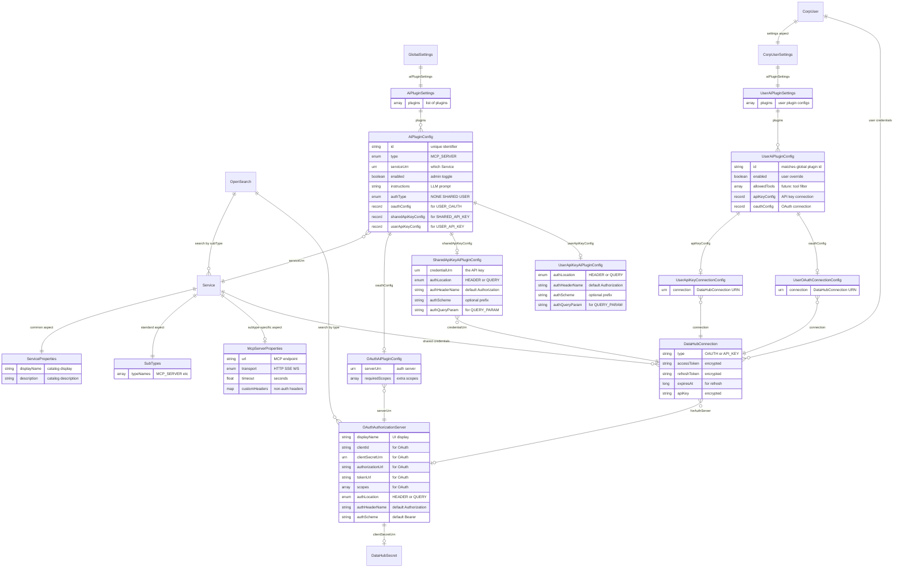

# AI Plugins and Provider OAuth - Object Model

This document describes the object model for integrating external AI plugins (MCP servers) and OAuth authorization servers into DataHub.

## Overview

The system has a **three-tier architecture** separating catalog, configuration, and credentials:

1. **Service** (Entity) - Catalog entry for MCP servers. Lightweight, searchable, linkable. Contains only identity and connection info.
2. **OAuthAuthorizationServer** (Entity) - Generic authorization servers for OAuth flows.
3. **GlobalSettings.aiPluginSettings** (Record) - Ask DataHub configuration. Contains `plugins` array with enabled services, auth config, custom instructions.
4. **CorpUserSettings.aiPluginSettings** (Record) - User overrides. Personal enable/disable toggles.
5. **DataHubConnection** - Per-user credentials for each authorization server.

### Key Design Principle: Catalog vs Configuration

| Concern                | Storage                  | Purpose                                                                                                    |
| ---------------------- | ------------------------ | ---------------------------------------------------------------------------------------------------------- |
| **Catalog**            | Service Entity           | MCP server identity - searchable, lineage-able, documentable. Customers may ingest 1000s.                  |
| **Ask DataHub Config** | GlobalSettings.aiPlugins | Which services are enabled for the agent, auth settings, custom instructions. References Service entities. |
| **User Preferences**   | CorpUserSettings         | User-level overrides for enabled plugins.                                                                  |
| **User Credentials**   | DataHubConnection        | OAuth tokens, API keys per user per auth server.                                                           |

An MCP Server can exist in the catalog **without** being enabled for Ask DataHub.

## Architecture Diagram

```
┌─────────────────────────────────────────────────────────────────────────────┐
│                              ENTITIES (Catalog)                             │
├─────────────────────────────────────────────────────────────────────────────┤
│                                                                             │
│  Service (Entity) - with subTypes aspect                                    │
│  ┌─────────────────────────────────────────────────────────────────────┐    │
│  │ urn:li:service:glean-search                                         │    │
│  │   → serviceProperties: { displayName, description }                 │    │
│  │   → subTypes: { typeNames: ["MCP_SERVER"] }                         │    │
│  │   → mcpServerProperties: { url, transport, timeout, customHeaders } │    │
│  ├─────────────────────────────────────────────────────────────────────┤    │
│  │ urn:li:service:internal-tools                                       │    │
│  │   → serviceProperties: { displayName }                              │    │
│  │   → subTypes: { typeNames: ["MCP_SERVER"] }                         │    │
│  │   → mcpServerProperties: { url, transport }                         │    │
│  └─────────────────────────────────────────────────────────────────────┘    │
│                                                                             │
│  OAuthAuthorizationServer (Entity) - OAuth config only                      │
│  ┌─────────────────────────────────────────────────────────────────────┐    │
│  │ urn:li:oauthAuthorizationServer:glean                               │    │
│  │   → clientId, clientSecretUrn, authUrl, tokenUrl, scopes            │    │
│  │   → authLocation: HEADER, authScheme: Bearer                        │    │
│  └─────────────────────────────────────────────────────────────────────┘    │
│  Note: OAuthAuthorizationServer is strictly for OAuth. API key auth         │
│  injection is configured in AiPluginConfig (sharedApiKeyConfig or           │
│  userApiKeyConfig).                                                         │
│                                                                             │
└─────────────────────────────────────────────────────────────────────────────┘

┌─────────────────────────────────────────────────────────────────────────────┐
│                      SETTINGS (Ask DataHub Configuration)                    │
├─────────────────────────────────────────────────────────────────────────────┤
│                                                                             │
│  GlobalSettings.aiPluginSettings.plugins (Array of AiPluginConfig)          │
│  ┌─────────────────────────────────────────────────────────────────────┐    │
│  │ - type: MCP_SERVER                                                  │    │
│  │   serviceUrn: urn:li:service:glean-search                           │    │
│  │   enabled: true                                                     │    │
│  │   instructions: "Use Glean for searching company docs..."           │    │
│  │   authType: USER_OAUTH                                              │    │
│  │   oauthServerUrn: urn:li:oauthAuthorizationServer:glean             │    │
│  ├─────────────────────────────────────────────────────────────────────┤    │
│  │ - type: MCP_SERVER                                                  │    │
│  │   serviceUrn: urn:li:service:internal-tools                         │    │
│  │   enabled: true                                                     │    │
│  │   authType: SHARED_API_KEY                                          │    │
│  │   sharedApiKeyConfig:                                               │    │
│  │     credentialUrn: urn:li:dataHubConnection:(service:...,apiKey)    │    │
│  │     authLocation: HEADER, authHeaderName: X-API-Key                 │    │
│  ├─────────────────────────────────────────────────────────────────────┤    │
│  │ - type: MCP_SERVER                                                  │    │
│  │   serviceUrn: urn:li:service:external-api                           │    │
│  │   enabled: true                                                     │    │
│  │   authType: USER_API_KEY                                            │    │
│  │   userApiKeyConfig:                                                 │    │
│  │     authLocation: HEADER, authHeaderName: X-API-Key                 │    │
│  └─────────────────────────────────────────────────────────────────────┘    │
│                                                                             │
│  CorpUserSettings.aiPluginSettings (List of UserAiPluginSettings)           │
│  ┌─────────────────────────────────────────────────────────────────────┐    │
│  │ - serviceUrn: urn:li:service:glean-search                           │    │
│  │   enabled: false  (user disabled this plugin)                       │    │
│  └─────────────────────────────────────────────────────────────────────┘    │
│                                                                             │
└─────────────────────────────────────────────────────────────────────────────┘

┌─────────────────────────────────────────────────────────────────────────────┐
│                      DataHubConnection (All Credentials)                     │
├─────────────────────────────────────────────────────────────────────────────┤
│                                                                             │
│  User credentials (owner = corpuser):                                       │
│  urn:li:dataHubConnection:(urn:li:corpuser:alice,glean)                     │
│  ┌─────────────────────────────────────────────────────────────────────┐    │
│  │ JSON: { accessToken, refreshToken, expiresAt, userId, ... }        │    │
│  └─────────────────────────────────────────────────────────────────────┘    │
│                                                                             │
│  Shared credentials (owner = service):                                      │
│  urn:li:dataHubConnection:(urn:li:service:internal-tools,apiKey)            │
│  ┌─────────────────────────────────────────────────────────────────────┐    │
│  │ JSON: { apiKey: "..." }                                            │    │
│  └─────────────────────────────────────────────────────────────────────┘    │
│                                                                             │
└─────────────────────────────────────────────────────────────────────────────┘

┌─────────────────────────────────────────────────────────────────────────────┐
│                      DataHubSecret (OAuth Client Secrets)                    │
├─────────────────────────────────────────────────────────────────────────────┤
│                                                                             │
│  urn:li:dataHubSecret:glean-client-secret     → [encrypted]                 │
│  (Client secrets for OAuth - part of OAuth config, not user credentials)    │
│                                                                             │
└─────────────────────────────────────────────────────────────────────────────┘
```

## Entity Relationship Diagram



**Key relationships:**

- `CorpUser` has `CorpUserSettings` aspect (lightweight preferences)
- `CorpUser` owns `DataHubConnection` entities for user credentials
- `Service` owns `DataHubConnection` entities for shared credentials
- `AiPluginConfig.oauthConfig.serverUrn` references `OAuthAuthorizationServer` for `USER_OAUTH` auth type
- `AiPluginConfig.sharedApiKeyConfig` embeds auth injection settings + credential URN for `SHARED_API_KEY`
- `AiPluginConfig.userApiKeyConfig` embeds auth injection settings for `USER_API_KEY` (credentials in user's `DataHubConnection`)
- `UserAiPluginConfig.id` matches `AiPluginConfig.id` to link user settings to global config
- `UserAiPluginConfig.apiKeyConfig.connection` and `oauthConfig.connection` reference `DataHubConnection` for easy credential discovery

---

## Entity Definitions

### Service (Entity)

A catalog entry for an MCP server (or other service types in the future). This is **lightweight and catalog-focused**:

- Searchable in the catalog
- Can have lineage, ownership, documentation
- May exist without being enabled for Ask DataHub

**URN Format:** `urn:li:service:<id>`

```pdl
namespace com.linkedin.service

/**
 * Key for a Service entity
 */
@Aspect = {
  "name": "serviceKey"
}
record ServiceKey {
  /**
   * Unique identifier for this service
   * Examples: "glean-search", "internal-tools", "weather-api"
   */
  id: string
}
```

```pdl
namespace com.linkedin.service

/**
 * Common properties for all Service types.
 * Subtype-specific properties are in separate aspects.
 */
@Aspect = {
  "name": "serviceProperties"
}
record ServiceProperties {

  /**
   * Display name shown in UI and search
   */
  @Searchable = {
    "fieldType": "WORD_GRAM",
    "enableAutocomplete": true
  }
  displayName: string

  /**
   * Description of what this service provides
   */
  description: optional string

  /**
  // Note: Service subtype is stored in the standard "subTypes" aspect
  // for consistency with other entities and built-in search indexing.
  // Example subtypes: "MCP_SERVER", "REST_API", "OPEN_API", "GRPC"
}
```

The service subtype uses the standard `subTypes` aspect (see `com.linkedin.common.SubTypes`):

```pdl
namespace com.linkedin.common

@Aspect = { "name": "subTypes" }
record SubTypes {
  @Searchable = {
    "/*": {
      "fieldType": "KEYWORD",
      "addToFilters": true,
      "filterNameOverride": "Sub Type"
    }
  }
  typeNames: array[string]
}
```

```pdl
namespace com.linkedin.service

/**
 * MCP-specific properties for Services of subtype MCP_SERVER.
 * Only attached to Service entities where subType = MCP_SERVER.
 *
 * Note: This contains only connection details.
 * Authentication and Ask DataHub config are in GlobalSettings.aiPlugins.
 */
@Aspect = {
  "name": "mcpServerProperties"
}
record McpServerProperties {

  /**
   * MCP server endpoint URL
   */
  url: string

  /**
   * Transport protocol for MCP communication
   */
  transport: McpTransport = "HTTP"

  /**
   * Connection timeout in seconds
   */
  timeout: float = 30.0

  /**
   * Custom headers to send with every request (non-auth)
   */
  customHeaders: optional map[string, string]
}

enum McpTransport {
  HTTP
  SSE
  WEBSOCKET
}
```

---

### OAuthAuthorizationServer (Entity)

An authorization server that issues OAuth tokens. This is a **separate entity** because:

- Can be shared across multiple AI plugins
- Can be used for non-AI-plugin purposes (SQL execution, direct API calls)
- Decouples authorization concerns from service definition

**URN Format:** `urn:li:oauthAuthorizationServer:<id>`

```pdl
namespace com.linkedin.oauth

/**
 * Key for an OAuth Authorization Server entity
 */
@Aspect = {
  "name": "oauthAuthorizationServerKey"
}
record OAuthAuthorizationServerKey {
  /**
   * Unique identifier for this authorization server
   * Examples: "glean", "snowflake", "hubspot"
   */
  id: string
}
```

```pdl
namespace com.linkedin.oauth

/**
 * Properties of an OAuth Authorization Server.
 *
 * Note: This represents the authorization server itself, which could be:
 * - The service's own OAuth server (e.g., Glean, HubSpot)
 * - A third-party IDP (e.g., Okta, Azure AD) configured for a service
 */
@Aspect = {
  "name": "oauthAuthorizationServerProperties"
}
record OAuthAuthorizationServerProperties {

  /**
   * Display name shown in UI (e.g., "Glean", "Snowflake via Okta")
   */
  @Searchable = {
    "fieldType": "WORD_GRAM",
    "enableAutocomplete": true
  }
  displayName: string

  /**
   * Description of what this authorization server provides access to
   */
  description: optional string

  // ─── OAuth Configuration ─────────────────────────────────────────────────
  // This entity is strictly for OAuth2 configuration.
  // API key auth injection is configured directly in AiPluginConfig.

  /**
   * OAuth client ID (public, safe to expose)
   */
  clientId: optional string

  /**
   * URN of DataHubSecret containing OAuth client secret.
   * Never stored as plain string - always encrypted.
   *
   * GraphQL visibility: Exposed as `clientSecretUrn: String` in GraphQL.
   * The URN is safe to expose because:
   * - It's just a reference/pointer - the actual secret value is never exposed
   * - Access to the DataHubSecret entity is protected by authorization
   * - Backend services need the URN to resolve secrets for token exchange
   *
   * The UI can also use `hasClientSecret: Boolean` to show configured state.
   */
  clientSecretUrn: optional com.linkedin.common.Urn

  // ─── Dynamic Client Registration (Phase 2) ──────────────────────────────
  // Required for providers like Glean that don't support manual client setup.
  // See RFC 7591 for DCR specification.

  /**
   * URL for OAuth Dynamic Client Registration endpoint.
   * If set and clientId is null, admin can trigger auto-registration.
   * Example: "https://api.glean.com/oauth/register"
   */
  registrationUrl: optional string

  /**
   * URN of DataHubSecret containing initial access token for DCR.
   * Some providers require this token to register new clients.
   */
  initialAccessTokenUrn: optional com.linkedin.common.Urn

  /**
   * OAuth authorization endpoint URL
   * Example: "https://accounts.google.com/o/oauth2/v2/auth"
   */
  authorizationUrl: optional string

  /**
   * OAuth token endpoint URL
   * Example: "https://oauth2.googleapis.com/token"
   */
  tokenUrl: optional string

  /**
   * Default OAuth scopes to request.
   * Stored as array for UI chip rendering and scope merging.
   */
  scopes: optional array[string]

  // ─── Token Endpoint Behavior ───────────────────────────────────────────

  /**
   * How to authenticate at the token endpoint.
   * - BASIC: client_id:client_secret in Authorization header
   * - POST_BODY: client_id and client_secret in request body
   * - NONE: No client authentication (public clients)
   */
  tokenAuthMethod: TokenAuthMethod = "POST_BODY"

  /**
   * Additional parameters for token requests.
   * Examples: Auth0 audience, Azure AD resource
   */
  additionalTokenParams: optional map[string, string]

  /**
   * Additional parameters for authorization URL.
   * Examples: prompt=consent, tenant=my-org
   */
  additionalAuthParams: optional map[string, string]

  // ─── Token Injection ────────────────────────────────────────────────────
  // How tokens from this server are injected into API requests

  /**
   * Where to inject the credential in HTTP requests
   */
  authLocation: AuthLocation = "HEADER"

  /**
   * For HEADER: which header name (default "Authorization")
   */
  authHeaderName: string = "Authorization"

  /**
   * For HEADER: scheme prefix (default "Bearer", null for raw value)
   * Example: "Bearer" produces "Authorization: Bearer <token>"
   */
  authScheme: optional string = "Bearer"

  /**
   * For QUERY_PARAM: parameter name
   * Example: "access_token" produces "?access_token=<token>"
   */
  authQueryParam: optional string
}

enum AuthLocation {
  HEADER
  QUERY_PARAM
}

enum TokenAuthMethod {
  /** HTTP Basic Auth */
  BASIC

  /** Form POST body */
  POST_BODY

  /** No client auth */
  NONE

  /** Custom auth scheme using authScheme field (e.g., "Token" for dbt Cloud) */
  CUSTOM
}
```

---

### GlobalSettings.aiPlugins (Ask DataHub Configuration)

Configuration for which services are available in Ask DataHub. This is **not an entity** - it's a list of records within GlobalSettings.

**Key insight:** The AiPluginConfig holds Ask DataHub-specific configuration:

- Which services are enabled for the agent
- Which auth method to use (and which auth server)
- Custom LLM instructions

**Note:** Auth injection settings (how tokens are sent) are on `OAuthAuthorizationServerProperties`, not here.

```pdl
namespace com.linkedin.settings.global

/**
 * Extension to GlobalSettings for AI plugin configuration.
 */
record GlobalSettingsInfo {
  // ... existing fields ...

  /**
   * AI plugin settings for Ask DataHub.
   */
  aiPluginSettings: optional AiPluginSettings
}
```

```pdl
namespace com.linkedin.settings.global

/**
 * Wrapper for AI plugin configuration in GlobalSettings.
 * Uses an array (not a map) for consistency with other settings patterns.
 */
record AiPluginSettings {
  /**
   * List of configured AI plugins.
   */
  plugins: array[AiPluginConfig] = []
}
```

```pdl
namespace com.linkedin.settings.global

/**
 * Ask DataHub configuration for an AI plugin.
 * References a Service entity and adds agent-specific settings.
 */
record AiPluginConfig {

  /**
   * Unique identifier for this plugin configuration.
   * Typically the service URN string for easy correlation.
   */
  id: string

  /**
   * Type of AI plugin (determines how to use it)
   */
  type: AiPluginType

  /**
   * Reference to the Service entity (catalog entry)
   */
  serviceUrn: com.linkedin.common.Urn

  /**
   * Whether this plugin is enabled for Ask DataHub
   */
  enabled: boolean = true

  /**
   * Custom instructions for the LLM when using this plugin's tools.
   * Injected into the agent's system prompt.
   */
  instructions: optional string

  // ─── Authentication ────────────────────────────────────────────────────

  /**
   * How this plugin authenticates requests
   */
  authType: AiPluginAuthType

  /**
   * OAuth configuration.
   * Required when authType is USER_OAUTH.
   */
  oauthConfig: optional record OAuthAiPluginConfig {
    /**
     * URN of the OAuthAuthorizationServer that provides OAuth configuration.
     * Contains clientId, authorization URL, token URL, scopes, and auth injection.
     */
    serverUrn: com.linkedin.common.Urn

    /**
     * Additional scopes required by this plugin.
     * Merged with the authorization server's base scopes when user connects.
     */
    requiredScopes: optional array[string]
  }

  /**
   * Shared API key configuration.
   * Required when authType is SHARED_API_KEY.
   *
   * Auth injection settings are embedded directly because shared API keys
   * don't need OAuth config.
   */
  sharedApiKeyConfig: optional record SharedApiKeyAiPluginConfig {
    /**
     * URN of DataHubConnection containing the shared API key.
     * The DataHubConnection is owned by the Service entity.
     */
    credentialUrn: com.linkedin.common.Urn

    /**
     * Where to inject the API key in HTTP requests.
     */
    authLocation: AuthInjectionLocation = "HEADER"

    /**
     * For HEADER: which header name to use.
     */
    authHeaderName: string = "Authorization"

    /**
     * For HEADER: optional scheme prefix (e.g., "Bearer", "ApiKey").
     */
    authScheme: optional string

    /**
     * For QUERY_PARAM: which query parameter name to use.
     */
    authQueryParam: optional string
  }

  /**
   * User API key configuration.
   * Required when authType is USER_API_KEY.
   *
   * User credentials are stored in DataHubConnection keyed by (userUrn, serviceId).
   * This config only defines how to inject the user's API key into requests.
   */
  userApiKeyConfig: optional record UserApiKeyAiPluginConfig {
    /**
     * Where to inject the API key in HTTP requests.
     */
    authLocation: AuthInjectionLocation = "HEADER"

    /**
     * For HEADER: which header name to use.
     */
    authHeaderName: string = "Authorization"

    /**
     * For HEADER: optional scheme prefix (e.g., "Bearer", "ApiKey").
     */
    authScheme: optional string

    /**
     * For QUERY_PARAM: which query parameter name to use.
     */
    authQueryParam: optional string
  }
}

enum AuthInjectionLocation {
  HEADER
  QUERY_PARAM
}

enum AiPluginType {
  /** Model Context Protocol server */
  MCP_SERVER

  // Future types as needed
}

enum AiPluginAuthType {
  /** No authentication required */
  NONE

  /** System-wide API key (shared across all users) */
  SHARED_API_KEY

  /** User provides their own API key */
  USER_API_KEY

  /** User authenticates via OAuth */
  USER_OAUTH
}
```

---

### CorpUserSettings.aiPluginSettings (User Overrides and Connections)

User-level AI plugin settings. Tracks:

1. **User preferences** - Enable/disable plugins, allowed tools
2. **User credentials** - References to DataHubConnection entities containing OAuth tokens or API keys

This structure mirrors GlobalSettings.aiPluginSettings but with user-specific data.

```pdl
namespace com.linkedin.identity

/**
 * Extension to CorpUserSettings for AI plugin preferences.
 */
record CorpUserSettings {
  // ... existing fields ...

  /**
   * User's AI plugin settings - preferences and credential references.
   */
  aiPluginSettings: optional UserAiPluginSettings
}
```

```pdl
namespace com.linkedin.identity

/**
 * User-level AI plugin settings.
 * Tracks preferences and credential references for each plugin.
 */
record UserAiPluginSettings {
  /**
   * List of user plugin configurations.
   * Each entry corresponds to a GlobalSettings.aiPluginSettings.plugins entry by id.
   */
  plugins: array[UserAiPluginConfig] = []
}

/**
 * User-level configuration for a single AI plugin.
 * Links to global config by id and stores user's credential references.
 */
record UserAiPluginConfig {
  /**
   * Matches GlobalSettings.aiPluginSettings.plugins[].id
   * Used to correlate user settings with global plugin config.
   */
  id: string

  /**
   * User override - can disable a globally-enabled plugin.
   * Default true means "use global setting".
   */
  enabled: boolean = true

  /**
   * Future: Which tools from this plugin the user wants enabled.
   * Empty array or null means all tools allowed.
   */
  allowedTools: optional array[string]

  /**
   * For USER_API_KEY auth type - reference to user's API key connection.
   * Present when user has saved an API key for this plugin.
   */
  apiKeyConfig: optional UserApiKeyConnectionConfig

  /**
   * For USER_OAUTH auth type - reference to user's OAuth connection.
   * Present when user has completed OAuth flow for this plugin.
   */
  oauthConfig: optional UserOAuthConnectionConfig
}

/**
 * Reference to user's API key stored in DataHubConnection.
 */
record UserApiKeyConnectionConfig {
  /**
   * URN of DataHubConnection containing the user's API key.
   * Format: urn:li:dataHubConnection:(<userUrn>,<authServerId>)
   */
  connection: com.linkedin.common.Urn
}

/**
 * Reference to user's OAuth tokens stored in DataHubConnection.
 */
record UserOAuthConnectionConfig {
  /**
   * URN of DataHubConnection containing the user's OAuth tokens.
   * Format: urn:li:dataHubConnection:(<userUrn>,<authServerId>)
   */
  connection: com.linkedin.common.Urn
}
```

**Key design points:**

- `id` field links to `GlobalSettings.aiPluginSettings.plugins[].id` for O(1) lookup
- Connection URNs stored here make discovery trivial (no need to search DataHubConnection entities)
- `allowedTools` is future-ready for tool-level permissions (Note: consider renaming to `disabledTools` - opt-out model where all tools are allowed by default)
- Structure mirrors global settings for consistency

---

### User Credentials (DataHubConnection)

Following existing practice (Slack, Teams), use **DataHubConnection** for user credentials.

**URN Format Options:**

The URN format can be structured in different ways depending on implementation needs:

| Option          | URN Format                                            | Use Case                                                |
| --------------- | ----------------------------------------------------- | ------------------------------------------------------- |
| Per auth server | `urn:li:dataHubConnection:(<userUrn>,<authServerId>)` | Shared connection across plugins using same auth server |
| Per plugin      | `urn:li:dataHubConnection:(<userUrn>,<pluginId>)`     | Isolated connection per plugin                          |

Both options are valid. See implementation plan for the chosen approach.

The JSON payload structure for OAuth credentials:

```json
{
  "type": "OAUTH",
  "accessToken": "encrypted_token_here",
  "refreshToken": "encrypted_refresh_token_here",
  "expiresAt": 1705276800000,
  "providerUserId": "alice@company.com",
  "providerUserDisplayName": "Alice Smith"
}
```

For API key credentials:

```json
{
  "type": "API_KEY",
  "apiKey": "encrypted_api_key_here"
}
```

**Note:** The `expiresAt` field (milliseconds since epoch) is used for:

- On-demand token refresh when expired
- Background refresh scheduling to proactively refresh tokens before expiry

**Note:** The JSON structure must be clearly documented since DataHubConnection has a loosely typed payload. This approach:

- Follows existing patterns (Slack, Teams connections)
- Allows collective improvements across systems
- **Encrypts internally** - no need for separate DataHubSecret entities for user tokens

---

## Data Flows

### 1. Admin Creates Service (MCP Server in Catalog)

```
Admin UI                    DataHub API
   │                            │
   │  1. Create Service         │
   │  - displayName, url, etc.  │
   ├───────────────────────────>│
   │                            │
   │                            │  2. Create entity
   │                            │  urn:li:service:glean-search
   │                            │  with serviceProperties,
   │                            │  subTypes: ["MCP_SERVER"],
   │                            │  and mcpServerProperties
   │                            │
   │  3. Entity created         │
   │<───────────────────────────│
```

### 2. Admin Enables Service for Ask DataHub

```
Admin UI                    DataHub API               DataHubSecret
   │                            │                          │
   │  1. Enable AI plugin       │                          │
   │  (Select service,          │                          │
   │   configure auth)          │                          │
   ├───────────────────────────>│                          │
   │                            │                          │
   │                            │  2. If shared API key:   │
   │                            │  Create secret           │
   │                            ├─────────────────────────>│
   │                            │  Return URN              │
   │                            │<─────────────────────────│
   │                            │                          │
   │                            │  3. Update GlobalSettings
   │                            │  Add to aiPlugins map
   │                            │  with AiPluginConfig
   │                            │
   │  4. Plugin enabled         │
   │<───────────────────────────│
```

### 3. User Connects to Authorization Server (OAuth)

```
User Browser          Integrations Service       OAuth Server         DataHub
     │                        │                       │                  │
     │ 1. Click "Connect"     │                       │                  │
     │ to Glean               │                       │                  │
     ├───────────────────────>│                       │                  │
     │                        │ 2. Load auth server   │                  │
     │                        │ entity config         │                  │
     │                        ├──────────────────────────────────────────>│
     │                        │                       │                  │
     │                        │ 3. Generate PKCE      │                  │
     │                        │ Store state           │                  │
     │                        │                       │                  │
     │ 4. Redirect to OAuth   │                       │                  │
     │<───────────────────────│                       │                  │
     │                        │                       │                  │
     │ 5. Login & consent ────────────────────────────>                  │
     │                        │                       │                  │
     │ 6. Callback with code  │                       │                  │
     ├───────────────────────>│                       │                  │
     │                        │ 7. Exchange code      │                  │
     │                        ├──────────────────────>│                  │
     │                        │ 8. Tokens             │                  │
     │                        │<──────────────────────│                  │
     │                        │                       │                  │
     │                        │ 9. Create DataHubConnection ─────────────>│
     │                        │ urn:li:dataHubConnection:(alice,glean)   │
     │                        │ with encrypted tokens │                  │
     │                        │                       │                  │
     │ 10. Success            │                       │                  │
     │<───────────────────────│                       │                  │
```

### 4. Agent Uses AI Plugin Tools

```
Agent               ExternalMCPManager        DataHub API         MCP Server
  │                        │                       │                   │
  │ 1. get_available_tools │                       │                   │
  ├───────────────────────>│                       │                   │
  │                        │                       │                   │
  │                        │ 2. Load GlobalSettings│                   │
  │                        │ aiPlugins list        │                   │
  │                        ├──────────────────────>│                   │
  │                        │                       │                   │
  │                        │ 3. For glean plugin:  │                   │
  │                        │ Load Service entity   │                   │
  │                        │ (URL, transport)      │                   │
  │                        ├──────────────────────>│                   │
  │                        │                       │                   │
  │                        │ 4. Check user's       │                   │
  │                        │ aiPluginSettings      │                   │
  │                        │ (is it enabled?)      │                   │
  │                        ├──────────────────────>│                   │
  │                        │                       │                   │
  │                        │ 5. Load user's        │                   │
  │                        │ DataHubConnection     │                   │
  │                        │ for glean             │                   │
  │                        ├──────────────────────>│                   │
  │                        │                       │                   │
  │                        │ 6. Check expiresAt    │                   │
  │                        │ Refresh if needed     │                   │
  │                        │                       │                   │
  │                        │ 7. Build auth header  │                   │
  │                        │ using AiPluginConfig  │                   │
  │                        │ (authLocation, etc.)  │                   │
  │                        │                       │                   │
  │                        │ 8. Connect to MCP ────────────────────────>│
  │                        │                       │                   │
  │                        │ 9. Discover tools <───────────────────────│
  │                        │                       │                   │
  │ 10. Return tools       │                       │                   │
  │<───────────────────────│                       │                   │
```

---

## Design Decisions

### Why Separate Service Entity from AiPluginConfig?

| Decision                             | Rationale                                                                                             |
| ------------------------------------ | ----------------------------------------------------------------------------------------------------- |
| **Service as entity**                | Catalog use case - searchable, lineage-able, documentable. Customers may ingest 1000s of MCP servers. |
| **AiPluginConfig in GlobalSettings** | Ask DataHub config is separate from catalog. A service can exist without being enabled for the agent. |
| **Service is lightweight**           | Only connection details (URL, transport). No auth config - that's agent-specific.                     |
| **Auth config in AiPluginConfig**    | Same service could be used with different auth in different contexts.                                 |

### Why GlobalSettings Instead of Entity Aspects?

| Decision                                     | Rationale                                                                     |
| -------------------------------------------- | ----------------------------------------------------------------------------- |
| **GlobalSettings for Ask DataHub config**    | Clear separation between catalog (entity) and agent config (settings).        |
| **Parallel structure with CorpUserSettings** | Global defaults, user overrides - clean inheritance model.                    |
| **Easy cascade delete**                      | Remove from GlobalSettings = remove from agent. Entity can remain in catalog. |
| **No eventual consistency issues**           | GlobalSettings is always consistent. No waiting for OpenSearch indexing.      |

### Service Entity Discovery

Services are discovered via OpenSearch by `subType`:

- Catalog UI: Search for `subType=MCP_SERVER` to list all MCP servers
- When creating AiPluginConfig: Search available services to select

**Note:** Newly created Service entities may have a brief delay before appearing in search results due to eventual consistency. This is acceptable for admin UI operations.

### When to Use Each Auth Type

| authType         | Config Location                           | Credential Location                  | Use Case                                  |
| ---------------- | ----------------------------------------- | ------------------------------------ | ----------------------------------------- |
| `NONE`           | N/A                                       | N/A                                  | Public APIs, no auth needed               |
| `SHARED_API_KEY` | `sharedApiKeyConfig` (embedded injection) | DataHubConnection (owned by Service) | Service account, all users share same key |
| `USER_API_KEY`   | `userApiKeyConfig` (embedded injection)   | DataHubConnection (owned by user)    | User's personal API key                   |
| `USER_OAUTH`     | `oauthConfig` → OAuthAuthorizationServer  | DataHubConnection (owned by user)    | User's OAuth tokens                       |

### User Settings Override Logic

```python
def is_plugin_enabled_for_user(global_settings, user_settings, service_urn):
    # 1. Check if globally enabled
    global_config = global_settings.aiPlugins.get(service_urn)
    if not global_config or not global_config.enabled:
        return False

    # 2. Check user override
    user_config = user_settings.aiPluginSettings.get(service_urn)
    if user_config is not None:
        return user_config.enabled

    # 3. Default to global setting
    return True
```

---

## Security Considerations

### Secret Storage

| Secret              | Storage                              | Referenced By                                   |
| ------------------- | ------------------------------------ | ----------------------------------------------- |
| OAuth client secret | DataHubSecret                        | OAuthAuthorizationServer.clientSecretUrn        |
| Shared API key      | DataHubConnection (owned by Service) | AiPluginConfig.sharedApiKeyConfig.credentialUrn |
| User credentials    | DataHubConnection (owned by user)    | User's connection                               |

### OAuth Flow Security

| Feature               | Implementation                                 |
| --------------------- | ---------------------------------------------- |
| User identity         | Server-side state, never in URLs               |
| PKCE                  | code_verifier stored server-side               |
| Single-use state      | Nonce deleted after first use                  |
| Redirect validation   | Allowlist of valid prefixes                    |
| Single callback URL   | `/integrations/oauth/callback` for all plugins |
| Plugin identification | Via OAuth state parameter, not URL path        |

**Single Callback URL Design:** All OAuth providers redirect to the same URL (`/integrations/oauth/callback`). The plugin is identified from the OAuth `state` parameter. Benefits:

- Simpler OAuth app registration - one URL works for all plugins
- Admin doesn't need to know plugin URN when setting up OAuth app
- Consistent with how Cloud Router handles multi-tenant OAuth

**User Settings Update Security:** The user's JWT token is captured at `/connect` time and stored in OAuth state. During the callback, this token is used to call `updateUserAiPluginSettings` as the actual user (not the system user). This ensures:

- User settings are updated with the user's own permissions
- No privileged mutation input (like `userUrn`) that could allow impersonation
- Token refresh doesn't need this - it only updates `DataHubConnection` (system user), not user settings

---

## Implementation Status

- [ ] Create Service entity (key + serviceProperties + mcpServerProperties aspects)
- [ ] Create OAuthAuthorizationServer entity (key + properties aspects)
- [ ] Extend GlobalSettings with aiPlugins field
- [ ] Extend CorpUserSettings with aiPluginSettings field
- [ ] OAuth endpoints (start flow, callback, disconnect)
- [ ] Token refresh logic for DataHubConnection
- [ ] ExternalMCPManager integration with new model
- [ ] Admin UI for service catalog (MCP servers)
- [ ] Admin UI for AI plugin configuration (GlobalSettings)
- [ ] User UI for plugin preferences
- [ ] User UI for provider connections

---

## Future Work

### ToolDefinition Entity

Individual tools exposed by AI plugins will be modeled as a separate entity in a future iteration.

**URN Format:** `urn:li:toolDefinition:(<serviceUrn>,<toolName>)`

**Key aspects:**

- One-to-many relationship with Service
- Lifecycle managed like tables/columns (near real-time ingestion)
- Admin can enable/disable tools globally (in AiPluginConfig or separate aspect)
- User can toggle tools (in UserAiPluginSettings)
- Searchable and governable

### ServiceEndpoint / ServiceFunction Entities

For more granular modeling of service APIs:

- `ServiceEndpoint` - individual API endpoints
- `ServiceFunction` - MCP tools as functions

These could map MCP server tools to searchable entities with their own governance.

### Additional Service Subtypes

The `ServiceSubType` enum can be extended:

- `REST_API` - REST API services
- `OPEN_API` - Services with OpenAPI spec
- `GRPC` - gRPC services

Each new subtype could have its own type-specific aspect.

---

## Changelog

| Date       | Change                                                                                                                                                                                                                                                                                                    |
| ---------- | --------------------------------------------------------------------------------------------------------------------------------------------------------------------------------------------------------------------------------------------------------------------------------------------------------- |
| 2026-01-17 | **DataHubConnection URN options**: Documented both per-auth-server and per-plugin URN format options. Implementation chooses which approach to use.                                                                                                                                                       |
| 2026-01-17 | **UserAiPluginSettings redesigned**: Changed from `map[string, UserAiPluginSettings]` to `UserAiPluginSettings { plugins: array[UserAiPluginConfig] }`. Added `id` field to match global config, `allowedTools` for future, and `apiKeyConfig`/`oauthConfig` with connection URN references.              |
| 2026-01-16 | **Removed supportedCredentialTypes**: The `supportedCredentialTypes` field and `CredentialType` enum were removed entirely from `OAuthAuthorizationServer` since it's strictly for OAuth2 - the field was redundant.                                                                                      |
| 2026-01-16 | **User API key config separated**: Added `UserApiKeyAiPluginConfig` with embedded auth injection settings for `USER_API_KEY` auth type. `OAuthAuthorizationServer` is now strictly for OAuth.                                                                                                             |
| 2026-01-16 | **Removed iconUrl fields**: Removed `iconUrl` from `ServiceProperties` and `OAuthAuthorizationServerProperties` as usage was unclear.                                                                                                                                                                     |
| 2026-01-16 | **Embedded auth injection for shared API keys**: `SharedApiKeyAiPluginConfig` now embeds auth injection settings directly (`authLocation`, `authHeaderName`, `authScheme`, `authQueryParam`) instead of referencing an `OAuthAuthorizationServer`. Cleaner and more self-contained for API key use cases. |
| 2026-01-16 | **SubTypes aspect**: Service subtype now uses standard `subTypes` aspect for consistency with other entities. Removed `subType` from `ServiceProperties`.                                                                                                                                                 |
| 2026-01-16 | **AiPluginSettings wrapper**: `GlobalSettings.aiPlugins` (map) → `GlobalSettings.aiPluginSettings.plugins` (array wrapper). Added `id` field to `AiPluginConfig`.                                                                                                                                         |
| 2026-01-16 | **Nested auth config**: Added indirection in `AiPluginConfig` - `oauthConfig: OAuthAiPluginConfig` and `sharedApiKeyConfig: SharedApiKeyAiPluginConfig`. Provides extensibility for future auth fields.                                                                                                   |
| 2026-01-15 | **Credential separation**: Removed `sharedApiKeyUrn` from `OAuthAuthorizationServer`. Shared API keys now in `DataHubConnection` (owned by Service). Cleanly separates config from credentials.                                                                                                           |
| 2026-01-15 | **DCR fields added**: `registrationUrl` and `initialAccessTokenUrn` added to `OAuthAuthorizationServerProperties` for Phase 2 Dynamic Client Registration (required for Glean).                                                                                                                           |
| 2026-01-14 | **Entity renamed**: `AIPlugin` → `Service` with subtype `MCP_SERVER`. Service is lightweight (catalog only), config moved to GlobalSettings.                                                                                                                                                              |
| 2026-01-14 | **Three-tier architecture**: Service (catalog) + GlobalSettings.aiPlugins (config) + CorpUserSettings.aiPluginSettings (user prefs)                                                                                                                                                                       |
| 2026-01-14 | **Auth injection moved**: `authLocation`, `authHeaderName`, `authScheme`, `authQueryParam` moved from `AiPluginConfig` to `OAuthAuthorizationServerProperties`                                                                                                                                            |
| 2026-01-14 | ~~**Shared API key moved**: `sharedApiKeyUrn` moved from `AiPluginConfig` to `OAuthAuthorizationServerProperties`.~~ (Superseded by 2026-01-15 credential separation)                                                                                                                                     |
| 2026-01-14 | **ERD updated**: Shows `CorpUser` owns both `CorpUserSettings` (aspect) and `DataHubConnection` (entities). Clarified user preferences vs credentials separation.                                                                                                                                         |
