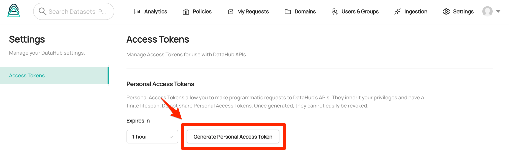

# Ingestion

Acryl Metadata Ingestion functions similarly to that in open source DataHub. Sources are configured via the[ UI Ingestion](docs/ui-ingestion.md) or via a [Recipe](metadata-ingestion/README.md#recipes), ingestion recipes can be scheduled using your system of choice, and metadata can be pushed from anywhere.
This document will describe the steps required to ingest metadata from your data sources.

## Batch Ingestion

Batch ingestion involves extracting metadata from a source system in bulk. Typically, this happens on a predefined schedule using the [Metadata Ingestion ](metadata-ingestion/README.md#install-from-pypi)framework.
The metadata that is extracted includes point-in-time instances of dataset, chart, dashboard, pipeline, user, group, usage, and task metadata.

### Step 1: Install DataHub CLI

Regardless of how you ingest metadata, you'll need your account subdomain and API key handy.

#### **Install from Gemfury Private Repository**

**Installing from command line with pip**

Determine the version you would like to install and obtain a read access token by requesting a one-time-secret from the Acryl team then run the following command:

`python3 -m pip install acryl-datahub==<VERSION> --index-url https://<TOKEN>:@pypi.fury.io/acryl-data/`

#### Install from PyPI for OSS Release

Run the following commands in your terminal:

```
python3 -m pip install --upgrade pip wheel setuptools
python3 -m pip install --upgrade acryl-datahub
python3 -m datahub version
```

_Note: Requires Python 3.6+_

Your command line should return the proper version of DataHub upon executing these commands successfully.

### Step 2: Install Connector Plugins

Our CLI follows a plugin architecture. You must install connectors for different data sources individually. For a list of all supported data sources, see [the open source docs](metadata-ingestion/README.md#installing-plugins).
Once you've found the connectors you care about, simply install them using `pip install`.
For example, to install the `mysql` connector, you can run

```python
pip install --upgrade acryl-datahub[mysql]
```

### Step 3: Write a Recipe

[Recipes](metadata-ingestion/README.md#recipes) are yaml configuration files that serve as input to the Metadata Ingestion framework. Each recipe file define a single source to read from and a single destination to push the metadata.
The two most important pieces of the file are the _source_ and \_sin*k configuration blocks.
The \_source* configuration block defines where to extract metadata from. This can be an OLTP database system, a data warehouse, or something as simple as a file. Each source has custom configuration depending on what is required to access metadata from the source. To see configurations required for each supported source, refer to the [Sources](metadata-ingestion/README.md#sources) documentation.
The _sink_ configuration block defines where to push metadata into. Each sink type requires specific configurations, the details of which are detailed in the [Sinks](metadata-ingestion/README.md#sinks) documentation.
In Acryl DataHub deployments, you _must_ use a sink of type `datahub-rest`, which simply means that metadata will be pushed to the REST endpoints exposed by your DataHub instance. The required configurations for this sink are

1. **server**: the location of the REST API exposed by your instance of DataHub
2. **token**: a unique API key used to authenticate requests to your instance's REST API

The token can be retrieved by logging in as admin. You can go to Settings page and generate a Personal Access Token with your desired expiration date.
.png)



To configure your instance of DataHub as the destination for ingestion, set the "server" field of your recipe to point to your Acryl instance's domain suffixed by the path `/gms`, as shown below.
A complete example of a DataHub recipe file, which reads from MySQL and writes into a DataHub instance:

```yaml
# example-recipe.yml

# MySQL source configuration
source:
  type: mysql
  config:
    username: root
    password: password
    host_port: localhost:3306

# Recipe sink configuration.
sink:
  type: "datahub-rest"
  config:
    server: "https://<your domain name>.acryl.io/gms"
    token: <Your API key>
```

:::info
Your API key is a signed JSON Web Token that is valid for 6 months from the date of issuance. Please keep this key secure & avoid sharing it.
:::

If your key is compromised for any reason, please reach out to the Acryl team at support@acryl.io.:::

### Step 4: Running Ingestion

The final step requires invoking the DataHub CLI to ingest metadata based on your recipe configuration file.
To do so, simply run `datahub ingest` with a pointer to your YAML recipe file:

```
datahub ingest -c ./example-recipe.yml
```

### Step 5: Scheduling Ingestion

Ingestion can either be run in an ad-hoc manner by a system administrator or scheduled for repeated executions. Most commonly, ingestion will be run on a daily cadence.
To schedule your ingestion job, we recommend using a job schedule like [Apache Airflow](https://airflow.apache.org/). In cases of simpler deployments, a CRON job scheduled on an always-up machine can also work.
Note that each source system will require a separate recipe file. This allows you to schedule ingestion from different sources independently or together.

_Looking for information on real-time ingestion? Click_ [_here_](docs/lineage/airflow.md)_._

_Note: Real-time ingestion setup is not recommended for an initial POC as it generally takes longer to configure and is prone to inevitable system errors._
