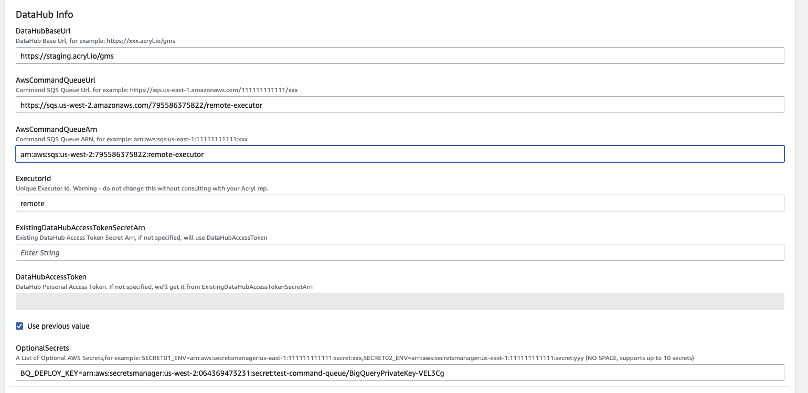
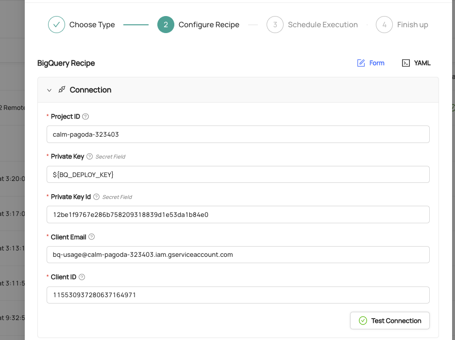
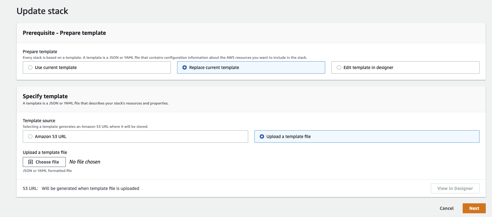

import FeatureAvailability from '@site/src/components/FeatureAvailability';

# Setting up Remote Ingestion Executor on AWS
<FeatureAvailability saasOnly />

## Overview

UI-based Metadata Ingestion reduces the overhead associated with operating DataHub. It allows you to create, schedule, and run batch metadata ingestion on demand in just a few clicks, without requiring custom orchestration. Behind the scenes, a simple ingestion "executor" abstraction makes this possible.

Acryl DataHub comes packaged with an Acryl-managed ingestion executor, which is hosted inside of Acryl's environment on your behalf. However, there are certain scenarios in which an Acryl-hosted executor is not sufficient to cover all of an organization's ingestion sources.

For example, if an ingestion source is not publicly accessible via the internet, e.g. hosted privately within a specific AWS account, then the Acryl executor will be unable to extract metadata from it.

.png)

To accommodate these cases, Acryl supports configuring a remote ingestion executor which can be deployed inside of your AWS account. This setup allows you to continue leveraging the Acryl DataHub console to create, schedule, and run metadata ingestion, all while retaining network and credential isolation.

.png)

## Deploying a Remote Ingestion Executor
1. **Provide AWS Account Id**: Provide Acryl Team with the id of the AWS in which the remote executor will be hosted. This will be used to grant access to private Acryl containers and create a unique SQS queue which your remote agent will subscribe to. The account id can be provided to your Acryl representative via Email or [One Time Secret](https://onetimesecret.com/). 

2. **Provision an Acryl Executor** (ECS)**:** Acryl team will provide a [Cloudformation Template](https://github.com/acryldata/datahub-cloudformation/blob/master/Ingestion/templates/python.ecs.template.yaml) that you can run to provision an ECS cluster with a single remote ingestion task. It will also provision an AWS role for the task which grants the permissions necessary to read and delete from the private SQS queue created for you, along with reading the secrets you've specified. At minimum, the template requires the following parameters:
   1. **Deployment Location:** The AWS VPC + subnet in which the Acryl Executor task is to be provisioned.
   2. **SQS Queue ARN**: Reference to your private SQS command queue. This is provided by Acryl and is used to configure IAM policies enabling the Task role to read from the shared queue.
   3. **SQS Queue URL**: The URL referring to your private SQS command queue. This is provided by Acryl and is used to read messages.
   4. **DataHub Personal Access Token**: A valid DataHub PAT. This can be generated inside of **Settings > Access Tokens** of DataHub web application. You can alternatively create a secret in AWS Secrets Manager and refer to that by ARN.
   5. **Acryl DataHub URL**: The URL for your DataHub instance, e.g. `<your-company>.acryl.io/gms`. Note that you MUST enter the trailing /gms when configuring the executor.
   6. **Acryl Remote Executor Version:** The version of the remote executor to deploy. This is converted into a container image tag. It will be set to the latest version of the executor by default.
   7. **Ingestion Source Secrets:** The template accepts up to 10 named secrets which live inside your environment. Secrets are specified using the **OptionalSecrets** parameter in the following form: `SECRET_NAME=SECRET_ARN` with multiple separated by comma, e.g. `SECRET_NAME_1=SECRET_ARN_1,SECRET_NAME_2,SECRET_ARN_2.`
   8.  **Environment Variables:** The template accepts up to 10 arbitrary environment variables. These can be used to inject properties into your ingestion recipe from within your environment. Environment variables are specified using the **OptionalEnvVars** parameter in the following form: `ENV_VAR_NAME=ENV_VAR_VALUE` with multiple separated by comma, e.g. `ENV_VAR_NAME_1=ENV_VAR_VALUE_1,ENV_VAR_NAME_2,ENV_VAR_VALUE_2.`
       ``
       ``Providing secrets enables you to manage ingestion sources from the DataHub UI without storing credentials inside DataHub. Once defined, secrets can be referenced by name inside of your DataHub Ingestion Source configurations using the usual convention: `${SECRET_NAME}`.
       
       Note that the only external secret provider that is currently supported is AWS Secrets Manager.




3.  **Test the Executor:** To test your remote executor:

    1. Create a new Ingestion Source by clicking '**Create new Source**' the '**Ingestion**' tab of the DataHub console. Configure your Ingestion Recipe as though you were running it from inside of your environment.
    2.  When working with "secret" fields (passwords, keys, etc), you can refer to any "self-managed" secrets by name: `${SECRET_NAME}:`

        
    3. In the 'Finish Up' step, click '**Advanced'**.
    4. Update the '**Executor Id**' form field to be  '**remote**'. This indicates that you'd like to use the remote executor.
    5. Click '**Done**'.

    Now, simple click '**Execute**' to test out the remote executor. If your remote executor is configured properly, you should promptly see the ingestion task state change to 'Running'.


## Updating a Remote Ingestion Executor
In order to update the executor, ie. to deploy a new container version, you'll need to update the CloudFormation Stack to re-deploy the CloudFormation template with a new set of parameters.
### Steps - AWS Console
1. Navigate to CloudFormation in AWS Console
2. Select the stack dedicated to the remote executor
3. Click **Update**
4. Select **Replace Current Template**
5. Select **Upload a template file**
6. Upload a copy of the Acryl Remote Executor [CloudFormation Template](https://raw.githubusercontent.com/acryldata/datahub-cloudformation/master/Ingestion/templates/python.ecs.template.yaml)

7. Click **Next**
8. Change parameters based on your modifications (e.g. ImageTag, etc)
9. Click **Next**
10. Confirm your parameter changes, and update. This should perform the necessary upgrades.

## FAQ

### If I need to change (or add) a secret that is stored in AWS Secrets Manager, e.g. for rotation, will the new secret automatically get picked up by Acryl's executor?**

Unfortunately, no. Secrets are wired into the executor container at deployment time, via environment variables. Therefore, the ECS Task will need to be restarted (either manually or via a stack parameter update) whenever your secrets change.

### I want to deploy multiple Acryl Executors. Is this currently possible?**

This is possible, but requires a new SQS queue is maintained (on per executor). Please contact your Acryl representative for more information.

### I've run the CloudFormation Template, how can I tell that the container was successfully deployed?**

We recommend verifying in AWS Console by navigating to **ECS > Cluster > Stack Name > Services > Logs.**
When you first deploy the executor, you should a single log line to indicate success:
```
Starting AWS executor consumer..
```
This indicates that the remote executor has established a successful connection to your DataHub instance and is ready to execute ingestion runs.
If you DO NOT see this log line, but instead see something else, please contact your Acryl representative for support.

## Release Notes
This is where release notes for the Acryl Remote Executor Container will live.

### v0.0.3.9
Bumping to the latest version of acryl-executor, which includes smarter messaging around OOM errors.
