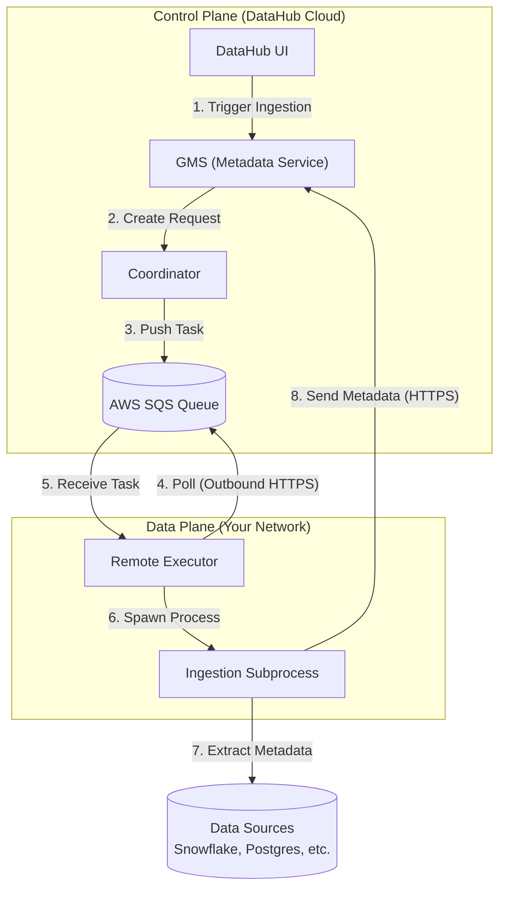

import FeatureAvailability from '@site/src/components/FeatureAvailability';

# About Remote Executor

<FeatureAvailability saasOnly />

## Overview

The Remote Executor is a powerful feature of DataHub Cloud that enables secure metadata ingestion from private sources while maintaining full control over credentials and network access. It serves as a bridge between your private infrastructure and DataHub Cloud, allowing you to:

- Ingest metadata and execute DataHub Cloud Observe monitors from sources behind firewalls or in private networks
- Monitor ingestion sources and run assertions from within your environment

## Key Benefits

### Security & Control

- Credentials stay in your environment
- Network access controlled by your policies
- Support for AWS Secrets Manager integration and all secret management systems accessible by [External Secrets Operator](https://external-secrets.io/latest/provider/aws-secrets-manager/)
- Full audit trail of execution activities

### Enterprise-Ready Integration & Operations

- Compatible with all DataHub Ingestion Sources
- Easy deployment on various platforms (AWS ECS, Kubernetes, etc.)
- Multiple executor support for high availability
- Built-in monitoring and observability
- Enterprise-grade support, eliminating the complexity of self-managed solutions

## Architecture

Remote Executors use a **pull-based** architecture. The executor polls for tasks—it never exposes any inbound ports.

### How It Works

1. **Job Creation**: You trigger ingestion from the DataHub UI
2. **Queuing**: DataHub creates a task and pushes it to an SQS queue
3. **Polling**: The Remote Executor (running in your VPC) polls SQS for tasks
4. **Execution**: The executor receives the task and spawns a subprocess to run ingestion
5. **Reporting**: Status updates and metadata are sent back to DataHub via HTTPS

## Next Steps

To get started with Remote Executor:

1. Review the [Configuring Remote Executor](../operator-guide/setting-up-remote-ingestion-executor.md) guide for deployment instructions
2. See the [Monitoring Remote Executors](monitoring.md) guide

## FAQ

### Is Remote Executor required for DataHub Cloud?

No, DataHub Cloud comes with a managed executor by default. Remote Executor is an optional feature for cases where you need to ingest from private sources or maintain stricter control over credentials and network access.

### Can I use multiple Remote Executors?

Yes, you can deploy multiple Remote Executors for high availability or to handle different security zones. Contact your DataHub Cloud representative for details.

### What platforms are supported?

Remote Executor can be deployed on various platforms including:

- Amazon ECS
- Kubernetes (v1.28+)
  - Cloud-agnostic deployment supporting all major cloud providers (AWS EKS, Google GKE, Azure AKS, etc.)
  - Compatible with self-managed Kubernetes clusters
- Other container platforms (contact DataHub team for details)

### How secure is the Remote Executor?

The Remote Executor is designed with security as a top priority:

- All credentials remain in your environment
- No inbound connections required
- Support for secret management systems
- Regular security updates
