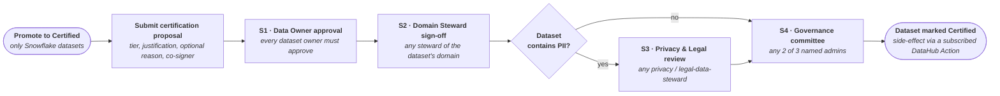

import FeatureAvailability from '@site/src/components/FeatureAvailability';

# Workflow Tutorial

<FeatureAvailability saasOnly/>

> **Note**: Action Workflows is currently in **Private Beta**. To enable this feature, please reach out to the DataHub team.

This tutorial walks through a complete Action Workflow definition that exercises every major primitive in the engine. The running example is a workflow that promotes a Snowflake dataset from _Draft_ to _Certified_ lifecycle status through a multi-step review.

For the conceptual introduction, see [Action Workflows](action-workflows.md). For the exhaustive JSON syntax of every primitive, see the [Workflow Reference](action-workflows-reference.md). The full JSON definition is attached at the end of this page and can be submitted directly as the `input` argument to the `upsertActionWorkflow` mutation.

## Overview

The Dataset Promotion to Certified workflow is launched from a Snowflake dataset's profile page. It collects a target tier, a justification, and a co-signer nomination from the requester, then walks four approval steps:



The workflow combines:

1. **Entrypoint** restricted to Snowflake datasets ([Entrypoint](#entrypoint))
2. **User form** with: a required, length-validated justification; a co-signer nominated from the dataset's domain owners; a curated 3-option tier picker; a conditional downgrade-reason field ([User Request Form](#user-request-form))
3. **Steps**: dynamically-routed data-owner approval with `ALL_OF` quorum; dynamically-routed domain-steward approval with `ANY_OF` quorum; a legal-review step conditional on the launching dataset's PII tag; an admin sign-off with `N_OF_M(2/3)` quorum ([The Decision Graph](#the-decision-graph))
4. **Lifecycle**: full audit history with on-behalf-of attribution; requester self-cancellation supported; admin override supported ([Lifecycle, Attribution, Cancellation](#lifecycle-attribution-cancellation))
5. **Side-effect**: on the workflow's `COMPLETED` event, a subscribed DataHub Action flips the dataset's `lifecycleStage` structured property and applies a `certified-by-workflow` tag. The side-effect itself is implemented in the Actions framework and is out of scope for this tutorial — see [Reacting to Workflow Events](action-workflows.md#reacting-to-workflow-events) for the integration pattern

The full assembled JSON definition is attached in the [Appendix](#appendix-full-workflow-definition). The snippets in the sections that follow are excerpts of the same definition.

## Entrypoint

Every workflow declares where in the UI it surfaces. The `trigger` object lists the entity types on whose profile pages the workflow's launch icon appears, plus an optional `HOME` entry for catalog-wide discovery. Each entrypoint can carry a visibility filter the catalog applies before showing the icon. The same filter dialect is also used for conditional steps and field-visibility conditions.

The Dataset Promotion workflow uses a single `ENTITY_PROFILE` entrypoint labelled _Promote to Certified_, with a visibility filter that requires the launching dataset's `platform` to equal Snowflake:

```json
{
  "trigger": {
    "type": "FORM_SUBMITTED",
    "form": {
      "entityTypes": ["DATASET"],
      "entrypoints": [
        {
          "type": "ENTITY_PROFILE",
          "label": "Promote to Certified",
          "filter": {
            "operator": "AND",
            "filters": [
              {
                "field": "platform",
                "values": ["urn:li:dataPlatform:snowflake"],
                "condition": "EQUAL"
              }
            ]
          }
        }
      ]
    }
  }
}
```

The same filter dialect can match by tag, glossary term, domain, data product, owner, sub-type, or any combination — so an author can scope visibility as narrowly or broadly as the governance process requires. See the [Filter Dialect](action-workflows-reference.md#filter-dialect) section of the reference for the full set of supported fields and operators.

## User Request Form

### Field types and validation

Form fields declare a value type (`STRING`, `RICH_TEXT`, `DATE`, `URN`, `NUMBER`, `BOOLEAN`), a required flag, and an optional validator. Regex and length bounds are supported as built-in validators; submission errors are rendered inline in the UI with the field's configured `errorMessage`.

The _justification_ field is `RICH_TEXT`, `required`, and carries a regex `validation` that enforces at least 100 characters:

```json
{
  "id": "justification",
  "name": "Reason for certification",
  "description": "Minimum 100 characters.",
  "valueType": "RICH_TEXT",
  "cardinality": "SINGLE",
  "required": true,
  "validation": {
    "pattern": "[\\s\\S]{100,}",
    "errorMessage": "Please describe at least 100 characters explaining why this dataset is ready for certification."
  }
}
```

### Context-aware dropdowns

Any URN-valued field can declare a `dynamicSource` that resolves its selectable options by traversing the catalog graph. The starting point — the resolver's `source` — can be the launching entity (`"launching"`) or a URN the requester picked earlier in the form (`"field:<form-field-id>"`); the traversal walks documented relationships (owners, domain, tags, glossary terms, data products, applications, container, members of); an optional `filter` narrows the final option set.

The form's _co_signer_steward_ URN picker — scoped to `CORP_USER` — uses a `dynamicSource` with resolver `DOMAIN_OWNERS_OF` and source `launching`, so the dropdown lists only users who own the launching dataset's domain rather than every catalog user:

```json
{
  "id": "co_signer_steward",
  "name": "Domain steward co-signer (nomination)",
  "description": "Picker resolves to domain owners of the launching dataset.",
  "valueType": "URN",
  "allowedEntityTypes": ["CORP_USER"],
  "cardinality": "SINGLE",
  "required": true,
  "dynamicSource": {
    "resolvers": [{ "resolver": "DOMAIN_OWNERS_OF", "source": "launching" }]
  }
}
```

The picker renders each resolved URN as a rich entity card (icon, type pill, display name), and the submit boundary validates that the requester picks a URN inside the resolved set.

### Fixed-URN allow-lists

The `filter` slot on a `dynamicSource` narrows the resolver's result to options matching arbitrary indexed criteria — platform, tag, domain, or any other entity attribute. The same dialect is used everywhere a `Filter` appears in the workflow definition (entrypoint visibility, field visibility, step skip-condition).

For a curated, fixed URN list — for example "pick one of these three certification tiers" — pair the `ALL_ENTITIES` resolver (which enumerates entities scoped by the field's `allowedEntityTypes`) with a `filter` that narrows by `urn` to the chosen members. Multi-value `EQUAL` is an OR — only URNs in the list pass.

The _target_tier_ field uses `ALL_ENTITIES` over `GLOSSARY_TERM` plus an `urn`-EQUAL filter against the three certification glossary term URNs, so the picker surfaces exactly those three options:

```json
{
  "id": "target_tier",
  "name": "Target certification tier",
  "description": "Picker scoped to 3 certification glossary terms via ALL_ENTITIES + urn-EQUAL filter.",
  "valueType": "URN",
  "allowedEntityTypes": ["GLOSSARY_TERM"],
  "cardinality": "SINGLE",
  "required": true,
  "dynamicSource": {
    "resolvers": [{ "resolver": "ALL_ENTITIES", "source": "launching" }],
    "filter": {
      "operator": "AND",
      "filters": [
        {
          "field": "urn",
          "condition": "EQUAL",
          "values": [
            "urn:li:glossaryTerm:certification.bronze",
            "urn:li:glossaryTerm:certification.silver",
            "urn:li:glossaryTerm:certification.gold"
          ]
        }
      ]
    }
  }
}
```

### Conditional field visibility

A field can declare a `filterCondition` that decides whether it renders. The condition is a boolean expression that can mix **form-field values** the requester entered (referenced via `formField:<id>`) AND **attributes of the launching entity** the catalog already knows (tags, glossary terms, domain, platform, data product, owners, sub-type, name, description). A field reveals itself only when the combined condition holds.

The _downgrade_reason_ field renders only when the launching dataset's `glossaryTerms` already contain `certification.gold` AND the requester's _target_tier_ choice is not equal to `certification.gold` — i.e., a genuine downgrade:

```json
{
  "id": "downgrade_reason",
  "name": "Reason for downgrade",
  "description": "Visible only when the dataset currently has certification.gold AND the target tier is not gold.",
  "valueType": "RICH_TEXT",
  "cardinality": "SINGLE",
  "required": true,
  "filterCondition": {
    "operator": "AND",
    "filters": [
      {
        "field": "glossaryTerms",
        "values": ["urn:li:glossaryTerm:certification.gold"],
        "condition": "CONTAIN"
      },
      {
        "field": "formField:target_tier",
        "values": ["urn:li:glossaryTerm:certification.gold"],
        "condition": "EQUAL",
        "negated": true
      }
    ]
  }
}
```

## The Decision Graph

### Steps and dynamic actor resolution

Each step declares an actor model — who can decide. Actors can be statically named users, members of a role, members of a group, or resolved dynamically at step-open time. The same resolver dialect used by dynamic dropdowns can also resolve actors, so "the data owner of this dataset" and "the owners of the application the requester picked in their form" are both expressible from the launching entity or from URN-valued form fields.

The _data-owner-approval_ step leaves the static actor slots empty and resolves its actors via a `dynamicSource` with resolver `OWNERS_OF` and source `launching` — at step-open time the engine assigns the approving actors to be the launching dataset's owners:

```json
{
  "id": "data-owner-approval",
  "type": "APPROVAL",
  "description": "ALL_OF: every dataset owner must approve.",
  "actors": {
    "dynamicSource": {
      "resolvers": [{ "resolver": "OWNERS_OF", "source": "launching" }]
    }
  },
  "quorum": { "allOf": true }
}
```

### Quorum

Each step declares a quorum policy: `anyOf: true` (any single approver suffices — the default), `allOf: true` (every slot must approve), or `nofM: { n: <count> }` (a threshold count out of the assigned pool). Group and role slots are expanded transparently — any member of an assigned group can satisfy the slot — and the step's audit trail records which slot each decision satisfied.

In the running example, the _data-owner-approval_ step uses `allOf` (every data owner must approve), the _domain-steward-approval_ step uses `anyOf` (any single domain owner advances), and the final _admin-signoff_ step uses `nofM: { n: 2 }` over a static pool of three named reviewers (the classical "two-of-three" governance committee):

```json
{
  "id": "admin-signoff",
  "type": "APPROVAL",
  "description": "N_OF_M(2/3): any 2 of the 3 named reviewers must approve.",
  "actors": {
    "userUrns": [
      "urn:li:corpuser:reviewer-alpha",
      "urn:li:corpuser:reviewer-beta",
      "urn:li:corpuser:reviewer-gamma"
    ]
  },
  "quorum": { "nofM": { "n": 2 } }
}
```

### Conditional step skip

A step can declare a `condition` that decides whether it opens for a given request. The condition reads form-field values and launching-entity attributes — tags, glossary terms, domain, platform, owners, sub-type — using the same expression dialect as entrypoint and field-visibility conditions. Steps whose condition evaluates to false are skipped automatically and the audit log records the skip with the condition that decided it.

The _legal-review_ step assigns the `legal-data-stewards` group, and its step `condition` requires the launching dataset's `tags` to contain `urn:li:tag:pii` — when the condition is false the step is auto-skipped and the audit log records a `SKIPPED` entry:

```json
{
  "id": "legal-review",
  "type": "APPROVAL",
  "description": "ANY_OF from legal-data-stewards group. Fires only when the dataset carries urn:li:tag:pii.",
  "actors": {
    "groupUrns": ["urn:li:corpGroup:legal-data-stewards"]
  },
  "quorum": { "anyOf": true },
  "condition": {
    "operator": "AND",
    "filters": [
      {
        "field": "tags",
        "values": ["urn:li:tag:pii"],
        "condition": "CONTAIN"
      }
    ]
  }
}
```

## Lifecycle, Attribution, Cancellation

Every state transition on a workflow request — submission, approval, rejection, skip, cancellation — appends an immutable entry to the request's audit history, with the actor URN, timestamp, comment, and (for approvals) the slot the decision counted toward. The UI renders each entry as a separate audit line and includes on-behalf-of attribution when a user acts as part of a group ("Alice, on behalf of the group `data-stewards`").

In-flight requests can be cancelled in two ways. The original requester can cancel their own request through the request profile; an administrator with `Manage Global Settings` can cancel any request as an override. Cancellation appends a `CANCELLED` decision to the history, flips the request's status, and notifies assigned approvers — the audit trail on the cancelled request remains complete.

## Submitting the Definition

The complete JSON definition below is directly accepted as the `input` argument to the `upsertActionWorkflow` GraphQL mutation. Customers typically maintain workflow definitions like this in their version-controlled configuration repository and apply them through one of:

- **DataHub Python SDK**: `graph.execute_graphql(query=UPSERT_MUTATION, variables={"input": <json>})` — see the [Action Workflows concept page](action-workflows.md#creating-an-action-workflow) for a complete example
- **Raw GraphQL** via curl, GraphiQL, or your tool of choice — point your client at `/api/graphql` and submit the mutation directly
- **`datahub` CLI** — wrap the JSON in a small Python or shell script that calls the SDK; there is no dedicated CLI subcommand for workflow upsert today

Every upsert produces a new immutable revision; in-flight workflow requests continue against the revision they were launched under, so a definition change does not retroactively alter approvals already in progress.

## Appendix — Full Workflow Definition

The complete `Dataset Promotion to Certified` workflow definition. This is the same JSON exercised end-to-end by the canonical smoke test (`smoke-test/tests/workflows/test_dataset_promotion_canonical.py`).

```json
{
  "urn": "urn:li:actionWorkflow:dataset-promotion-certified",
  "name": "Dataset Promotion to Certified",
  "description": "Promote a dataset's lifecycleStage to a higher certification tier. Restricted to Snowflake datasets. Combines context-aware form pickers, conditional fields, dynamic actor resolution, mixed quorum policies, and a conditional legal-review step that auto-fires on PII-tagged datasets.",
  "category": "CUSTOM",
  "customCategory": "GOVERNANCE",
  "trigger": {
    "type": "FORM_SUBMITTED",
    "form": {
      "entityTypes": ["DATASET"],
      "entrypoints": [
        {
          "type": "ENTITY_PROFILE",
          "label": "Promote to Certified",
          "filter": {
            "operator": "AND",
            "filters": [
              {
                "field": "platform",
                "values": ["urn:li:dataPlatform:snowflake"],
                "condition": "EQUAL"
              }
            ]
          }
        }
      ],
      "fields": [
        {
          "id": "target_tier",
          "name": "Target certification tier",
          "description": "Picker scoped to 3 certification glossary terms via ALL_ENTITIES + urn-EQUAL filter.",
          "valueType": "URN",
          "allowedEntityTypes": ["GLOSSARY_TERM"],
          "cardinality": "SINGLE",
          "required": true,
          "dynamicSource": {
            "resolvers": [
              { "resolver": "ALL_ENTITIES", "source": "launching" }
            ],
            "filter": {
              "operator": "AND",
              "filters": [
                {
                  "field": "urn",
                  "condition": "EQUAL",
                  "values": [
                    "urn:li:glossaryTerm:certification.bronze",
                    "urn:li:glossaryTerm:certification.silver",
                    "urn:li:glossaryTerm:certification.gold"
                  ]
                }
              ]
            }
          }
        },
        {
          "id": "justification",
          "name": "Reason for certification",
          "description": "Minimum 100 characters.",
          "valueType": "RICH_TEXT",
          "cardinality": "SINGLE",
          "required": true,
          "validation": {
            "pattern": "[\\s\\S]{100,}",
            "errorMessage": "Please describe at least 100 characters explaining why this dataset is ready for certification."
          }
        },
        {
          "id": "downgrade_reason",
          "name": "Reason for downgrade",
          "description": "Visible only when the dataset currently has certification.gold AND the target tier is not gold.",
          "valueType": "RICH_TEXT",
          "cardinality": "SINGLE",
          "required": true,
          "filterCondition": {
            "operator": "AND",
            "filters": [
              {
                "field": "glossaryTerms",
                "values": ["urn:li:glossaryTerm:certification.gold"],
                "condition": "CONTAIN"
              },
              {
                "field": "formField:target_tier",
                "values": ["urn:li:glossaryTerm:certification.gold"],
                "condition": "EQUAL",
                "negated": true
              }
            ]
          }
        },
        {
          "id": "co_signer_steward",
          "name": "Domain steward co-signer (nomination)",
          "description": "Picker resolves to domain owners of the launching dataset.",
          "valueType": "URN",
          "allowedEntityTypes": ["CORP_USER"],
          "cardinality": "SINGLE",
          "required": true,
          "dynamicSource": {
            "resolvers": [
              { "resolver": "DOMAIN_OWNERS_OF", "source": "launching" }
            ]
          }
        }
      ]
    }
  },
  "steps": [
    {
      "id": "data-owner-approval",
      "type": "APPROVAL",
      "description": "ALL_OF: every dataset owner must approve.",
      "actors": {
        "dynamicSource": {
          "resolvers": [{ "resolver": "OWNERS_OF", "source": "launching" }]
        }
      },
      "quorum": { "allOf": true }
    },
    {
      "id": "domain-steward-approval",
      "type": "APPROVAL",
      "description": "ANY_OF: any owner of the dataset's domain can approve.",
      "actors": {
        "dynamicSource": {
          "resolvers": [
            { "resolver": "DOMAIN_OWNERS_OF", "source": "launching" }
          ]
        }
      },
      "quorum": { "anyOf": true }
    },
    {
      "id": "legal-review",
      "type": "APPROVAL",
      "description": "ANY_OF from legal-data-stewards group. Fires only when the dataset carries urn:li:tag:pii.",
      "actors": {
        "groupUrns": ["urn:li:corpGroup:legal-data-stewards"]
      },
      "quorum": { "anyOf": true },
      "condition": {
        "operator": "AND",
        "filters": [
          {
            "field": "tags",
            "values": ["urn:li:tag:pii"],
            "condition": "CONTAIN"
          }
        ]
      }
    },
    {
      "id": "admin-signoff",
      "type": "APPROVAL",
      "description": "N_OF_M(2/3): any 2 of the 3 named reviewers must approve.",
      "actors": {
        "userUrns": [
          "urn:li:corpuser:reviewer-alpha",
          "urn:li:corpuser:reviewer-beta",
          "urn:li:corpuser:reviewer-gamma"
        ]
      },
      "quorum": { "nofM": { "n": 2 } }
    }
  ]
}
```
