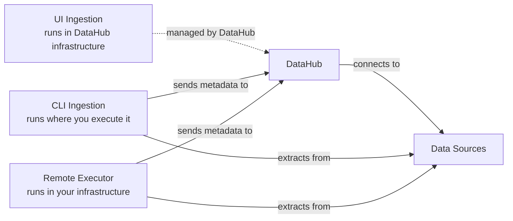

# Ingestion Security Comparison

DataHub supports three ways to ingest metadata. They differ primarily in where credentials are stored and what network access is required.

## Quick Comparison

|                     | **Credentials**                              | **Runs From**                                                                        | **Network**                                                                            | **Firewall/IP Allowlist Adjustments**                                          |
| ------------------- | -------------------------------------------- | ------------------------------------------------------------------------------------ | -------------------------------------------------------------------------------------- | ------------------------------------------------------------------------------ |
| **UI Ingestion**    | Encrypted in DataHub                         | DataHub's infrastructure                                                             | DataHub infrastructure connects to your data sources                                   | Required for sources behind firewalls or with IP allowlists                    |
| **CLI Ingestion**   | Local files/env vars                         | Wherever you execute it (personal machine, CI/CD, scheduler like Airflow/Cron, etc.) | CLI connects to your data sources, then sends metadata to DataHub                      | Depends on where CLI runs and if those machines already have connectivity      |
| **Remote Executor** | Your infrastructure (AWS Secrets, K8s, etc.) | Deployed in your infrastructure (K8s, ECS, etc.)                                     | Executor connects to your data sources, then sends metadata to DataHub (outbound only) | Depends on where executor runs and if those machines already have connectivity |

### Network Flow Diagram

## Where Credentials Live

### UI Ingestion

Credentials are encrypted with an encryption key and stored in the DataHub database. DataHub manages the encryption and uses these credentials when connecting to your data sources.

### CLI Ingestion

Credentials are stored in your infrastructure via recipe files. **Best practice: Always use environment variables** rather than hardcoding credentials in recipe files. You can also integrate with local secret managers.

### Remote Executor

Integrates with enterprise secret management systems in your infrastructure, such as:

- AWS Secrets Manager
- Kubernetes Secrets
- External Secrets Operator
- HashiCorp Vault
- Other secret management solutions

## Network Patterns

### UI Ingestion

DataHub's infrastructure connects directly to your data sources. This requires configuring your sources to allow DataHub access, which is source-dependent:

- **Cloud sources** (Snowflake, BigQuery, etc.): May require adding DataHub IPs to allowlists
- **On-premise sources**: May require VPN tunnels or firewall rules to allow DataHub to reach them

### CLI Ingestion

The CLI runs wherever you execute it (personal machine, CI/CD, cloud instance, scheduler like Airflow/Cron). It first connects to your data sources to extract metadata, then sends that metadata to DataHub. Network requirements depend entirely on where the CLI runs and whether that machine already has connectivity to both your sources and DataHub.

### Remote Executor

Deployed as software in your infrastructure (Kubernetes, ECS, etc.) with access to both your data sources and DataHub. Like CLI, it connects to sources first, then sends metadata to DataHub.

**Key advantage**: Only makes outbound connections. You don't need to open inbound firewall ports or configure VPN access for external systems—the executor software runs entirely within your network perimeter.

## When to Use What

Most organizations use a mix of all three approaches based on their specific needs. Here are common patterns:

### UI Ingestion - Best For:

- **Cloud-hosted data sources**: Snowflake, BigQuery, Redshift, Tableau, Looker, PowerBI, etc.
- **When you want simplicity**: Built-in scheduling, no infrastructure to manage, easiest to scale
- **Getting started quickly**: Minimal setup required

**Advantages**: Simplest for both scheduling and scale. DataHub handles all infrastructure and orchestration.

### CLI Ingestion - Best For:

- **Sources requiring local files**: dbt projects, custom SQL queries, local transformations
- **CI/CD pipelines**: Integrate metadata ingestion into your build/deploy process
- **Development and testing**: Quick iteration and testing of ingestion recipes
- **Custom orchestration**: When you need fine-grained control over scheduling (Airflow, Cron, etc.)

**Scheduling**: Requires external scheduler (Airflow, Cron, Kubernetes CronJob, etc.)

### Remote Executor - Best For:

- **Databases inside your network**: On-premise databases, internal data warehouses
- **Strict security requirements**: When credentials cannot leave your infrastructure
- **Sources behind firewalls**: When you cannot or prefer not to configure external access
- **Enterprise secret management**: When you need integration with existing secret management systems

**Advantages**: Runs in your infrastructure with your security controls, only requires outbound connectivity, integrates with your existing secret management.

### Choosing the Right Approach

The choice often depends on:

- **Source location**: Cloud-hosted vs on-premise
- **Security requirements**: Where credentials can be stored
- **Network topology**: Firewall and connectivity constraints
- **Operational preferences**: Managed service vs self-hosted
- **Scale**: How many sources and how frequently you ingest

**Note**: These are guidelines, not strict rules. The best choice varies by organization and even by individual data source within an organization.

## More Info

- [UI Ingestion Guide](ui-ingestion.md)
- [CLI Installation](cli.md#installation)
- [Remote Executor Overview](managed-datahub/remote-executor/about.md)
- [Scheduling CLI Ingestion with Airflow](https://datahubproject.io/docs/metadata-ingestion/schedule_docs/airflow)
- [Personal Access Tokens](authentication/personal-access-tokens.md)
