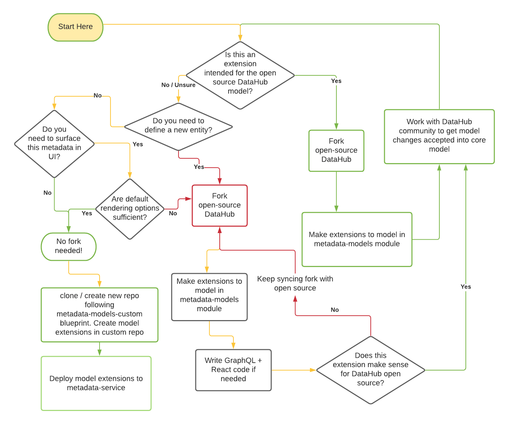

***

## slug: /metadata-modeling/extending-the-metadata-model

# Ampliación del modelo de metadatos

Puede ampliar el modelo de metadatos creando una nueva entidad o ampliando una existente. No estoy seguro de si necesita
crear una nueva entidad o agregar un aspecto a una entidad existente? Leer [modelo de metadatos](./metadata-model.md) para entender
estos dos conceptos antes de realizar cambios.

## ¿Bifurcar o no bifurcar?

Una pregunta importante que surgirá una vez que haya decidido extender el modelo de metadatos es si necesita bifurcar el repositorio principal o no. Use el diagrama a continuación para comprender cómo tomar esta decisión.


Las líneas verdes representan vías que conducirán a una menor fricción para que pueda mantener su código a largo plazo. Las líneas rojas representan un mayor riesgo de conflictos en el futuro. Estamos trabajando arduamente para mover la mayoría de los casos de uso de extensiones de modelo a rutas sin código / de código bajo para garantizar que pueda extender el modelo de metadatos central sin tener que mantener una bifurcación personalizada de DataHub.

Nos referiremos a las dos opciones como el **bifurcación de código abierto** y **repositorio personalizado** enfoques en el resto del documento a continuación.

## Esta guía

Esta guía describirá cómo debería ser la experiencia de agregar una nueva entidad a través de un ejemplo real de agregar el
Entidad dashboard. Si desea ampliar una entidad existente, puede saltar directamente a [Paso 3](#step\_3).

A un alto nivel, una entidad está formada por:

1.  Un aspecto clave: identifica de forma única una instancia de una entidad,
2.  Una lista de aspectos especificados, grupos de atributos relacionados que se adjuntan a una entidad.

## Definición de una entidad

Ahora repasaremos los pasos necesarios para crear, ingerir y ver las extensiones del modelo de metadatos. Usaremos
la entidad "Dashboard" existente a efectos ilustrativos.

### <a name="step_1"></a>Paso 1: Definir el aspecto de la clave de entidad

Una clave representa los campos que identifican de forma exclusiva a la entidad. Para aquellos familiarizados con la arquitectura heredada de DataHub,
estos campos formaban parte anteriormente de la clase Urn Java que se definía para cada entidad.

Esta estructura se utilizará para generar una clave de cadena serializada, representada por una urna. Cada campo en la estructura de claves
se convertirán en una sola parte de la tupla de la Urna, en el orden en que se definen.

Definamos un aspecto clave para nuestra nueva entidad Dashboard.

```
namespace com.linkedin.metadata.key

/**
 * Key for a Dashboard
 */
@Aspect = {
  "name": "dashboardKey",
}
record DashboardKey {
  /**
  * The name of the dashboard tool such as looker, redash etc.
  */
  @Searchable = {
    ...
  }
  dashboardTool: string

  /**
  * Unique id for the dashboard. This id should be globally unique for a dashboarding tool even when there are multiple deployments of it. As an example, dashboard URL could be used here for Looker such as 'looker.linkedin.com/dashboards/1234'
  */
  dashboardId: string
}

```

La representación en urna de la clave mostrada arriba sería:

    urn:li:dashboard:(<tool>,<id>)

Debido a que son aspectos, las claves deben anotarse con una anotación @Aspect, esto indica a DataHub que esta estructura
puede ser parte de.

La clave también se puede anotar con las dos anotaciones de índice: @Relationship y @Searchable. Esto indica a DataHub
infra para utilizar los campos de la clave para crear relaciones y campos de índice para la búsqueda. Ver [Paso 3](#step\_3) para más detalles sobre
el modelo de anotación.

**Restricciones**: Tenga en cuenta que cada campo de un aspecto clave DEBE ser del tipo String o Enum.

### <a name="step_2"></a>Paso 2: Crear la nueva entidad con su aspecto clave

Definir la entidad dentro de un `entity-registry.yml` archivo. Dependiendo de su enfoque, la ubicación de este archivo puede variar. Más sobre eso en pasos [4](#step\_4) y [5](#step\_5).

Ejemplo:

```yaml
  - name: dashboard
    doc: A container of related data assets.
    keyAspect: dashboardKey
```

*   nombre: El nombre/tipo de entidad, este estará presente como parte de la Urna.
*   doc: Una breve descripción de la entidad.
*   keyAspect: el nombre del aspecto clave definido en el paso 1. Este nombre debe coincidir con el valor de la anotación PDL.

#

### <a name="step_3"></a>Paso 3: Definir aspectos personalizados o adjuntar aspectos existentes a su entidad

Algunos aspectos, como Ownership y GlobalTags, son reutilizables en todas las entidades. Se pueden incluir en el conjunto de
aspectos libremente. Para incluir atributos que no están incluidos en un aspecto existente, se debe crear un nuevo aspecto.

Veamos el aspecto DashboardInfo como un ejemplo de lo que entra en un nuevo aspecto.

    namespace com.linkedin.dashboard

    import com.linkedin.common.AccessLevel
    import com.linkedin.common.ChangeAuditStamps
    import com.linkedin.common.ChartUrn
    import com.linkedin.common.Time
    import com.linkedin.common.Url
    import com.linkedin.common.CustomProperties
    import com.linkedin.common.ExternalReference

    /**
     * Information about a dashboard
     */
    @Aspect = {
      "name": "dashboardInfo"
    }
    record DashboardInfo includes CustomProperties, ExternalReference {

      /**
       * Title of the dashboard
       */
      @Searchable = {
        "fieldType": "TEXT_WITH_PARTIAL_MATCHING",
        "queryByDefault": true,
        "enableAutocomplete": true,
        "boostScore": 10.0
      }
      title: string

      /**
       * Detailed description about the dashboard
       */
      @Searchable = {
        "fieldType": "TEXT",
        "queryByDefault": true,
        "hasValuesFieldName": "hasDescription"
      }
      description: string

      /**
       * Charts in a dashboard
       */
      @Relationship = {
        "/*": {
          "name": "Contains",
          "entityTypes": [ "chart" ]
        }
      }
      charts: array[ChartUrn] = [ ]

      /**
       * Captures information about who created/last modified/deleted this dashboard and when
       */
      lastModified: ChangeAuditStamps

      /**
       * URL for the dashboard. This could be used as an external link on DataHub to allow users access/view the dashboard
       */
      dashboardUrl: optional Url

      /**
       * Access level for the dashboard
       */
      @Searchable = {
        "fieldType": "KEYWORD",
        "addToFilters": true
      }
      access: optional AccessLevel

      /**
       * The time when this dashboard last refreshed
       */
      lastRefreshed: optional Time
    }

El Aspecto tiene cuatro componentes clave: sus propiedades, la anotación @Aspect, la anotación @Searchable y la
@Relationship anotación. Vamos a desglosar cada uno de estos:

*   **Propiedades de aspecto**: Las propiedades del registro se pueden declarar como un campo en el registro, o mediante la inclusión de otro
    registro en la definición del Aspecto (`record DashboardInfo includes CustomProperties, ExternalReference {`). Propiedades
    se pueden definir como primitivas PDL, enumeraciones, registros o colecciones (
    ver [Documentación del esquema PDL](https://linkedin.github.io/rest.li/pdl_schema))
    referencias a otras entidades, de tipo Urna u opcionalmente `<Entity>Urn`
*   **@Aspect anotación**: Declara que el registro es un aspecto y lo incluye al serializar una entidad. A diferencia de lo siguiente
    dos anotaciones, @Aspect se aplica a todo el registro, en lugar de a un campo específico.  Nota, puede marcar un aspecto
    como un aspecto de serie temporal. Echa un vistazo a esto [Doc](metadata-model.md#timeseries-aspects) para más detalles.
*   **@Searchable anotación**: Esta anotación se puede aplicar a cualquier campo primitivo o a un campo de mapa para indicar que
    debe indexarse en Elasticsearch y se puede buscar en. Para obtener una guía completa sobre el uso de la anotación de búsqueda, consulte
    los documentos de anotación más abajo en este documento.
*   **@Relationship anotación**: Estas anotaciones crean aristas entre la Urna de la Entidad y el destino de la
    campo anotado cuando se ingieren las entidades. @Relationship deben aplicarse anotaciones a campos de tipo Urna. En
    el caso de DashboardInfo, el `charts` campo es una matriz de urnas. No se puede aplicar la anotación @Relationship
    directamente a una matriz de urnas. Es por eso que ve el uso de una anulación de anotación ('"/\*":) para aplicar el @Relationship
    anotación a la Urna directamente. Lea más sobre las anulaciones en los documentos de anotación más abajo en esta página.

Después de crear su Aspecto, debe adjuntarlo a todas las entidades a las que se aplica.

**Restricciones**: Tenga en cuenta que todos los aspectos DEBEN ser de tipo Registro.

### <a name="step_4"></a> Paso 4: Elige un lugar para almacenar la extensión de tu modelo

Al principio de este documento, le guiamos a través de un diagrama de flujo que debería ayudarlo a decidir si necesita mantener una bifurcación del repositorio de DataHub de código abierto para sus extensiones de modelo, o si simplemente puede usar un repositorio de extensiones de modelo que pueda permanecer independiente del repositorio de DataHub. En función de la ruta que haya tomado, el lugar donde almacene los archivos de modelo de aspecto (los archivos .pdl) y los archivos de registro de entidades (el archivo yaml llamado `entity-registry.yaml` o `entity-registry.yml`) variará.

*   Bifurcación de código abierto: los archivos de aspecto van debajo [`metadata-models`](../../metadata-models) módulo en el repositorio principal, el registro de entidades entra en [`metadata-models/src/main/resources/entity-registry.yml`](../../metadata-models/src/main/resources/entity-registry.yml). Siga leyendo para obtener más detalles en [Paso 5](#step\_5).
*   Repositorio personalizado: Lea el [metadatos-modelos-personalizados](../../metadata-models-custom/README.md) documentación para aprender a almacenar y versionar sus modelos de aspecto y registro.

### <a name="step_5"></a>Paso 5: Adjuntar los aspectos no clave a la entidad

Adjuntar aspectos no clave a una entidad se puede hacer simplemente agregándolos al archivo yaml del registro de entidades. La ubicación de este archivo difiere en función de si está siguiendo la ruta de oss-fork o la ruta de acceso de repositorio personalizado.

Aquí hay un ejemplo mínimo de agregar nuestro nuevo `DashboardInfo` aspecto de la `Dashboard` entidad.

```yaml
entities:
   - name: dashboard
   - keyAspect: dashBoardKey
   aspects:
     # the name of the aspect must be the same as that on the @Aspect annotation on the class
     - dashboardInfo  
```

Anteriormente, se requería agregar todos los aspectos de la entidad en una unión de Aspect. Verá ejemplos de este patrón en todo el código base (por ejemplo, `DatasetAspect`, `DashboardAspect` etc.). Esto ya no es necesario.

### <a name="step_6"></a>Paso 6 (enfoque de Oss-Fork): Vuelva a crear DataHub para tener acceso a su entidad nueva o actualizada

Si optó por el enfoque de bifurcación de código abierto, donde está editando modelos en el `metadata-models` repositorio de DataHub, deberá volver a compilar el servicio de metadatos de DataHub siguiendo los pasos a continuación. Si está siguiendo el enfoque de repositorio de modelo personalizado, solo necesita crear su repositorio de modelo personalizado e implementarlo en una instancia de servicio de metadatos en ejecución para leer y escribir metadatos utilizando sus nuevas extensiones de modelo.

Siga leyendo para comprender cómo volver a compilar DataHub para la opción oss-fork.

***NOTA***: Si ha actualizado algún tipo existente o ve un `Incompatible changes` advertencia al compilar, deberá ejecutar
`./gradlew :gms:impl:build -Prest.model.compatibility=ignore`
antes de correr `build`.

Luego, corre `./gradlew build` desde la raíz del repositorio para reconstruir Datahub con acceso a su nueva entidad.

A continuación, vuelva a implementar metadata-service (gms) y mae-consumer y mce-consumer (opcionalmente si los está ejecutando desagregados). Ver [desarrollo de docker](../../docker/README.md) para obtener más información sobre cómo
para implementar durante el desarrollo. Esto permitirá a Datahub leer y escribir su nueva entidad o extensiones en entidades existentes, junto con la búsqueda de búsquedas y consultas de gráficos para ese tipo de entidad.

Para emitir propuestas para ingerir desde la herramienta CLI de Datahub, primero instale la cli de datahub
localmente [siguiendo las instrucciones aquí](../../metadata-ingestion/developing.md). `./gradlew build` generó el avro
esquemas que la herramienta cli de ingesta local utiliza anteriormente. Después de seguir la guía de desarrollo, debería poder emitir
su nuevo evento mediante la CLI de datahub local.

¡Ahora está listo para comenzar a ingerir metadatos para su nueva entidad!

### <a name="step_7"></a>(Opcional) Paso 7: Amplíe el frontend de DataHub para ver su entidad en GraphQL y React

Si va a ampliar una entidad con aspectos adicionales y puede utilizar las especificaciones de representación automática para representar automáticamente estos aspectos a su satisfacción, no es necesario escribir ningún código personalizado.

Sin embargo, si desea escribir código específico para representar las extensiones de modelo, o si introdujo una entidad completamente nueva y desea darle su propia página, deberá escribir código React y Grapqhl personalizado para ver y mutar su entidad en GraphQL o React. Para
instrucciones sobre cómo empezar a ampliar el gráfico GraphQL, consulte [documentos de graphql](../../datahub-graphql-core/README.md). Una vez que haya hecho eso, puede seguir la guía [aquí](../../datahub-web-react/README.md) para agregar la entidad a la interfaz de usuario de React.

## Anotaciones de metadatos

Hay cuatro anotaciones principales que DataHub reconoce:

#### @Entity

**Legado**
Esta anotación se aplica a cada registro de instantánea de entidad, como DashboardSnapshot.pdl. Cada uno que se incluye en
el modelo snapshot.pdl raíz debe tener esta anotación.

Toma los siguientes parámetros:

*   **nombre**: string - Un nombre común utilizado para identificar la entidad. Debe ser único entre todas las entidades que DataHub conoce.

##### Ejemplo

```aidl
@Entity = {
  // name used when referring to the entity in APIs.
  String name;
}
```

#### @Aspect

Esta anotación se aplica a cada registro aspect, como DashboardInfo.pdl. Cada aspecto que se incluye en la
conjunto de aspectos en el `entity-registry.yml` debe tener esta anotación.

Toma los siguientes parámetros:

*   **nombre**: string - Un nombre común utilizado para identificar el aspecto. Debe ser único entre todos los aspectos que DataHub conoce.
*   **tipo**: string (opcional) - establecido en "timeseries" para marcar este aspecto como timeseries. Check-out
    éste [Doc](metadata-model.md#timeseries-aspects) para más detalles.
*   **autoRender**: booleano (opcional): el valor predeterminado es false. Cuando se establece en true, el aspecto se mostrará automáticamente
    en las páginas de entidad de una ficha mediante un representador predeterminado. ***Actualmente, esto solo se admite para gráficos, paneles, flujos de datos, datajobs, conjuntos de datos, dominios y glosarios.***.
*   **renderSpec**: RenderSpec (opcional): configuración para los aspectos de autorregeneración que controla cómo se muestran. ***Actualmente, esto solo se admite para gráficos, paneles, flujos de datos, datajobs, conjuntos de datos, dominios y glosarios.***. Contiene tres campos:
    *   **displayType**: Uno de `tabular`, `properties`. Tabular debe usarse para una lista de elementos de datos, propiedades para una sola bolsa de datos.
    *   **displayName**: Cómo se debe hacer referencia al aspecto en la interfaz de usuario. Determina el nombre de la ficha en la página de entidad.
    *   **llave**: Para `tabular` sólo aspectos. Especifica la clave en la que se puede encontrar la matriz que se va a representar.

##### Ejemplo

```aidl
@Aspect = {
  // name used when referring to the aspect in APIs.
  String name;
}
```

#### @Searchable

Esta anotación se aplica a los campos dentro de un aspecto. Indica a DataHub que indexe el campo para que pueda recuperarse.
a través de las API de búsqueda.

Toma los siguientes parámetros:

*   **fieldType**: string - La configuración de cómo se indexa cada campo está definida por el tipo de campo. Cada tipo de campo es
    asociado a un conjunto de analizadores que Elasticsearch utilizará para tokenizar el campo. Dichos conjuntos se definen en el
    MappingsBuider, que genera las asignaciones para el índice de cada entidad dados los campos con la búsqueda
    Anotaciones. Para personalizar el conjunto de analizadores utilizados para indexar un campo determinado, debe agregar un nuevo tipo de campo y definir
    el conjunto de asignaciones que se aplicarán en MappingsBuilder.

    Hasta ahora, hemos implementado 9 fieldTypes:

    1.  *PALABRA CLAVE* - Campos de texto cortos que solo admiten coincidencias exactas, a menudo utilizados solo para filtrar

    2.  *MENSAJE DE TEXTO* - Campos de texto delimitados por espacios/barras/puntos. Tipo de campo predeterminado para variables de cadena.

    3.  *TEXT_PARTIAL* - Campos de texto delimitados por espacios/barras/puntos con soporte de coincidencia parcial. Nota, parcial
        La coincidencia es costosa, por lo que este tipo de campo no debe aplicarse a campos con valores largos (como la descripción)

    4.  *BROWSE_PATH* - Tipo de campo para navegar por rutas. Aplica asignaciones específicas para trazados delimitados por barras diagonales.

    5.  *URNA* - Campos de urna donde se indexa cada subcomponente dentro de la urna. Por ejemplo, para una urna de plataforma de datos como
        "urn:li:dataplatform:kafka", indexará el nombre de la plataforma "kafka" e ignorará los componentes comunes

    6.  *URN_PARTIAL* - Campos de urna donde cada subcomponente dentro de la urna se indexa con soporte de coincidencia parcial.

    7.  *BOOLEANO* - Campos booleanos utilizados para filtrar.

    8.  *CONTAR* - Contar los campos utilizados para el filtrado.

    9.  *FECHA Y HORA* - Campos datetime utilizados para representar marcas de tiempo.

*   **fieldName**: string (opcional): el nombre del campo en el documento de índice de búsqueda. El valor predeterminado es el nombre del campo donde
    la anotación reside.

*   **queryByDefault**: booleano (opcional) - Si debemos coincidir con el campo para la consulta de búsqueda predeterminada. Verdadero por
    predeterminado para los campos de texto y urna.

*   **enableAutocompletar**: booleano (opcional) - Si debemos usar el campo para autocompletar. El valor predeterminado es false

*   **addToFilters**: booleano (opcional) - Si se debe agregar o no un campo a los filtros. El valor predeterminado es false

*   **boostScore**: doble (opcional) - Aumentar el multiplicador de la puntuación del partido. Partidos en campos con mayor puntuación de impulso
    ocupa un lugar más alto.

*   **hasValuesFieldName**: string (opcional): si está establecido, agregue un campo de índice del nombre dado que compruebe si el campo
    Existe

*   **numValuesFieldName**: string (opcional) - Si está establecido, agregue un campo de índice del nombre dado que compruebe el número de
    Elementos

*   **pesosPerFieldValue**: map\[object, double] (opcional) - Pesos a aplicar para puntuar un valor determinado.

##### Ejemplo

Echemos un vistazo a un ejemplo del mundo real usando el `title` campo de `DashboardInfo.pdl`:

```aidl
record DashboardInfo {
 /**
   * Title of the dashboard
   */
  @Searchable = {
    "fieldType": "TEXT_PARTIAL",
    "enableAutocomplete": true,
    "boostScore": 10.0
  }
  title: string
  ....
}
```

Esta anotación dice que queremos indexar el campo de título en Elasticsearch. Queremos apoyar partidos parciales en
el título, por lo que consulta para `Cust` debe devolver un panel con el título `Customers`. `enableAutocomplete` se establece en
true, lo que significa que podemos autocompletar en este campo al escribir en la barra de búsqueda. Finalmente, un boostScore de 10 es
proporcionado, lo que significa que debemos priorizar los partidos al título sobre los partidos a otros campos, como la descripción, cuando
clasificación.

Ahora, cuando Datahub ingiera Dashboards, indexará el título del Dashboard en Elasticsearch. Cuando un usuario busca
Dashboards, esa consulta se usará para buscar en el índice de título y se devolverán los Dashboards coincidentes.

Tenga en cuenta que cuando se aplica @Searchable anotación a un mapa, la convertirá en una lista con "key.toString()
\=value.toString()" como elementos. Esto nos permite indexar campos de mapa, sin aumentar el número de columnas indexadas.

#### @Relationship

Esta anotación se aplica a los campos dentro de un aspecto. Esta anotación crea aristas entre la urna de una entidad y el
destino del campo anotado cuando se ingiere la Entidad. @Relationship deben aplicarse anotaciones a los campos de
tipo Urna.

Toma los siguientes parámetros:

*   **nombre**: string - Un nombre utilizado para identificar el tipo de relación.
*   **entityTypes**: array\[string] (Opcional): lista de tipos de entidad que son valores válidos para la clave externa
    campo de relación.

##### Ejemplo

Echemos un vistazo a un ejemplo del mundo real para ver cómo se usa esta anotación. El `Owner.pdl` struct es referenciado por
el `Ownership.pdl` aspecto. `Owned.pdl` contiene una relación con un CorpUser o CorpGroup:

    namespace com.linkedin.common

    /**
     * Ownership information
     */
    record Owner {

      /**
       * Owner URN, e.g. urn:li:corpuser:ldap, urn:li:corpGroup:group_name, and urn:li:multiProduct:mp_name
       */
      @Relationship = {
        "name": "OwnedBy",
        "entityTypes": [ "corpUser", "corpGroup" ]
      }
      owner: Urn

      ...
    }

Esta anotación dice que cuando ingerimos una entidad con un aspecto de propiedad, DataHub creará una relación OwnedBy
entre esa entidad y el CorpUser o CorpGroup que la posee. Esto se podrá consultar mediante el recurso Relaciones
tanto en la dirección hacia adelante como en la inversa.

#### Anotación de colecciones y anulaciones de anotaciones

No siempre podrá aplicar anotaciones a un campo primitivo directamente. Esto puede deberse a que el campo está envuelto
en una matriz, o porque el campo forma parte de una estructura compartida a la que hacen referencia muchas entidades. En estos casos, debe
usar anulaciones de anotación. Una anulación se realiza especificando un campoPath al campo de destino dentro de la anotación, como
así que:

     /**
       * Charts in a dashboard
       */
      @Relationship = {
        "/*": {
          "name": "Contains",
          "entityTypes": [ "chart" ]
        }
      }
      charts: array[ChartUrn] = [ ]

Esta anulación aplica la anotación de relación a cada elemento de la matriz, en lugar de a la matriz en sí. Éste
permite crear una relación única entre el panel y cada uno de sus gráficos.

Otro ejemplo se puede ver en el caso de las etiquetas. En este caso, TagAssociation.pdl tiene una anotación @Searchable:

     @Searchable = {
        "fieldName": "tags",
        "fieldType": "URN_WITH_PARTIAL_MATCHING",
        "queryByDefault": true,
        "hasValuesFieldName": "hasTags"
      }
      tag: TagUrn

Al mismo tiempo, SchemaField reemplaza esa anotación para permitir la búsqueda de etiquetas aplicadas a los campos de esquema.
específicamente. Para ello, anula la anotación Searchable aplicada a la `tag` campo de `TagAssociation` y
lo reemplaza con el suyo propio: esto tiene un boostScore diferente y un fieldName diferente.

     /**
       * Tags associated with the field
       */
      @Searchable = {
        "/tags/*/tag": {
          "fieldName": "fieldTags",
          "fieldType": "URN_WITH_PARTIAL_MATCHING",
          "queryByDefault": true,
          "boostScore": 0.5
        }
      }
      globalTags: optional GlobalTags

Como resultado, puede emitir una consulta específicamente para etiquetas en campos de esquema a través de `fieldTags:<tag_name>` o etiquetas directamente
aplicado a una entidad a través de `tags:<tag_name>`. Ya que ambos han `queryByDefault` establecido en true, también puede buscar
entidades con cualquiera de estas propiedades simplemente buscando el nombre de la etiqueta.
