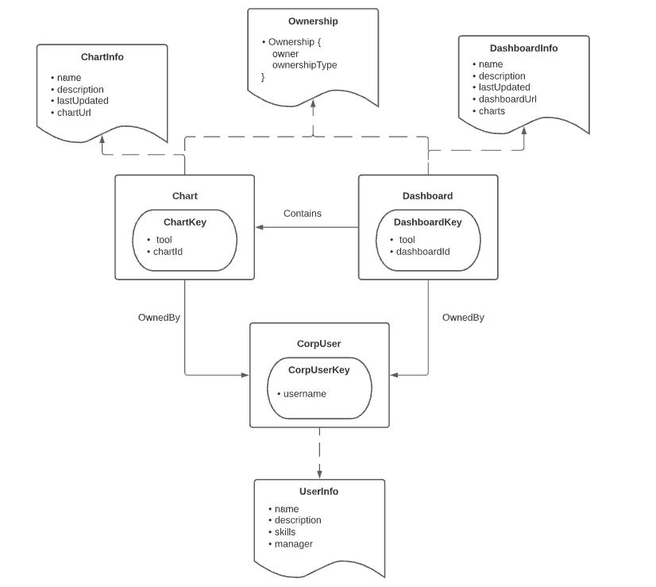
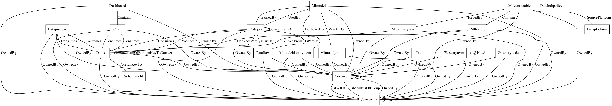

# How does DataHub model metadata?

DataHub takes a schema-first approach to modeling metadata. We use the open-source Pegasus schema language ([PDL](https://linkedin.github.io/rest.li/pdl_schema)) extended with a custom set of annotations to model metadata. The DataHub storage, serving, indexing and ingestion layer operates directly on top of the metadata model and supports strong types all the way from the client to the storage layer. 

Conceptually, metadata is modeled using the following abstractions

- **Entities**: An entity is the primary node in the metadata graph. For example, an instance of a Dataset or a CorpUser is an Entity. An entity is made up of a type, e.g. 'dataset', a unique identifier (e.g. an 'urn') and groups of metadata attributes (e.g. documents) which we call aspects.


- **Aspects**: An aspect is a collection of attributes that describes a particular facet of an entity. They are the smallest atomic unit of write in DataHub. That is, multiple aspects associated with the same Entity can be updated independently. For example, DatasetProperties contains a collection of attributes that describes a Dataset. Aspects can be shared across entities, for example "Ownership" is an aspect that is re-used across all the Entities that have owners. Common aspects include

    - [ownership](https://github.com/datahub-project/datahub/blob/master/metadata-models/src/main/pegasus/com/linkedin/common/Ownership.pdl): Captures the users and groups who own an Entity. 
    - [globalTags](https://github.com/datahub-project/datahub/blob/master/metadata-models/src/main/pegasus/com/linkedin/common/GlobalTags.pdl): Captures references to the Tags associated with an Entity. 
    - [glossaryTerms](https://github.com/datahub-project/datahub/blob/master/metadata-models/src/main/pegasus/com/linkedin/common/GlossaryTerms.pdl): Captures references to the Glossary Terms associated with an Entity. 
    - [institutionalMemory](https://github.com/datahub-project/datahub/blob/master/metadata-models/src/main/pegasus/com/linkedin/common/InstitutionalMemory.pdl): Captures internal company Documents associated with an Entity (e.g. links!)
    - [status](https://github.com/datahub-project/datahub/blob/master/metadata-models/src/main/pegasus/com/linkedin/common/Status.pdl): Captures the "deletion" status of an Entity, i.e. whether it should be soft-deleted. 
    - [subTypes](https://github.com/datahub-project/datahub/blob/master/metadata-models/src/main/pegasus/com/linkedin/common/SubTypes.pdl): Captures one or more "sub types" of a more generic Entity type. An example can be a "Looker Explore" Dataset, a "View" Dataset. Specific sub types can imply that certain additional aspects are present for a given Entity. 


- **Relationships**: A relationship represents a named edge between 2 entities. They are declared via foreign key attributes within Aspects along with a custom annotation (@Relationship). Relationships permit edges to be traversed bi-directionally. For example, a Chart may refer to a CorpUser as its owner via a relationship named "OwnedBy". This edge would be walkable starting from the Chart *or* the CorpUser instance.

- **Identifiers (Keys & Urns)**: A key is a special type of aspect that contains the fields that uniquely identify an individual Entity. Key aspects can be serialized into *Urns*, which represent a stringified form of the key fields used for primary-key lookup. Moreover, *Urns* can be converted back into key aspect structs, making key aspects a type of "virtual" aspect. Key aspects provide a mechanism for clients to easily read fields comprising the primary key, which are usually generally useful like Dataset names, platform names etc. Urns provide a friendly handle by which Entities can be queried without requiring a fully materialized struct.


Here is an example graph consisting of 3 types of entity (CorpUser, Chart, Dashboard), 2 types of relationship (OwnedBy, Contains), and 3 types of metadata aspect (Ownership, ChartInfo, and DashboardInfo).



## The Core Entities

DataHub's "core" Entity types model the Data Assets that comprise the Modern Data Stack. They include 

1. **[Data Platform](docs/generated/metamodel/entities/dataPlatform.md)**: A type of Data "Platform". That is, an external system that is involved in processing, storing, or visualizing Data Assets. Examples include MySQL, Snowflake, Redshift, and S3. 
2. **[Dataset](docs/generated/metamodel/entities/dataset.md)**: A collection of data. Tables, Views, Streams, Document Collections, and Files are all modeled as "Datasets" on DataHub. Datasets can have tags, owners, links, glossary terms, and descriptions attached to them. They can also have specific sub-types, such as "View", "Collection", "Stream", "Explore", and more. Examples include Postgres Tables, MongoDB Collections, or S3 files.
3. **[Chart](docs/generated/metamodel/entities/chart.md)**: A single data vizualization derived from a Dataset. A single Chart can be a part of multiple Dashboards. Charts can have tags, owners, links, glossary terms, and descriptions attached to them. Examples include a Superset or Looker Chart.
4. **[Dashboard](docs/generated/metamodel/entities/dashboard.md)**: A collection of Charts for visualization. Dashboards can have tags, owners, links, glossary terms, and descriptions attached to them. Examples include a Superset or Mode Dashboard.
5. **[Data Job](docs/generated/metamodel/entities/dataJob.md)** (Task): An executable job that processes data assets, where "processing" implies consuming data, producing data, or both. Data Jobs can have tags, owners, links, glossary terms, and descriptions attached to them. They must belong to a single Data Flow. Examples include an Airflow Task.
6. **[Data Flow](docs/generated/metamodel/entities/dataFlow.md)** (Pipeline): An executable collection of Data Jobs with dependencies among them, or a DAG. Data Jobs can have tags, owners, links, glossary terms, and descriptions attached to them. Examples include an Airflow DAG.

See the **Metadata Modeling/Entities** section on the left to explore the entire model.

## The Entity Registry

Where are Entities and their aspects defined in DataHub? Where does the Metadata Model "live"? The Metadata Model is stitched together by means 
of an **Entity Registry**, a catalog of Entities that comprise the Metadata Graph along with the aspects associated with each. Put
simply, this is where the "schema" of the model is defined. 

Traditionally, the Entity Registry was constructed using [Snapshot](https://github.com/datahub-project/datahub/tree/master/metadata-models/src/main/pegasus/com/linkedin/metadata/snapshot) models, which are schemas that explicitly tie 
an Entity to the Aspects associated with it. An example is [DatasetSnapshot](https://github.com/datahub-project/datahub/blob/master/metadata-models/src/main/pegasus/com/linkedin/metadata/snapshot/DatasetSnapshot.pdl), which defines the core `Dataset` Entity. 
The Aspects of the Dataset entity are captured via a union field inside a special "Aspect" schema. An example is 
[DatasetAspect](https://github.com/datahub-project/datahub/blob/master/metadata-models/src/main/pegasus/com/linkedin/metadata/aspect/DatasetAspect.pdl).
This file associates dataset-specific aspects (like [DatasetProperties](https://github.com/datahub-project/datahub/blob/master/metadata-models/src/main/pegasus/com/linkedin/dataset/DatasetProperties.pdl)) and common aspects  (like [Ownership](https://github.com/datahub-project/datahub/blob/master/metadata-models/src/main/pegasus/com/linkedin/common/Ownership.pdl), 
[InstitutionalMemory](https://github.com/datahub-project/datahub/blob/master/metadata-models/src/main/pegasus/com/linkedin/common/InstitutionalMemory.pdl), 
and [Status](https://github.com/datahub-project/datahub/blob/master/metadata-models/src/main/pegasus/com/linkedin/common/Status.pdl)) 
to the Dataset Entity. This approach to defining Entities will soon be deprecated in favor of a new approach. 

As of January 2022, DataHub has deprecated support for Snapshot models as a means of adding new entities. Instead,
the Entity Registry is defined inside a YAML configuration file called [entity-registry.yml](https://github.com/datahub-project/datahub/blob/master/metadata-models/src/main/resources/entity-registry.yml),
which is provided to DataHub's Metadata Service at start up. This file declares Entities and Aspects by referring to their [names](https://github.com/datahub-project/datahub/blob/master/metadata-models/src/main/pegasus/com/linkedin/common/Ownership.pdl#L7). 
At boot time, DataHub validates the structure of the registry file and ensures that it can find PDL schemas associated with 
each aspect name provided by configuration (via the [@Aspect](https://github.com/datahub-project/datahub/blob/master/metadata-models/src/main/pegasus/com/linkedin/common/Ownership.pdl#L6) annotation). 

By moving to this format, evolving the Metadata Model becomes much easier. Adding Entities & Aspects becomes a matter of adding a 
to the YAML configuration, instead of creating new Snapshot / Aspect files. 


## Exploring DataHub's Metadata Model

To explore the current DataHub metadata model, you can inspect this high-level picture that shows the different entities and edges between them showing the relationships between them. 


To navigate the aspect model for specific entities and explore relationships using the `foreign-key` concept, you can view them in our demo environment or navigate the auto-generated docs in the **Metadata Modeling/Entities** section on the left.

For example, here are helpful links to the most popular entities in DataHub's metadata model: 
* [Dataset](docs/generated/metamodel/entities/dataset.md): [Profile](https://demo.datahubproject.io/dataset/urn:li:dataset:(urn:li:dataPlatform:datahub,Dataset,PROD)/Schema?is_lineage_mode=false) [Documentation](https://demo.datahubproject.io/dataset/urn:li:dataset:(urn:li:dataPlatform:datahub,Dataset,PROD)/Documentation?is_lineage_mode=false)
* [Dashboard](docs/generated/metamodel/entities/dashboard.md): [Profile](https://demo.datahubproject.io/dataset/urn:li:dataset:(urn:li:dataPlatform:datahub,Dashboard,PROD)/Schema?is_lineage_mode=false) [Documentation](https://demo.datahubproject.io/dataset/urn:li:dataset:(urn:li:dataPlatform:datahub,Dashboard,PROD)/Documentation?is_lineage_mode=false)
* [User (a.k.a CorpUser)](docs/generated/metamodel/entities/corpuser.md): [Profile](https://demo.datahubproject.io/dataset/urn:li:dataset:(urn:li:dataPlatform:datahub,Corpuser,PROD)/Schema?is_lineage_mode=false) [Documentation](https://demo.datahubproject.io/dataset/urn:li:dataset:(urn:li:dataPlatform:datahub,Corpuser,PROD)/Documentation?is_lineage_mode=false)
* [Pipeline (a.k.a DataFlow)](docs/generated/metamodel/entities/dataFlow.md): [Profile](https://demo.datahubproject.io/dataset/urn:li:dataset:(urn:li:dataPlatform:datahub,DataFlow,PROD)/Schema?is_lineage_mode=false) [Documentation](https://demo.datahubproject.io/dataset/urn:li:dataset:(urn:li:dataPlatform:datahub,DataFlow,PROD)/Documentation?is_lineage_mode=false)
* [Feature Table (a.k.a. MLFeatureTable)](docs/generated/metamodel/entities/mlFeatureTable.md): [Profile](https://demo.datahubproject.io/dataset/urn:li:dataset:(urn:li:dataPlatform:datahub,MlFeatureTable,PROD)/Schema?is_lineage_mode=false) [Documentation](https://demo.datahubproject.io/dataset/urn:li:dataset:(urn:li:dataPlatform:datahub,MlFeatureTable,PROD)/Documentation?is_lineage_mode=false)
* For the full list of entities in the metadata model, browse them [here](https://demo.datahubproject.io/browse/dataset/prod/datahub/entities) or use the **Metadata Modeling/Entities** section on the left.

### Generating documentation for the Metadata Model

- This website: Metadata model documentation for this website is generated using `./gradlew :docs-website:yarnBuild`, which delegates the model doc generation to the `modelDocGen` task in the `metadata-ingestion` module.
- Uploading documentation to a running DataHub Instance: The metadata model documentation can be generated and uploaded into a running DataHub instance using the command `./gradlew :metadata-ingestion:modelDocUpload`. **_NOTE_**: This will upload the model documentation to the DataHub instance running at the environment variable `$DATAHUB_SERVER` (http://localhost:8080 by default)

## Querying the Metadata Graph 

DataHub’s modeling language allows you to optimize metadata persistence to align with query patterns.

There are three supported ways to query the metadata graph: by primary key lookup, a search query, and via relationship traversal. 

> New to [PDL](https://linkedin.github.io/rest.li/pdl_schema) files? Don't fret. They are just a way to define a JSON document "schema" for Aspects in DataHub. All Data ingested to DataHub's Metadata Service is validated against a PDL schema, with each @Aspect corresponding to a single schema. Structurally, PDL is quite similar to [Protobuf](https://developers.google.com/protocol-buffers) and conveniently maps to JSON.

### Querying an Entity

#### Fetching Latest Entity Aspects (Snapshot)

Querying an Entity by primary key means using the "entities" endpoint, passing in the 
urn of the entity to retrieve. 

For example, to fetch a Chart entity, we can use the following `curl`: 

```
curl --location --request GET 'http://localhost:8080/entities/urn%3Ali%3Achart%3Acustomers
```

This request will return a set of versioned aspects, each at the latest version. 

As you'll notice, we perform the lookup using the url-encoded *Urn* associated with an entity. 
The response would be an "Entity" record containing the Entity Snapshot (which in turn contains the latest aspects associated with the Entity).

#### Fetching Versioned Aspects

DataHub also supports fetching individual pieces of metadata about an Entity, which we call aspects. To do so, 
you'll provide both an Entity's primary key (urn) along with the aspect name and version that you'd like to retrieve. 

For example, to fetch the latest version of a Dataset's SchemaMetadata aspect, you would issue the following query:

```
curl 'http://localhost:8080/aspects/urn%3Ali%3Adataset%3A(urn%3Ali%3AdataPlatform%3Afoo%2Cbar%2CPROD)?aspect=schemaMetadata&version=0'

{
   "version":0,
   "aspect":{
      "com.linkedin.schema.SchemaMetadata":{
         "created":{
            "actor":"urn:li:corpuser:fbar",
            "time":0
         },
         "platformSchema":{
            "com.linkedin.schema.KafkaSchema":{
               "documentSchema":"{\"type\":\"record\",\"name\":\"MetadataChangeEvent\",\"namespace\":\"com.linkedin.mxe\",\"doc\":\"Kafka event for proposing a metadata change for an entity.\",\"fields\":[{\"name\":\"auditHeader\",\"type\":{\"type\":\"record\",\"name\":\"KafkaAuditHeader\",\"namespace\":\"com.linkedin.avro2pegasus.events\",\"doc\":\"Header\"}}]}"
            }
         },
         "lastModified":{
            "actor":"urn:li:corpuser:fbar",
            "time":0
         },
         "schemaName":"FooEvent",
         "fields":[
            {
               "fieldPath":"foo",
               "description":"Bar",
               "type":{
                  "type":{
                     "com.linkedin.schema.StringType":{
                        
                     }
                  }
               },
               "nativeDataType":"string"
            }
         ],
         "version":0,
         "hash":"",
         "platform":"urn:li:dataPlatform:foo"
      }
   }
}
```

#### Fetching Timeseries Aspects

DataHub supports an API for fetching a group of Timeseries aspects about an Entity. For example, you may want to use this API
to fetch recent profiling runs & statistics about a Dataset. To do so, you can issue a "get" request against the `/aspects` endpoint.

For example, to fetch dataset profiles (ie. stats) for a Dataset, you would issue the following query:

```
curl -X POST 'http://localhost:8080/aspects?action=getTimeseriesAspectValues' \
--data '{
    "urn": "urn:li:dataset:(urn:li:dataPlatform:redshift,global_dev.larxynx_carcinoma_data_2020,PROD)",
    "entity": "dataset",
    "aspect": "datasetProfile",
    "startTimeMillis": 1625122800000,
    "endTimeMillis": 1627455600000
}'

{
   "value":{
      "limit":10000,
      "aspectName":"datasetProfile",
      "endTimeMillis":1627455600000,
      "startTimeMillis":1625122800000,
      "entityName":"dataset",
      "values":[
         {
            "aspect":{
               "value":"{\"timestampMillis\":1626912000000,\"fieldProfiles\":[{\"uniqueProportion\":1.0,\"sampleValues\":[\"123MMKK12\",\"13KDFMKML\",\"123NNJJJL\"],\"fieldPath\":\"id\",\"nullCount\":0,\"nullProportion\":0.0,\"uniqueCount\":3742},{\"uniqueProportion\":1.0,\"min\":\"1524406400000\",\"max\":\"1624406400000\",\"sampleValues\":[\"1640023230002\",\"1640343012207\",\"16303412330117\"],\"mean\":\"1555406400000\",\"fieldPath\":\"date\",\"nullCount\":0,\"nullProportion\":0.0,\"uniqueCount\":3742},{\"uniqueProportion\":0.037,\"min\":\"21\",\"median\":\"68\",\"max\":\"92\",\"sampleValues\":[\"45\",\"65\",\"81\"],\"mean\":\"65\",\"distinctValueFrequencies\":[{\"value\":\"12\",\"frequency\":103},{\"value\":\"54\",\"frequency\":12}],\"fieldPath\":\"patient_age\",\"nullCount\":0,\"nullProportion\":0.0,\"uniqueCount\":79},{\"uniqueProportion\":0.00820873786407767,\"sampleValues\":[\"male\",\"female\"],\"fieldPath\":\"patient_gender\",\"nullCount\":120,\"nullProportion\":0.03,\"uniqueCount\":2}],\"rowCount\":3742,\"columnCount\":4}",
               "contentType":"application/json"
            }
         },
      ]
   }
}
```

You'll notice that the aspect itself is serialized as escaped JSON. This is part of a shift toward a more generic set of READ / WRITE APIs
that permit serialization of aspects in different ways. By default, the content type will be JSON, and the aspect can be deserialized into a normal JSON object 
in the language of your choice. Note that this will soon become the de-facto way to both write and read individual aspects. 


### Search Query

A search query allows you to search for entities matching an arbitrary string. 

For example, to search for entities matching the term "customers", we can use the following CURL:

```
curl --location --request POST 'http://localhost:8080/entities?action=search' \                           
--header 'X-RestLi-Protocol-Version: 2.0.0' \
--header 'Content-Type: application/json' \
--data-raw '{
    "input": "\"customers\"",
    "entity": "chart",
    "start": 0,
    "count": 10
}'
```

The notable parameters are `input` and `entity`. `input` specifies the query we are issuing and `entity` specifies the Entity Type we want to search over. This is the common name of the Entity as defined in the @Entity definition. The response contains a list of Urns, that can be used to fetch the full entity.

### Relationship Query

A relationship query allows you to find Entity connected to a particular source Entity via an edge of a particular type.

For example, to find the owners of a particular Chart, we can use the following CURL:

```
curl --location --request GET --header 'X-RestLi-Protocol-Version: 2.0.0' 'http://localhost:8080/relationships?direction=OUTGOING&urn=urn%3Ali%3Achart%3Acustomers&types=List(OwnedBy)'
```

The notable parameters are `direction`, `urn` and `types`. The response contains *Urns* associated with all entities connected 
to the primary entity (urn:li:chart:customer) by an relationship named "OwnedBy". That is, it permits fetching the owners of a given
chart. 

### Special Aspects

There are a few special aspects worth mentioning: 

1. Key aspects: Contain the properties that uniquely identify an Entity. 
2. Browse Paths aspect: Represents a hierarchical path associated with an Entity.

#### Key aspects

As introduced above, Key aspects are structs / records that contain the fields that uniquely identify an Entity. There are 
some constraints about the fields that can be present in Key aspects:

- All fields must be of STRING or ENUM type
- All fields must be REQUIRED

Keys can be created from and turned into *Urns*, which represent the stringified version of the Key record. 
The algorithm used to do the conversion is straightforward: the fields of the Key aspect are substituted into a
string template based on their index (order of definition) using the following template:

```aidl
// Case 1: # key fields == 1
urn:li:<entity-name>:key-field-1

// Case 2: # key fields > 1
urn:li:<entity-name>:(key-field-1, key-field-2, ... key-field-n) 
```

By convention, key aspects are defined under [metadata-models/src/main/pegasus/com/linkedin/metadata/key](https://github.com/datahub-project/datahub/tree/master/metadata-models/src/main/pegasus/com/linkedin/metadata/key).

##### Example

A CorpUser can be uniquely identified by a "username", which should typically correspond to an LDAP name. 

Thus, it's Key Aspect is defined as the following: 

```aidl
namespace com.linkedin.metadata.key

/**
 * Key for a CorpUser
 */
@Aspect = {
  "name": "corpUserKey"
}
record CorpUserKey {
  /**
  * The name of the AD/LDAP user.
  */
  username: string
}
```

and it's Entity Snapshot model is defined as 

```aidl
/**
 * A metadata snapshot for a specific CorpUser entity.
 */
@Entity = {
  "name": "corpuser",
  "keyAspect": "corpUserKey"
}
record CorpUserSnapshot {

  /**
   * URN for the entity the metadata snapshot is associated with.
   */
  urn: CorpuserUrn

  /**
   * The list of metadata aspects associated with the CorpUser. Depending on the use case, this can either be all, or a selection, of supported aspects.
   */
  aspects: array[CorpUserAspect]
}
```

Using a combination of the information provided by these models, we are able to generate the Urn corresponding to a CorpUser as 

```
urn:li:corpuser:<username>
```

Imagine we have a CorpUser Entity with the username "johnsmith". In this world, the JSON version of the Key Aspect associated with the Entity would be 

```aidl
{
  "username": "johnsmith"
}
```

and its corresponding Urn would be

```aidl
urn:li:corpuser:johnsmith 
```

#### BrowsePaths aspect

The BrowsePaths aspect allows you to define a custom "browse path" for an Entity. A browse path is a way to hierarchically organize
entities. They manifest within the "Explore" features on the UI, allowing users to navigate through trees of related entities of a given type. 

To support browsing a particular entity, add the "browsePaths" aspect to the entity in your `entity-registry.yml` file. 

```aidl
/// entity-registry.yml 
entities:
  - name: dataset
    doc: Datasets represent logical or physical data assets stored or represented in various data platforms. Tables, Views, Streams are all instances of datasets.
    keyAspect: datasetKey
    aspects:
      ...
      - browsePaths
```

By declaring this aspect, you can produce custom browse paths as well as query for browse paths manually using a CURL like the following:

```aidl
curl --location --request POST 'http://localhost:8080/entities?action=browse' \
--header 'X-RestLi-Protocol-Version: 2.0.0' \
--header 'Content-Type: application/json' \
--data-raw '{
    "path": "/my/custom/browse/path",
    "entity": "dataset",
    "start": 0,
    "limit": 10
}'
```

Please note you must provide: 
- The "/"-delimited root path for which to fetch results.
- An entity "type" using its common name ("dataset" in the example above). 

### Types of Aspect

There are 2 "types" of Metadata Aspects. Both are modeled using PDL schemas, and both can be ingested in the same way. 
However, they differ in what they represent and how they are handled by DataHub's Metadata Service. 

#### 1. Versioned Aspects
 
Versioned Aspects each have a **numeric version** associated with them. When a field in an aspect changes, a new
version is automatically created and stored within DataHub's backend. In practice, all versioned aspects are stored inside a relational database
that can be backed up and restored. Versioned aspects power much of the UI experience you're used to, including Ownership, Descriptions,
Tags, Glossary Terms, and more. Examples include Ownership, Global Tags, and Glossary Terms. 

#### 2. Timeseries Aspects

Timeseries Aspects each have a **timestamp** associated with them. They are useful for representing
time-ordered events about an Entity. For example, the results of profiling a Dataset, or a set of Data Quality checks that
run every day. It is important to note that Timeseries aspects are NOT persisted inside the relational store, and are instead
persisted only in the search index (e.g. elasticsearch) and the message queue (Kafka). This makes restoring timeseries aspects
in a disaster scenario a bit more challenge. Timeseries aspects can be queried by time range, which is what makes them most different from Versioned Aspects.
A timeseries aspect can be identified by the "timeseries" [type](https://github.com/datahub-project/datahub/blob/master/metadata-models/src/main/pegasus/com/linkedin/dataset/DatasetProfile.pdl#L10) in its [@Aspect](https://github.com/datahub-project/datahub/blob/master/metadata-models/src/main/pegasus/com/linkedin/dataset/DatasetProfile.pdl#L8) annotation.
Examples include [DatasetProfile](https://github.com/datahub-project/datahub/blob/master/metadata-models/src/main/pegasus/com/linkedin/dataset/DatasetProfile.pdl) & [DatasetUsageStatistics](https://github.com/datahub-project/datahub/blob/master/metadata-models/src/main/pegasus/com/linkedin/dataset/DatasetUsageStatistics.pdl).

Timeseries aspects are aspects that have a timestampMillis field, and are meant for aspects that continuously change on a
timely basis e.g. data profiles, usage statistics, etc.

Each timeseries aspect must be declared "type": "timeseries" and must
include [TimeseriesAspectBase](https://github.com/datahub-project/datahub/tree/master/metadata-models/src/main/pegasus/com/linkedin/timeseries/TimeseriesAspectBase.pdl)
, which contains a timestampMillis field.

Timeseries aspect cannot have any fields that have the @Searchable or @Relationship annotation, as it goes through a
completely different flow.

Please refer
to [DatasetProfile](https://github.com/datahub-project/datahub/tree/master/metadata-models/src/main/pegasus/com/linkedin/dataset/DatasetProfile.pdl)
to see an example of a timeseries aspect.

Because timeseries aspects are updated on a frequent basis, ingests of these aspects go straight to elastic search (
instead of being stored in local DB). 

You can retrieve timeseries aspects using the "aspects?action=getTimeseriesAspectValues" end point. 

##### Aggregatable Timeseries aspects
Being able to perform SQL like *group by + aggregate* operations on the timeseries aspects is a very natural use-case for
this kind of data (dataset profiles, usage statistics etc.). This section describes how to define, ingest and perform an
aggregation query against a timeseries aspect.

###### Defining a new aggregatable Timeseries aspect.

The *@TimeseriesField* and the *@TimeseriesFieldCollection* are two new annotations that can be attached to a field of
a *Timeseries aspect* that allows it to be part of an aggregatable query. The kinds of aggregations allowed on these
annotated fields depends on the type of the field, as well as the kind of aggregation, as
described [here](#Performing-an-aggregation-on-a-Timeseries-aspect).

* `@TimeseriesField = {}` - this annotation can be used with any type of non-collection type field of the aspect such as
  primitive types and records (see the fields *stat*, *strStat* and *strArray* fields
  of [TestEntityProfile.pdl](https://github.com/datahub-project/datahub/blob/master/test-models/src/main/pegasus/com/datahub/test/TestEntityProfile.pdl)).

* The `@TimeseriesFieldCollection {"key":"<name of the key field of collection item type>"}` annotation allows for
aggregation support on the items of a collection type (supported only for the array type collections for now), where the
value of `"key"` is the name of the field in the collection item type that will be used to specify the group-by clause (
see *userCounts* and *fieldCounts* fields of [DatasetUsageStatistics.pdl](https://github.com/datahub-project/datahub/blob/master/metadata-models/src/main/pegasus/com/linkedin/dataset/DatasetUsageStatistics.pdl)). 

In addition to defining the new aspect with appropriate Timeseries annotations,
the [entity-registry.yml](https://github.com/datahub-project/datahub/blob/master/metadata-models/src/main/resources/entity-registry.yml)
file needs to be updated as well. Just add the new aspect name under the list of aspects against the appropriate entity as shown below, such as `datasetUsageStatistics` for the aspect DatasetUsageStatistics.
```yaml
entities:
  - name: dataset
    keyAspect: datasetKey
    aspects:
      - datasetProfile
      - datasetUsageStatistics
```

###### Ingesting a Timeseries aspect
The timeseries aspects can be ingested via the GMS REST endpoint `/aspects?action=ingestProposal` or via the python API.

Example1: Via GMS REST API using curl.

```shell
curl --location --request POST 'http://localhost:8080/aspects?action=ingestProposal' \
--header 'X-RestLi-Protocol-Version: 2.0.0' \
--header 'Content-Type: application/json' \
--data-raw '{
  "proposal" : {
    "entityType": "dataset",
    "entityUrn" : "urn:li:dataset:(urn:li:dataPlatform:hive,SampleHiveDataset,PROD)",
    "changeType" : "UPSERT",
    "aspectName" : "datasetUsageStatistics",
    "aspect" : {
      "value" : "{ \"timestampMillis\":1629840771000,\"uniqueUserCount\" : 10, \"totalSqlQueries\": 20, \"fieldCounts\": [ {\"fieldPath\": \"col1\", \"count\": 20}, {\"fieldPath\" : \"col2\", \"count\": 5} ]}",
      "contentType": "application/json"
    }
  }
}'
```
Example2: Via Python API to Kafka(or REST)
```python
from datahub.metadata.schema_classes import (
    ChangeTypeClass,
    DatasetFieldUsageCountsClass,
    DatasetUsageStatisticsClass,
)
from datahub.emitter.kafka_emitter import DatahubKafkaEmitter
from datahub.emitter.rest_emitter import DatahubRestEmitter

usageStats = DatasetUsageStatisticsClass(
            timestampMillis=1629840771000,
            uniqueUserCount=10,
            totalSqlQueries=20,
            fieldCounts=[
                DatasetFieldUsageCountsClass(
                    fieldPath="col1",
                    count=10
                )
            ]
        )

mcpw = MetadataChangeProposalWrapper(
    entityType="dataset",
    aspectName="datasetUsageStatistics",
    changeType=ChangeTypeClass.UPSERT,
    entityUrn="urn:li:dataset:(urn:li:dataPlatform:hive,SampleHiveDataset,PROD)",
    aspect=usageStats,
)

# Instantiate appropriate emitter (kafk_emitter/rest_emitter)
my_emitter = DatahubKafkaEmitter("""<config>""")
my_emitter.emit(mcpw)
```

###### Performing an aggregation on a Timeseries aspect.

Aggreations on timeseries aspects can be performed by the GMS REST API for `/analytics?action=getTimeseriesStats` which
accepts the following params.
* `entityName` - The name of the entity the aspect is associated with.
* `aspectName` - The name of the aspect.
* `filter` - Any pre-filtering criteria before grouping and aggregations are performed.
* `metrics` - A list of aggregation specification. The `fieldPath` member of an aggregation specification refers to the
  field name against which the aggregation needs to be performed, and the `aggregationType` specifies the kind of aggregation.
* `buckets` - A list of grouping bucket specifications. Each grouping bucket has a `key` field that refers to the field
  to use for grouping. The `type` field specifies the kind of grouping bucket.

We support three kinds of aggregations that can be specified in an aggregation query on the Timeseries annotated fields.
The values that `aggregationType` can take are:

* `LATEST`: The latest value of the field in each bucket. Supported for any type of field.
* `SUM`: The cumulative sum of the field in each bucket. Supported only for integral types.
* `CARDINALITY`: The number of unique values or the cardinality of the set in each bucket. Supported for string and
  record types.

We support two types of grouping for defining the buckets to perform aggregations against:

* `DATE_GROUPING_BUCKET`: Allows for creating time-based buckets such as by second, minute, hour, day, week, month,
  quarter, year etc. Should be used in conjunction with a timestamp field whose value is in milliseconds since *epoch*.
  The `timeWindowSize` param specifies the date histogram bucket width.
* `STRING_GROUPING_BUCKET`: Allows for creating buckets grouped by the unique values of a field. Should always be used in
  conjunction with a string type field.

The API returns a generic SQL like table as the `table` member of the output that contains the results of
the `group-by/aggregate` query, in addition to echoing the input params.

* `columnNames`: the names of the table columns. The group-by `key` names appear in the same order as they are specified
  in the request. Aggregation specifications follow the grouping fields in the same order as specified in the request,
  and will be named `<agg_name>_<fieldPath>`.
* `columnTypes`: the data types of the columns.
* `rows`: the data values, each row corresponding to the respective bucket(s).

Example: Latest unique user count for each day.
```shell
# QUERY
curl --location --request POST 'http://localhost:8080/analytics?action=getTimeseriesStats' \
--header 'X-RestLi-Protocol-Version: 2.0.0' \
--header 'Content-Type: application/json' \
--data-raw '{
    "entityName": "dataset",
    "aspectName": "datasetUsageStatistics",
    "filter": {
        "criteria": []
    },
    "metrics": [
        {
            "fieldPath": "uniqueUserCount",
            "aggregationType": "LATEST"
        }
    ],
    "buckets": [
        {
            "key": "timestampMillis",
            "type": "DATE_GROUPING_BUCKET",
            "timeWindowSize": {
                "multiple": 1,
                "unit": "DAY"
            }
        }
    ]
}'

# SAMPLE RESPOSNE
{
    "value": {
        "filter": {
            "criteria": []
        },
        "aspectName": "datasetUsageStatistics",
        "entityName": "dataset",
        "groupingBuckets": [
            {
                "type": "DATE_GROUPING_BUCKET",
                "timeWindowSize": {
                    "multiple": 1,
                    "unit": "DAY"
                },
                "key": "timestampMillis"
            }
        ],
        "aggregationSpecs": [
            {
                "fieldPath": "uniqueUserCount",
                "aggregationType": "LATEST"
            }
        ],
        "table": {
            "columnNames": [
                "timestampMillis",
                "latest_uniqueUserCount"
            ],
            "rows": [
                [
                    "1631491200000",
                    "1"
                ]
            ],
            "columnTypes": [
                "long",
                "int"
            ]
        }
    }
}
```
For more examples on the complex types of group-by/aggregations, refer to the tests in the group `getAggregatedStats` of [ElasticSearchTimeseriesAspectServiceTest.java](https://github.com/datahub-project/datahub/blob/master/metadata-io/src/test/java/com/linkedin/metadata/timeseries/elastic/ElasticSearchTimeseriesAspectServiceTest.java).


