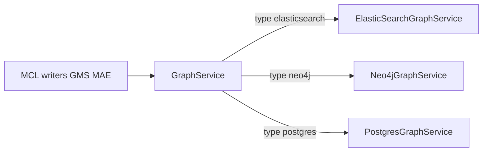

# pgGraph: PostgreSQL Graph for DataHub

## Purpose

pgGraph is an optional PostgreSQL store for DataHub **relationship edges** (lineage, ownership,
containment, and other `GraphService` relationships). It can replace Elasticsearch/OpenSearch or
Neo4j as the graph backend. Entity search can use Elasticsearch or exclusive **pgSearch** (see
[pgSearch](./pgsearch-design.md)).

Vertices are identified by a client-stable **XXHash64** of the URN. Edges are stored in a
hash-partitioned table and exposed to pgRouting through views for in-database connected-component
and reachability analytics. GMS **UI lineage** (`getLineage`) walks the graph with JDBC one-hop
queries (Java BFS). **Impact lineage** (`getImpactLineage`) uses `pgr_breadthFirstSearch` on a
**typed** directed network built from `LineageRegistry` (entity type, relationship, opposing type,
orientation) — not a flat list of relationship names and not connected-component tables.

Connected-component DDL is created with pgGraph; **population is off by default**
(`postgres.pgGraph.connectedComponents.enabled` / `DATAHUB_PGGRAPH_CONNECTED_COMPONENTS_ENABLED`).
GMS does not create CC definitions or run `dh_calculate_ccs_*` unless that flag is on (jobs are not
wired yet). Manual SQL in `docker/postgres/graph-test-data/` can still populate CC for analytics.

## Modes of Operation

| Mode                   | Config                                       | Writes / Reads         |
| ---------------------- | -------------------------------------------- | ---------------------- |
| **Disabled (default)** | `postgres.pgGraph.enabled=false`             | ES or Neo4j            |
| **Postgres SoT**       | `enabled=true`, `graphService.type=postgres` | `PostgresGraphService` |

Defaults keep Elasticsearch as the graph store. Set both `DATAHUB_PGGRAPH_ENABLED=true` and
`GRAPH_SERVICE_IMPL=postgres`. Partial enablement is rejected at GMS/MAE/MCE startup. Dual-write is
not supported. SqlSetup may still create tables from `enabled` alone.

Switching the source of truth does **not** backfill Elasticsearch or Neo4j edges into Postgres.
Wipe and rebuild, re-ingest, or keep `GRAPH_SERVICE_IMPL=elasticsearch` / `neo4j`.



## Docker Compose (Postgres profiles)

Postgres quickstart/debug profiles enable **exclusive** pgGraph via
`x-primary-datastore-postgres-env` and `x-graph-datastore-postgres-env` in
`docker/profiles/docker-compose.gms.yml`:

```bash
DATAHUB_PGGRAPH_ENABLED=true
GRAPH_SERVICE_IMPL=postgres
```

Requires PostgreSQL with **PostGIS** and **pgRouting** (the DataHub `acryldata/datahub-postgres`
image). See [`docs/deploy/environment-vars.md`](./deploy/environment-vars.md) and
[`docs/how/updating-datahub.md`](./how/updating-datahub.md).

## Schema

SqlSetup applies versioned scripts under `sqlsetup/pggraph/migrations/` (namespace `pggraph`).
`__PGGRAPH_PREFIX__` defaults to `metadata_graph`.

| Object                       | Role                                                                              |
| ---------------------------- | --------------------------------------------------------------------------------- |
| `{prefix}_edge_types`        | Relationship type catalog (`SMALLINT` id + name)                                  |
| `{prefix}_vertices`          | URN, `xxhash64_id`, `removed`, JSONB properties                                   |
| `{prefix}_edges`             | Hash-partitioned by `source_id`; PK `(source_id, edge_type, target_id, owner_id)` |
| `{prefix}_pgrouting_network` | View for pgRouting (`id/source/target/cost`)                                      |
| `{prefix}_schema_migration`  | SqlSetup ledger                                                                   |

Soft-delete of a vertex cascades to connected edges via triggers. Repeatable migration
`R__connected_components.sql` adds connected-component tables and `pgr_connectedComponents` /
`pgr_breadthFirstSearch` helpers. GMS does not populate those tables unless
`DATAHUB_PGGRAPH_CONNECTED_COMPONENTS_ENABLED=true`. Impact lineage calls `pgr_breadthFirstSearch`
on a query-time typed edge SQL (no `{prefix}_cc_*` join). UI lineage does not call those functions.

Runtime uses a **dedicated Ebean pool** (`postgres.pgGraph.pool.*`, defaults fall through to
`ebean.*`). SqlSetup DDL uses the main Ebean connection unless `pool.url` is overridden.

## API notes

- `PostgresGraphService` implements `GraphService`: one-hop `findRelatedEntities` /
  `scrollRelatedEntities`, multi-hop `getLineage` (Java BFS) / `getImpactLineage` (typed
  `pgr_breadthFirstSearch` spanning tree; paths include via/lifecycleOwner; via URNs are first-class
  `LineageRelationship` rows at the graph layer, while GraphQL drops transient `query` entities from
  the search-across-lineage entity set), `setEdgeStatus`, and `raw`.
- `supportsMultiHop()` is true.
- The service does **not** implement `ElasticSearchIndexed`. BuildIndices / incremental reindex /
  LoadIndices do not manage `graph_service_v1` in Elasticsearch when Postgres is SoT.
- Load-test SQL lives in [`docker/postgres/graph-test-data/`](../docker/postgres/graph-test-data/README_TEST_DATA.md).
