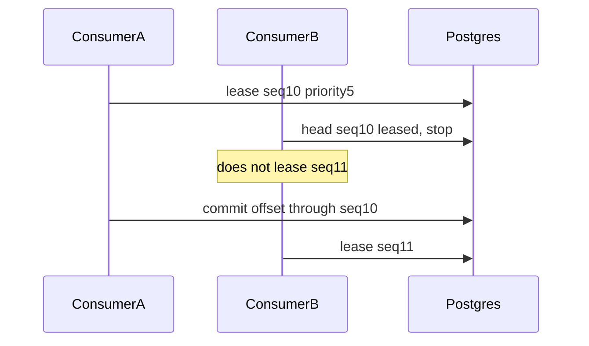
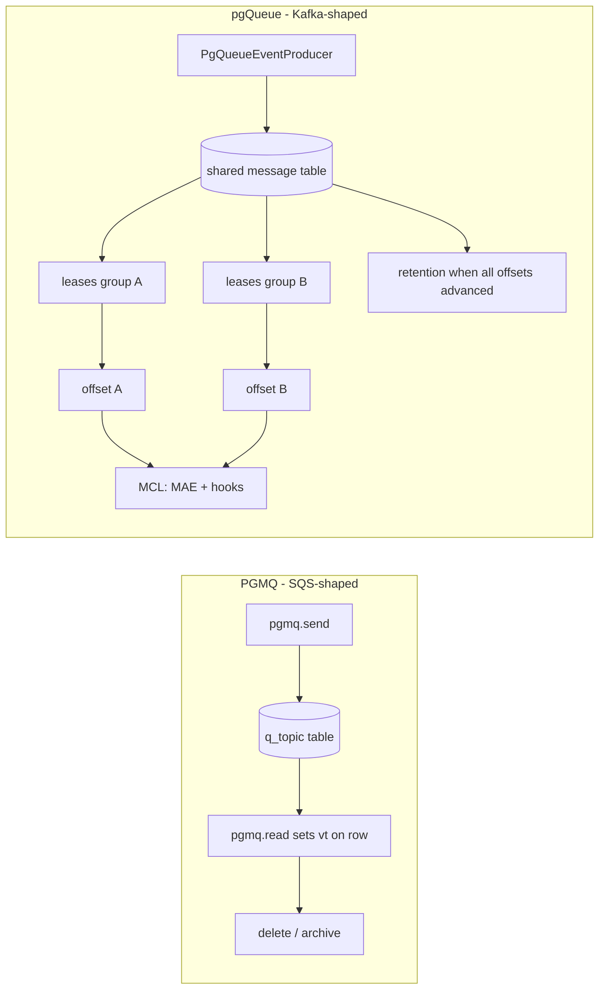

# pgQueue: PostgreSQL-Native Messaging for DataHub

## Purpose

pgQueue is a PostgreSQL-native messaging transport that serves as a drop-in alternative to Apache Kafka for DataHub's internal event streaming. It enables DataHub deployments that need metadata change propagation (MCP → MCL pipeline) without operating a separate Kafka cluster.

The feature targets:

- **Simplified operational footprint** — Postgres replaces Kafka and Schema Registry as external dependencies for event transport.
- **Single-database deployments** — metadata and queue state can live in one Postgres instance, eliminating the need for a separate message broker.
- **Environments where Kafka is impractical** — small teams, embedded/edge deployments, or organizations that prefer fewer moving parts.
- **Lighter quickstart** — the `quickstart-postgres` profile omits the Kafka broker container; messaging runs inside existing GMS and consumer containers via Postgres (see [Quickstart and container footprint](#quickstart-and-container-footprint)).

pgQueue reuses the same Avro schemas, topic naming conventions, and consumer-group semantics as Kafka mode, so application code (resolvers, hooks, ingestion) is transport-agnostic.

### Trade-offs

pgQueue reduces infrastructure complexity at the cost of throughput ceiling and some Kafka-specific features. Key considerations before choosing pgQueue:

- **Throughput** — pgQueue is bound by Postgres IOPS and connection pool size; it is practical for small to medium workloads (up to ~thousands of events/sec) but cannot match Kafka's horizontal scaling to millions of events/sec.
- **MCL batch mode** — `metadataChangeLog.consumer.batch.enabled=true` is supported with pgQueue. Three configurable levers control batch flushing (any threshold triggers a flush): message count (`MCL_CONSUMER_BATCH_MAX_MESSAGES`, default 500), cumulative raw payload bytes (`MCL_CONSUMER_BATCH_SIZE`, default ~15 MB), and linger age (`MCL_CONSUMER_BATCH_MAX_AGE_MS`, default 1000 ms).
- **Replay** — aggressive retention (enabled by default on high-throughput topics) purges messages as soon as all consumers advance past them, so rewinding a consumer may find no data to replay. Standard time-based retention still applies, but the window may be shorter than Kafka's log retention.
- **Sequence overflow** — `enqueue_seq` and `offset_value` are monotonic `bigint` counters with no wrap or reset today. See [Sequence number overflow](#sequence-number-overflow-known-limitation) below.
- **Ecosystem** — pgQueue is DataHub-specific with Java and Python clients. Kafka's broader ecosystem (Connect, Streams, ksqlDB, MirrorMaker) is not available.

A detailed comparison table is included in the [Trade-offs vs. Kafka](#trade-offs-vs-kafka) section below.

---

## Basic Configuration and Enablement

### Minimum Required Settings

pgQueue is activated by setting a single environment variable:

```bash
DATAHUB_MESSAGING_TRANSPORT=pgqueue
```

This switches the `EventProducer` and all consumer poll loops from Kafka to PostgreSQL. Additionally, the pgQueue schema DDL subsystem must be enabled:

```bash
DATAHUB_PGQUEUE_ENABLED=true
```

### Typical Minimal Deployment

```bash
# Core transport switch
DATAHUB_MESSAGING_TRANSPORT=pgqueue

# Enable pgQueue schema setup (creates tables on startup)
DATAHUB_PGQUEUE_ENABLED=true

```

When `DATAHUB_MESSAGING_TRANSPORT=pgqueue`:

- **Kafka becomes unnecessary** — no brokers, no Schema Registry server process.
- **System Update** (datahub-upgrade) creates queue tables in a dedicated PostgreSQL schema (`queue` by default).
- **GMS** produces events via SQL INSERT instead of Kafka producer.
- **MCE/MAE/PE consumers** poll via SQL queries against the `*_message_group_lease` table using lease-based coordination (`INSERT ... ON CONFLICT DO UPDATE ... WHERE locked_until < NOW()`) instead of Kafka consumer groups.

---

## Schema Isolation

### Dedicated Queue Schema

pgQueue DDL is deployed into its own PostgreSQL schema, separate from DataHub's metadata tables:

```bash
DATAHUB_PGQUEUE_SCHEMA=queue          # default
```

This means:

- Queue tables (`metadata_queue_topic`, `metadata_queue_message`, etc.) live in the `queue` schema.
- DataHub's Ebean metadata tables remain in `public` (or whatever `postgres.schema` is set to).
- `search_path` is explicitly set on trigger functions and maintenance procedures so they resolve correctly regardless of the calling session's path.

### Why Isolation Matters

- **Backup/restore independence** — queue data is ephemeral and can be dropped without affecting metadata.
- **Permission boundaries** — the queue schema can have a separate role with tighter write privileges.
- **Partition management** — `pg_partman` operates on queue tables without interfering with metadata table maintenance.
- **Monitoring clarity** — table bloat, vacuum stats, and I/O metrics for the queue are isolated from metadata storage.

### Table Prefix

All pgQueue objects use a configurable prefix (default `metadata_queue`):

```bash
DATAHUB_PGQUEUE_TABLE_PREFIX=metadata_queue
```

Tables created: `{prefix}_topic`, `{prefix}_message`, `{prefix}_content_type`, `{prefix}_consumer_offset`, `{prefix}_message_group_lease`, `{prefix}_consumer_registration`.

### Schema migrations

pgQueue DDL is applied by System Update (`SqlSetup` → `PgQueueSchemaStep`) using the shared Postgres SQL migrator in `metadata-io` (versioned `V*` and repeatable `R__` scripts under `sqlsetup/pgqueue/migrations/`). A ledger table records applied scripts:

```sql
SELECT * FROM queue.metadata_queue_schema_migration ORDER BY version_rank;
```

(Use your configured `DATAHUB_PGQUEUE_SCHEMA` and `DATAHUB_PGQUEUE_TABLE_PREFIX` if non-default.)

Authoring guide: [`metadata-io/src/main/resources/sqlsetup/README.md`](../metadata-io/src/main/resources/sqlsetup/README.md).

---

## Topic and Message Table Design

### Shared Message Table

All topics share a single time-partitioned `*_message` table. Each message row carries a `topic_id` foreign key that references a `*_topic` catalog row. This avoids DDL churn when topics are added and lets pg_partman manage one partition hierarchy for all queue traffic. **Consumers do not lock or update message rows for dequeue**; work is acquired only through `*_message_group_lease` rows scoped by `consumer_group`. Ordering is enforced per `(consumer_group, topic, partition, priority)` via head-of-line lease acquisition; `*_consumer_offset.offset_value` is a contiguous `enqueue_seq` watermark for that partition.

The topic catalog stores per-topic configuration — partition count, retention limits, and the aggressive retention flag — so different topics can have different behavior without requiring separate physical tables.

### Topic Seeding

By default (`inheritKafkaTopics: true`), topic rows are seeded from `kafka.topics.*` configuration at startup — the same logical names used in Kafka mode (e.g., `MetadataChangeProposal_v1`, `MetadataChangeLog_Versioned_v1`). Per-topic overrides under `postgres.pgQueue.topics` overlay or add pg-specific settings.

### Scaling the Message Table

A single shared table could become a bottleneck as message volume grows. pgQueue addresses this through several mechanisms:

- **Time-based partitioning** — The message table is `PARTITION BY RANGE (enqueued_at)` via pg_partman. Each child partition covers a configurable interval (default 1 day; allowed: `1 hour`, `6 hours`, `12 hours`, `1 day`, `1 week`, `1 month`). Future partitions are pre-created (`DATAHUB_PGQUEUE_RETENTION_PARTMAN_PREMAKE`, default 4). Old partitions are dropped as a unit during retention — an O(1) metadata operation rather than row-by-row DELETE. Autovacuum also benefits from smaller partitions.
- **B-tree index for dequeue** — A B-tree index on `(topic_id, partition_id, priority, enqueue_seq)` keeps the hot dequeue path fast. Consumer progress is tracked exclusively via consumer group offsets in `consumer_offset`, and messages are cleaned up by retention and aggressive retention rather than per-row completion marking.
- **BRIN index on enqueued_at** — Enables efficient partition pruning for time-bounded retention queries with minimal index overhead.
- **Aggressive retention** — On high-throughput topics, messages are purged as soon as all consumers advance past them, keeping the active working set small.
- **Per-partition advisory locks** — Enqueue serialization uses `pg_advisory_xact_lock` scoped to `(topic_id, partition_id)`, so writes to different logical partitions proceed concurrently.

### Logical Partitions (Routing Key)

Each topic row declares its `partition_count`. On enqueue, a `partition_id` is computed as `CRC32(routing_key) % partition_count` — analogous to Kafka's key-based partition assignment. This ensures messages with the same routing key (typically entity URN) always land in the same logical partition, preserving per-entity ordering.

```bash
DATAHUB_PGQUEUE_TOPIC_DEFAULT_PARTITION_COUNT=2   # default
```

Per-topic overrides:

```yaml
postgres:
  pgQueue:
    topics:
      metadataChangeProposal:
        partitionCount: 4
```

### Per-Message Priority

Each message carries a `priority` column — an integer in `[0, 9]` with `DEFAULT 5`. Lower values are dequeued first (`0` = highest priority, `9` = lowest). The default of 5 (middle of range) allows producers to escalate messages (0-4) or demote them (6-9) relative to normal traffic. A `CHECK (priority BETWEEN 0 AND 9)` constraint on the message table enforces the valid range; no trigger is needed.

The dequeue index `(topic_id, partition_id, priority, enqueue_seq)` supports efficient head-of-line lookups per priority.

**Ordering vs priority:** Within the same `(topic, partition, priority)`, consumers preserve strict `enqueue_seq` order (Kafka-like for a routing key when priorities match). Across different priorities on the same partition, a higher-priority message may be processed before a lower-priority message with a lower `enqueue_seq` — that reordering is intentional.

Priority is a per-message attribute — there is no topic-level configuration for priority ranges. All producers currently enqueue at the default (5); non-default priority is reserved as a future extension point.

#### Starvation Mitigation: Weighted Fair Queuing

To prevent high-priority messages from indefinitely starving lower-priority ones, dequeue uses weighted fair queuing across configurable priority bands. Each poll batch is split proportionally across bands; if a band has no pending messages, its unused slots are redistributed to other bands.

```bash
DATAHUB_PGQUEUE_PRIORITY_BANDS='[{"range":[0,3],"weight":70},{"range":[4,6],"weight":20},{"range":[7,9],"weight":10}]'
```

Per-topic overrides:

```yaml
postgres:
  pgQueue:
    topicDefaults:
      priorityBands: '[{"range":[0,3],"weight":70},{"range":[4,6],"weight":20},{"range":[7,9],"weight":10}]'
    topics:
      metadataChangeProposal:
        priorityBands: '[{"range":[0,3],"weight":50},{"range":[4,6],"weight":30},{"range":[7,9],"weight":20}]'
```

Each band specifies:

- `range`: inclusive `[min, max]` priority values
- `weight`: relative share of poll batch capacity (weights are normalized; they need not sum to 100)

Bands must cover the full 0-9 range without overlap; startup validation rejects invalid configurations. With the default weights (70/20/10) and a batch size of 10, the consumer fetches up to 7 high-band, 2 normal-band, and 1 low-band message per poll cycle. Since initial code uses only the default priority (5), all messages land in the normal band and the weighting has no observable effect until priority is actively used.

### pg_cron Maintenance

When enabled, a `pg_cron` job runs `partman.run_maintenance()` and the retention function on a configurable schedule:

```bash
DATAHUB_PGQUEUE_MAINTENANCE_CRON_ENABLED=false    # default (app-level maintenance)
DATAHUB_PGQUEUE_MAINTENANCE_INTERVAL_SECONDS=3600 # 1 hour
```

---

## Threads and Partitions

### Within a Single Process (Same-JVM Sharding)

Each consumer registration spawns one or more poll threads based on:

```
effectiveConcurrency = min(configuredConcurrency, partitionCount)
```

Thread `i` polls partitions where `partition_id % concurrency == i`. This ensures no two threads within the same JVM compete for the same partition.

```bash
DATAHUB_PGQUEUE_TOPIC_DEFAULT_CONSUMER_CONCURRENCY=1  # default threads per topic
```

Example: With `partitionCount=4` and `consumerConcurrency=2`:

- Thread 0 polls partitions {0, 2}
- Thread 1 polls partitions {1, 3}

The maximum configurable concurrency is capped at 64 per topic. If `consumerConcurrency > partitionCount`, extra threads simply idle.

### Across Multiple Processes (Cross-JVM Coordination)

Multiple DataHub GMS or consumer instances can run simultaneously. Cross-process deduplication is handled by the `*_message_group_lease` table:

```sql
CREATE TABLE metadata_queue_message_group_lease (
    id bigint GENERATED ALWAYS AS IDENTITY PRIMARY KEY,
    message_id bigint NOT NULL,
    message_enqueued_at timestamptz NOT NULL,
    consumer_group text NOT NULL,
    lock_owner text NOT NULL,
    locked_until timestamptz NOT NULL,
    UNIQUE (message_id, message_enqueued_at, consumer_group)
);
```

When a consumer polls (per assigned partition, using weighted fair queuing across priority bands):

1. For each priority value in the band, select the head candidate: minimum `enqueue_seq > committedOffset` with **no active lease** for this consumer group (or whose lease has expired).
2. Attempt `INSERT ... ON CONFLICT DO UPDATE ... WHERE locked_until < NOW() RETURNING ...` to acquire a lease on that head only.
3. If the lease is not acquired, **stop** for that priority — do not skip to a higher `enqueue_seq` at the same priority while the head is leased elsewhere.
4. After a successful lease, continue with the next contiguous `enqueue_seq` at that priority until the poll batch limit is reached.

Cross-JVM alignment comes from this head-of-line rule, not from a partition coordinator. Multiple instances may compete, but only one holds the lease on the current head sequence at a given priority.

This is the pgQueue analog of Kafka partition consumption, but:

- **No coordinator** — alignment uses leases + contiguous offsets, not consumer-group rebalance.
- **No rebalance storms** — adding/removing consumers is graceful; expired leases are simply re-acquired.
- **Visibility timeout** — leases expire after `visibilityTimeoutSeconds` (default 600s / 10 min), enabling automatic retry of unacknowledged messages.

### Lock Owner Identity

Each poll worker identifies itself as `{consumerGroupId}:{UUID}`, ensuring unique lock ownership even across restarts. The UUID is generated once per worker thread lifecycle (Java) or consumer instance (Python), providing stable ownership for the duration of a poll loop. On restart, a new UUID is generated and stale leases expire via the visibility timeout.

---

## Consumer Coordination

### Consumer Groups

Each logical consumer job has a named consumer group string, identical to its Kafka `group.id`:

- `generic-mce-consumer-job-client` (MCP — **one** consumer group on `MetadataChangeProposal_v1`, configurable via `METADATA_CHANGE_PROPOSAL_KAFKA_CONSUMER_GROUP_ID`)
- `generic-mae-consumer-job-client` plus **per-hook** groups (MCL versioned/timeseries — multiple groups read the same MCL topics)
- `generic-duhe-consumer-job-client` (Upgrade History)
- Platform Event consumer group (when enabled)

### Offset Tracking

The `*_consumer_offset` table tracks per-group, per-topic, per-partition committed offsets:

```sql
CREATE TABLE metadata_queue_consumer_offset (
    id bigint GENERATED ALWAYS AS IDENTITY PRIMARY KEY,
    consumer_group text NOT NULL,
    topic_id bigint NOT NULL REFERENCES metadata_queue_topic (id) ON DELETE CASCADE,
    partition_id int NOT NULL CHECK (partition_id >= 0),
    offset_value bigint NOT NULL DEFAULT 0,
    epoch bigint NOT NULL DEFAULT 0,
    UNIQUE (consumer_group, topic_id, partition_id)
);
```

When a handler acknowledges messages, the offset advances only across a **contiguous** run of `enqueue_seq` values starting at `offset_value + 1`. Acking a higher sequence while a lower one is still pending does not advance the watermark (the lower message remains eligible for dequeue). This provides at-least-once delivery: if a consumer crashes before acknowledging, the offset stays behind and messages are re-delivered after lease expiry.

Each poll worker thread loops continuously: heartbeat its consumer registration, acquire leases on unread messages for its assigned partitions, dispatch to the handler, and sleep on empty or errored polls.

### Ordering guarantees

| Scope                                                | Guarantee                                                               |
| ---------------------------------------------------- | ----------------------------------------------------------------------- |
| Same `routing_key` (same partition), same `priority` | Strict `enqueue_seq` order; no cross-JVM skip past an active head lease |
| Same partition, different `priority`                 | Higher priority may run first even if `enqueue_seq` is larger           |
| Different partitions                                 | No ordering guarantee (same as Kafka)                                   |
| Different consumer groups                            | Independent offsets and leases                                          |



### Offset ahead of log (STUCK_AHEAD)

Each consumer group tracks progress separately per topic and partition. **STUCK_AHEAD** means the stored offset is past the end of the message log (often after retention or a partial DB reset). The consumer keeps polling but receives nothing, and logs may look healthy.

**How to notice it:** search MAE/MCE logs for `STUCK_AHEAD`, or call the messaging consumer lag API with `detailed=true` and look for a positive `aheadBy` on a partition.

**What to do:** reset the consumer offset for the affected consumer group, topic, and partition (or run a full environment reset in dev). On **MCL** topics, check every MAE hook consumer group registered on the topic, not only `generic-mae-consumer-job-client`. MCP has a single MCE group.

### Sequence number overflow (known limitation)

Per-partition message ordering and consumer progress both use PostgreSQL `bigint` sequence numbers (`enqueue_seq` on messages, `offset_value` on `consumer_offset`). Producers allocate the next sequence as `MAX(enqueue_seq) + 1` over rows still present in the message table for that `(topic_id, partition_id)`.

**Known issue:** there is no coordinated wrap or reset when a counter approaches `2^63 - 1` (`9223372036854775807`). The `epoch` column on `consumer_offset` is reserved for future use but is always `0` today — dequeue and commit logic compare only `enqueue_seq` / `offset_value`, not `(epoch, seq)` tuples.

If a partition exhausts the `bigint` range, behavior is undefined: allocation may fail or produce duplicate sequence numbers relative to committed offsets, and consumers may stop making progress. In practice this requires an extraordinary volume of messages on a single logical partition over the lifetime of a deployment (on the order of billions of events per partition), so most installations will never hit it. Very long-lived, high-throughput production clusters should plan for it.

**Planned mitigation (not yet implemented):** a durable per-partition sequence ledger decoupled from message row lifetimes, `(epoch, enqueue_seq)` ordering for dequeue and offsets, and a coordinated epoch bump that resets consumer offsets when the partition is empty and the next sequence would overflow. Until that ships, treat monotonic `bigint` exhaustion as an operational limit rather than a supported wrap scenario.

---

## Retention

### Standard Retention (Time, Row Count, Payload Size)

Three orthogonal retention policies run during maintenance:

| Policy            | Config                                                 | Behavior                                                                             |
| ----------------- | ------------------------------------------------------ | ------------------------------------------------------------------------------------ |
| **Age**           | `retentionMaxAgeSeconds` (default 604800 = 7 days)     | Deletes rows where `enqueued_at < now() - retention` regardless of consumer progress |
| **Row count**     | `maxRowsPerTopic` (default 0 = unlimited)              | Trims oldest rows when count exceeds soft cap                                        |
| **Payload bytes** | `maxTotalPayloadBytesPerTopic` (default 0 = unlimited) | Trims oldest rows when total payload exceeds cap                                     |

Standard retention runs unconditionally — it does **not** wait for consumers to read messages. If a consumer falls behind, messages may be deleted before consumption.

```bash
DATAHUB_PGQUEUE_RETENTION_MAX_AGE_SECONDS=604800
DATAHUB_PGQUEUE_TOPIC_DEFAULT_MAX_ROWS_PER_TOPIC=0
DATAHUB_PGQUEUE_TOPIC_DEFAULT_MAX_TOTAL_PAYLOAD_BYTES=0
DATAHUB_PGQUEUE_MAINTENANCE_BATCH_DELETE_LIMIT=5000
```

### Aggressive Retention

Aggressive retention is an **additional** policy that purges messages **early** — as soon as all registered consumers have committed past them — rather than waiting for time-based expiry:

```yaml
postgres:
  pgQueue:
    topicDefaults:
      aggressiveRetention: false # global default off
    topics:
      metadataChangeProposal:
        aggressiveRetention: true
      metadataChangeLogVersioned:
        aggressiveRetention: true
      metadataChangeLogTimeseries:
        aggressiveRetention: true
```

#### How It Works

1. **Consumer registration** — Each poll cycle calls `registerConsumer(groupId, topicId)`, which upserts a row in `*_consumer_registration` and updates `last_heartbeat_at`.
2. **Retention check** — For each message, does every registered consumer group on that topic have `offset_value >= enqueue_seq` for the message's `(topic_id, partition_id)`? Purge is skipped if any registered group is STUCK_AHEAD (`offset_value > MAX(enqueue_seq)` for that topic/partition).
3. **Purge** — If all groups have caught up and no group is STUCK_AHEAD on that partition, the message is deleted immediately (even if `enqueued_at` is well within the normal retention window).

#### Why Aggressive Retention?

For high-throughput topics (MCP, MCL), messages are ephemeral once processed. Without aggressive retention, 7 days of messages accumulate in the table, consuming disk and slowing index scans. With aggressive retention enabled:

- Disk usage stays proportional to consumer lag, not retention window.
- Index sizes remain small, keeping dequeue queries fast.
- Backpressure is visible: if a consumer stops, messages accumulate (and standard retention eventually cleans them).

#### Consumer Management API

Since aggressive retention depends on knowing **which** consumers exist, manual CRUD endpoints are provided:

| Method   | Endpoint                                                                  | Purpose                   |
| -------- | ------------------------------------------------------------------------- | ------------------------- |
| `GET`    | `/openapi/operations/messaging/consumers?topicName=...`                   | List registered consumers |
| `PUT`    | `/openapi/operations/messaging/consumers`                                 | Register a consumer group |
| `DELETE` | `/openapi/operations/messaging/consumers?consumerGroup=...&topicName=...` | Unregister a consumer     |

If a consumer is decommissioned without unregistering, its stale registration prevents aggressive retention from purging messages (safety mechanism). Unregister via the API or wait for standard time-based retention.

---

## Schema Registry Integration

### Embedded Schema Registry

pgQueue does **not** require a running Confluent Schema Registry server. Instead, DataHub includes an embedded `SchemaRegistryService` that:

1. Maps topic names to Avro schema names (e.g., `MetadataChangeProposal_v1` → `MetadataChangeProposal` schema).
2. Assigns stable integer schema IDs via `SchemaIdOrdinal` (compile-time constants, not a registry server).
3. Provides schema-by-ID lookups for consumers that need to deserialize.

### Wire Format Compatibility

Messages are stored using the **Confluent Avro wire format**:

```
[0x00] [schema_id as big-endian int32] [Avro binary payload]
```

This means:

- The same deserializers used for Kafka payloads work on pgQueue payloads.
- Schema evolution follows the same rules (backward/forward compatibility via Avro schema resolution).
- External consumers (Python ingestion, DataHub Actions) use the standard `AvroDeserializer` from `confluent_kafka` pointed at DataHub's schema registry endpoint.

### Schema Registry HTTP API

When `DATAHUB_MESSAGING_TRANSPORT=pgqueue`, the embedded schema registry still exposes the Confluent-compatible HTTP API (subjects, versions, schemas-by-id) so that Python/external consumers can resolve schemas without connecting to a separate registry:

```bash
# Python consumer config
schema_registry_url: "http://datahub-gms:8080/schema-registry/api"
```

**Important:** While the wire format is Confluent-compatible, a standard Kafka consumer cannot read from pgQueue — there is no Kafka broker to connect to. Consumers must use the pgQueue Python/Java client libraries or the DataHub Actions pgQueue event source to poll messages directly from PostgreSQL.

---

## Payload Compression

### Application-Layer Codec

pgQueue supports optional application-layer compression to reduce storage and I/O.
This is a producer-side setting (`postgres.pgQueue.producer.payloadCompression`):

```bash
DATAHUB_PGQUEUE_PAYLOAD_COMPRESSION=SNAPPY  # default (or NONE)
```

Each message row stores a `payload_compression` smallint indicating which codec was used:

- `0` = NONE (raw Confluent Avro bytes)
- `1` = SNAPPY

Consumers read this field and decompress before Avro deserialization. This is independent of PostgreSQL's TOAST compression (which is transparent and always active for large `bytea` values).

### Why Application-Level Compression?

- **Explicit coordination** — producers and consumers must agree on codec; the per-row indicator makes mixed deployments safe during rollouts.
- **Better ratio** — Snappy on structured Avro achieves better compression than TOAST's LZ4 on already-framed `bytea`.
- **Future extensibility** — wire codes 2+ are reserved for ZSTD or other codecs.

---

## Trade-offs vs. Kafka

| Dimension                       | pgQueue                                                                                                                                                                             | Kafka                                                                     |
| ------------------------------- | ----------------------------------------------------------------------------------------------------------------------------------------------------------------------------------- | ------------------------------------------------------------------------- |
| **Operational complexity**      | Single Postgres instance; no broker fleet                                                                                                                                           | Requires dedicated cluster (3+ brokers recommended for HA)                |
| **Throughput ceiling**          | Bound by Postgres IOPS and connection pool; practical for ~thousands of events/sec                                                                                                  | Designed for millions of events/sec with horizontal scaling               |
| **Horizontal consumer scaling** | Add processes; lease-based coordination, no rebalance protocol                                                                                                                      | Partition-based assignment with consumer group protocol                   |
| **Message ordering**            | Strict per `(consumer_group, topic, partition, priority)` by `enqueue_seq` (head-of-line leases); cross-priority reorder on same partition; independent groups via leases + offsets | Strict per-partition ordering                                             |
| **Retention model**             | Time + row count + byte cap + aggressive (consumer-aware); partition DROP for bulk cleanup                                                                                          | Time + byte cap per topic; log compaction available                       |
| **Replay/rewind**               | Consumer offset reset via DB; aggressive retention may have already purged old messages                                                                                             | Consumer offset reset; log compaction retains latest per key indefinitely |
| **Sequence range**              | Monotonic `bigint` per partition; no wrap today (`epoch` unused); overflow is a known limitation                                                                                    | Partition offsets are effectively unbounded for practical deployments     |
| **Schema evolution**            | Embedded registry (no external process); same Avro wire format                                                                                                                      | Confluent Schema Registry (separate service)                              |
| **Backpressure**                | DB connection pool saturation signals overload; no built-in flow control                                                                                                            | Consumer lag metrics; broker-side quota and throttling                    |
| **Multi-datacenter**            | Postgres logical replication or pgQueue-level CDC                                                                                                                                   | MirrorMaker, Confluent Replicator                                         |
| **Ecosystem**                   | DataHub-specific; Python/Java clients only                                                                                                                                          | Broad ecosystem (Connect, Streams, ksqlDB)                                |
| **MCL batch mode**              | Supported with three configurable levers (count, bytes, linger age)                                                                                                                 | Supported (`metadataChangeLog.consumer.batch.enabled=true`)               |

### When to Choose pgQueue

- Small to medium deployments (< 10k metadata changes/hour)
- Teams without Kafka operational expertise
- Environments where minimizing infrastructure is a priority
- Development and testing environments
- Air-gapped or edge deployments

### When to Stay on Kafka

- High-throughput production deployments
- Existing Kafka infrastructure and expertise
- Need for log compaction or other Kafka features pgQueue does not implement

---

## Alternatives considered

DataHub evaluated other Postgres-backed and Kafka-compatible messaging options before choosing pgQueue for **small- to medium-scale** deployments. The comparison scope is DataHub’s **internal metadata pipeline topics** (MCP, MCL, platform events, and other topics seeded from `kafka.topics.*`) — not a general-purpose replacement for high-volume Kafka workloads. pgQueue preserves Kafka topic names, partition routing, consumer groups, and Confluent Avro wire format on that subset so GMS and consumers stay transport-agnostic. The most relevant comparisons are below.

### Quickstart and container footprint

A major operational benefit of pgQueue is **not running a separate message-broker stack** in local and CI deployments. None of the alternatives below embed a broker _inside_ the existing DataHub Java (`datahub-gms`, MCE/MAE consumers) or Python (`datahub-actions`, ingestion) images except pgQueue, which uses JDBC/SQL from those containers to Postgres.

| Profile / transport                 | Extra messaging containers                                                                                      | Where messaging runs                                                                                                   |
| ----------------------------------- | --------------------------------------------------------------------------------------------------------------- | ---------------------------------------------------------------------------------------------------------------------- |
| **`quickstart`** (default, Kafka)   | Yes — **Kafka broker** (`kafka-broker` service; see `docker/profiles/`)                                         | GMS and consumers connect to `broker`; schema registry is served from GMS (`/schema-registry/api`)                     |
| **`quickstart-postgres`** (pgQueue) | **No Kafka column** — same Postgres service used for metadata also holds the `queue` schema                     | GMS, integrated consumers, Actions, and ingestion use existing images with `DATAHUB_MESSAGING_TRANSPORT=pgqueue`       |
| **PGMQ** (hypothetical)             | No dedicated PGMQ container on self-managed Postgres only (`CREATE EXTENSION pgmq` not available on RDS/Aurora) | Not used as the DataHub transport; SQS-shaped API on Postgres                                                          |
| **Tansu**                           | Yes — a **Tansu broker** process/container in addition to Postgres                                              | GMS/consumers remain Kafka clients pointed at Tansu; storage in Postgres is internal to Tansu, not DataHub SQL dequeue |
| **Bufstream**                       | Yes — **Bufstream broker** plus **object storage**; Postgres/RDS for broker metadata only                       | GMS/consumers remain Kafka clients; message bodies in object storage (Iceberg), not DataHub `queue` schema             |

**Takeaway:** pgQueue’s quickstart win is fewer **systems to operate** (no `kafka-broker` container), not fewer Postgres tables. Producers and poll workers already live in the DataHub containers you start anyway. PGMQ could avoid a broker container on **self-managed** Postgres (extension install) but not on **RDS/Aurora**, where `pgmq` is unsupported. Kafka, Tansu, and Bufstream all require **additional long-running services** outside GMS/ingestion (Bufstream also requires object storage), which defeats the simplified-local-deploy goal that `quickstart-postgres` targets.

### [PGMQ](https://github.com/pgmq/pgmq) (Postgres message queue extension)

[PGMQ](https://pgmq.github.io/pgmq/) and pgQueue solve overlapping problems at **different layers**. PGMQ is a general-purpose Postgres message queue with **SQS/RSMQ-shaped** APIs (`send`, `read`, `delete`, `archive`, visibility timeout). pgQueue is a **Kafka-shaped** transport for DataHub’s pipeline topics at modest throughput, switchable via `DATAHUB_MESSAGING_TRANSPORT=pgqueue` while keeping the same topic names, Avro wire format, and consumer-group strings as Kafka mode.

|                          | PGMQ                                                                                                                                                                                                                                       | DataHub pgQueue                                                                                                    |
| ------------------------ | ------------------------------------------------------------------------------------------------------------------------------------------------------------------------------------------------------------------------------------------ | ------------------------------------------------------------------------------------------------------------------ |
| **Goal**                 | Reusable queue primitive on Postgres                                                                                                                                                                                                       | Drop-in transport for small-scale MCP/MCL and other DataHub pipeline topics on Postgres                            |
| **Docs / audience**      | [pgmq.github.io](https://pgmq.github.io/pgmq/) — any app needing queues on Postgres                                                                                                                                                        | This document — GMS, MCE/MAE/PE consumers, ingestion, Actions                                                      |
| **Install**              | `CREATE EXTENSION pgmq` or SQL-only into `pgmq` schema                                                                                                                                                                                     | DataHub `sqlsetup` DDL + `DATAHUB_PGQUEUE_ENABLED` via upgrade                                                     |
| **Amazon RDS / Aurora**  | **`pgmq` is not an allowlisted extension** — `CREATE EXTENSION pgmq` is not available on RDS or Aurora PostgreSQL ([supported extensions](https://docs.aws.amazon.com/AmazonRDS/latest/PostgreSQLReleaseNotes/postgresql-extensions.html)) | No `pgmq` dependency; queue objects are application DDL. Uses **`pg_partman`** (RDS-supported) for time partitions |
| **Quickstart footprint** | No PGMQ-specific container; extension in existing Postgres only (if adopted)                                                                                                                                                               | No broker containers; uses `quickstart-postgres` profile (see above)                                               |

PGMQ’s SQL-only install path (loading `pgmq.sql` without the extension binary) is documented upstream for self-managed Postgres. **`CREATE EXTENSION pgmq` is still unavailable on RDS/Aurora**, which rules out the supported extension workflow on managed Postgres.

#### Data model

**PGMQ** creates one physical table per queue (`pgmq.q_<name>`, archive `pgmq.a_<name>`). Message identity is `msg_id` with a `jsonb` body. Visibility is stored **on the message row**: `pgmq.read(queue, vt, qty)` sets `vt` so the row is hidden until timeout or `delete` / `archive`.

**pgQueue** uses one shared, time-partitioned `*_message` table for all topics (`topic_id`, `partition_id`, monotonic `enqueue_seq`). A `*_topic` catalog holds partition count, retention, and aggressive-retention flags. **Consumers do not lock or update message rows for dequeue**; work is acquired only through `*_message_group_lease` rows scoped by `consumer_group`, with ordering enforced by `enqueue_seq` relative to that group's committed offset in `*_consumer_offset` (see [Topic and Message Table Design](#topic-and-message-table-design)).

PGMQ optimizes for many independent queues. pgQueue optimizes for a small set of Kafka-named topics, **multi-group fan-out on MCL topics** (MAE base + hooks), and one `pg_partman` partition hierarchy.

#### Consumption and coordination

**PGMQ (SQS-like):**

```
Producer → pgmq.send(queue, json)
Consumer → pgmq.read(queue, vt, qty)   -- hides rows via vt on the message
         → process
         → pgmq.delete() or archive()
```

Competing consumers on one queue share the same message stream. PGMQ's documented "exactly once" means **at-most-one concurrent consumer per message within `vt`** (same as SQS). There is no first-class model for **multiple consumer groups with independent offsets** on the same stream.

**pgQueue (Kafka-like):**

```
Producer → INSERT message (Confluent Avro bytes)
Consumer group A → poll: offset + lease acquire → handler → commit offset, delete lease
Consumer group B → same message row, different offset/lease
Retention        → purge when all registered groups advanced (aggressive) or time/row/byte caps
```

Dequeue (simplified): head-of-line per priority (`MIN(enqueue_seq)` above the offset with no active lease); `INSERT ... ON CONFLICT ... WHERE locked_until < NOW()` on `*_message_group_lease` (do not skip past a leased head at the same priority); on ack, delete leases and advance `offset_value` only across contiguous `enqueue_seq` — the message row remains until retention runs.

**Implication for DataHub:** **MCL** topics (`MetadataChangeLog_*`) are read by many independent consumer groups on the same stream (base MAE group plus per-hook groups). **MCP** is consumed by a **single** MCE group. Other topics (upgrade history, platform events) typically have one group each. PGMQ has no native per-group offsets on one queue — modeling MCL on PGMQ would need duplicate queues or separate offset tracking per group.

#### Delivery, ordering, and retention

| Dimension                    | PGMQ                                               | pgQueue                                                                                                                    |
| ---------------------------- | -------------------------------------------------- | -------------------------------------------------------------------------------------------------------------------------- |
| **Delivery**                 | At-least-once via `vt`; ack = `delete` / `archive` | At-least-once via lease + offset                                                                                           |
| **Ordering**                 | FIFO queues + message group keys                   | Per `(topic, partition, priority)` via `enqueue_seq` (head-of-line); `partition_id = CRC32(routing_key) % partition_count` |
| **Priority**                 | Not in core SQS API                                | `priority` 0–9 + [weighted fair queuing](#starvation-mitigation-weighted-fair-queuing)                                     |
| **Multi-group on same data** | Not native                                         | Native: leases + offsets per `consumer_group`                                                                              |
| **Retention**                | Until delete/archive; per-queue archive tables     | Age / row / byte caps; **aggressive** purge when every registered group has `offset >= enqueue_seq`                        |
| **Bulk cleanup**             | Row deletes                                        | `pg_partman` partition DROP; sequence anchor row kept for `MAX(enqueue_seq)+1` after purge                                 |

PGMQ's newer topic routing / wildcards are pub-sub oriented; they do **not** replace Kafka consumer-group offsets plus aggressive multi-group retention without substantial custom SQL.

#### Payload, schema, and operations

| Dimension           | PGMQ                                                 | pgQueue                                                                               |
| ------------------- | ---------------------------------------------------- | ------------------------------------------------------------------------------------- |
| **Payload**         | `jsonb` in SQL examples                              | `bytea` — Confluent Avro wire format (magic + schema id + Avro bytes)                 |
| **Schema registry** | Application responsibility                           | [Embedded Schema Registry](#schema-registry-integration); same deserializers as Kafka |
| **Compression**     | None in core API                                     | Application-layer Snappy (`payload_compression` per row)                              |
| **Extra deps**      | Extension (or copied SQL); `pg_partman` not required | `pg_partman`, optional `pg_cron`, dedicated JDBC pool                                 |
| **Observability**   | SQL on queue tables; community clients               | Transport-neutral OpenAPI lag APIs, `STUCK_AHEAD`, poll health                        |
| **Clients**         | Rust, Python (psycopg3), community                   | `PgQueuePollWorker`, `datahub.pgqueue`, Actions pg_queue source                       |

`PgQueueEventProducer` mirrors `KafkaEventProducer` on the wire.

#### Mapping DataHub needs onto PGMQ

| DataHub need                                     | PGMQ fit                                        | pgQueue                                                          |
| ------------------------------------------------ | ----------------------------------------------- | ---------------------------------------------------------------- |
| Topics `MetadataChangeProposal_v1`, MCL variants | One PGMQ queue per topic (workable)             | Topic catalog + shared partitioned table                         |
| Multiple consumer groups per topic (MCL)         | Poor — duplicate queues or custom offsets       | Built-in (MCP: single MCE group only)                            |
| URN-keyed partition ordering                     | FIFO / group keys (similar idea, different API) | `routing_key` + `partition_id`                                   |
| Avro + embedded registry                         | Custom                                          | Built-in                                                         |
| MCL batch accumulator                            | Custom poll loop                                | `PgQueueBatchPolicy` / poll worker                               |
| Aggressive purge when pipeline caught up         | Custom                                          | Built-in + [consumer registration API](#consumer-management-api) |

#### When PGMQ is still the better choice

- A **new, non-DataHub** service that needs point-to-point or single-consumer queues on Postgres with JSON payloads, on **self-managed Postgres** (not RDS/Aurora if you depend on `CREATE EXTENSION pgmq`).
- A narrow internal tool (one queue, one consumer, JSON) where a maintained extension and community clients outweigh Kafka semantics.
- **Parallel infrastructure** — Kafka for production-scale pipelines and PGMQ for something else; not as the transport for DataHub’s MCP/MCL topics.

#### Conclusion (PGMQ vs pgQueue for DataHub)

For **small-scale MCP/MCL and related DataHub topics**, **pgQueue is the better fit** on this branch: MCL multi-group fan-out (MAE + hooks), Confluent Avro bytes, aggressive retention where multiple groups share a topic, and `DATAHUB_MESSAGING_TRANSPORT=pgqueue` are already in place. PGMQ is an excellent **general** Postgres queue for SQS-style workloads but lacks native multi-group consumption on one stream (the main gap for **MCL**, not MCP) and is not available as an extension on RDS/Aurora.



### [Tansu](https://github.com/tansu-io/tansu) (Kafka-compatible broker on pluggable storage)

[Tansu](https://github.com/tansu-io/tansu) is an **Apache Kafka API–compatible broker** (Rust, single binary) with pluggable storage engines—including **PostgreSQL**, SQLite, S3, or memory. Clients use standard `kafka-console-producer`, consumer groups, partitions, and librdkafka. It bundles a schema registry and can optionally land schema-backed topics to Iceberg or Delta Lake.

| Dimension                       | Tansu (Postgres storage)                                   | pgQueue                                                                    |
| ------------------------------- | ---------------------------------------------------------- | -------------------------------------------------------------------------- |
| **What you operate**            | A broker process plus Postgres                             | Postgres only (SQL enqueue/dequeue from GMS/consumers)                     |
| **Client protocol**             | Kafka wire protocol                                        | JDBC/SQL + DataHub pgQueue libraries                                       |
| **Data location**               | Broker persists to Postgres (implementation detail)        | Messages in dedicated `queue` schema tables co-located with metadata DB    |
| **Schema registry**             | Built into Tansu                                           | Embedded in GMS (Confluent-compatible HTTP API)                            |
| **Eliminates Kafka footprint?** | Replaces Kafka **cluster**; still a message **service**    | Replaces broker for **DataHub pipeline topics** at small/medium scale only |
| **Quickstart footprint**        | Adds Tansu broker container; GMS still a Kafka client      | No extra messaging containers in `quickstart-postgres`                     |
| **Throughput path**             | Broker can scale independently of DB (depending on design) | Bounded by Postgres IOPS and pool size (see [Trade-offs](#trade-offs))     |

**Why pgQueue instead of Tansu:** Tansu targets teams that want **Kafka compatibility** with simpler ops and durable Postgres/S3 backing—not teams that want to **remove the broker** for a bounded set of internal topics. DataHub would still deploy and monitor a separate streaming service, keep Kafka-oriented client configuration (`bootstrap.servers`), and not gain SQL-native polling, shared maintenance with metadata DDL, or lease/offset logic integrated into existing consumer jobs. Tansu is worth considering for **high-throughput or org-wide Kafka** needs (“keep Kafka clients, store logs in Postgres/S3”); pgQueue fits **small-scale MCP/MCL and other seeded DataHub topics** with no broker and a single Postgres deployment.

### [Bufstream](https://buf.build/bufstream/) (Kafka-compatible broker on object storage)

[Bufstream](https://buf.build/docs/bufstream/) is a **self-hosted, Kafka protocol–compatible** broker from [Buf](https://buf.build/). It targets lakehouse-oriented streaming: topic data is persisted to **object storage** (S3, GCS, Azure Blob, or S3-compatible stores such as MinIO) as **Apache Iceberg** tables, while a separate **metadata store** (PostgreSQL, Google Cloud Spanner, or etcd) holds ordering and broker state. [RDS for PostgreSQL is a supported metadata backend](https://buf.build/docs/bufstream/deployment/aws/deploy-postgres/) — but Postgres stores **Bufstream’s metadata schema only**, not MCP/MCL message payloads.

| Dimension                       | Bufstream                                                               | pgQueue                                                                    |
| ------------------------------- | ----------------------------------------------------------------------- | -------------------------------------------------------------------------- |
| **What you operate**            | Bufstream broker + object storage + metadata Postgres (or Spanner/etcd) | Postgres only (SQL enqueue/dequeue from GMS/consumers)                     |
| **Client protocol**             | Kafka wire protocol                                                     | JDBC/SQL + DataHub pgQueue libraries                                       |
| **Where messages live**         | Object storage (Iceberg); Postgres is metadata-only                     | `queue` schema tables co-located with DataHub metadata                     |
| **Schema / validation**         | Buf Schema Registry, Protovalidate at the broker                        | Embedded Confluent-compatible registry in GMS; existing Avro wire format   |
| **Eliminates Kafka footprint?** | Replaces Kafka **cluster**; still a broker **service** + bucket         | Replaces broker for **DataHub pipeline topics** at small/medium scale only |
| **Quickstart footprint**        | Adds Bufstream broker + object storage; GMS remains a Kafka client      | No extra messaging containers in `quickstart-postgres`                     |
| **RDS / Aurora**                | Supported for **Bufstream metadata** (separate DB/schema from DataHub)  | DataHub metadata + queue DDL on same Postgres (`pg_partman` allowlisted)   |

**Why pgQueue instead of Bufstream:** Bufstream is a strong option when the goal is **Kafka compatibility with cheaper durable storage and optional direct-to-Iceberg analytics** at scale, not when the goal is to **drop the broker for small-scale DataHub pipeline traffic only**. DataHub would still run `bootstrap.servers` against Bufstream, operate object storage alongside Postgres, and maintain Bufstream’s metadata database (which can be RDS, but is not the same as storing events in DataHub’s `metadata_queue_*` tables). pgQueue fits **modest-volume MCP/MCL and related topics** colocated with metadata Postgres, SQL-native consumers, and `quickstart-postgres` without a streaming sidecar. Bufstream fits teams standardizing on Buf’s schema governance and running broker + bucket infrastructure for broader Kafka workloads.

### Summary

| Approach               | Best when…                                                                         | Mismatch with DataHub pgQueue goals                                                        |
| ---------------------- | ---------------------------------------------------------------------------------- | ------------------------------------------------------------------------------------------ |
| **Kafka** (status quo) | High throughput, existing ops, broader ecosystem                                   | Extra infrastructure                                                                       |
| **PGMQ**               | Generic Postgres queues, JSON, SQS semantics; greenfield on self-managed Postgres  | No `pgmq` on RDS/Aurora; no multi-group offsets, Avro wire format, or aggressive retention |
| **Tansu**              | Kafka API with Postgres/S3 storage                                                 | Still operates a broker; does not unify transport with GMS SQL                             |
| **Bufstream**          | Kafka API, object-storage/Iceberg payloads, Buf schema governance; RDS metadata OK | Broker + object storage required; messages not in DataHub `queue` schema                   |
| **pgQueue**            | Small/medium-scale MCP/MCL and other DataHub topics without a broker               | Not for high-throughput or general org-wide Kafka replacement                              |

| Criterion                                          | Better fit for DataHub                          |
| -------------------------------------------------- | ----------------------------------------------- |
| Drop-in for small-scale MCP/MCL (+ seeded topics)  | pgQueue                                         |
| Multi-group reads on same stream (MCL topics)      | pgQueue                                         |
| Quickstart without extra broker containers         | pgQueue (`quickstart-postgres`)                 |
| Managed Postgres (RDS/Aurora)                      | pgQueue (`pg_partman` allowlisted; no `pgmq`)   |
| Minimal new dependencies (extension only)          | PGMQ on self-managed Postgres only              |
| Greenfield app queue (JSON, one consumer)          | PGMQ                                            |
| Small-scale DataHub pipeline topics on this branch | pgQueue (stay on Kafka if volume grows)         |
| Lakehouse / Iceberg from the broker                | Bufstream                                       |
| Kafka clients + RDS for broker metadata            | Bufstream (still needs broker + object storage) |

---

## Connection Pooling

pgQueue uses a **dedicated connection pool** separate from DataHub's main Ebean pool, preventing queue I/O from starving metadata reads/writes:

```bash
DATAHUB_PGQUEUE_DATASOURCE_URL=jdbc:postgresql://localhost:5432/datahub
DATAHUB_PGQUEUE_DATASOURCE_USERNAME=datahub
DATAHUB_PGQUEUE_DATASOURCE_PASSWORD=datahub
DATAHUB_PGQUEUE_MIN_CONNECTIONS=1
DATAHUB_PGQUEUE_MAX_CONNECTIONS=8
DATAHUB_PGQUEUE_MAX_INACTIVE_TIME_SECONDS=120
DATAHUB_PGQUEUE_MAX_AGE_MINUTES=120
DATAHUB_PGQUEUE_LEAK_TIME_MINUTES=15
DATAHUB_PGQUEUE_WAIT_TIMEOUT_MILLIS=1000
```

For single-Postgres deployments, these default to the main `ebean.*` connection settings.

---

## Observability

### Consumer Lag Endpoints

Transport-neutral OpenAPI endpoints report consumer lag regardless of backend:

| Endpoint                                                        | Description                                           |
| --------------------------------------------------------------- | ----------------------------------------------------- |
| `GET /openapi/operations/messaging/transport`                   | Active transport type and topic names                 |
| `GET /openapi/operations/messaging/mcp/consumer/lag`            | MCP consumer lag (per-partition when `detailed=true`) |
| `GET /openapi/operations/messaging/mcl/consumer/lag`            | MCL versioned consumer lag                            |
| `GET /openapi/operations/messaging/mcl-timeseries/consumer/lag` | MCL timeseries consumer lag                           |

These replace the Kafka-specific `/openapi/operations/kafka` endpoints (deprecated).

### Health Checks

- `PgQueuePollHealthIndicator` reports UP when all poll worker threads are alive.
- Standard Spring Boot health endpoints include pgQueue status when transport is active.

### Queue lag metrics (Micrometer)

Inbound consumer lag is recorded on the transport-neutral Micrometer timer `messaging.queue.time`:

| Tag                  | pgQueue value               |
| -------------------- | --------------------------- |
| `messaging.system`   | `pgqueue`                   |
| `topic`              | Logical topic name          |
| `consumer.group`     | Consumer group id           |
| `messaging.priority` | WFQ band index from dequeue |

Legacy Dropwizard/JMX histograms still use the `kafkaLag` metric name on consumer classes (unchanged for existing dashboards). See [monitoring.md](advanced/monitoring.md) for PromQL examples.

---

## Python Client Support

### Ingestion Framework (datahub-ingestion)

The `datahub.pgqueue` package provides a Python consumer and emitter. Dequeue matches the Java store: `PgQueueRepository.receive_batch_for_group` uses head-of-line lease acquisition per priority within each WFQ band, and `commit_for_group` deletes leases then advances `*_consumer_offset` only across contiguous `enqueue_seq` (same semantics as `PgQueueContiguousOffset` in Java). Visibility extension updates lease `locked_until`, not the message row.

```python
from datahub.pgqueue.config import PgQueueConsumerConfig, PgQueueConnectionConfig
from datahub.pgqueue.consumer import DatahubPgQueueConsumer

config = PgQueueConsumerConfig(
    queue=PgQueueConnectionConfig(
        host_port="localhost:5432",
        database="datahub",
        username="datahub",
        password="...",
        queue_schema="queue",
        table_prefix="metadata_queue",
    ),
    schema_registry_url="http://datahub-gms:8080/schema-registry/api",
    consumer_group="my-consumer",
)

consumer = DatahubPgQueueConsumer(config)
records = consumer.poll_route_key("MetadataChangeProposal", max_messages=100)
consumer.ack_records(records)
```

**Note:** `poll_route_key` takes a logical **route key** (e.g., `"MetadataChangeProposal"`), not a topic name. The route key is resolved to a topic name via the `topic_routes` mapping in `PgQueueConsumerConfig` (default: `"MetadataChangeProposal"` → `"MetadataChangeProposal_v1"`). Legacy snapshot **MetadataChangeEvent** (MCE) emission to pgQueue is rejected by the Python emitter; pgQueue mode does not run an MCE consumer — use MCP ingestion instead. Kafka deployments may still enable the legacy MCE consumer via `MCE_CONSUMER_ENABLED=true`.

### DataHub Actions

A pgQueue event source is available for DataHub Actions, configured via YAML:

```yaml
source:
  type: pg_queue
  config:
    queue:
      host_port: "postgres:5432"
      database: datahub
      username: datahub
      password: datahub
    schema_registry_url: "http://datahub-gms:8080/schema-registry/api"
```

---

## Summary of Configuration Reference

| Environment Variable                                       | Default          | Description                                                      |
| ---------------------------------------------------------- | ---------------- | ---------------------------------------------------------------- |
| `DATAHUB_MESSAGING_TRANSPORT`                              | `kafka`          | Transport backend: `kafka` or `pgqueue`                          |
| `DATAHUB_PGQUEUE_ENABLED`                                  | `false`          | Enable pgQueue schema DDL setup                                  |
| `DATAHUB_PGQUEUE_SCHEMA`                                   | `queue`          | PostgreSQL schema for queue objects                              |
| `DATAHUB_PGQUEUE_TABLE_PREFIX`                             | `metadata_queue` | Table name prefix                                                |
| `DATAHUB_PGQUEUE_INHERIT_KAFKA_TOPICS`                     | `true`           | Seed topic catalog from `kafka.topics.*`                         |
| `DATAHUB_PGQUEUE_PAYLOAD_COMPRESSION`                      | `SNAPPY`         | Producer: application-layer codec (`NONE` or `SNAPPY`)           |
| `DATAHUB_PGQUEUE_TOPIC_DEFAULT_PARTITION_COUNT`            | `2`              | Default partitions per topic                                     |
| `DATAHUB_PGQUEUE_PRIORITY_BANDS`                           | _(see below)_    | JSON: priority band ranges and weights for weighted fair queuing |
| `DATAHUB_PGQUEUE_TOPIC_DEFAULT_VISIBILITY_TIMEOUT_SECONDS` | `600`            | Consumer lease duration                                          |
| `DATAHUB_PGQUEUE_TOPIC_DEFAULT_CONSUMER_CONCURRENCY`       | `1`              | Poll threads per topic per JVM                                   |
| `DATAHUB_PGQUEUE_TOPIC_DEFAULT_AGGRESSIVE_RETENTION`       | `false`          | Purge when all consumers advance                                 |
| `DATAHUB_PGQUEUE_RETENTION_MAX_AGE_SECONDS`                | `604800`         | Time-based retention (7 days)                                    |
| `DATAHUB_PGQUEUE_RETENTION_PARTMAN_INTERVAL`               | `1 day`          | pg_partman partition width                                       |
| `DATAHUB_PGQUEUE_MAINTENANCE_CRON_ENABLED`                 | `false`          | Use pg_cron for maintenance                                      |
| `DATAHUB_PGQUEUE_MAINTENANCE_INTERVAL_SECONDS`             | `3600`           | Maintenance run frequency                                        |
| `DATAHUB_PGQUEUE_MAINTENANCE_BATCH_DELETE_LIMIT`           | `5000`           | Max rows deleted per maintenance pass                            |
| `MCL_CONSUMER_BATCH_ENABLED`                               | `false`          | Enable MCL batch processing (works with both Kafka and pgQueue)  |
| `MCL_CONSUMER_BATCH_SIZE`                                  | `15744000`       | Max cumulative raw payload bytes per MCL batch (~15 MB)          |
| `MCL_CONSUMER_BATCH_MAX_MESSAGES`                          | `500`            | Max message count per MCL batch                                  |
| `MCL_CONSUMER_BATCH_MAX_AGE_MS`                            | `1000`           | Max linger time (ms) before flushing a partial MCL batch         |
