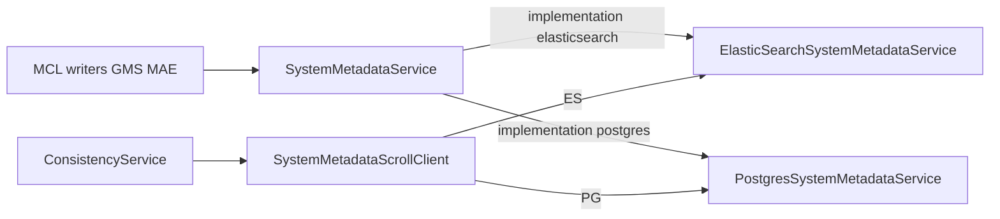

# pgSystemMetadata: PostgreSQL System Metadata for DataHub

## Purpose

pgSystemMetadata is an optional PostgreSQL store for DataHub **system metadata** (ingestion run
IDs, aspect row summaries, and related catalog used by rollback and consistency checks). It can
replace Elasticsearch/OpenSearch as the system-metadata backend while **search and graph stay on
Elasticsearch**.

Documents keep the same **Elasticsearch-shaped JSON** produced for the
`system_metadata_service_v1` index. Postgres stores that payload in a `document jsonb` column plus
extracted columns (`doc_id`, `urn`, `aspect`, `run_id`, registry fields, `last_updated`,
`removed`).

## Modes of Operation

| Mode                   | Config                                                          | Writes                                      | Reads           |
| ---------------------- | --------------------------------------------------------------- | ------------------------------------------- | --------------- |
| **Disabled (default)** | `postgres.pgSystemMetadata.enabled=false`                       | ES via `ElasticSearchSystemMetadataService` | ES / OpenSearch |
| **Postgres SoT**       | `enabled=true`, `systemMetadataService.implementation=postgres` | `PostgresSystemMetadataService`             | Postgres        |

Defaults keep Elasticsearch as the system-metadata store. Set both
`DATAHUB_PGSYSTEMMETADATA_ENABLED=true` and
`SYSTEM_METADATA_SERVICE_IMPLEMENTATION=postgres`. Partial enablement is rejected at GMS/MAE/MCE
startup. Dual-write is not supported. SqlSetup may still create tables from `enabled` alone.

Switching the source of truth does **not** backfill Elasticsearch history into Postgres.
Upgrading an existing postgres+Elasticsearch deployment (system metadata already in the
`system_metadata_service_v1` index) will **not** copy those documents into the Postgres table.
Wipe and rebuild, re-ingest, or keep `SYSTEM_METADATA_SERVICE_IMPLEMENTATION=elasticsearch`.



## Docker Compose (Postgres profiles)

Postgres quickstart/debug profiles enable **exclusive** pgSystemMetadata via
`x-primary-datastore-postgres-env` in `docker/profiles/docker-compose.gms.yml`:

```bash
DATAHUB_PGSYSTEMMETADATA_ENABLED=true
SYSTEM_METADATA_SERVICE_IMPLEMENTATION=postgres
```

Requires PostgreSQL (no `pg_partman` / `pg_cron`). See
[`docs/deploy/environment-vars.md`](./deploy/environment-vars.md) and
[`docs/how/updating-datahub.md`](./how/updating-datahub.md).

## Schema

| Object                           | Role                                                                                 |
| -------------------------------- | ------------------------------------------------------------------------------------ |
| `{postgres.schema}.{tableName}`  | Data table. Default `public.system_metadata_service_v1` (same name as the ES index). |
| `{tablePrefix}_schema_migration` | SqlSetup migration ledger only. Default prefix `metadata_system_metadata`.           |

The table is **not** time-partitioned. Indexes exist on `urn`, `run_id`, `aspect`, and
`(urn, aspect)` for keyset scroll.

Runtime uses a **dedicated Ebean pool** (`postgres.pgSystemMetadata.pool.*`, defaults fall through
to `ebean.*`). SqlSetup DDL uses the main Ebean connection unless `pool.url` is overridden; IAM
settings come from `ebean.*` scoped to that URL.

## API notes

- Entity counts (`KeyAspectEntityCountService`, `/openapi/v1/entities/counts`, and the entity-count
  metrics publisher) use the selected `SystemMetadataService`. Postgres counts key aspects with SQL
  `FILTER` aggregations; Elasticsearch still uses the system-metadata index.
- `getTaskStatus` is an Elasticsearch **task API** concept (not the system-metadata index). Rest.li
  `operations.getEsTaskStatus` and OpenAPI `/openapi/operations/elasticSearch/getTaskStatus` call
  `elasticSearchSystemMetadataService` so they keep working when Postgres is the system-metadata
  SoT. The Postgres `SystemMetadataService` implementation always returns empty for `getTaskStatus`.
- The Postgres service does **not** implement `ElasticSearchIndexed`. BuildIndices / incremental
  reindex / LoadIndices do not create or manage `system_metadata_service_v1` in Elasticsearch.
  `ClearSystemMetadataServiceStep` still calls `clear()`, which `TRUNCATE`s the Postgres table.
  Elasticsearch cleanup may still delete a leftover `system_metadata_service_v1` index if one exists.
- Consistency checks use `SystemMetadataScrollClient` (keyset pagination on `(urn, aspect)` for
  Postgres; `search_after` for Elasticsearch). Orphan cleanup (`DeleteIndexDocumentsFix`) deletes
  from the selected system-metadata store via `SystemMetadataService.deleteUrn`. Continuation tokens
  are not portable across backends.
