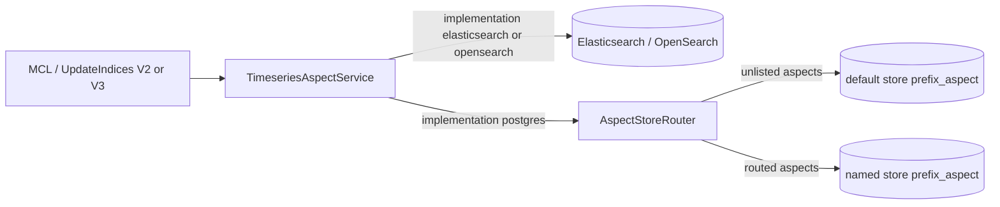
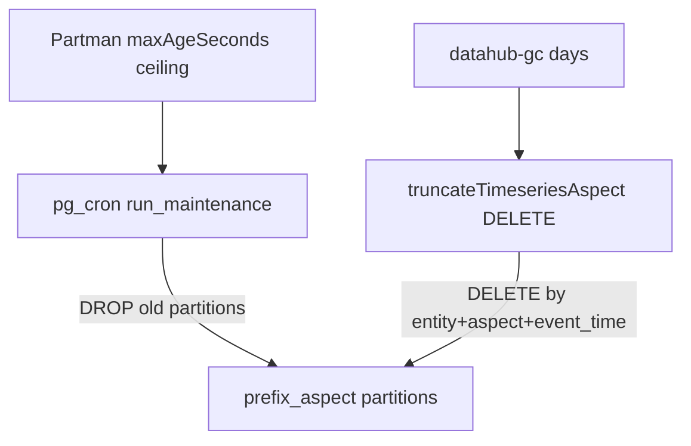

# pgTimeseries: PostgreSQL Timeseries Aspects for DataHub

## Purpose

pgTimeseries is an optional PostgreSQL store for DataHub **timeseries aspects** (profiles, usage
stats, assertion run events, and other time-ordered aspect payloads). It complements — and can
eventually replace — Elasticsearch/OpenSearch as the timeseries aspect backend.

The feature targets:

- **Single- or multi-database deployments** — keep timeseries history in Postgres alongside Ebean
  metadata (and optionally [pgQueue](./pgqueue-design.md)), or split high-volume / long-retention
  aspects across named stores (prefixes and/or JDBC URLs).
- **Operational control** — RANGE partitioning on event time via `pg_partman`, per-store retention
  ceilings, and optional `pg_cron` maintenance.
- **Backend choice** — use the same timeseries APIs with either Elasticsearch/OpenSearch or
  PostgreSQL as the single source of truth.

Timeseries documents keep the same **Elasticsearch-shaped JSON** produced by
`TimeseriesAspectTransformer`. Postgres stores that payload in a `document jsonb` column (plus
extracted columns for identity and time).

---

## Modes of Operation

| Mode                   | Config                                    | Writes                                         | Reads           |
| ---------------------- | ----------------------------------------- | ---------------------------------------------- | --------------- |
| **Disabled (default)** | `postgres.pgTimeseries.enabled=false`     | ES only via `TimeseriesAspectService`          | ES / OpenSearch |
| **Postgres SoT**       | `enabled=true`, `implementation=postgres` | Postgres via `PostgresTimeseriesAspectService` | Postgres        |

Defaults keep Elasticsearch as the timeseries store. Set both
`DATAHUB_PGTIMESERIES_ENABLED=true` and
`TIMESERIES_ASPECT_SERVICE_IMPLEMENTATION=postgres`; partial enablement is rejected.



---

## Basic Configuration and Enablement

### Docker Compose (Postgres profiles)

Postgres quickstart/debug profiles (`quickstart-postgres`, `debug-postgres`, consumers variants,
etc.) enable **exclusive** pgTimeseries by default via
`x-primary-datastore-postgres-env` in `docker/profiles/docker-compose.gms.yml`:

```bash
DATAHUB_PGTIMESERIES_ENABLED=true
TIMESERIES_ASPECT_SERVICE_IMPLEMENTATION=postgres
DATAHUB_PGTIMESERIES_MAINTENANCE_CRON_ENABLED=true
```

Timeseries reads and writes go only to Postgres in this mode.

Requires PostgreSQL with **`pg_partman`**. See
[`docs/deploy/environment-vars.md`](./deploy/environment-vars.md) and
[`docs/how/updating-datahub.md`](./how/updating-datahub.md).

### Postgres as source of truth

```bash
DATAHUB_PGTIMESERIES_ENABLED=true
TIMESERIES_ASPECT_SERVICE_IMPLEMENTATION=postgres
```

Default table: `{postgres.schema}.{DATAHUB_PGTIMESERIES_TABLE_PREFIX}_aspect` →
`public.metadata_timeseries_aspect`.

### Multi-store (named stores + routing)

By default there is a single store named `default`, configured by the flat
`DATAHUB_PGTIMESERIES_*` / `postgres.pgTimeseries.{tablePrefix,partitioning,retention,maintenance,pool}`
keys (90-day ceiling, hybrid GC DELETE). Unlisted aspects always use this store.

To give some aspects a different retention ceiling or Postgres instance, add **named stores** and
an **aspect → store** map. Prefer a mounted ConfigMap / file (maps are awkward as env vars):

```bash
DATAHUB_PGTIMESERIES_CONFIG_FILE=file:/etc/datahub/pgtimeseries.yaml
```

Example file body (full Spring path `postgres.pgTimeseries:`):

```yaml
postgres:
  pgTimeseries:
    stores:
      long:
        tablePrefix: metadata_timeseries_long
        partitioning:
          partmanPartitionInterval: 1 month
        retention:
          maxAgeSeconds: 46656000 # ~18 months
        pool:
          url: jdbc:postgresql://ts-long-host:5432/datahub
    routing:
      # Bracket keys so Spring binds entity.aspect as a single map key
      "[dataset.datasetprofile]": long
```

**Precedence:** OS environment variables > mounted `DATAHUB_PGTIMESERIES_CONFIG_FILE` >
`application.yaml` defaults (same model as GMS rate limits). Spring relaxed binding can still patch
individual store/routing keys after the file loads (e.g.
`POSTGRES_PGTIMESERIES_STORES_LONG_RETENTION_MAXAGESECONDS`).

SqlSetup migrates **every** configured store against that store’s JDBC URL (falls back to the
upgrade/Ebean connection when the store pool URL is unset). GMS and Upgrade both load the same
config overlay.

**IAM is all-or-nothing.** Named stores may use different JDBC URLs and credentials, but they must
all use the **same authentication mechanism** as GMS Ebean / pgCron: either IAM (`EBEAN_USE_IAM_AUTH`
/ `EBEAN_POSTGRES_USE_AWS_IAM_AUTH`) or username/password. Mixing IAM on one Postgres database and
password auth on another is not supported. Cloud IAM properties (`wrapperPlugins`, Cloud SQL
`socketFactory` / `cloudSqlInstance`) are copied onto a store only when its JDBC URL matches the
Ebean pool URL; other stores still enable IAM the same way and infer cloud from the store URL or
`auto`.

---

## Schema Design

### Parent table

```text
{schema}.{prefix}_aspect          -- e.g. public.metadata_timeseries_aspect
  entity_name, aspect_name, urn, message_id, event_time
  -- PK: (entity_name, aspect_name, message_id, event_time); event_time is the partition key
  run_id, event_granularity
  partition_spec, event, system_metadata, document       -- jsonb
PARTITION BY RANGE (event_time)
```

Indexes:

- Lookup: `(entity_name, aspect_name, urn, event_time DESC)`
- Truncate / retention: `(entity_name, aspect_name, event_time)`
- BRIN on `event_time` for time-range scans

### Identity and `message_id`

Primary key is `(entity_name, aspect_name, message_id, event_time)`.

JDBC `message_id` is resolved as:

1. Logical `messageId` from the ES-shaped document when present (`TimeseriesAspectBase.messageId`)
2. Otherwise the transformer map key / Elasticsearch `docId` (hash)

Upserts use `ON CONFLICT (...) DO UPDATE`. Because collection-exploded transformer outputs can
share one aspect `messageId`, Postgres may store **fewer rows than Elasticsearch** for the same
MCL (documented in `TimeseriesAspectServicePostgresIT`). Operators should treat PG identity as
**(entity, aspect, message_id, event_time)**, not as a 1:1 map of every ES document id when
`messageId` is set.

---

## Filter and Aggregation Behavior

Postgres implements a **subset** of Elasticsearch timeseries query behavior:

- Boolean Filter trees (`or` / `and` criteria): EQUAL, ranges, CONTAIN / START_WITH / END_WITH,
  EXISTS / IS_NULL, lineage-style URN expansion.
- `timestampMillis` / `@timestamp` range and equality filters map to the `event_time` column
  (partition pruning + BRIN), not only `document` JSON text.
- Aggregations: SUM, CARDINALITY, LATEST with string/date grouping buckets.

### Scroll (`scrollAspects`)

Scroll pagination matches Elasticsearch `search_after` semantics for the active sort:

- Empty `sortCriteria` → `ORDER BY event_time DESC, message_id DESC`.
- Otherwise each criterion maps to SQL (`timestampMillis` / `@timestamp` → `event_time`,
  `messageId` → `message_id`, other fields → `document` text paths).
- If `message_id` is missing from the sort list, it is appended as a tiebreaker (same direction as
  the last key) so pages stay stable on non-unique document fields.
- The keyset `WHERE` uses direction-aware comparisons (`<` for DESC, `>` for ASC) with
  `IS NOT DISTINCT FROM` equality arms for mixed ASC/DESC sorts.
- `scrollId` is a Postgres-specific Base64url JSON cursor of sort values (`{"v":[...]}`). It is
  **not** interchangeable with Elasticsearch `SearchAfterWrapper` scroll ids.

OpenAPI timeseries scroll already passes `timestampMillis` + `messageId` DESC, which aligns with
the default keyset.

### Truncate and delete

- `deleteAspectValues` / `deleteAspectValuesAsync` delete rows for `(entity_name, aspect_name)`
  matching the filter (used by Rest.li `truncateTimeseriesAspect` and entity cleanup).
- `reindexAsync` is unsupported (throws). When `timeseriesAspectService.implementation=postgres`,
  `truncateTimeseriesAspect` **always** uses delete-by-query and rejects `forceReindex`.

### Missing parity

- `TimeWindowSize.multiple` > 1 is not applied in PG (`date_trunc` always truncates to the unit
  boundary; ES fixed/calendar intervals honor multiples such as 5-minute buckets)
- Exploded collection docs may collapse under a shared logical `messageId` (see Identity above)
- Document-field sorts use JSON text ordering (same limitation as `getAspectValues`)

---

## Retention

pgTimeseries uses a **hybrid** model so hot aspects can expire earlier without giving up efficient
partition drops:



| Layer                        | Mechanism                                                                                                                                                                                           | Scope                                                          |
| ---------------------------- | --------------------------------------------------------------------------------------------------------------------------------------------------------------------------------------------------- | -------------------------------------------------------------- |
| **Hard ceiling (per store)** | `pg_partman` `part_config.retention` from each store’s `retention.maxAgeSeconds` (default store: `DATAHUB_PGTIMESERIES_RETENTION_MAX_AGE_SECONDS`, 90d). Set `0` to clear retention and stop drops. | All aspects in that store — whole time partitions drop         |
| **Shorter per-aspect TTL**   | `truncateTimeseriesAspect` / `datahub-gc` deletes on `(entity_name, aspect_name, event_time)`                                                                                                       | Selected `(entity, aspect)` pairs (routed to the owning store) |

`partmanPartitionInterval` / `partmanPremake` apply on first `create_parent` and then stay sticky.
To change them later, set `DATAHUB_PGTIMESERIES_PARTITIONING_FORCE_OVERWRITE=true` for a SqlSetup
re-run (leaves existing child partitions alone; use with care).

Schedule GC or call the truncate API for shorter per-aspect TTLs (see the
`datahub-gc` ingestion source):

```yaml
source:
  type: datahub-gc
  config:
    truncate_indices: true
    truncate_index_older_than_days: 30
    truncate_aspect_retentions:
      - entity_type: dataset
        aspect: datasetusagestatistics
        older_than_days: 30
      - entity_type: dataset
        aspect: operation
        older_than_days: 30
```

When `truncate_aspect_retentions` is empty, GC uses its built-in high-volume aspect list with
`truncate_index_older_than_days`. Enable `DATAHUB_PGTIMESERIES_MAINTENANCE_CRON_ENABLED` (or run
`run_maintenance` externally) so partman actually drops partitions past the ceiling. Without
maintenance, retention config is written but partitions accumulate.

---

## Failure Semantics

- **Postgres SoT upserts** throw on SQL failure (fail the write path).
- Disabling the feature does not drop tables or unschedule cron jobs; clean up partman parents /
  `pg_cron` jobs operationally if retiring the store.

---

## Trade-offs vs Elasticsearch

|                          | Elasticsearch / OpenSearch              | pgTimeseries                                           |
| ------------------------ | --------------------------------------- | ------------------------------------------------------ |
| Ops footprint            | Search cluster + timeseries indices     | Postgres + `pg_partman` (+ optional `pg_cron`)         |
| Query model              | Full ES DSL / existing search stack     | SQL over `document jsonb` (subset parity)              |
| Scroll                   | `search_after` on hit sort values       | Keyset on active sort keys (+ `message_id` tiebreaker) |
| Scaling writes           | Bulk processor, horizontal search nodes | DB IOPS + dedicated pool size                          |
| Retention                | Index ILM / delete-by-query             | Partman ceiling + per-aspect DELETE (via GC)           |
| Truncate large ranges    | delete-by-query or reindex              | Delete-by-query only (no reindex)                      |
| Migration                | Native today                            | Switch the configured source of truth                  |
| Exploded collection docs | One ES doc per explosion                | May collapse when sharing `messageId`                  |
