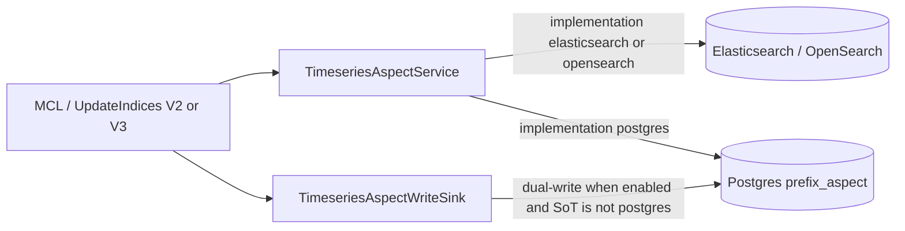
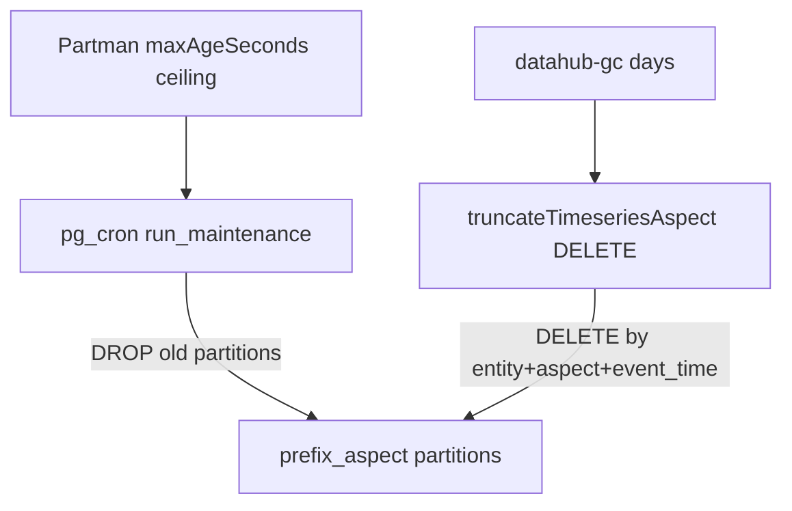

# pgTimeseries: PostgreSQL Timeseries Aspects for DataHub

## Purpose

pgTimeseries is an optional PostgreSQL store for DataHub **timeseries aspects** (profiles, usage
stats, assertion run events, and other time-ordered aspect payloads). It complements — and can
eventually replace — Elasticsearch/OpenSearch as the timeseries aspect backend.

The feature targets:

- **Single-database deployments** — keep timeseries history in Postgres alongside Ebean metadata
  (and optionally [pgQueue](./pgqueue-design.md)).
- **Operational control** — RANGE partitioning on event time via `pg_partman`, retention policies,
  and optional `pg_cron` maintenance.
- **Gradual migration** — dual-write from the MCL / UpdateIndices path while Elasticsearch remains
  the source of truth, then switch reads with a config flag.

Timeseries documents keep the same **Elasticsearch-shaped JSON** produced by
`TimeseriesAspectTransformer`. Postgres stores that payload in a `document jsonb` column (plus
extracted columns for identity and time).

---

## Modes of Operation

| Mode                   | Config                                                                                   | Writes                                                        | Reads           |
| ---------------------- | ---------------------------------------------------------------------------------------- | ------------------------------------------------------------- | --------------- |
| **Disabled (default)** | `postgres.pgTimeseries.enabled=false`                                                    | ES only via `TimeseriesAspectService`                         | ES / OpenSearch |
| **Dual-write**         | `enabled=true`, `timeseriesAspectService.implementation=elasticsearch` (or `opensearch`) | ES **and** Postgres (`TimeseriesAspectWriteSink`)             | ES / OpenSearch |
| **Postgres SoT**       | `enabled=true`, `implementation=postgres`                                                | Postgres via `PostgresTimeseriesAspectService` (sink is NOOP) | Postgres        |

Defaults keep Elasticsearch as the timeseries store. Enabling `DATAHUB_PGTIMESERIES_ENABLED` alone
does **not** change read behavior until `TIMESERIES_ASPECT_SERVICE_IMPLEMENTATION=postgres`.



---

## Basic Configuration and Enablement

### Docker Compose (Postgres profiles)

Postgres quickstart/debug profiles (`quickstart-postgres`, `debug-postgres`, consumers variants,
etc.) enable **exclusive** pgTimeseries by default via
`x-primary-datastore-postgres-env` in [`docker/profiles/docker-compose.gms.yml`](../docker/profiles/docker-compose.gms.yml):

```bash
DATAHUB_PGTIMESERIES_ENABLED=true
TIMESERIES_ASPECT_SERVICE_IMPLEMENTATION=postgres
DATAHUB_PGTIMESERIES_MAINTENANCE_CRON_ENABLED=true
```

With `implementation=postgres`, the dual-write sink is a no-op — timeseries reads and writes go
only to Postgres. To dual-write instead (ES remains SoT), override:

```bash
TIMESERIES_ASPECT_SERVICE_IMPLEMENTATION=elasticsearch
```

### Dual-write (migration step outside Compose defaults)

```bash
DATAHUB_PGTIMESERIES_ENABLED=true

# Keep Elasticsearch as source of truth
TIMESERIES_ASPECT_SERVICE_IMPLEMENTATION=elasticsearch
```

Requires PostgreSQL with **`pg_partman`**. See
[`docs/deploy/environment-vars.md`](./deploy/environment-vars.md) and
[`docs/how/updating-datahub.md`](./how/updating-datahub.md).

### Postgres as source of truth

```bash
DATAHUB_PGTIMESERIES_ENABLED=true
TIMESERIES_ASPECT_SERVICE_IMPLEMENTATION=postgres
```

Default table: `{postgres.schema}.{DATAHUB_PGTIMESERIES_TABLE_PREFIX}_aspect` →
`public.metadata_timeseries_aspect`.

---

## Schema Design

### Parent table

```text
{schema}.{prefix}_aspect          -- e.g. public.metadata_timeseries_aspect
  entity_name, aspect_name, urn, message_id, event_time
  -- PK: (entity_name, aspect_name, message_id, event_time); event_time is the partition key
  run_id, event_granularity
  partition_spec, event, system_metadata, document       -- jsonb
PARTITION BY RANGE (event_time)
```

Indexes:

- Lookup: `(entity_name, aspect_name, urn, event_time DESC)`
- Truncate / retention: `(entity_name, aspect_name, event_time)`
- BRIN on `event_time` for time-range scans

### Identity and `message_id`

Primary key is `(entity_name, aspect_name, message_id, event_time)`.

JDBC `message_id` is resolved as:

1. Logical `messageId` from the ES-shaped document when present (`TimeseriesAspectBase.messageId`)
2. Otherwise the transformer map key / Elasticsearch `docId` (hash)

Upserts use `ON CONFLICT (...) DO UPDATE`. Because collection-exploded transformer outputs can
share one aspect `messageId`, Postgres may store **fewer rows than Elasticsearch** for the same
MCL (documented in `TimeseriesAspectServicePostgresIT`). Operators should treat PG identity as
**(entity, aspect, message_id, event_time)**, not as a 1:1 map of every ES document id when
`messageId` is set.

MCL / `deleteDocument` deletes by `(entity_name, aspect_name, message_id)` and intentionally omit
`event_time`, so every timestamp row for that logical message is removed. That is broader than the
PK (which includes `event_time`) and matches “delete this logical message,” including the
exploded-collapse case above. Filter-based truncate (`deleteAspectValues`) still uses the document
filter + optional API time window on `event_time`.

---

## Filter and Aggregation Behavior

Postgres implements a **subset** of Elasticsearch timeseries query behavior:

- Boolean Filter trees (`or` / `and` criteria): EQUAL, ranges, CONTAIN / START_WITH / END_WITH,
  EXISTS / IS_NULL, lineage-style URN expansion.
- `timestampMillis` / `@timestamp` range and equality filters map to the `event_time` column
  (partition pruning + BRIN), not only `document` JSON text.
- Aggregations: SUM, CARDINALITY, LATEST with string/date grouping buckets.

### Scroll (`scrollAspects`)

Scroll pagination matches Elasticsearch `search_after` semantics for the active sort:

- Empty `sortCriteria` → `ORDER BY event_time DESC, message_id DESC`.
- Otherwise each criterion maps to SQL (`timestampMillis` / `@timestamp` → `event_time`,
  `messageId` → `message_id`, other fields → `document` text paths).
- If `message_id` is missing from the sort list, it is appended as a tiebreaker (same direction as
  the last key) so pages stay stable on non-unique document fields.
- The keyset `WHERE` uses direction-aware comparisons (`<` for DESC, `>` for ASC) with
  `IS NOT DISTINCT FROM` equality arms for mixed ASC/DESC sorts.
- `scrollId` is a Postgres-specific Base64url JSON cursor of sort values (`{"v":[...]}`). It is
  **not** interchangeable with Elasticsearch `SearchAfterWrapper` scroll ids.

OpenAPI timeseries scroll already passes `timestampMillis` + `messageId` DESC, which aligns with
the default keyset.

### Truncate and delete

- `deleteAspectValues` / `deleteAspectValuesAsync` delete rows for `(entity_name, aspect_name)`
  matching the filter (used by Rest.li `truncateTimeseriesAspect` and entity cleanup).
- `reindexAsync` is unsupported (throws). When `timeseriesAspectService.implementation=postgres`,
  `truncateTimeseriesAspect` **always** uses delete-by-query and rejects `forceReindex`.
- `deleteDocument` should pass the ES-shaped `document` when available so JDBC `message_id`
  resolves the same way as upsert (logical `messageId` when present, else `docId`).

### Missing parity

- `TimeWindowSize.multiple` > 1 is not applied in PG (`date_trunc` always truncates to the unit
  boundary; ES fixed/calendar intervals honor multiples such as 5-minute buckets)
- Exploded collection docs may collapse under a shared logical `messageId` (see Identity above)
- Document-field sorts use JSON text ordering (same limitation as `getAspectValues`)

---

## Retention

pgTimeseries uses a **hybrid** model so hot aspects can expire earlier without giving up efficient
partition drops:



| Layer                      | Mechanism                                                                                                | Scope                                    |
| -------------------------- | -------------------------------------------------------------------------------------------------------- | ---------------------------------------- |
| **Hard ceiling**           | `pg_partman` `part_config.retention` from `DATAHUB_PGTIMESERIES_RETENTION_MAX_AGE_SECONDS` (default 90d). Set `0` to clear retention and stop drops. | All aspects — whole time partitions drop |
| **Shorter per-aspect TTL** | `truncateTimeseriesAspect` / `datahub-gc` deletes on `(entity_name, aspect_name, event_time)`            | Selected `(entity, aspect)` pairs        |

`partmanPartitionInterval` / `partmanPremake` apply on first `create_parent` and then stay sticky.
To change them later, set `DATAHUB_PGTIMESERIES_PARTITIONING_FORCE_OVERWRITE=true` for a SqlSetup
re-run (leaves existing child partitions alone; use with care).

Schedule GC or call the truncate API for shorter per-aspect TTLs (see
[datahub-gc](../metadata-ingestion/docs/sources/datahubgc/datahub-gc_post.md)):

```yaml
source:
  type: datahub-gc
  config:
    truncate_indices: true
    truncate_index_older_than_days: 30
    truncate_aspect_retentions:
      - entity_type: dataset
        aspect: datasetusagestatistics
        older_than_days: 30
      - entity_type: dataset
        aspect: operation
        older_than_days: 30
```

When `truncate_aspect_retentions` is empty, GC uses its built-in high-volume aspect list with
`truncate_index_older_than_days`. Enable `DATAHUB_PGTIMESERIES_MAINTENANCE_CRON_ENABLED` (or run
`run_maintenance` externally) so partman actually drops partitions past the ceiling. Without
maintenance, retention config is written but partitions accumulate.

---

## Failure and Dual-Write Semantics

- **Postgres SoT upserts** throw on SQL failure (fail the write path).
- **Dual-write sink** logs SQL errors and increments failure metrics
  (`dual_write_upsert_failure` / `dual_write_delete_failure`). By default it does **not** fail the
  MCL, so Elasticsearch remains authoritative during migration.
- Optional fail-loud for migration:
  `DATAHUB_PGTIMESERIES_DUAL_WRITE_FAIL_ON_ERROR=true` /
  `postgres.pgTimeseries.dualWriteFailOnError=true` rethrows dual-write SQL errors.
- Disabling the feature does not drop tables or unschedule cron jobs; clean up partman parents /
  `pg_cron` jobs operationally if retiring the store.

---

## Trade-offs vs Elasticsearch

|                          | Elasticsearch / OpenSearch              | pgTimeseries                                           |
| ------------------------ | --------------------------------------- | ------------------------------------------------------ |
| Ops footprint            | Search cluster + timeseries indices     | Postgres + `pg_partman` (+ optional `pg_cron`)         |
| Query model              | Full ES DSL / existing search stack     | SQL over `document jsonb` (subset parity)              |
| Scroll                   | `search_after` on hit sort values       | Keyset on active sort keys (+ `message_id` tiebreaker) |
| Scaling writes           | Bulk processor, horizontal search nodes | DB IOPS + dedicated pool size                          |
| Retention                | Index ILM / delete-by-query             | Partman ceiling + per-aspect DELETE (via GC)           |
| Truncate large ranges    | delete-by-query or reindex              | Delete-by-query only (no reindex)                      |
| Migration                | Native today                            | Dual-write then SoT flip                               |
| Exploded collection docs | One ES doc per explosion                | May collapse when sharing `messageId`                  |
