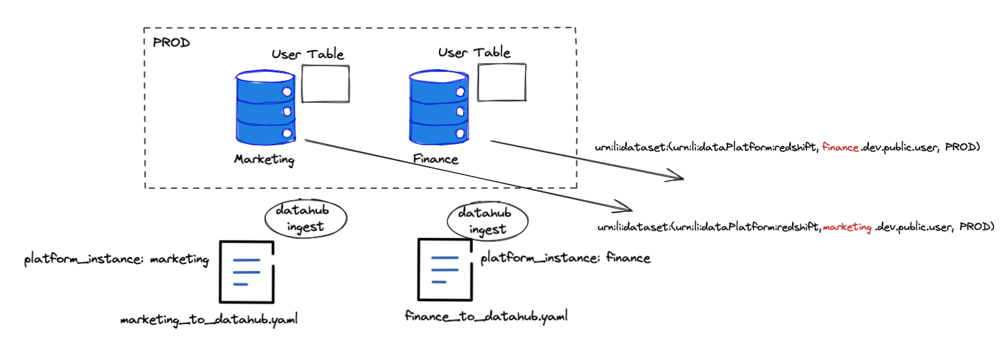

# Trabajar con instancias de plataforma

El modelo de metadatos de DataHub para Datasets admite actualmente una clave de tres partes:

*   Plataforma de datos (por ejemplo, urn:li:dataPlatform:mysql)
*   Nombre (por ejemplo, db.schema.name)
*   Env o Fabric (por ejemplo, DEV, PROD, etc.)

Desafortunadamente, este esquema de nomenclatura no permite una representación fácil de la multiplicidad de plataformas (o tecnologías) que podrían implementarse en una organización dentro del mismo entorno o tejido. Por ejemplo, una organización podría tener varias instancias de Redshift en Producción y querría ver todos los activos de datos ubicados en esas instancias dentro del repositorio de metadatos de DataHub.

Como parte de la `v0.8.24+` estamos desbloqueando la primera fase de soporte de instancias de plataforma en el modelo de metadatos. Esto se hace a través de dos adiciones principales:

*   El `dataPlatformInstance` aspecto que se ha agregado a Datasets que permite asociar datasets a una instancia de una plataforma
*   Mejoras en todas las fuentes de ingesta que les permiten adjuntar una instancia de plataforma a la receta que cambia las urnas generadas para ir desde `urn:li:dataset:(urn:li:dataPlatform:<platform>,<name>,ENV)` formato a `urn:li:dataset:(urn:li:dataPlatform:<platform>,<instance.name>,ENV)` formato. Las fuentes que producen linaje a conjuntos de datos en otras plataformas (por ejemplo, Looker, Superset, etc.) también tienen adiciones de configuración específicas que permiten al autor de la receta especificar la asignación entre una plataforma y el nombre de instancia al que se debe asignar.



## Nombres de instancias de plataforma

Al configurar una instancia de plataforma, elija un nombre de instancia que sea comprensible y que sea estable en el futuro previsible. p. ej.. `core_warehouse` o `finance_redshift` son nombres permitidos, al igual que guids puros como `a37dc708-c512-4fe4-9829-401cd60ed789`. Recuerde que cualquiera que sea el nombre de instancia que elija, deberá especificarlo en más de una receta para asegurarse de que los identificadores producidos por diferentes fuentes se alinearán.

## Habilitación de instancias de plataforma

Lea las guías específicas del origen de Ingestion para saber cómo habilitar instancias de plataforma en cada una de ellas.
El patrón general es agregar un parámetro de configuración opcional adicional llamado `platform_instance`.

Por ejemplo, así es como configuraría una receta para ingerir una instancia mysql a la que desea llamar `core_finance`

```yaml
source:
  type: mysql
  config:
    # Coordinates
    host_port: localhost:3306
    platform_instance: core_finance
    database: dbname
    
    # Credentials
    username: root
    password: example

sink:
  # sink configs
```

##
