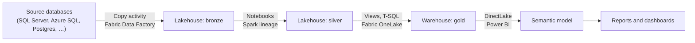

# Microsoft Fabric: Overview

DataHub covers Microsoft Fabric with three connectors plus runtime lineage from Fabric Spark. Each
has its own page; this guide shows how they fit together so lineage runs from your source systems,
through the Fabric medallion layers, to Power BI reports at table and column level.

## What each piece covers

| Piece                                                                                                    | What it ingests                                                                                       | Lineage it produces                                                                                                                                                                                   |
| -------------------------------------------------------------------------------------------------------- | ----------------------------------------------------------------------------------------------------- | ----------------------------------------------------------------------------------------------------------------------------------------------------------------------------------------------------- |
| [Fabric OneLake](https://docs.datahub.com/docs/generated/ingestion/sources/fabric-onelake)               | Workspaces, Lakehouses, Warehouses, schemas, tables and views, with schema metadata; usage statistics | Views (same item and cross-item `item.schema.table` names) and Warehouse T-SQL such as `INSERT … SELECT` and CTAS (from `queryinsights`), table- and column-level                                     |
| [Fabric Data Factory](https://docs.datahub.com/docs/generated/ingestion/sources/fabric-data-factory)     | Workspaces, data pipelines, activities and their runs                                                 | Copy activities, from the source dataset to the destination, table- and column-level (from the activity's mapping)                                                                                    |
| [Power BI](https://docs.datahub.com/docs/generated/ingestion/sources/powerbi)                            | Workspaces, semantic models and their tables, reports, pages, dashboards                              | DirectLake tables to their OneLake tables (table- and column-level), and Import / DirectQuery tables to their sources (M-Query)                                                                       |
| [Notebook and Spark lineage](https://docs.datahub.com/docs/lineage/openlineage#microsoft-fabric-onelake) | Spark jobs and runs, one DataFlow per notebook                                                        | What notebooks and Spark job definitions read and write, table- and column-level, reported by Fabric Spark at run time (OpenLineage). No connector can see inside a notebook, so this is the only way |

All of them name OneLake tables the same way, so the lineage joins up:

```text
urn:li:dataset:(urn:li:dataPlatform:fabric-onelake,<workspaceGUID>.<itemGUID>.<schema>.<table>,<env>)
```

## How lineage flows

A typical medallion architecture, and which piece produces each hop:



The source databases themselves come from their own connectors (for example
[Microsoft SQL Server](https://docs.datahub.com/docs/generated/ingestion/sources/mssql)); Copy
activity lineage attaches to those datasets.

## Set up, in this order

1. **Source databases** that feed Fabric, with their own connectors.
2. **Fabric OneLake**, with the SQL analytics endpoint enabled (`sql_endpoint.enabled`, on by
   default): it is how views, Warehouse tables, column schemas and query lineage are read.
3. **Fabric Data Factory**, with the `datahub-rest` sink. For Copy activities that map columns by
   name, the connector reads source and destination schemas from DataHub.
4. **Power BI**, with the `datahub-rest` sink (or `datahub_api`). DirectLake column lineage is
   checked against the OneLake schemas already in DataHub, so ingest OneLake first.
5. **Notebook lineage** is pushed by the notebooks when they run, independent of the schedule above.
   See [Notebook lineage](#notebook-lineage).

Re-running in this order keeps each connector reading what the previous one wrote.

## Settings that must line up

If these differ between connectors, the same table ends up under two URNs and lineage splits into
disconnected nodes.

| What                                     | Fabric OneLake                    | Power BI                                                        | Notebook lineage (request option)                    |
| ---------------------------------------- | --------------------------------- | --------------------------------------------------------------- | ---------------------------------------------------- |
| Lowercase schema, table and column names | `convert_urns_to_lowercase: true` | `convert_lineage_urns_to_lowercase: true` (default)             | `fabricOneLakeConvertUrnsToLowercase=true`           |
| Platform instance                        | `platform_instance`               | `server_to_platform_instance`, keyed by the Fabric workspace ID | `fabricOneLakePlatformInstance`                      |
| Environment                              | `env`                             | `env` in the same `server_to_platform_instance` entry           | the OpenLineage endpoint's `DATAHUB_OPENLINEAGE_ENV` |

Power BI lowercases DirectLake upstream URNs by default, so the simplest setup is
`convert_urns_to_lowercase: true` on Fabric OneLake and the matching option on notebook lineage.

For Fabric Data Factory, Copy activity sources are named after the Fabric connection. Use
`platform_instance_map` so they match the URNs your source-database connectors emit; see
[Fabric Data Factory](https://docs.datahub.com/docs/generated/ingestion/sources/fabric-data-factory).

## Notebook lineage

Fabric Spark bundles the OpenLineage listener. It is registered but disabled, and it writes its
events to a file in the notebook's default Lakehouse. To send notebook lineage to DataHub:

1. **Use Fabric Runtime 2.0** for the notebooks (the Environment attached to them, or the workspace
   default). It reports column-level lineage for `MERGE INTO`, `CREATE OR REPLACE TABLE … AS SELECT`,
   `INSERT OVERWRITE` and DataFrame `saveAsTable`. Runtime 1.3 reports column-level lineage for
   `MERGE INTO` only.
2. **Turn the listener on** with `spark.openlineage.disabled=false`, in the Environment's Spark
   properties and in the notebook's first cell:

   ```python
   %%configure -f
   {"conf": {"spark.openlineage.disabled": "false"}}
   ```

3. **Give the notebook a default Lakehouse.** That is where Fabric writes the lineage file.
4. **Forward the events from the last cell.** Fabric pins the listener to its file, so its `http`
   transport can't be pointed at DataHub. The query string sets the mapping for these requests; keep
   it in line with your Fabric OneLake recipe (see the table above):

   ```python
   import requests, time

   time.sleep(20)  # let the listener write the last statement's events
   location = spark.sparkContext.getConf().get("spark.openlineage.transport.location")
   token = notebookutils.credentials.getSecret("https://<vault>.vault.azure.net/", "<secret-name>")
   with open(location) as events:
       for event in filter(None, map(str.strip, events)):
           requests.post(
               "https://<datahub-gms>/openapi/openlineage/api/v1/lineage"
               "?fabricOneLake=true&fabricOneLakeConvertUrnsToLowercase=true&fabricNotebookFlowNames=true",
               data=event,
               headers={"Content-Type": "application/json", "Authorization": f"Bearer {token}"},
               timeout=60,
           ).raise_for_status()
   ```

No DataHub jar, `spark.extraListeners` or transport settings are needed. Each notebook shows up as
one `spark` DataFlow (`fabricNotebookFlowNames=true`), with a DataJob per statement that carries
its lineage.

Fabric Spark needs network access to DataHub, and the token needs permission to write lineage. A
notebook that fails before the last cell sends no lineage for that run; a pipeline step that runs
after it can forward the same file instead. All options and details are in
[Microsoft Fabric (OneLake) in the OpenLineage docs](https://docs.datahub.com/docs/lineage/openlineage#microsoft-fabric-onelake).
DataHub's [Spark agent](https://docs.datahub.com/docs/metadata-integration/java/acryl-spark-lineage#configuration-instructions-microsoft-fabric)
is an alternative on Runtime 2.0.

## What's not covered

- **Copy Job and Dataflow Gen2 items**: not ingested. Copy activities inside data pipelines are.
- **Link between a pipeline's Notebook activity and the notebook's lineage**: the Fabric Data
  Factory connector ingests the activity as its own DataJob; it isn't linked to the notebook's
  `spark` DataFlow.
- **4-part cross-workspace names** (`workspace.item.schema.table`): Fabric's SQL endpoint rejects
  them, so cross-item lineage is same-workspace only.
- **Writing metadata back to Fabric**: descriptions, tags and terms stay in DataHub.
- **Lakehouse writes as operations**: notebook writes to Lakehouse tables don't produce `operation`
  aspects, so freshness based on DataHub operations isn't available for those tables.

## Next Steps

Set up each connector from its page:
[Fabric OneLake](https://docs.datahub.com/docs/generated/ingestion/sources/fabric-onelake),
[Fabric Data Factory](https://docs.datahub.com/docs/generated/ingestion/sources/fabric-data-factory)
and [Power BI](https://docs.datahub.com/docs/generated/ingestion/sources/powerbi) (with its
[quick ingestion guide](../powerbi/overview.md)).
