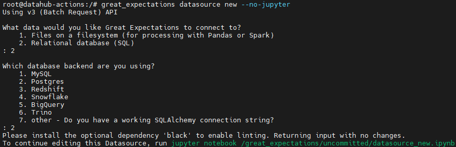
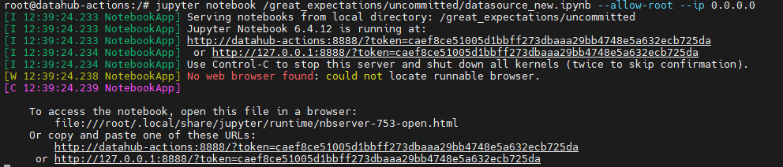
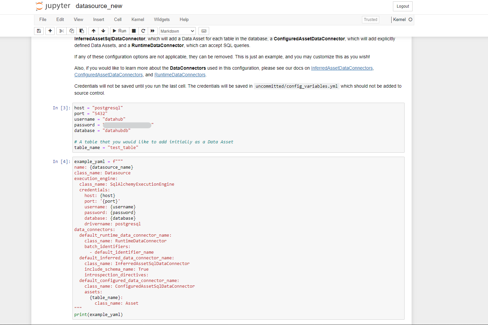
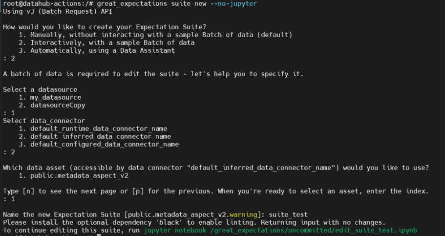
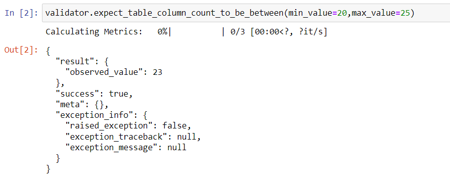
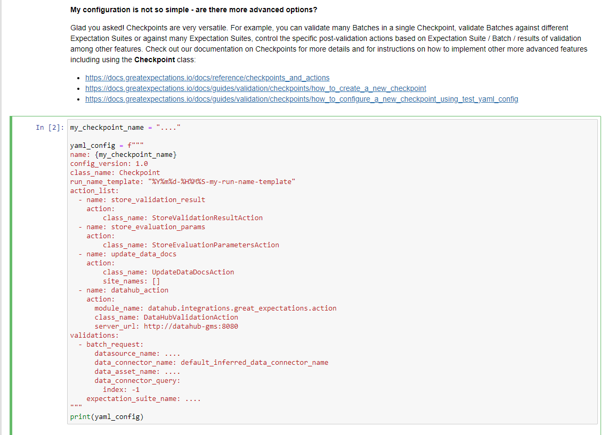

# Configuring Your Great Expectations files

Now that you have installed all the dependecies needed for Great Expectations in [the prior step](setup.md), it's now 
time to set up the files needed.

## Configure files

**Datasource File**: 
   1. This file provides a way for accessing and interacting with data from a wide variety of source
   systems (PostgreSQL, Hive). The command: `great_expectations datasource new --no-jupyter`, creates a new datasource 
   file, being its default name datasource_new.
   

   

:::note
For Hive, as it doesn't appear as an option, you would have to select the "other" option.
:::

   2. In order to be able to edit it, you will have to execute the command: `jupyter notebook /great_expectations/uncommitted/datasource_new.ipynb
      --allow-root --ip 0.0.0.0` and access jupyter notebook with one of the URL's given as result of the execution.

   

:::note

  - `--allow-root` allows you to run jupyter as root, which by default is both not allowed and recommended.

  - `--ip 0.0.0.0` allows your jupyter instance to be accessible for all IPs.
:::

   3. Once you have accessed the file in Jupyter, you will have to fill out the information of your source. For example:

   

    
   4. Last but not least, you will have to execute the whole notebook. During this execution you will be able to see if 
      there is any error in your configuration; and in case there were no errors, this file will be automatically saved.

**Expectations Suite File**:

   1. In this file you will have to define the expectations both for the tables and columns for your data. For this file
      you will have to follow these steps:
      1. `great_expectations suite new --no-jupyter` which starts the creation of the expectations' suite file.
      2. Select how you want to create your suite (usually is recommended selecting the second option, `Interactively`,
         as it allows you to define your own tests).
      3. Select the datasource for this file (in case you have created more than one).
      4. Select the data connector (it is recommended to choose the second option, `default_inferred_data_connector_name`)
      5. Select the table you want to define your expectations for (the tables that will appear are obtained thanks to 
         the previously defined datasource file)
      6. Give the file a name 
      7. Execute the command `jupyter notebook /great_expectations/uncommitted/edit_<file name>.ipynb 
         ---allow-root -–ip 0.0.0.0 ` with the name given to the file instead of `<file name>`
      
      

        
      

      

   2. The next step would be to create the expectations for both the table and the columns. If you need to look at the 
      reference documentation to know what expectations exist, check the following pages:

      1. [Expectations](https://greatexpectations.io/expectations/?banner=false)
      2. [How to create and edit Expectations](https://docs.greatexpectations.io/docs/guides/expectations/how_to_create_and_edit_expectations_based_on_domain_knowledge_without_inspecting_data_directly/)
      3. [Create Expectations](https://docs.greatexpectations.io/docs/tutorials/getting_started/tutorial_create_expectations/)
      

   3. To end with this file, as with the previous one, you will have to execution, during which you will be able to see 
         the result of each expectation.For example, in the image shown below, it checks that the number of columns of the 
         table is greater than 20 but smaller than 25. In the result, it can be observed that the expectation succeeded as the observed value (real number of columns) is 23.

         

           
         

**Checkpoint File**:

   1. This file is the primary mean for validating data in a production deployment of Great Expectations. In case you need 
      to look at some documentation in order to create this file, check the following pages:
      1. [Checkpoint](https://docs.greatexpectations.io/docs/terms/checkpoint/)
      2. [How to create a Checkpoint](https://docs.greatexpectations.io/docs/guides/validation/checkpoints/how_to_create_a_new_checkpoint/)
      3. [How to configure a Checkpoint](https://docs.greatexpectations.io/docs/guides/validation/checkpoints/how_to_configure_a_new_checkpoint_using_test_yaml_config/)

   2. In order to create this file, you will only have to execute the following command: 
      `great_expectations checkpoint new <name> --no-jupyter`. Then, as happened with the other files, in order to modify
      it, you will have to execute the `jupyter notebook /great_expectations/uncommitted/edit_checkpoint_<name>.ipynb
      --allow-root --ip 0.0.0.0`

   3. Once inside the notebook, you will have to modify your checkpoint, so it looks something similar to this:

      

        
      

:::note

The dots `....` should be replaced by the corresponding information (checkpoint name, datasource name, ...)

:::

:::note

If you forget the names of the files that you have created you can always execute the commands:

   1. `great_expectations datasource list`: In order to list all the datasource files.

   2. `great_expectations suite list`: In order to list all the suite of expectations files. 

   3. `great_expectations checkpoint list`: In order to list all the checkpoint files.

:::