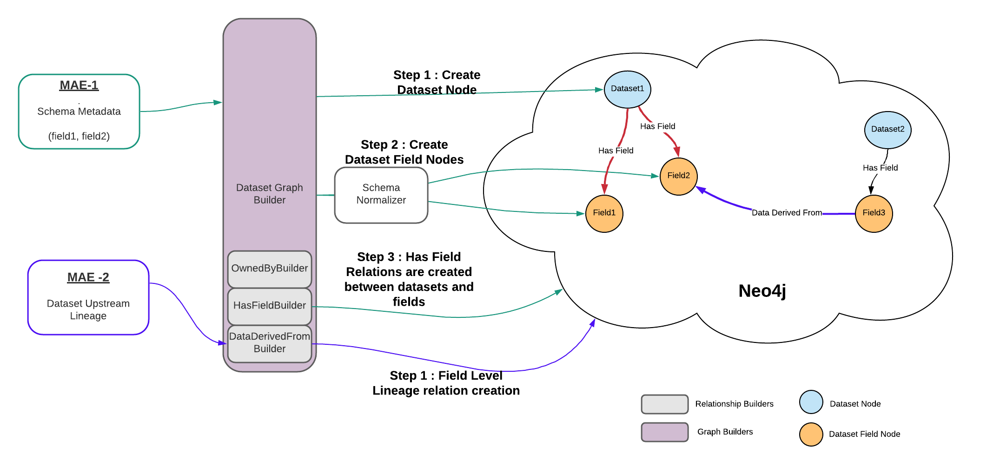

*   Fecha de inicio: 2020-08-28
*   RFC PR: #1841
*   Problema de discusión: #1731
*   Pr(s) de implementación:

# RFC - Linaje a nivel de campo

## Resumen

DataHub admite el linaje a nivel de conjunto de datos. UpStreamLineage es un aspecto del conjunto de datos que impulsa el linaje a nivel de conjunto de datos (también conocido como linaje de grano grueso).
Sin embargo, existe la necesidad de comprender el linaje a nivel de campo (también conocido como linaje de grano fino)

En este RFC, discutiremos a continuación y obtendremos un consenso sobre el modelado involucrado.

*   Representación de un campo en un conjunto de datos
*   Representación del linaje a nivel de campo
*   Proceso de creación de campos de dataset y sus relaciones con otras entidades.
*   La función de transformación involucrada en el linaje a nivel de campo está fuera del alcance del RFC actual.


## Ejemplo básico

### DatasetFieldURN

Se introducirá un identificador único para un campo de un conjunto de datos en forma de DatasetFieldUrn. Y esta urna será la clave para la entidad DatasetField. Una muestra es la siguiente.

> urn:li:datasetField:(urn:li:dataset:(urn:li:dataPlatform:kafka,demo.orders,PROD),/restaurant)

### Aspecto que representa el linaje a nivel de campo.

```json
       {
          "DatasetUpstreamLineage": {
            "fieldMappings": [
              {
                "created": null,
                "transformationFunction": {
                  "string": "com.linkedin.finegrainedmetadata.transformation.Identity"
                },
                "sourceFields": [
                  {
                    "string": "urn:li:datasetField:(urn:li:dataset:(urn:li:dataPlatform:kafka,demo.orders,PROD),/header/customerId)"
                  }
                ],
                "destinationField": "urn:li:datasetField:(urn:li:dataset:(urn:li:dataPlatform:hdfs,/demo/fact_orders,PROD),/customerId)"
              },
              {
                "created": null,
                "transformationFunction": {
                  "string": "com.linkedin.finegrainedmetadata.transformation.Identity"
                },
                "sourceFields": [
                  {
                    "string": "urn:li:datasetField:(urn:li:dataset:(urn:li:dataPlatform:kafka,demo.orders,PROD),/header/timeStamp)"
                  }
                ],
                "destinationField": "urn:li:datasetField:(urn:li:dataset:(urn:li:dataPlatform:hdfs,/demo/fact_orders,PROD),/timeStamp)"
              }
          ]
        }
     }
```

## Motivación

Hay mucho interés en el linaje a nivel de campo para los conjuntos de datos. Los problemas relacionados/rfcs son

1.  ¿Cuándo sale la característica de linaje de grano fino? #1649
2.  dataset nivel de campo Compatibilidad con linaje? #1519
3.  agregar compatibilidad con la programación de flujo de trabajo de linaje #1615
4.  Revisión del diseño: característica de linaje a nivel de columna #1731
5.  Propuesta alternativa para el linaje a nivel de campo #1784

Hay propuestas alternativas para el linaje a nivel de campo (consulte #1731 y #1784). Sin embargo, creo que existe la necesidad de identificar de forma única un campo de conjunto de datos y representarlo como URN por las siguientes razones.

*   Proporciona un camino natural hacia adelante para hacer que el campo del conjunto de datos sea una entidad de primera clase. Los productores y consumidores de este campo de conjunto de datos pueden proporcionar naturalmente más metadatos para un campo que no viene o no se puede expresar como parte de la definición del esquema.
*   La búsqueda y el descubrimiento de conjuntos de datos basados en el campo y sus metadatos serán una extensión natural de esto.

## Diseño detallado

### Modelos

#### DatasetField

Proponemos un identificador estándar para el campo del conjunto de datos en el siguiente formato.

> `urn:li:datasetField:(\<datasetUrn>,\<fieldPath>)`

Contiene dos partes

*   Dataset Urn -> Identificador estándar del dataset. Esta URN ya forma parte de los modelos de DataHub
*   Ruta de acceso de campo -> Representa el campo de un conjunto de datos

FieldPath en la mayoría de los casos típicos es el nombre fieldName o de columna del conjunto de datos. Donde los campos están anidados en la naturaleza, este será un camino para llegar al nodo de la hoja.
Para estandarizar las rutas de campo para diferentes formatos, existe la necesidad de construir rutas estandarizadas `schema normalizers`.

```json
{
   "type":"record",
   "name":"Record1",
   "fields":[
      {
         "name":"foo1",
         "type":"int"
      },
      {
         "name":"foo2",
         "type":{
            "type":"record",
            "name":"Record2",
            "fields":[
               {
                  "name":"bar1",
                  "type":"string"
               },
               {
                  "name":"bar2",
                  "type":[
                     "null",
                     "int"
                  ]
               }
            ]
         }
      }
   ]
}
```

Si este es el esquema del conjunto de datos, los campos del conjunto de datos que emanan de este esquema son

> 1.  urn:li:datasetField:(urn:li:dataset:(urn:li:dataPlatform:kafka,demo.orders,PROD),/foo1)
> 2.  urn:li:datasetField:(urn:li:dataset:(urn:li:dataPlatform:kafka,demo.orders,PROD),/foo2/bar1)
> 3.  urn:li:datasetField:(urn:li:dataset:(urn:li:dataPlatform:kafka,demo.orders,PROD),/foo2/bar2/int)

#### Aspecto

```pdl
/**
* ASPECT :: Fine Grained upstream lineage for fields in a dataset
*/
record DatasetUpstreamLineage {
 /**
  * Upstream to downstream field level lineage mappings
  */
 fieldMappings: array[DatasetFieldMapping]
}
```

```pdl
/**
* Representation of mapping between fields in sourcer dataset to the field in destination dataset
*/
record DatasetFieldMapping{
 /**
  * Source fields from which the fine grained lineage is derived
  */
 sourceFields: array[ typeref : union[DatasetFieldUrn]]

 /**
  * Destination field which is derived from source fields
  */
 destinationField: DatasetFieldUrn
 /**
  * A UDF mentioning how the source got transformed to destination. 
  * UDF also annotates how some metadata can be carried over from source fields to destination fields.
  * BlackBox UDF implies the transformation function is unknwon from source to destination.
  * Identity UDF implies pure copy of the data from source to destination. 
  */
 transformationFunction: string = "com.linkedin.finegrainedmetadata.transformation.BlackBox"
}
```

*   Un aspecto con nombre `DatasetUpstreamLineage` se introducirá para capturar el linaje de grano fino. Técnicamente el grano grueso ya se captura con linaje de grano fino.
*   También se puede proporcionar una función de transformación sobre cómo se transformaron los datos de los campos de origen al campo de destino. La sintaxis exacta de dicha función está fuera del alcance de este documento.
    *   BlackBox UDF significa que el campo de destino se deriva de los campos de origen, pero no se conoce la función de transformación.
    *   UDF de identidad significa que el campo de destino es una copia pura del campo de origen y la transformación es Identidad.
*   Las fuentes ascendentes en las relaciones de nivel de campo son urnas de campo de conjunto de datos y son extensibles para admitir otros tipos en el futuro. Piense en rest api como una posible upstream en la producción de un campo en el conjunto de datos.

### DataFlow en DataHub para linaje a nivel de campo

Como parte del POC que hicimos, utilizamos el siguiente flujo de trabajo. Esencialmente, Se introduce DatasetFieldUrn allanando el camino para que sea la entidad de primera clase.


1.  GraphBuilder al recibir MAE para `SchemaMetadata` aspecto, lo haremos a continuación
    1.  Crear entidad de conjunto de datos en el gráfico db.
    2.  Utilice normalizadores de esquema y extraiga rutas de campo. Este esquema y, por lo tanto, los campos son la fuente de verdad para los campos del conjunto de datos.
    3.  Crea entidades de campo de conjunto de datos en la base de datos de gráficos.
    4.  Un nuevo constructor de relaciones `Data Derived From Relation Builder` creará `HasField` relación entre `Dataset` entidad y `DatasetFields` Entidades
2.  GraphBuilder al recibir MAE para `DatasetUpstreamLienage` Aspect creará los linajes a nivel de campo (relación `DataDerivedFrom`) entre `Source DatasetFields` y `Destination DatasetField`

#### Modelos que representan el linaje

```pdl
@pairings = [ {
  "destination" : "com.linkedin.common.urn.DatasetFieldUrn",
  "source" : "com.linkedin.common.urn.DatasetUrn"
}  ]
record HasField includes BaseRelationship {
}
```

```pdl
@pairings = [ {
  "destination" : "com.linkedin.common.urn.DatasetFieldUrn",
  "source" : "com.linkedin.common.urn.DatasetFieldUrn"
} ]
record DataDerivedFrom includes BaseRelationship {
}
```

Se pueden introducir dos nuevas relaciones para representar las relaciones en el gráfico.

*   `HasField` la relación representa la relación del conjunto de datos al campo del conjunto de datos.
*   `DataDerivedFrom` El modelo de relación representa los datos del campo del conjunto de datos de destino derivados de los campos del conjunto de datos de origen.

### DataFlow cuando DatasetField es una entidad de primera clase

Una vez que decidimos hacer el campo del conjunto de datos como una entidad de primera clase, los productores pueden comenzar a emitir MCE para los campos del conjunto de datos.
A continuación se muestra el flujo de extremo a extremo de la entidad de campo del conjunto de datos que se verá en la imagen más grande.


*   Se desarrollarán normalizadores de esquemas como utilidad.
*   `DatasetField` Entidad se introducirá con aspecto `FieldInfo`
*   Los productores pueden usar normalizadores de esquema y enviar emisiones `DatasetField` MCEs para cada campo del esquema.
*   Los productores seguirán emitiendo el `SchemaMetadata` como un aspecto de `Dataset` entidad. Este aspecto sirve como metadatos para la relación `HasField` entre `Dataset` y `DatasetField` Entidades.
*   Un aspecto con nombre `DatasetUpstreamLineage` se introducirá para capturar el linaje a nivel de campo. Técnicamente el grano grueso ya se captura con linaje de grano fino.

## Cómo enseñamos esto

Estamos introduciendo la capacidad de linaje a nivel de campo en DataHub. Como parte de esto, a continuación se presentan las características más destacadas que uno debe conocer.

1.  `Schema Normalizers` se definirá para estandarizar las rutas de campo en un esquema. Una vez hecho esto, el linaje a nivel de campo será la relación entre dos rutas de campo estandarizadas de rutas de origen y destino.
2.  `Dataset Field URN` se introducirá y `DatasetField` será una entidad de primera clase en DataHub.
3.  `HasField` Las relaciones se rellenarán en el gráfico DB entre `Dataset` y `DatasetField`
4.  `DataDerived` las relaciones se poblarán sobre el terreno.
5.  `SchemaMetadata` seguirá sirviendo la información de esquema de un conjunto de datos. Pero, se utiliza como SOT para la presencia de entidades de campo de conjunto de datos.

Esta es una extensión del soporte actual de linaje de grano grueso por DataHub.\
La pestaña Relaciones en la interfaz de usuario de DataHub también se puede mejorar para mostrar el linaje a nivel de campo.

## Inconvenientes

No he pensado en ningún inconveniente potencial.

## Alternativas

En el diseño alternativo, no necesitaríamos considerar la definición de una urna de campo de conjunto de datos. Hay un extenso RFC y discusión sobre esto en ( #1784 )

## Estrategia de implementación / adopción

Esto introduce un nuevo aspecto `DatasetUpstreamLineage` que es capaz de definir el linaje a nivel de campo. Por lo tanto, los clientes existentes no deberían verse afectados con este cambio.

## Preguntas no resueltas

*   La sintaxis de la función de transformación que representa cómo se transformaron los campos de origen en campos de destino no está pensada.
*   Cómo obtener automáticamente el linaje de nivel de campo analizando los lenguajes de nivel superior o los planes de consulta de diferentes entornos de ejecución.

Para los dos anteriores, necesitamos tener RFC más detallados.
