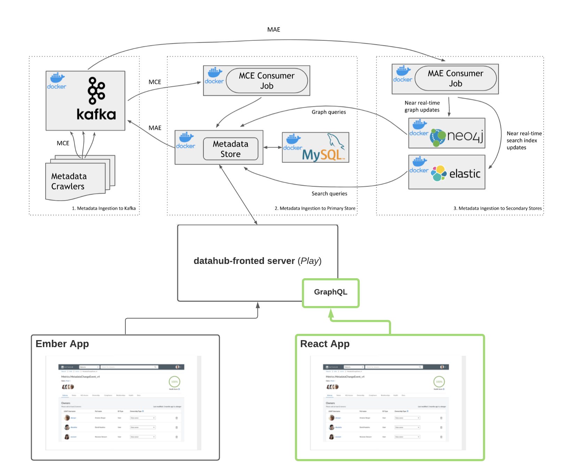

- Start Date: 1/12/2020
- RFC PR: 2055
- Implementation PR(s): N/A

# Proposal to Incubate a new React Application

## Proposal

In this document, we propose the incubation of a new React application inside the DataHub repository. ‘Incubation’ implies iterative development by the community over time, as opposed to a big-bang rewrite, which is impractical given the scope of work.

We’ll begin by outlining the motivations for this proposal, followed by a characterization of the design principles & functional requirements, and conclude with a look at the proposed architecture. We will largely omit specific implementation details from this RFC, which will be left to subsequent RFCs + PRs.

## Goals

The goal of this RFC is to get community buy-in on the development of a React app that will exist in parallel to the existing Ember app inside the DataHub repository.

## Non Goals

The following are omitted from the scope of this RFC

- GraphQL server-side implementation (Play Server versus separate server)
- Specific React component architecture
- Specific tech / tooling choices within React ecosystem (state mgmt, client, etc)

## Motivation

The primary motivation behind developing a new React app is improving the reach & accessibility of DataHub. It’s no secret that React is a much more popular technology than Ember by the numbers:

- React GitHub stars: ~160k
- Ember GitHub stars: ~20k

Adopting a more familiar stack will facilitate an active community by lowering the barrier to contribution, in addition to providing access to a richer ecosystem.

A secondary motivation is that a new client would allow us to address tech debt present in the existing Ember app, including

- **Legacy & unused code**: Special handling logic exists to support legacy versions of DataHub (ie. WhereHows). An example of this can be found in [legacy.ts](https://github.com/datahub-project/datahub/blob/master/datahub-web/@datahub/data-models/addon/entity/dataset/utils/legacy.ts). Additionally, there is code that goes unused in the OSS client, such as that pertaining to Dataset [compliance](https://github.com/datahub-project/datahub/blob/master/datahub-web/packages/data-portal/app/utils/datasets/compliance-suggestions.ts). A new client will provide legibility benefits, lacking historical baggage.

- **Difficulty of extension**: Given the lack of formal guidance, steep learning curve for Ember (& the addon structure), & presence of legacy / unused code, it is nontrivial to extend the existing web client.

- **Difficulty of customization**: There is a lack of clear customization levers for modifying the Ember application. Because DataHub is deployed in a variety of different organizations, it would be useful to support customization of
    - Theme: How it looks (color, ux, assets, copy)
    - Features: How it behaves (enable / disable features)
      
      out of the box!

- **Coupling with GMA**: GMA concepts of [entity](https://github.com/datahub-project/datahub/blob/master/datahub-web/@datahub/data-models/addon/entity/base-entity.ts) and [aspect](https://github.com/datahub-project/datahub/blob/master/datahub-web/@datahub/data-models/addon/entity/utils/aspects.ts) are rooted in the Ember client. With the new client, we can revisit the abstractions exposed to the client side & look for opportunities to simplify.

A clean slate will allow us to address these items, improving the frontend development experience & making community contribution easier.

It is important to note that we are not proposing deprecation of the Ember client at this time. Maintenance and feature development should be free to continue on Ember as the React app evolves in isolation.

### Design Principles

In developing the new application, it is important that we have an agreed-upon set of design principles to guide our decisions.

Such principles should promote the health of the community (eg. by increasing the likelihood of contribution) & the value proposition of the DataHub product for organizations (eg. by permitting domain-specific modification of the default deployment).

Specifically, the new client should be

1. **Extensible**
- Modular, composable architecture 
- Formal guidance on extending the client to support domain-specific needs

2. **Configurable**
- Clear, consistent, & documented levers to alter style & behavior between DataHub deployments
- Support injection of custom ‘applets’ or ‘widgets’ where appropriate

3. **Scalable**
- An architecture suited for scale, both along the people & feature dimensions
- Easy to contribute! 

These principles should serve as evaluation criteria used by authors & reviewers of application changes.

### Functional Requirements

#### Near term

Initially, our goal is to achieve functional parity with the existing Ember frontend for common use-cases. Specifically, the React app should support

- Authenticating a user
- Displaying metadata entities
- Updating metadata entities  
- Browsing metadata entities
- Searching metadata entities
- Managing a user account

The finer details of which entities fall into each feature bucket will be dictated by the needs of the community, with the short-term milestone to achieve parity with entities appearing in the Ember client (Datasets, CorpUsers).

#### Long term

In the longer term, we will work with the community to define a more extensive functional road map, which may include

- Providing migration pathway from the Ember application to the React application
- New entities, aspects, operations (eg. Dashboards, Charts, etc)
- Custom, server-driven ‘extensions’ or ‘applets’ to display in the UI
- Admin Dashboard
- Metrics Collection
- Social features
& more!

### Architecture

The figure below depicts the updated DataHub architecture given this proposal:

Where the boxes outlined in green denote newly introduced components.

Notice that the app will be completely independent of the existing Ember client, meaning there are no compatibility risks for existing deployments. Moreover, the React app will communicate exclusively with a GraphQL server (See [RFC 2042](https://github.com/datahub-project/datahub/pulls?q=is%3Apr+is%3Aclosed) for proposal). This will improve the frontend development experience by providing 
- a clearly defined API contract
- simplified state management (via Apollo GQL client -- no redux required)
- auto-generated models for queries and data types

That’s the extent of the technical specifics we’ll cover for now. Stay tuned for a proof-of-concept PR coming soon that will present an initial React shell.

## How we teach this

A major goal of this initiative is to develop a frontend web client that can be easily extended by the DataHub community. Toward that end, we will provide documentation detailing the process of changing the frontend client to do things like:

- Add a new entity page
- Extend an existing entity page
- Enable / disable specific features
- Modify configurations
- Test new components
& more!

## Alternatives

### Evolve the Ember App in place

*What?*: Iterate on the existing Ember appclient.

*Why not?* Firstly, we actually do not consider this to be mutually exclusive with introducing a separate React app. Regardless, there are benefits to adopting a more accessible technology like React that do not change with improvements to the existing Ember app.

### Mixing Ember & React

*What?*: Migrate from Ember to React incrementally by incrementally replacing Ember components with React components.

*Why not?*: The intermediate state of a half-react, half-ember app is something we’d rather not think about -- it’s scary & sad. We’d like to avoid degrading client-side developer experience with this type of complexity. Since this migration will take some time, we feel it more productive to iterate independently.

## Rollout / Adoption Strategy

As described above, the rollout of the React frontend will be iterative. In the short term, existing deployments will continue using Ember. In the long term, organizations will be free to validate and migrate to the new client at their own pace.

## Open Questions

**Can we reuse code from the Ember client?**

Great Question :) Yes -- we should actively try to extract as much common code as possible from Ember (most likely shared UI components), so long as it conforms to the principles laid out above. This will hopefully speed up the development process and allow for improvements across both clients at the same time.  

**Which GMS entities should appear in the new frontend? Which update operations?**

This is something we’ll look to the community to help define! Initially, we’ll target functional parity with the Ember app, which today supports

- reading Dataset & CorpUser
- writing certain Dataset aspects (eg. ownership) 
