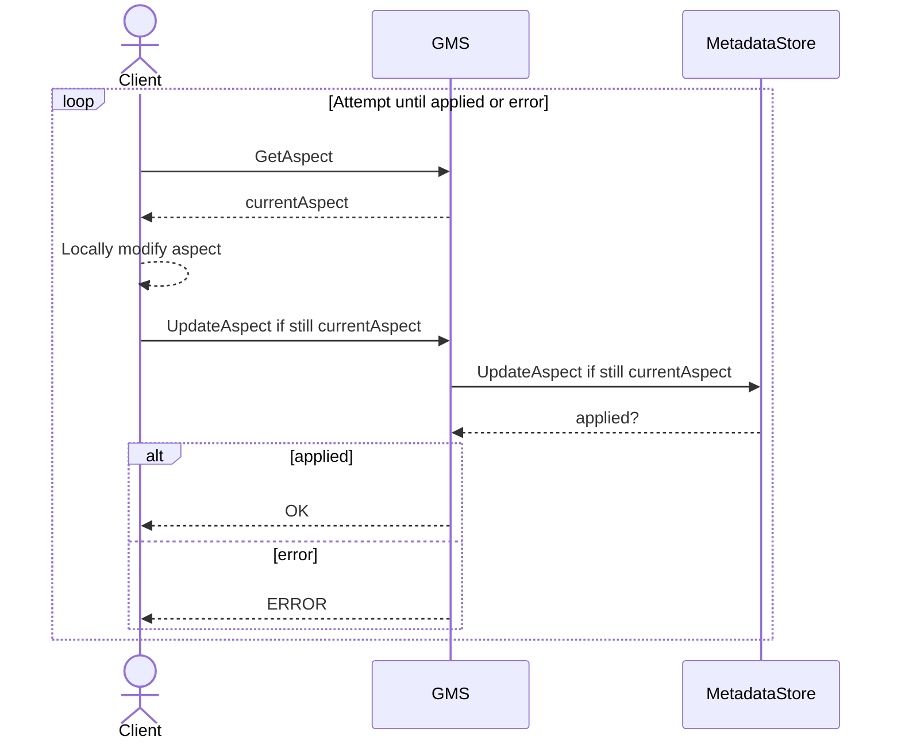
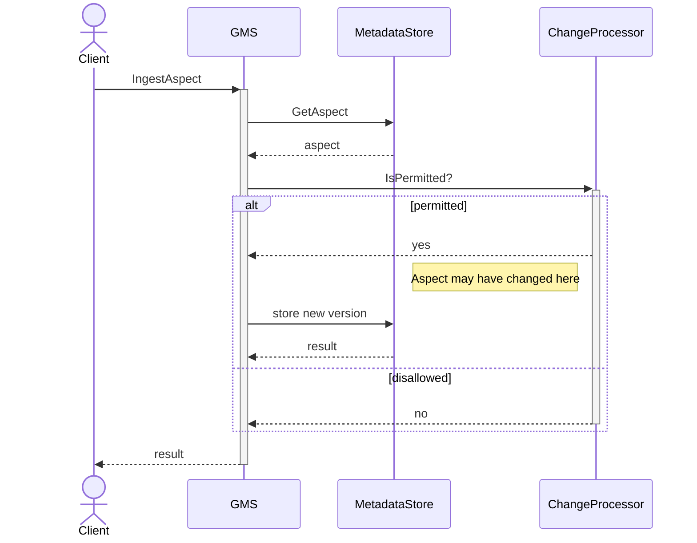
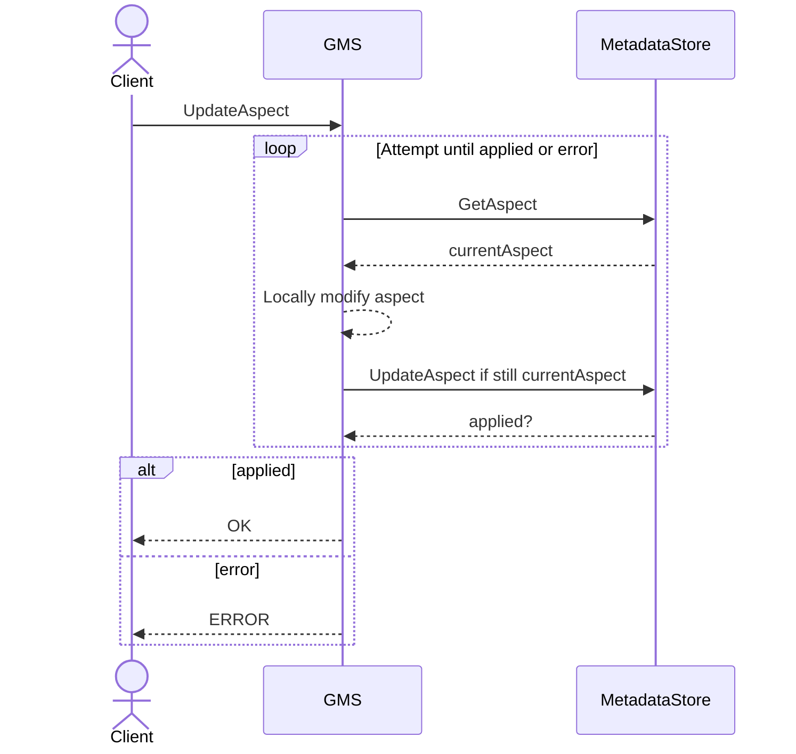
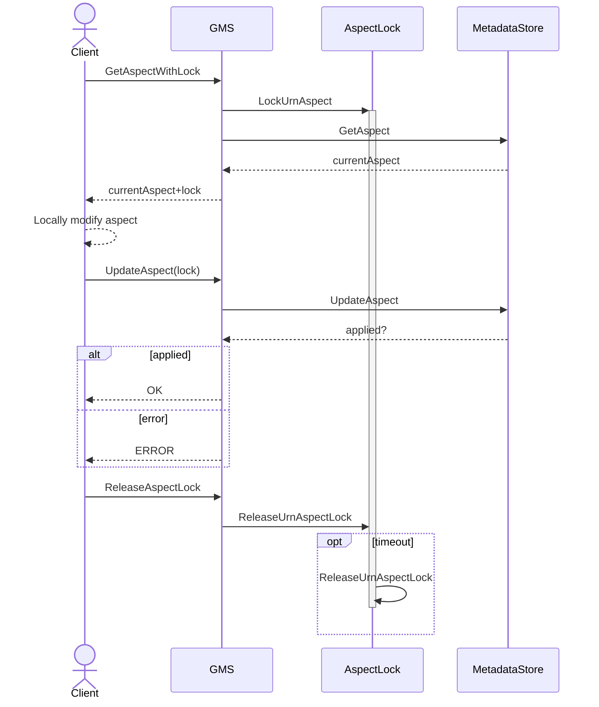

- Start Date: 2022-09-02
- RFC PR: https://github.com/datahub-project/datahub/pull/5818
- Discussion Issue: https://github.com/datahub-project/datahub/issues/5635
- Implementation PR(s): (leave this empty)

# Serialisation of Updates via GMS

## Summary

Make it possible for the GMS to serialise updates by rejecting an update if an aspect has changed between a client 
reading the state and writing a proposed new state.

## Basic example

When a client connects to DataHub and wants to make changes to an existing aspect, their update may depend on the 
current state of that aspect. An example would be adding items to a list or adding a new aspect on the basis that 
one doesn't yet exist.

Because the update endpoint requires client to write the full state of the aspect they wish to update, this can lead 
to race conditions. If Client A and Client B are both writing to the same aspect concurrently they will (silently) find 
that only one of their updates will have worked.

See the very basic example below:

### Current State
```json
{
  "myList": ["red", "blue", "green"]
}
```

Both clients legitimately read the starting state as above.

### Client A

Wants to add "yellow" to the list, so the target state is
```json
{
  "myList": ["red", "blue", "green", "yellow"]
}
```

### Client B

Wants to add "purple" to the list, so the target state is
```json
{
  "myList": ["red", "blue", "green", "purple"]
}
```

If they both run their updates in a similar timeframe, both will succeed but either "yellow" or "purple" will be 
added to the list, not both.

I would like a way for a client to request for an update to be rejected if the initial state differs from its 
assumptions, i.e. only update the state if the starting state is still the same.

## Motivation

We wish to avoid losing data silently when two clients make updates to the same aspect. This can be quite likely in 
an event-driven world driving downstream operations on Datasets. We should offer clients the chance to conditionally 
update an aspect on the basis that what they recently observed is still the case and signal to the client if the 
state changed before the update was possible. Essentially we need a long "compare-and-swap" operation 
for atomic updates.

## Requirements

> What specific requirements does your design need to meet? This should ideally be a bulleted list of items you wish
> to achieve with your design. This can help everyone involved (including yourself!) make sure your design is robust
> enough to meet these requirements.
>
> Once everyone has agreed upon the set of requirements for your design, we can use this list to review the detailed
> design.

* A client needs to be able to identify the unique state or version of a given aspect when querying for it.
* The client needs to be able to reference the same state to a GMS "update" endpoint if it wants to ensure the 
  aspect has not changed between fetching it and mutating it.
* A client could include multiple aspects in its precondition state, in case one update relies on the state of many 
  other aspects. We need to defend against race conditions for all the aspects given.

### Extensibility

> Please also call out extensibility requirements. Is this proposal meant to be extended in the future? Are you adding
> a new API or set of models that others can build on in later? Please list these concerns here as well.

1. The proposal could be extended to include a list of aspect versions which must hold true in order for a single 
   aspect update to occur.
2. We could extend to include the state version in a batch update, though this may be complicated if handling 
   multiple updates to the same aspect in a single batch.

## Non-Requirements

It's not important for us to discuss complex prerequisites here. The only thing we need to enforce is the state of 
an aspect has not changed when making an update to it.

There are some potential spin-offs of this design which could involve writing some kind of PATCH update where a client 
supplies a diff instead of a complete new state, but this is out of scope of this particular RFC.

## Detailed design

> This is the bulk of the RFC.

> Explain the design in enough detail for somebody familiar with the framework to understand, and for somebody familiar
> with the implementation to implement. This should get into specifics and corner-cases, and include examples of how the
> feature is used. Any new terminology should be defined here.

### PROPOSED SOLUTION: Read and Conditional Update

Read the current aspect(s) and pass that state back to the client. The client can propose an update on the basis that 
what they just read is still valid. The client should return an HTTP error code that specifically mentions the state 
has changed underneath it when attempting the update. In this case the client can choose to re-apply the update 
(read-modify-write) or throw its own error.

Good
* Guarantee of state between the read and write
* No need for business-specific logic in GMS code

Bad
* Slow, especially under high contention
* Client will need to handle retries



#### Implementation via Etag

We could achieve this via HTTP [Conditional Requests](https://developer.mozilla.org/en-US/docs/Web/HTTP/Conditional_requests#avoiding_the_lost_update_problem_with_optimistic_locking).
GMS would populate the `ETag` header in the GET response for aspects. This can be used in the `If-Match` or 
`If-None-Match` header when a POST request is passed to GMS to update the aspects. The main concern is then how to 
format the ASCII `Etag` value for multiple aspects such that client and server are able to compose them.

A suggested format would be semicolon-separated aspect-value pairs, e.g. `myAspect1=hashValue1;myAspect2=hashValue2`.

## How we teach this

> What names and terminology work best for these concepts and why? How is this idea best presented? As a continuation
> of existing DataHub patterns, or as a wholly new one?

> What audience or audiences would be impacted by this change? Just DataHub backend developers? Frontend developers?
> Users of the DataHub application itself?

> Would the acceptance of this proposal mean the DataHub guides must be re-organized or altered? Does it change how
> DataHub is taught to new users at any level?

> How should this feature be introduced and taught to existing audiences?

We would have two potential additions to terminology:
1. Previous state: The version(s) of aspects required in order for a GM update to succeed.
2. Preconditions: A wider set of assertions which must be true in order for a GM update to succeed.

We don't really cover "Preconditions" in this RFC, and in fact I argue we should never do, as this leaks business 
knowledge into the GMS code. I would therefore use "Previous State" to describe the aspect versions required for 
updates.

### Documentation

This should be added as an extra section of the following:
* REST API examples
* Java/Python REST Emitter
* GraphQL mutations?

## Drawbacks

> Why should we *not* do this? Please consider the impact on teaching DataHub, on the integration of this feature with
> other existing and planned features, on the impact of the API churn on existing apps, etc.

> There are tradeoffs to choosing any path, please attempt to identify them here.

There are two major reasons this will be difficult to achieve: Aspect Versioning and Performance.

### Aspect Versioning

Currently, [aspect versioning](/docs/advanced/aspect-versioning.md) uses 0 as a mutable placeholder for the latest 
aspect version. We would have to find a way to get around this or provide a different, deterministic identifier for 
a specific aspect version if we aren't able to reference a single fixed integer for the aspect versions.

We don't necessarily have to overhaul the versioning approach here, as all we need is a way of uniquely identifying
the aspect instance that is to be changed. We don't need to rely on numerical version ordering for this, but
something will need to be added as the general aspect level to allow for this new functionality.

Whatever is done, the most important thing is that changes can be isolated at the metadata storage level, whether
through locking, transactions or Cassandra LWTs.

### Performance

There are some significant performance drawbacks for most of these designs, as they will involve an extra hop between 
the client and DataHub. Things will get even worse if the aspect updates are under heavy contention.

#### Under contention

This approach would suffer a lot under high contention. Let's say:
* the time sending a request from client to gms and receiving response is `x`
* the time taken to manipulate read to create a new write request at the client is `y` (assume constant for simplicity)
* a constant transaction/LWT overhead of `z` (LWT if using Cassandra)

Under a contention of n clients sending 1 request targeting the same aspect, we would see:
* 1 client would take `2x + y + z` time
* 1 client would take `4x + 2y + 2z` time
* ...
* nth concurrent client would take 2nx + ny + nz time

This is assuming a client is just making one update to the aspect. If an aspect is being used in some complex 
communication chain this could take a very long time.

## Alternatives

> What other designs have been considered? What is the impact of not doing this?

> This section could also include prior art, that is, how other frameworks in the same domain have solved this problem.

### Modelling

Alternatives involve cleverly modelling aspects so they are only ever upserted without a previous state in mind, but 
I haven't worked out how to achieve this for our requirements given the standard entity and aspect model available.

### Change Processor

Check the allowed set of transitions between current and proposed aspect state. This would be achieved with
business-specific logic injected into the DataHub codebase via plugins. This feels like the wrong approach.

Good
* Fast as all code is executed in GMS

Bad
* No guarantee of state between the read and write
* No guarantee that the plugin code will run
* Specific business logic getting tied up with GMS code



### Idempotent Partial Update (Patch)

The client proposes a partial change to an aspect that is idempotent. The change can apply whatever state the aspect
is in at the time. This will need to be extended to check for multiple currentAspect states when requested.

Good
* No need for business-specific logic in GMS code
* Fast, as retry loop will be confined to GMS

Bad
* GMS will need to understand partial (PATCH) updates
* Retries will need to be handled in GMS



#### Patch Language

If a patch language were available, it might be possible to update collections in such a way that it's not
necessary for clients to know about the previous state of an aspect.

MongoDB offers an update mode which allows clients to [add items to a set](https://mongodb.github.io/mongo-java-driver/4.7/apidocs/mongodb-driver-core/com/mongodb/client/model/Updates.html#addToSet(java.lang.String,TItem)),
for example. This would avoid the need to go back to the client to ask them to construct the final state of a
collection.

##### Implementation of PATCH with json-patch format

Client sends its update request in json-patch or some other delta format. GMS will reject the update if the "previous"
side of the delta does not match. This closely matches the work in https://github.com/datahub-project/datahub/pull/5901.

### Serialised Updates Exclusively via Kafka

Here, the client never updates the aspect via HTTP but instead passes it via the MetadataChangeProposal topic in Kafka.
I don't think this is a viable solution due to the possibility of issuing out-of-date updates.

Good
* Local ordering
* Fast performance

Bad
* No way of knowing what the current state is unless the client constructs it from the Kafka topics
* Danger of proposing out-of-date updates if the topic is lagging

### URN-Aspect Locking

Lock the target URN aspect(s) when reading. The client is guaranteed that the state it has read will not change 
until it releases the lock.

Good
* Guarantee of state between the read and write
* No need for business-specific logic in GMS code

Bad
* Very slow, especially under high contention
* Need to handle lock release if a client fails to release the lock
* Potentially blocking MCE Kafka queue



## Rollout / Adoption Strategy

> If we implemented this proposal, how will existing users / developers adopt it? Is it a breaking change? Can we write
> automatic refactoring / migration tools? Can we provide a runtime adapter library for the original API it replaces? 

This rollout could be done as either a new API endpoint or an optional additional header to an existing API, so 
existing APIs will not be broken. Once available, clients may opt in to use the new features.

## Future Work

> Describe any future projects, at a very high level, that will build off this proposal. This does not need to be
> exhaustive, nor does it need to be anything you work on. It just helps reviewers see how this can be used in the
> future, so they can help ensure your design is flexible enough.

The capabilities built here would allow us to implement more parts of GMS than just UPSERT change types, as we could 
guarantee the current state before making any changes.

## Unresolved questions

> Optional, but suggested for first drafts. What parts of the design are still TBD?

I'm not as familiar with the GMS code as I could be, so it's unclear to me exactly where we'd end up making code 
changes. I know the solution needs to be agnostic to whichever backing store is being used.
