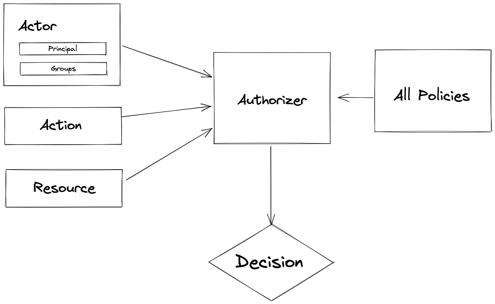
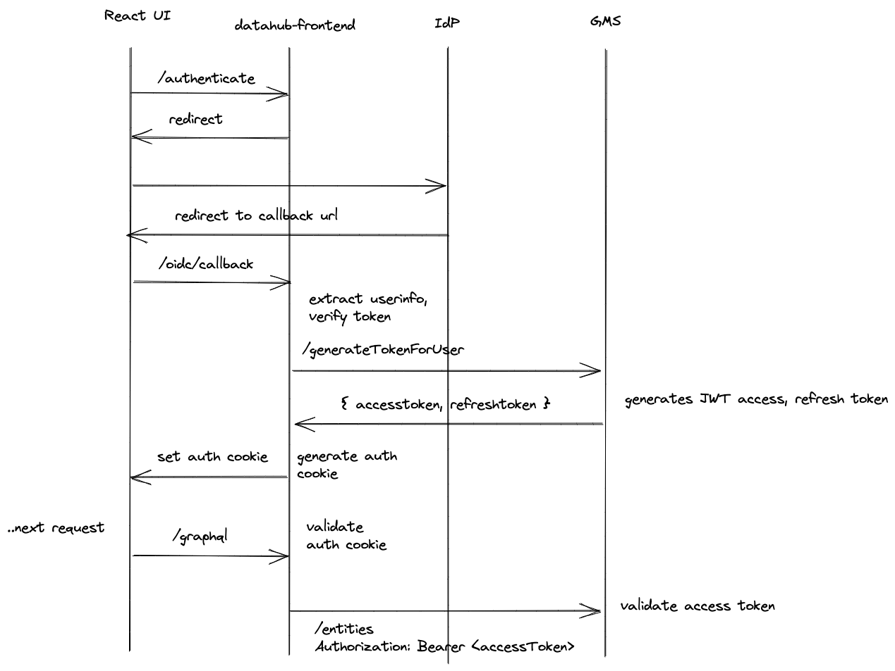
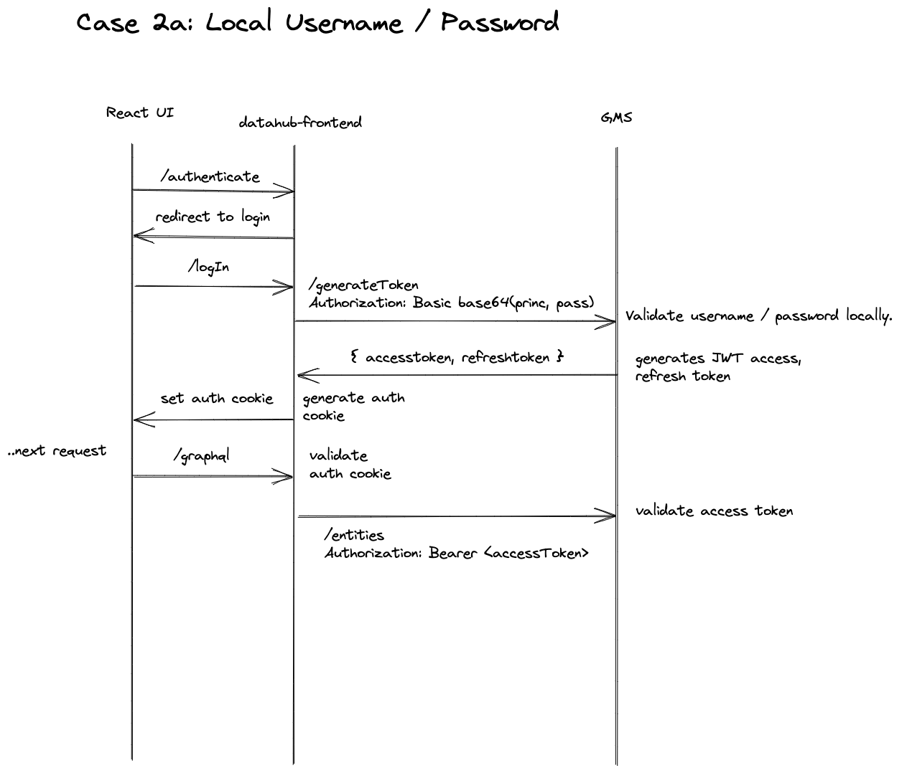
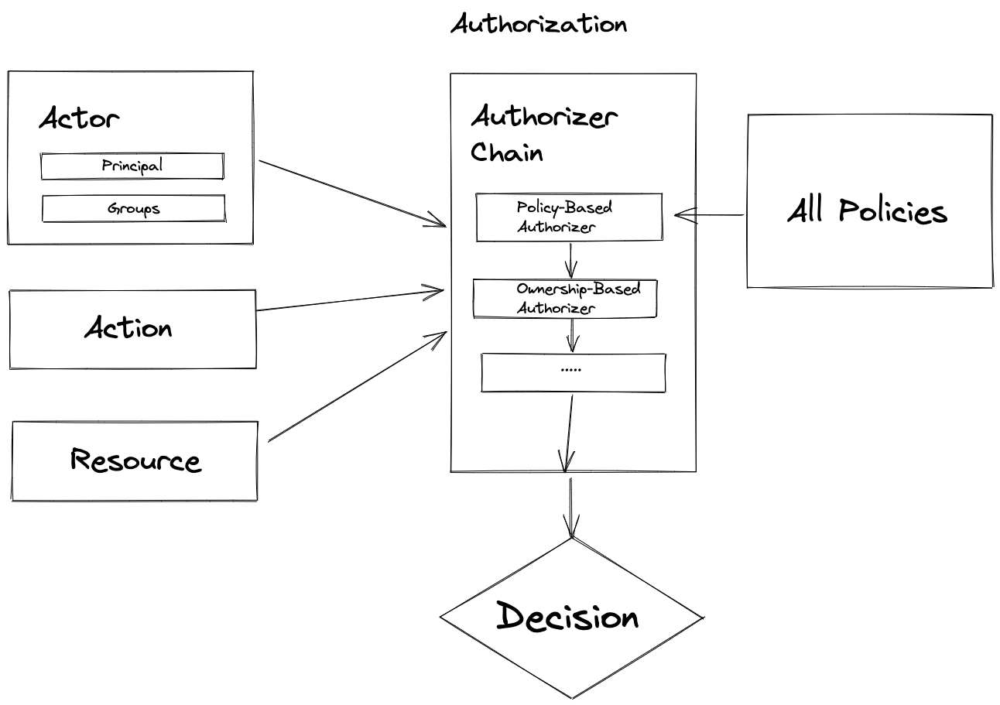

# RBAC: Fine-grained Access Controls in DataHub 

## Abstract

Access control is about managing what operations can be performed by whom. There are 2 broad buckets comprising access control:

- **Authentication**: Logging in. Associating an actor with a known identity.
- **Authorization**: Performing an action. Allowing / denying known identities to perform specific types of operations.

Over the past few months, numerous requests have surfaced around controlling access to metadata stored inside DataHub. 
In this doc, we will propose a design for supporting pluggable authentication along with fine-grained authorization within DataHub's backend (GMS).

## Requirements

We will cover the use cases around access control in this section, gathered from a multitude of sources.

### Personas

This feature is targeted primarily at the DataHub **Operator** & **Admin** personas (often the same person). This feature can help admins of DataHub comply with their respective company policies.

The secondary beneficiary are **Data Users** themselves. Fine-grained access controls will permit Data Owners, Data Stewards to more tightly control the evolution of the metadata under management. It will also make it more difficult to make mistakes while changing metadata, such as accidentally overriding / removing good metadata authored by someone else.

### Community Asks

Sheetal Pratik (Saxo Bank)

**Asks**

- Model metadata "domains" (ie. resource scopes, namespaces) using DataHub
- Define access policies that are scoped to a particular domain 
- Ability to define policies against DataHub resources at the following granularities: 
    - individual resource (primary key based)
    - resource type (eg. all 'datasets')
    - action (eg. VIEW, UPDATE)
    which can be associated with requests against DataHub backend via mapping from resolved Actor information (principal / username, groups, etc). 
    Resources can include entities, their aspects, access policies, etc. 
- Ability to compose & reuse groups of access policies.  
- Support for integrating with Active Directory (users, groups, and mappings to access policies)

Alasdair McBride (G-Research)

**Asks**

- Ability to organize multiple assets into groups and assign bucketed policies to these groups. 
- Ability to define READ / UPDATE / DELETE policies against DataHub resources at the following granularities:
    - individual resource (primary key based)
    - resource type (eg. all 'datasets')
    - resource group 
      which can be associated with requests against DataHub backend via mapping from resolved Actor information (principal / username, groups, etc).
      Resources can include entities, their aspects, roles, policies, etc.
- Support for service principals 
- Support for integrating with Active Directory (users, groups, and mappings to access policies)


As you may have noticed, the concepts of "domain" and "group" described in each set of requirements are quite similar. From here
on out, we will refer to a bucket of related entities that should be managed together as a metadata "domain".

### User Stories

|As a...          |I want to..                                                                                         |Because..                                                                                                                                       |
|-----------------|----------------------------------------------------------------------------------------------------|------------------------------------------------------------------------------------------------------------------------------------------------|
|DataHub Operator |Restrict the types of metadata that certain teams / individuals can change.                         |Reduce the changes of mistakes or malicious changes to metadata. Improve quality of metadata by putting it in the hands of the most knowledgable|
|DataHub Operator |Restrict the types of metadata that certain teams / individuals can view.                           |Reduce the risk of falling out of compliance by displaying sensitive data in the Metadata UI (sample data values & beyond)                      |
|DataHub Operator |Grant the ability to manage access policies to other users of DataHub.                              |I want to delegate this task to individual team managers. (Large org)                                                                           |
|DataHub Operator |Define bounded contexts, or "domains", of related metadata that can be access controlled together   |I want to empower teams with most domain knowledge to manage their own access controls.                                                         |
|DataHub Operator |Map users & groups from 3rd party identity providers to resolved access policies                    |I want to reuse the identity definitions that my organization already has                                                                       |
|DataHub Operator |Create identities for services and associate them with policies. (service principals)               |I want to access DataHub programmatically while honoring with restricted access controls.                                                       |
|DataHub User     |Update Metadata that I know intimately. For example, table descriptions.                            |I want to provide high-quality metadata to my consumers.                                                                                        |


### Concrete Requirements

#### Must Haves

a. a central notion of "authenticated user" in the DataHub backend (GMS).

b. pluggable authentication responsible for resolving DataHub users 
    
- in scope: file-based username password plugin (for built-in roles), continue to support OIDC 
- in the future: saml, ldap / ad, api key, native authentication plugins

c. ability to define fine-grained access control policies based on a combination of

- actors: the users + groups the policy should be applied to (with ability to specify "all users" or "all groups")
- resource type: the type of resource being accessed on the DataHub platform (eg. dataset entity, dataset aspect, roles, privileges etc) (exact match or ALL)
- resource identifier: the primary key identifier for a resource (eg. dataset urn) (support for pattern matching)
- action (bound to resource type. eg. read + write)
- [in the future] domains

with support for optional conjunctions of filtering on resource type, & identifier (eg. resource type = "entity:dataset:ownership", resource identifier = "urn:li:dataset:1", action = "UPDATE") 
and including with support for the following resource types:

- metadata entities: datasets, charts, dashboards, etc. 
- metadata aspects: dataset ownership, chart info, etc. 
- access control objects: access policies, etc.

d. ability to resolve DataHub users to a set of access policies 
    
- where User metadata includes principal name, group names, freeform string properties

e. ability to manage access policies programmatically via Rest API

f. ability to enforce fine-grained access control policies (ref.b) (Authorizer implementation)
- Inputs: resolved access policies, resource type, resource key

#### Nice to Haves

a. policies that are tied to arbitrary attributes of a target resource object. (full ABAC)

b. ability to manage access policies via React UI

c. domain-partitioned access controls (asigning domains to all DH assets + then allowing policies including domain-based predicates) 

### What success looks like

Based on the requirements gathered from talking with folks in the community, we decided to rally around the following goal. It should be possible to 

1. Define a named access control policy 
    - Resource Granularity: individual, asset type 
    - Action Granularity: VIEW, UPDATE
    against an individual or group of DataHub resources (entities, aspects, roles, policies)
2. Define mapping conditions from an authenticated user (DataHub user, groups) to one or more access policies

Within 15 minutes or less.


## Implementation

This section will outline the technical solution proposed to address the stated requirements. 

### In Scope

- Pluggable **Authentication** at GMS layer.
- **Access Management** at GMS layer.
- **Authorization** at GMS layer.

#### API-based Role Management

We aim to provide a rich API for defining access control policies. A default admin policy will be the `datahub` account.
New users will be automatically assigned to a configurable "default" policy.

### Out of Scope

#### UI-based Role Management

Eventually, we aim to provide an in-app experience for defining access policies. This, however, is not in scope of the first milestone deliverable.

#### Support for Dynamic Local Username / Password Authentication

Initially, we aim to support limited local username / password authentication driven by a configuration file provided to GMS. We will not support persisting sessions, hashed passwords, groups to a native store inside DataHub (yet).

#### Support for LDAP & AD Username / Password Authentication

Though the APIs we are building *will* be amenable to supporting both Active Directory and LDAP authentication (discussed more below) we will not include implementation of these plugins as part of the scope of the initial impl, as we will use this as an opportunity to focus on getting the foundational aspects of access management right. 

#### Modeling Domains in DataHub

As part of *this* particular initiative, we will omit from scope implementation of the domains, or sub-scopes / namespaces
tied to resources on DataHub. However, we aim to design a system suitable which can accommodate policies based on domain
predicates in the future.

### Concepts

We propose the introduction of the following concepts into the DataHub platform. 

1. **Actor**: A user or system actor recognized by DataHub. Defined by a unique **principal** name & an optional set of *group* names. In practice, an authenticated actor will be identified via a CorpUser urn. (`urn:li:corpuser:johndoe`)
    1. **Principal**:  A unique username associated with an actor. (Captured via a CorpUser urn)
    2. **Groups**: A set of groups that a user belongs to. (Captured via CorpGroup urns)
2. **Resource**: Any resource that can be access controlled on the DataHub platform. Examples include Entities, Relationships, Roles, etc. Resources can include
   - Type: the unique type of the resource on DataHub's platform.
3. **Policy**: A fine-grained access control rule comprised of target actors, resource type, a resource reference, and an action (specific to a resource type, eg. Read, Read / write)
    - Actors: Who the policy applies to (users + groups)
    - Action: CREATE, READ, UPDATE, DELETE
    - Match Criteria: resource type, reference filter

### Components

#### DataHub Backend (datahub-gms)

GMS will be augmented to include

1. a set of Auth-related primary store tables. (SQL) 
2. a set of Auth-related Rest APIs.
3. an Authentication Filter executed on each request to GMS.
4. an Authorizer component executed within endpoints to authorize particular actions. 

**Auth Tables & Endpoints**

1. *Policies*: Create, Read, Update fine-grained access policies.

```
// Create a policy.
POST /gms/policy

{  
    name: "manage_datasets_msd",
    users: ["urn:li:corpuser:johndoe", "urn:li:corpuser:test"],
    groups: ["urn:li:corpGroup:eng_all"],
    actions: ["VIEW_AND_UPDATE"],
    resource: {
        type: "ENTITY",
        attributes: {
            entity: "dataset",
            urn: ["*"],
        }
    },
    // optional, defaults to "true"
    allow: "true"
}
```

In the above example, we are creating an access policy that permits reads & writes against the
"ownership" aspect of the "dataset" entity. There are a few important pieces to note:

1. Name - All policies are named
2. Users / Groups - The users and groups the policy should apply to. Can be wildcard for all. 
3. Action - The action to be permitted or denied. We will initially ship with ("VIEW", "VIEW_AND_UPDATE")
4. Resource - The resource filters. The resource that the action is being requested against. Examples can be specific metadata assets, 
policies, operator stats and more.
5. Allow - A flag determining whether to allow the action on a match of user / group, action, and resource filters. 

Notice the use of a resource type along with resource-type-specific attributes. These
attributes will serve as matching criteria for resource specifications passed into an Authorizer component at runtime. 
Also note that policy attribute fields will support wildcard matching. 

The attributes section of the policies provides a mechanism for extension in the future. For example, adding a "domain" qualification
to a resource, and defining policies that leverage the domain attribute would be simply a matter of adding to the resource attributes. 

An additional "allow" flag will be supported to determine whether the action against the specified resource should be allowed or denied. 
This will default to "true", meaning that the action should be permitted given that the actor, action, and resource types match the policy. 

At authorization time, users will be resolved to policies by matching the user + groups specified in the policy against the authenticated user.
Moreover, resource specs will be constructed by the code invoking the authorization component and matched against the resource
filters defined within the policies. 

2. *Tokens*:

Tokens are used for **authentication** to GMS. They can be retrieved given authentication via another means, such as username / password auth. 

- `/generateTokenForActor`: Generates a signed, Oauth-compliant GMS access token+refresh token pair based on **provided principal, group, metadata**. Caller must be authorized to use this functionality.
- `/generateToken`: Generates a signed, OAuth-compliant GMS access token + refresh token pair **based on the currently authenticated actor**.

**Auth Filter**

The auth filter will be a configurable Rest filter that executes on each request to GMS.

Responsibility 1: Authentication

*Authenticator Chain* 

Inside the filter will live a configurable chain of "Authenticators" that will be executed in sequence with the goal of resolving a standardized "Actor" object model, which will contain the following fields:

1. `principal` (required): a unique identifier used on DataHub, represented as a CorpUser urn
2. `groups` (optional): a list of groups associated with the user, represented as a set of CorpGroup urns

Upon resolution of an "Actor" object, the authentication stage will be considered complete.

Responsibility 2: Saving to Thread Context

After resolving the authenticated user, the state of the Actor object will be written to the local ThreadContext, from which it will be retrieved to perform Authorization.

**Authorizer**

The authorizer is a component that will be called by endpoints + services internal to GMS in order to authorize a particular action, e.g. editing an entity, relationship, or permission.

It will accept the following arguments:

1. The resource spec: 
    - resource type
    - resource attributes 
2. The action being attempted on the resource
3. The actor attempting the action

and perform the following steps:

1. Resolve the Actor to a set of relevant access policies
2. Evaluate the fetched policies against the inputs 
3. If the Actor is authorized to perform the action, allow the action.
4. If the Actor is not authorized to perform the action, deny the action.



The authorizer will additionally be designed to support multiple authorizer filters in a single authorizer chain. 
This permits the addition of custom authorization logic in the future, for example for resolving "virtual policies" based on
edges in the metadata graph (discussed further below)

#### DataHub Frontend (datahub-frontend)

DataHub frontend will continue to handle much of the heavy lifting when it comes to OIDC SSO for the time being. However, the specific details of both OIDC and username / password authentication will be slightly different going forward.


##### Case 1: OIDC

DataHub frontend will continue to handle OIDC authentication by performing redirects to the Identity Provider and handling the callback from the Identity Provider for backwards compatibility. What occurs after authentication on the Identity Provider is what will change.

After successful authentication with an IdP, DataHub frontend will perform the following steps on `/callback` :

1. Contact a protected "generateTokenForUser" endpoint exposed by GMS to generate an access token and refresh token from a principal & set of groups extracted from the IdP UserInfo. In this call, `datahub-frontend` will identify itself using a service principal that will come preconfigured in GMS, allowing it the ability to generate a token on behalf of a user on demand. In this world, `datahub-frontend` is considered a highly trusted party by GMS.
2. Set the access + refresh tokens in cookies returned the the UI client.

For all subsequent calls, `datahub-frontend` will be expected to validate the authenticity of the GMS-issued access token using a public key provided in its configuration. This public key must match the private key that GMS uses to generate the original access token.

Upon expiration of the access token, `datahub-frontend` will be responsible for fetching a new access token from GMS and updating client side cookies. (In the datahub-frontend auth stage)



##### Case 2: Username / Password

In the case of username / password authentication, `datahub-frontend` will do something new: it will call a "generateToken" endpoint in GMS with a special Authorization header containing basic authentication - the username and password provided by the user on the UI.

This endpoint will validate the username / password combination using an **Authenticator** (by default one will exist to validate the "datahub" super user account) and return a pair of access token, refresh token to datahub-frontend. DataHub frontend will then set these as cookies in the UI and validate them using the same mechanism as discussed previously.

This allows us to evolve GMS to include LDAP, AD, and native username / password Authenticators while keeping **datahub-frontend** the same.



In the future, we will be able to easily add support for remote username / password authentication, such as using an LDAP / AD directory service. The call flow in such cases is shown below


##### Summary

On login, datahub-frontend will *always* call GMS to get an access token + refresh token. These will then serve as the credentials for both datahub-frontend, who will do lightweight validation on the token, and GMS who will handle authorization based on the principal + groups associated with the token.

It is the intention that GMS eventually take the heavy lifting of *all* authentication, including OIDC and SAML authentication, which both require a UI component. It will have a set of APIs that `datahub-frontend` will be able to use to perform the correct SSO redirects and validation endpoints for creating GMS tokens on successful login.

Because this means implementing OpenID Connect (OIDC) specification at the GMS layer as well as adding a host of new apis between datahub-frontend and GMS, we've decided to delay moving full OIDC responsibility to GMS at this time. This will be part of a followup phase 2 milestone on the auth track.

In the future, we imagine 3 cases that the `frontend` server will have to handle in different ways:

- OIDC
- SAML
- username / password

In contrast, GMS will have to know about the finer details of each, for example the ability to authenticate usernames and passwords using LDAP/AD, native (local db), or file-based credential stores.

### Milestones

**Milestone 1**

- The first version of all components described above are implemented. Basic authenticators implemented 
        a. gms issued oauth tokens
        b. file-based username / password combinations
- Support Entity-level policy granularity (no aspect level, yet)
- Support enforcement of write-side policies. (VIEW_AND_UPDATE actions)
- Support "default" access control policy with limited customization capability (allow VIEW on all resources as the default access control policy)
- Configurable ownership-based authorizer 

**Milestone 2**

- Support enforcement of read-side policies. (VIEW actions)
- Add support for associating each resource stored within DataHub with a particular domain. Permit domain-based predicates in policies. 
- Add UI for managing access policies 

**Milestone 3**

a. OpenLDAP authenticator impl
b. Active Directory authenticator impl
c. SAML authenticator impl

## Bonus 1: Modeling - To Graph or Not

### Risks with modeling on the Graph

- No strong read-after-write consistency based on non-primary keys 
    - Don't think this will be common given that the name is the primary key and likely what folks will query by. 
- Philosophy: Are "policies" really *metadata*? Do they belong on the metadata graph?
    - Should policies be retrievable on the "/entities" endpoint 
    - Should there be a separate, internal DataHub system graph? Stored in separate mysql table?
- Query pattern: Is the query pattern drastically different than for other entities? Policies will often be "read all" and cached.
- If we need to migrate away from the graph, we'd need to do a data migration from aspects table to another table.

### Benefits of modeling on the Graph

- Can reuse existing APIs for searching, fetching, searching, creating etc.
- Less boilerplate code. No hardcoded tables. We will still want a specific REST api for managing policies, however. 

## Bonus 2: The Ownership Question

The ownership question: How can we support the requirement that "owners should be allowed to edit the resources they own". We can do so using pluggable Authorizers.

Possible solution: Pluggable Authorizer chain. 



We plan to implement an "Ownership Authorizer" that is responsible for resolving an entity to their
ownership information and generating a "virtual policy" that allows asset owners to make changes to the 
entities they own. 

An alternate solution is to permit an additional flag inside a policy that marks it as applying to "owners"
of the target resource. The challenge here is that not all resource types are guaranteed to have owners in the first place. 

## References

In the process of writing this ERD, I researched the following systems to learn & take inspiration:

- Elasticsearch
- Pinot
- Airflow
- Apache Atlas
- Apache Ranger
