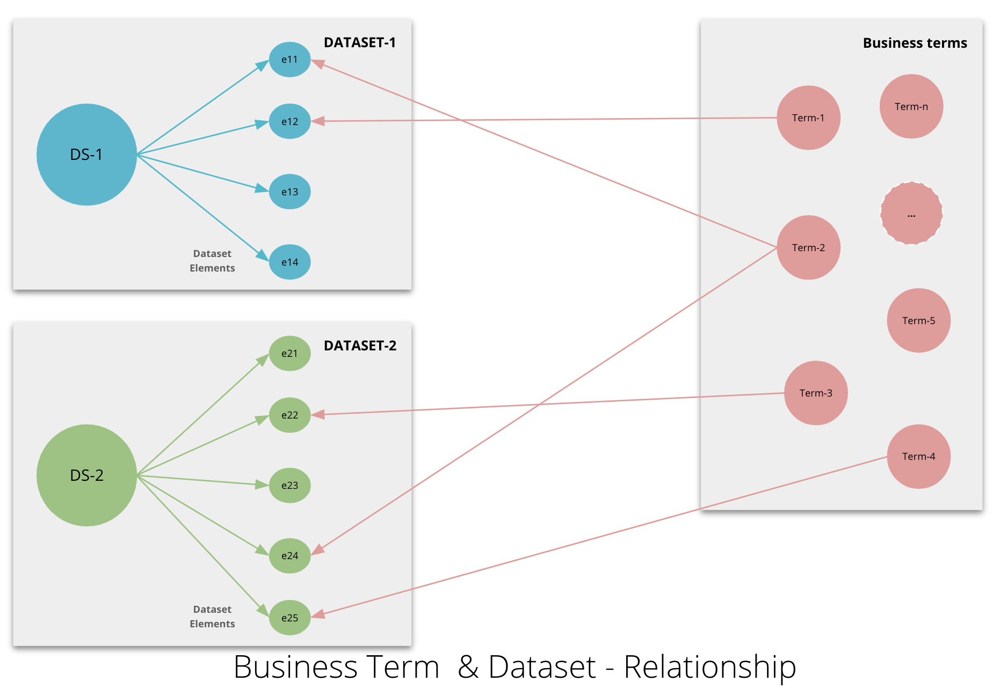

- Start Date: 08/28/2020
- RFC PR: <>
- Implementation PR(s): <>

# Business Glossary

## Summary

Adding Support for Business Glossary enhances the value of metadata and brings the business view. This helps to document the bsuiness terms used across the business and provides the common vocabulary to entire data stakeholders/community. This encourages/motivates the business community to interact with Data Catalog to discsover the relevant data asets of interest. This also enables find the relationship in the data assets through business terms that belong to them. This following link illisutates the importance of business glossary [article](https://dataedo.com/blog/business-glossary-vs-data-dictionary).

## Motivation

We need to model Business Glossary, where business team can define the business terms and link them to the data elements being onboarded to Data Platforms/data catalogs. This gives the following benefits :
- Define and enable common vocabulary in the organizations and enable easy colloborations with the bsuiness & technical comunities
- Organizations can leverage the existing industry taxanomies where they can import the definitions and can enhance or define there specific terms/definitions
- the crux and use of business glossary will be by linking the dataset/elements to Business Terms, so that business/consumers can discover the intersted datsets easily with the helps of business terms
- Promote the usage and reduce the redundancy: Business Glossary helps to dicsover the datasets quickly through business terms and this also helps reducing unnessary onboarding the same/similar datasets by different consumers. 

## Detailed design

### What is Business Glossary 
**Business Glossary**, is a list of business terms with their definitions. It defines business concepts for an organization or industry and is independent from any specific database or platform or vendor.

**Data Dictionary** is a description of a data set, provides the details about the attributes and data types

### Relationship 
Even though Data Dictionary and Business Glossary are separate entities, they work nicely together to describe different aspects and levels of abstraction of the data environment of an organization.
Business terms can be linked to specific entities/tables and columns in a data asset/data dictionary to provide more context and consistent approved definition to different instances of the terms in different platforms/databases.


### Sample Business Glossary Definition
|URN|Business Term |Definition  | Domain | Owner | Ext Source| URI | Ext Reference |
|--|--|--|--|--|--|--|--|
|urn:li:businessTerm:(instrument.cashInstrument) | instrument.cashInstrument| time point including a date and a time, optionally including a time zone offset| Foundation | abc@domain.com | fibo | fibo-fbc-fi-fi:CashInstrument|https://spec.edmcouncil.org/fibo/ontology/FBC/FinancialInstruments/FinancialInstruments/CashInstrument |
|urn:li:businessTerm:(common.dateTime) | common.dateTime| a financial instrument whose value is determined by the market and that is readily transferable (highly liquid)| Finance | xyz@domain.com | fibo | fibo-fnd-dt-fd:DateTime|https://spec.edmcouncil.org/fibo/ontology/FND/DatesAndTimes/FinancialDates/DateTime |
|urn:li:businessTerm:(market.bidSize) | market.bidSize| The bid size represents the quantity of a security that investors are willing to purchase at a specified bid price| Trading | xyz@domain.com | - | - |- | - |
|--|--|--|--|--|--|--|--|
| | | | | | | | |

### Business Term  & Dataset - Relationship

| Attribute Name| Data Type| Nullable?| **Business Term**| Description|
|--|--|--|--|--|
| recordId| int| N| | |n the case of FX QuoteData the RecordId is equal to the UIC from SymbolsBase|
| arrivalTime| TimestampTicks| N| | Time the price book was received by the TickCollector. 100s of Nanoseconds since 1st January 1970 (ticks)|
| bid1Price| com.xxxx.yyy.schema.common.Price| N| **common.monetoryAmount**|The bid price with rank 1/29.|
| bid1Size| int| N| market.bidSize| The amount the bid price with rank 5/29 is good for.|
|--|--|--|--|--|--|--|
| | | | | | | |

### Stiching Together


Business Glossary will be a first class entity where one can define the business terms and this will be similar to entities like Dataset, CorporateUser etc.
Then extending the Dataset's aspect SchemaMetadata, that will be extending the SchemaField model to capture urn of the business term (optional).



The above diagram illustrates the how business glossary will be connected to other entities. Business terms are modelled as BusinessTerm entity and example business terms are `Term-1`, `Term-2`, .. `Term-n`. In the above digram from dataset (`DS-1`) element `e11` is linked to busines term `Term-2` and `e12` is linked to `Term-1`. At the same time from Dataset (`DS-2`) element `e24` linked the business term `Term-2`, `e22` with `Term-3` and `e24` with `Term-4`.

### URN Representation
We'll define a [URNs](../../../what/urn.md): `BusinessTermUrn`.
These URNs should allow for unique identification of business term.  

A business term  URN will look like below:
```
urn:li:businessTerm:(<<namespace>>,<<name>>)
```


### Entities
There will be 1 top level GMA [entities](../../../what/entity.md) in the design: businessTerm (Business Glossary).
It's important to make businessTerm as a top level entity because it can exist without Dataset and can be definied independentantly by business team.

### Business Term metadata
- Model properties: Basic information about the ML Busines Term
  - name : name of the business term
  - definition : definition of the Business Term
  - sourceType : enum type (Internal or External], source of the Business Term
  - sourceURI : source URI 
  - sourceRef : URL of the business term external reference
  - namespace : Helps to organize the business terms as groups (e.g: domain can be defined as namespace)
  - Ownership : This provides the owenership to business terms (to track who manages/owner of the business term). 

### Extending SchemaField 
Need to extend the SchemaField type to capture additional businessTerm relation. Listing the fields including the existing elements
- fieldPath: SchemaFieldPath
- jsonPath: optional string
- nullable: boolean = false
- description: optional string
- type: SchemaFieldDataType
- nativeDataType: string
- recursive: boolean = false
- businessTerm: Urn


### Metadata graph

This might not be a crtical requirement, but nice to have.

1. User should be able to search for Business Term and would like to see all the Datasets that has elements that linked to that Business term. 

## How we teach this

We should create/update user guides to educate users for:
 - Importance and value that Business Glossary bringng to the Data Catalog
 - Search & discovery experience through business terms (how to find a relevant datasets quickly in DataHub)

## Alternatives
* [] Todo


## Rollout / Adoption Strategy

The design is supposed to be generic enough that any user of DataHub should easily be able to onboard their Business Glossary (list of terms and definitions) to DataHub irrespective of their industry. Some organizations can subscribe/download industry stadard taxanomy with slight modelling and integration should be able to bring the bsuiness glossary quickly

While onboarding datasets, business/tech teams need to link the business terms to the data elements, once users see the value of this will be motivated to link the elements with appropriate business terms.

## Unresolved questions

- This RFC does not cover the UI design for Business Glossary Definition.
