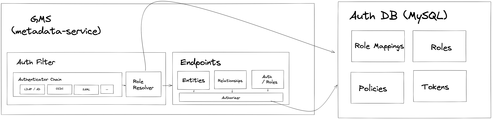

# RBAC: Fine-grained Access Controls in DataHub 

## Abstract

Access control is about managing what operations can be performed by whom. There are 2 broad buckets comprising access control:

- **Authentication**: Logging in. Associating an actor with a known identity.
- **Authorization**: Performing an action. Allowing / denying known identities to perform specific types of operations.

Over the past few months, numerous requests have surfaced around controlling access to metadata stored inside DataHub. 
In this doc, we will propose a design for supporting pluggable authentication along with fine-grained authorization within DataHub's backend (GMS).

## Requirements

We will cover the use cases around access control in this section, gathered from a multitude of sources.

### Personas

This feature is targeted primarily at the DataHub **Operator** & **Admin** personas (often the same person). This feature can help admins of DataHub comply with their respective company policies.

The secondary beneficiary are **Data Users** themselves. Fine-grained access controls will permit Data Owners, Data Stewards to more tightly control the evolution of the metadata under management. It will also make it more difficult to make mistakes while changing metadata, such as accidentally overriding / removing good metadata authored by someone else.

### Community Asks

Sheetal Pratik (Saxo Bank)

**Asks**

- Model metadata "domains" (ie. resource scopes, namespaces) using DataHub
- Define roles that are scoped to a particular domain 
- Ability to define policies against DataHub resources at the following granularities: 
    - individual resource (primary key based)
    - resource type (eg. all 'datasets')
    - action (eg. VIEW, UPDATE)
    which can be associated with requests against DataHub backend via mapping from resolved Actor information (principal / username, groups, etc). 
    Resources can include entities, their aspects, roles, policies, etc. 
- Ability to compose & reuse groups of access policies.  
- Support for integrating with Active Directory (users, groups, and mappings to access policies)

Alasdair McBride (G-Research)

**Asks**

- Ability to organize multiple assets into groups and assign bucketed policies to these groups. 
- Ability to define READ / UPDATE / DELETE policies against DataHub resources at the following granularities:
    - individual resource (primary key based)
    - resource type (eg. all 'datasets')
    - resource group 
      which can be associated with requests against DataHub backend via mapping from resolved Actor information (principal / username, groups, etc).
      Resources can include entities, their aspects, roles, policies, etc.
- Leverage DataHub backend APIs to discover metadata assets programmatically using service principals. 
- Support for integrating with Active Directory (users, groups, and mappings to access policies)


As you may have noticed, the concepts of "domain" and "group" described in each set of requirements are quite similar. From here
on out, we will refer to a bucket of related entities that should be managed together as a metadata "domain".

### Consolidated User Stories

|As a...          |I want to..                                                                                         |Because..                                                                                                                                       |
|-----------------|----------------------------------------------------------------------------------------------------|------------------------------------------------------------------------------------------------------------------------------------------------|
|DataHub Operator |Restrict the types of metadata that certain teams / individuals can change.                         |Reduce the changes of mistakes or malicious changes to metadata. Improve quality of metadata by putting it in the hands of the most knowledgable|
|DataHub Operator |Restrict the types of metadata that certain teams / individuals can view.                           |Reduce the risk of falling out of compliance by displaying sensitive data in the Metadata UI (sample data values & beyond)                      |
|DataHub Operator |Grant the ability to manage access policies to other users of DataHub.                              |I want to delegate this task to individual team managers. (Large org)                                                                           |
|DataHub Operator |Define bounded contexts, or "domains", of related metadata that can be access controlled together   |I want to empower teams with most domain knowledge to manage their own access controls.                                                         |
|DataHub Operator |Map users & groups from 3rd party identity providers to resolved access policies                    |I want to reuse the identity definitions that my organization already has                                                                       |
|DataHub Operator |Create identities for services and associate them with policies. (service principals)               |I want to access DataHub programmatically while honoring with restricted access controls.                                                       |
|DataHub User     |Update Metadata that I know intimately. For example, table descriptions.                            |I want to provide high-quality metadata to my consumers.                                                                                        |


### Concrete Requirements

#### Must Haves

a. a central notion of Actor identity in the DataHub backend (GMS).

b. pluggable authentication responsible for resolving DataHub Actors 
    
- in scope: file-based username password plugin (for built-in roles), continue to support OIDC 
- in the future: saml, ldap / ad, api key, native authentication plugins

c. ability to define logical access control policies based on a combination of

- resource type: the type of resource being accessed on the DataHub platform (eg. dataset entity, dataset aspect, roles, privileges etc) (exact match or ALL)
- resource identifier: the primary key identifier for a resource (eg. dataset urn) (support for pattern matching)
- action (bound to resource type. eg. read + write) 

with support for optional conjunctions of filtering on resource type, & identifier (eg. resource type = "entity:dataset:ownership", resource identifier = "urn:li:dataset:1", action = "UPDATE") 
and including with support for the following resource types:

- metadata entities: datasets, charts, dashboards, etc. 
- metadata aspects: dataset ownership, chart info, etc. 
- access control objects: roles, policies, etc.

d. ability to define named roles that can be associated with fine-grained access control policies

e. ability to configure mapping rules from DataHub Actors to named roles
    
- where Actor = (principal name, group names, freeform string properties) 

g. ability to manage roles, role mappings, policies dynamically via Rest API

h. ability to enforce fine-grained access control policies (ref.b) (Authorizer implementation)
- Inputs: resolved roles, role-policy mappings, resource type, resource key

#### Nice to Haves

a. policies that are tied to arbitrary attributes of a target resource object.

b. ability to manage roles, role mappings, policies via React UI

### What success looks like

Based on the requirements gathered from talking with folks in the community, we decided to rally around the following goal. It should be possible to 

1. Define a new access control policy 
    - Resource Granularity: individual, asset type 
    - Action Granularity: VIEW, UPDATE
    against an individual or group of DataHub resources (entities, aspects, roles, policies)
2. Define a named role, which maps to the access control policy
3. Define a configurable mapping from an authenticated Actor (DataHub user, groups) to one or more roles

Within 15 minutes or less. (dynamic)

Notice that we've omitted inclusion of

- introducing a new resource type
- introducing a new action type 

in the same amount of time. These should, however, be possible to change in code given sufficient development time. (static)
  

## Implementation

This section will outline the technical solution proposed to address the stated requirements. 

### In Scope

- Pluggable **Authentication** at GMS layer.
- **Access Management** at GMS layer. (Roles, Policies, Role Mappings)
- **Authorization** at GMS layer.

#### API-based Role Management

We aim to provide a rich API for defining privileges, roles, & role mappings. The default admin will be the `datahub` account.

### Out of Scope

#### UI-based Role Management

Eventually, we aim to provide an in-app experience for defining policies, roles, and mappings between roles and users / groups. This, however, is not in scope of the first milestone deliverable.

#### Support for Dynamic Local Username / Password Authentication

Initially, we aim to support limited local username / password authentication driven by a configuration file provided to GMS. We will not support persisting users, hashed passwords, groups to a native store inside of DataHub (yet).

#### Support for LDAP & AD Username / Password Authentication

Though the APIs we are building *will* be amenable to supporting both Active Directory and LDAP authentication (discussed more below) we will not include implementation of these plugins as part of the scope of the initial RBAC impl, as we will use this as an opportunity to focus on getting the foundational aspects of access management right. 

#### Modeling Domains in DataHub

As part of *this* particular initiative, we will omit from scope implementation of the domains, or sub-scopes / namespaces
tied to resources on DataHub. However, we aim to design a system suitable which can accommodate policies based on domain
predicates in the future.

### Concepts

We propose the introduction of the following concepts into the DataHub platform. 

2. **Actor**: A user or system actor recognized by DataHub. Defined by a unique **principal** name. Can be associated with **Roles**.
    1. **Principal**:  A unique identifier associated with an actor. This is effectively a username.
    2. **Group**: A group that a user may belong to. Can be associated with **Roles**.
3. **Resource**: Any resource that can be access controlled on the DataHub platform. Examples include Entities, Relationships, Roles, etc.
4. **Policy**: A fine-grained access control rule comprised of a resource type, a resource reference, and an action (specific to a resource type, eg. Read, Read / write)
    - Action (CREATE, READ, UPDATE, DELETE)
    - Match Criteria (resource type, reference filter)
5. **Role**: A named group of privileges. Eg. Admin, User 
6. **Role Mapping**: A mapping from a resolved Actor to one or more role(s), which dictate what they can do on the platform.

### Components

#### DataHub Backend (datahub-gms)

GMS will be augmented to include

1. a set of Auth-related primary store tables. (SQL) 
2. a set of Auth-related Rest APIs.
3. an Authentication Filter executed on each request to GMS.
4. an Authorizer component leveraged within endpoint impls. 

**Auth Tables & Endpoints**

1. *Policies*: Create, Read, Update fine-grained access policies.

```
// Create a policy.
POST /gms/policy

{  
    name: "manage_datasets_msd",
    actions: ["VIEW, UPDATE"]
    resource: {
        type: "ENTITY_ASPECT",
        urn: "urn:li:dataset:*"
        params: {
            entity: "dataset",
            aspect: "ownership"
        }
    }
}
```

In the above example, we are creating an access policy that permits reads & writes against the
"ownership" aspect of the "dataset" entity. Notice the use of a resource type, a resource reference (urn) that
supports wildcard (& regex) matching, and a set of parameters used for additional filtering. 

2.  *Roles*: Create, Read, Update Roles.

- Accepts a name and list of Privileges,

```
// Create a role.
POST /gms/role

{  
     name: "admin_msd",
     privileges: ["manage_datasets_msd", ....] 
}
```

3. *RoleMappings*: Create, Read, Update the mapping rules from Actor to Role.

Role mappings help answer the question: "what roles are assigned to a user or group?". This is turn allows us to understand the privileges that the Actor making a request should have, ie. what actions we should permit them to perform.

```
// Create a role mapping.
POST /gms/roleMapping

{  
    roles: ["admin_msd"],
    rules: [ // How to map Actor to the roles. 
        {
            "authenticator": "ldap", 
            "field": {
                "name": "groups", 
                "pattern": "cn=users,dc=example,dc=com" // match any in "groups" array 
            }
        },
        {
            "field": {
                "name": "principal", 
                "pattern": "johndoe"
            }
        }
    ] 
}
```

In the example above, actors who are in the group "cn=users,dc=example,dc=com" **AND** who authenticated via the "ldap" Authenticator, **OR** are named "johndoe" would be mapped to the role "admin_msd".

You can create more than one mapping for a particular role, of course.

At execution time, you are correct to think that each rule would need to be executed against the Actor object in order to resolve roles. We will require some caching here to make this more performant. Open to suggestions about how to handle this.

4. *Tokens*:

- `/generateTokenForActor`: Generates a signed, Oauth-compliant GMS access token+refresh token pair based on **provided principal, group, metadata**. Caller must be authorized to use this functionality.
- `/generateToken`: Generates a signed, Oauth-compliant GMS access token + refresh token pair **based on the currently authenticated actor**.

**Auth Filter**

The auth filter will be a configurable Rest filter that executes on each request to GMS.

Responsibility 1: Authentication

*Authenticator Chain* 

Inside the filter will live a configurable chain of "Authenticators" that will be executed in sequence with the goal of resolving a standardized "Actor" object model, which will contain the following fields:

1. `principal` (required): a unique identifier used on DataHub
2. `groups` (optional): a list of groups associated with the user
3. `metadata` (optional): freeform map of metadata properties that can be used when performing role mapping.

Upon resolution of an "Actor" object, the authentication stage will be considered complete, and we will move into the "role resolution" phase.

Responsibility 2: Role Resolution

After resolving an Actor, the filter will perform Role Resolution, wherein the Actor is enriched with a set of resolved roles (list of strings). 

Specifically, we will introduce a `RoleMapper` object that includes the following capabilities: 

1. Maintain an in-memory cache of all stored Role Mappings
    - Refreshes on role mapping updates + on a configurable interval 
2. Evaluates role mappings rules against a resolved Actor object
3. Maintain an in-memory cache of resolved Actor roles 

This will be used within an **Authorizer** to authorize a particular action request.

TBD: Whether role resolution will occur within or outside individual Authenticators. 

Responsibility 3: Saving to Thread Context

After resolving roles, the state of the "Actor" object will be updated to include those roles, and the Actor object will be written to the local ThreadContext, from which it will be retrieved to perform Authorization.

**Authorizer**

The authorizer is a component that will be called by endpoints + services internal to GMS in order to authorize a particular action, e.g. editing an entity, relationship, or permission.

It will accept the following arguments:

1. The resource type being acted on
2. The resource ref being acted on 
3. The action being attempted

and perform the following steps:

1. Extract the current Actor from the local context
2. Query the "policies" table for the policies associated with the user's roles, filtered by the resource type being accessed 
3. Evaluate the fetched policies against the inputs 
3. If the Actor is authorized to perform the action, allow the action.
4. If the Actor is not authorized to perform the action, deny the action.



#### DataHub Frontend (datahub-frontend)

DataHub frontend will continue to handle much of the heavy lifting when it comes to OIDC SSO for the time being. However, the specific details of both OIDC and username / password authentication will be slightly different going forward.


##### Case 1: OIDC

DataHub frontend will continue to handle OIDC authentication by performing redirects to the Identity Provider and handling the callback from the Identity Provider for backwards compatibility. What occurs after authentication on the Identity Provider is what will change.

After successful authentication with an IdP, DataHub frontend will perform the following steps on `/callback` :

1. Contact a protected "generateTokenForUser" endpoint exposed by GMS to generate an access token and refresh token from a principal & set of groups extracted from the IdP UserInfo. In this call, `datahub-frontend` will identify itself using a service principal that will come preconfigured in GMS, allowing it the ability to generate a token on behalf of a user on demand. In this world, `datahub-frontend` is considered a highly trusted party by GMS.
2. Set the access + refresh tokens in cookies returned the the UI client.

For all subsequent calls, `datahub-frontend` will be expected to validate the authenticity of the GMS-issued access token using a public key provided in its configuration. This public key must match the private key that GMS uses to generate the original access token.

Upon expiration of the access token, `datahub-frontend` will be responsible for fetching a new access token from GMS and updating client side cookies. (In the datahub-frontend auth stage)


##### Case 2: Username / Password

In the case of username / password authentication, `datahub-frontend` will do something new: it will call a "generateToken" endpoint in GMS with a special Authorization header containing basic authentication - the username and password provided by the user on the UI.

This endpoint will validate the username / password combination using an **Authenticator** (by default one will exist to validate the "datahub" super user account) and return a pair of access token, refresh token to datahub-frontend. DataHub frontend will then set these as cookies in the UI and validate them using the same mechanism as discussed previously.

This allows us to evolve GMS to include LDAP, AD, and native username / password Authenticators while keeping **datahub-frontend** the same.


In the future, we will be able to easily add support for remote username / password authentication, such as using an LDAP / AD directory service. The call flow in such cases is shown below


##### Summary

On login, datahub-frontend will *always* call GMS to get an access token + refresh token. These will then serve as the credentials for both datahub-frontend, who will do lightweight validation on the token, and GMS who will handle authorization based on the principal + groups associated with the token.

It is the intention that GMS eventually take the heavy lifting of *all* authentication, including OIDC and SAML authentication, which both require a UI component. It will have a set of APIs that `datahub-frontend` will be able to use to perform the correct SSO redirects and validation endpoints for creating GMS tokens on successful login.

Because this means implementing OpenID Connect (OIDC) specification at the GMS layer as well as adding a host of new apis between datahub-frontend and GMS, we've decided to delay moving full OIDC responsibility to GMS at this time. This will be part of a followup phase 2 milestone on the auth track.

In the future, we imagine 3 cases that the `frontend` server will have to handle in different ways:

- OIDC
- SAML
- username / password

In contrast, GMS will have to know about the finer details of each, for example the ability to authenticate usernames and passwords using LDAP/AD, native (local db), or file-based credential stores.

### Milestones

**Milestone 1: Basic Auth in GMS**

- The first version of all components described above are implemented. Basic authenticators implemented 
        a. gms issued oauth tokens
        b. file-based username / password combinations (local native)

**Milestone 2: Domain Oriented Auth** 

- Add support for associating each resource stored within DataHub with a particuilar domain. Permit domain-based predicates in policies. 

**Milestone 3: 3rd Party Authenticators**

a. OpenLDAP impl
b. Active Directory impl
c. SAML impl

## References

In the process of writing this ERD, I researched the following systems to learn & take inspiration:

- Elasticsearch
- Pinot
- Airflow
- Apache Atlas
- Apache Ranger

Much of the inspiration comes from Elasticsearch, which employs a very similar architecture. More information can be found by reading their x-pack auth docs located [here](https://github.com/elastic/elasticsearch/tree/13b8715a5624a67760886209cb03e5fd01d6fac4/x-pack/docs/en/security/authentication).