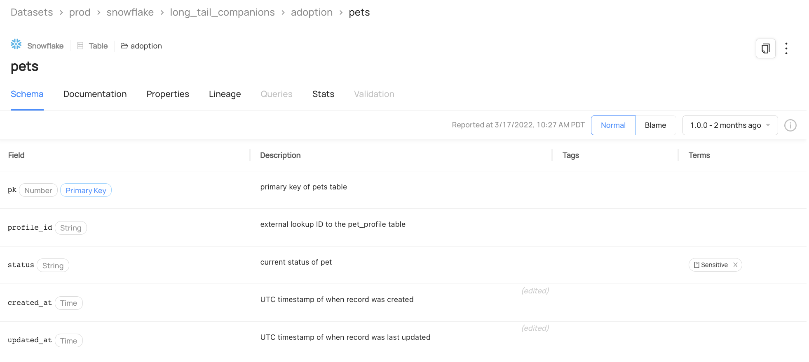
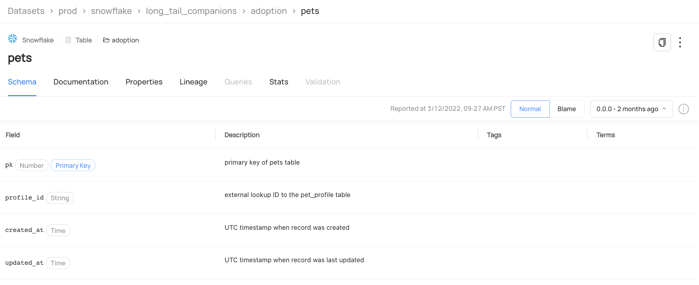
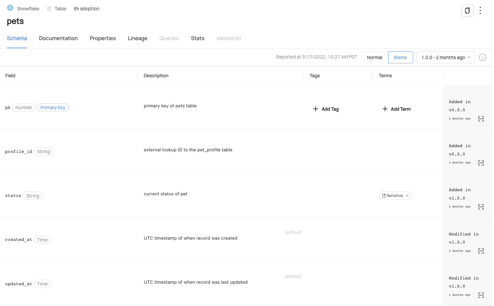

# Schema History Guide

## Introduction

As your data evolves over time, with fields getting added or removed, with type changes happening, with your documentation
and glossary term classifications changing, you may find yourself asking the question: "What did this dataset's schema
look like three months ago? Six months? What about a year ago?" We're happy to announce that you can now use DataHub to
answer these questions! We currently surface a Schema Blame view where you can examine what a schema looked like at a
specific point in time, and what the most recent changes were to each of these fields in that schema.

## Viewing a Dataset's Schema History

When you go to a dataset page, you'll be treated to a view that outlines what the latest version of the dataset is and when
the schema was last reported/modified. In addition, there's a version selector that outlines what the prior versions of
the dataset schema are, and when those were reported. Here's an example from our Demo with the
[Snowflake pets dataset](https://demo.datahubproject.io/dataset/urn:li:dataset:(urn:li:dataPlatform:snowflake,long_tail_companions.adoption.pets,PROD)/Schema?is_lineage_mode=false).

If you click on an older version in the selector, you'll travel back in time and see what the schema looked like back then. Notice
the changes here to the glossary terms for the `status` field, and to the descriptions for the `created_at` and `updated_at`
fields.

In addition to this, you can also activate the blame view that shows you when the most recent changes were made to each field.
You can active this by selecting the `Blame` button you see above the top right of the table.

You can see here that some of these fields were added at the oldest dataset version, while some were added only at this latest
version. Some fields were modified at the latest version!

The great thing about this blame view is that you can activate it for any version and see what the most recent changes were
at that point in time for each field. Similar to what Git blame would show you, but for understanding your schemas better!

## Coming Soon: Schema Timeline View

In the future, we plan on adding a timeline view where you can see what changes were made to various schema fields over time
in a linear fashion. Stay tuned for updates!

## Feedback / Questions / Concerns

We want to hear from you! For any inquiries, including Feedback, Questions, or Concerns, reach out on Slack!
