# UI Ingestion Guide 

## Introduction 

Starting in version `0.8.25`, DataHub supports creating, configuring, scheduling, & executing batch metadata ingestion using the DataHub user interface. This makes
getting metadata into DataHub easier by minimizing the overhead required to operate custom integration pipelines. 

This document will describe the steps required to configure, schedule, and execute metadata ingestion inside the UI. 

## Running Metadata Ingestion

### Prerequisites

To view & manage UI-based metadata ingestion, you must have the `Manage Metadata Ingestion` & `Manage Secrets`
 privileges assigned to your account. These can be granted by a [Platform Policy](authorization/policies.md).

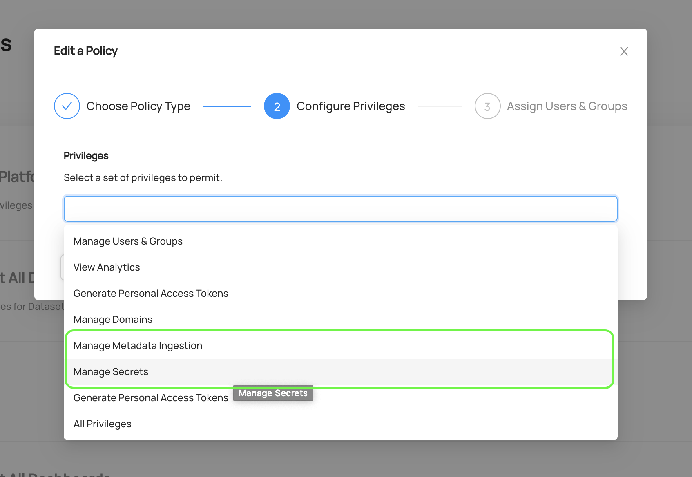

Once you have these privileges, you can begin to manage ingestion by navigating to the 'Ingestion' tab in DataHub. 

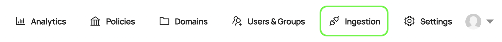

On this page, you'll see a list of active **Ingestion Sources**. An Ingestion Sources is a unique source of metadata ingested
into DataHub from an external source like Snowflake, Redshift, or BigQuery.

If you're just getting started, you won't have any sources. In the following sections, we'll describe how to create
your first **Ingestion Source**. 

### Creating an Ingestion Source

Before ingesting any metadata, you need to create a new Ingestion Source. Start by clicking **+ Create new source**.

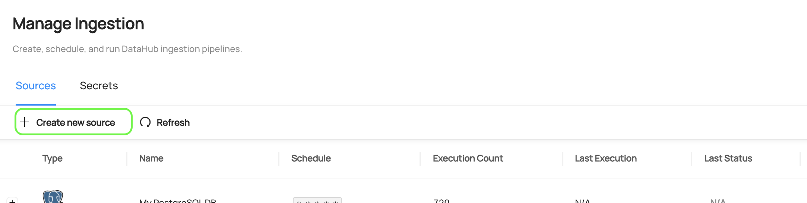

#### Step 1: Select a Platform Template

In the first step, select a **Recipe Template** corresponding to the source type that you'd like to extract metadata from. Choose among
a variety of natively supported integrations, from Snowflake to Postgres to Kafka.
Select `Custom` to construct an ingestion recipe from scratch. 

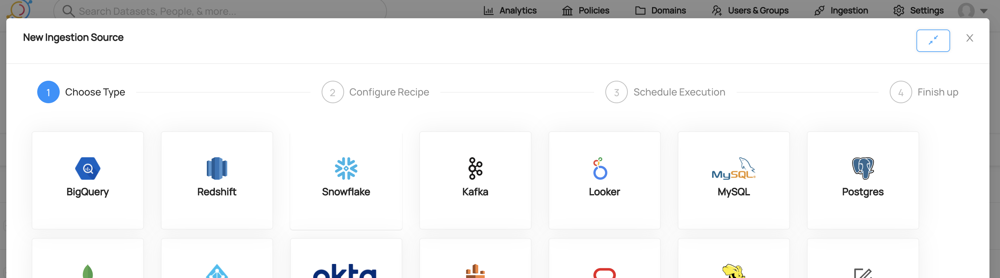

Next, you'll configure an ingestion **Recipe**, which defines _how_ and _what_ to extract from the source system.

#### Step 2: Configure a Recipe

Next, you'll define an ingestion **Recipe** in [YAML](https://yaml.org/). A [Recipe](https://datahubproject.io/docs/metadata-ingestion/#recipes) is a set of configurations which is
used by DataHub to extract metadata from a 3rd party system. It most often consists of the following parts:

1. A source **type**: The type of system you'd like to extract metadata from (e.g. snowflake, mysql, postgres). If you've chosen a native template, this will already be populated for you.
   To view a full list of currently supported **types**, check out [this list](https://datahubproject.io/docs/metadata-ingestion/#installing-plugins).
   

2. A source **config**: A set of configurations specific to the source **type**. Most sources support the following types of configuration values: 
      - **Coordinates**: The location of the system you want to extract metadata from
      - **Credentials**: Authorized credentials for accessing the system you want to extract metadata from
      - **Customizations**: Customizations regarding the metadata that will be extracted, e.g. which databases or tables to scan in a relational DB


3. A sink **type**: A type of sink to route the metadata extracted from the source type. The officially supported DataHub sink
   types are `datahub-rest` and `datahub-kafka`. 


4. A sink **config**: Configuration required to send metadata to the provided sink type. For example, DataHub coordinates and credentials.
   
A sample of a full recipe configured to ingest metadata from MySQL can be found in the image below.

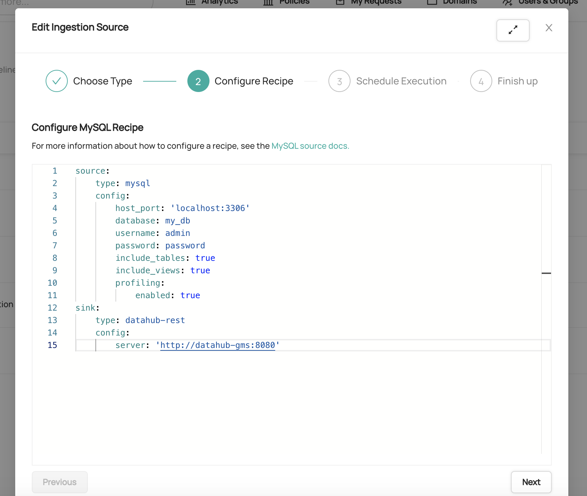

Detailed configuration examples & documentation for each source type can be found on the [DataHub Docs](https://datahubproject.io/docs/metadata-ingestion/) website.

##### Creating a Secret

For production use cases, sensitive configuration values, such as database usernames and passwords,
should be hidden from plain view within your ingestion recipe. To accomplish this, you can create & embed **Secrets**. Secrets are named values
that are encrypted and stored within DataHub's storage layer.

To create a secret, first navigate to the 'Secrets' tab. Then click `+ Create new secret`. 

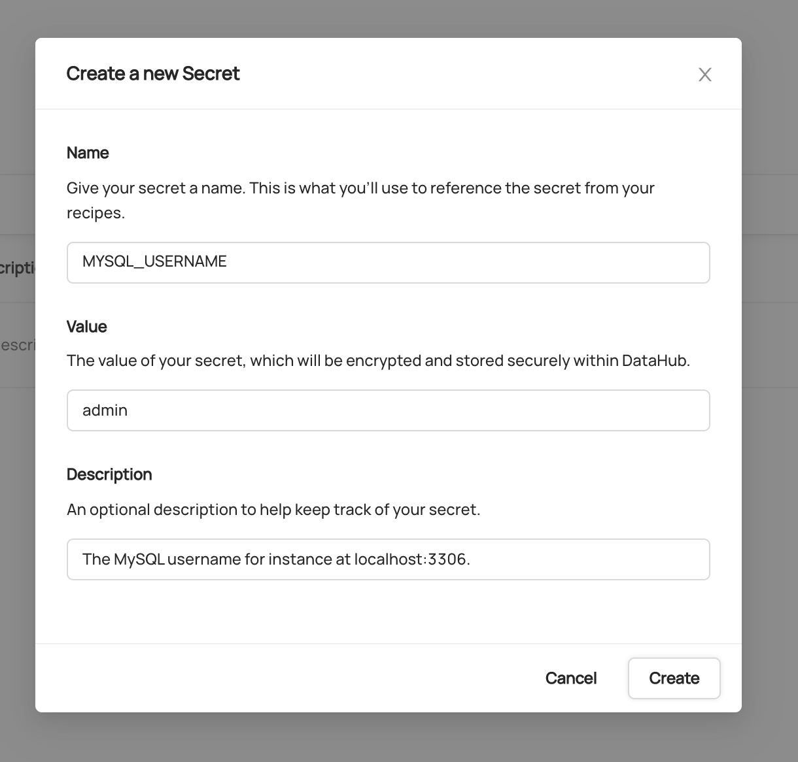

_Creating a Secret to store the username for a MySQL database_

Inside the form, provide a unique name for the secret along with the value to be encrypted, and an optional description. Click **Create** when you are done.
This will create a Secret which can be referenced inside your ingestion recipe using its name. 


##### Referencing a Secret

Once a Secret has been created, it can be referenced from within your **Recipe** using variable substitution. For example,
to substitute secrets for a MySQL username and password into a Recipe, your Recipe would be defined as follows:

```yaml
source:
    type: mysql
    config:
        host_port: 'localhost:3306'
        database: my_db
        username: ${MYSQL_USERNAME}
        password: ${MYSQL_PASSWORD}
        include_tables: true
        include_views: true
        profiling:
            enabled: true
sink:
    type: datahub-rest
    config:
        server: 'http://datahub-gms:8080'
```
_Referencing DataHub Secrets from a Recipe definition_

When the Ingestion Source with this Recipe executes, DataHub will attempt to 'resolve' Secrets found within the YAML. If a secret can be resolved, the reference is substituted for its decrypted value prior to execution.
Secret values are not persisted to disk beyond execution time, and are never transmitted outside DataHub.

> **Attention**: Any DataHub users who have been granted the `Manage Secrets` [Platform Privilege](authorization/policies.md) will be able to retrieve plaintext secret values using the GraphQL API. 


#### Step 3: Schedule Execution 

Next, you can optionally configure a schedule on which to execute your new Ingestion Source. This enables to schedule metadata extraction on a monthly, weekly, daily, or hourly cadence depending on the needs of your organization.
Schedules are defined using CRON format. 


_An Ingestion Source that is executed at 9:15am every day, Los Angeles time_

To learn more about the CRON scheduling format, check out the [Wikipedia](https://en.wikipedia.org/wiki/Cron) overview.

If you plan to execute ingestion on an ad-hoc basis, you can click **Skip** to skip the scheduling step entirely. Don't worry - 
you can always come back and change this. 

#### Step 4: Finishing Up

Finally, give your Ingestion Source a name. 

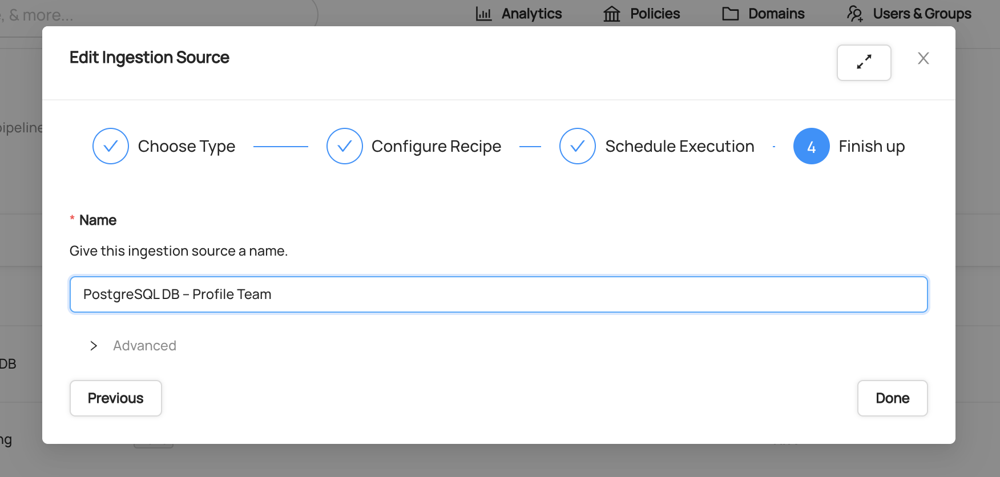

Once you're happy with your configurations, click 'Done' to save your changes.


##### Advanced: Running with a specific CLI version 

DataHub comes pre-configured to use the latest version of the DataHub CLI ([acryl-datahub](https://pypi.org/project/acryl-datahub/)) that is compatible
with the server. However, you can override the default package version using the 'Advanced' source configurations.

To do so, simply click 'Advanced', then change the 'CLI Version' text box to contain the exact version
of the DataHub CLI you'd like to use.

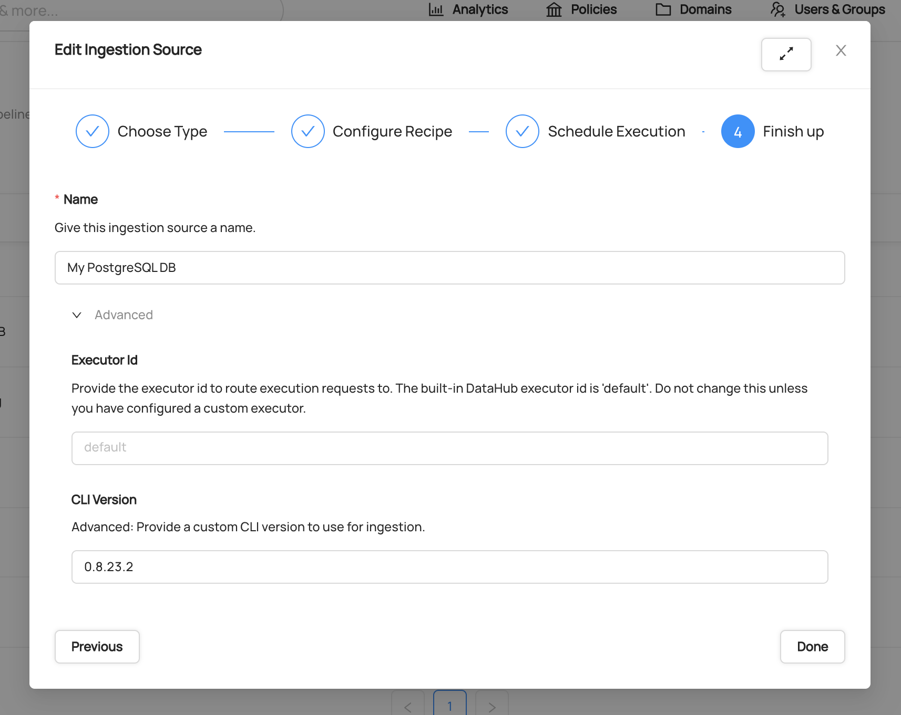
_Pinning the CLI version to version `0.8.23.2`_

Once you're happy with your changes, simply click 'Done' to save. 


### Running an Ingestion Source

Once you've created your Ingestion Source, you can run it by clicking 'Execute'. Shortly after,
you should see the 'Last Status' column of the ingestion source change from `N/A` to `Running`. This
means that the request to execute ingestion has been successfully picked up by the DataHub ingestion executor.


If ingestion has executed successfully, you should see it's state shown in green as `Succeeded`. 

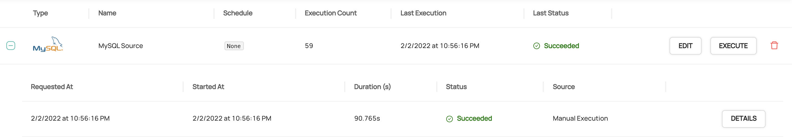


### Cancelling an Ingestion Run

If your ingestion run is hanging, there may a bug in the ingestion source, or another persistent issue like exponential timeouts. If these situations, 
you can cancel ingestion by clicking **Cancel** on the problematic run.

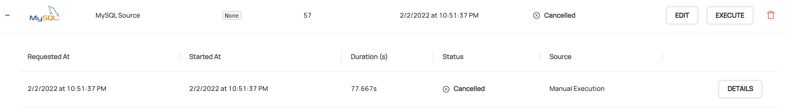

Once cancelled, you can view the output of the ingestion run by clicking **Details**. 


### Debugging a Failed Ingestion Run


A variety of things can cause an ingestion run to fail. Common reasons for failure include:  

1. **Recipe Misconfiguration**: A recipe has not provided the required or expected configurations for the ingestion source. You can refer
   to the [Metadata Ingestion Framework](https://datahubproject.io/docs/metadata-ingestion) source docs to learn more about the configurations required for your source type.
   
2. **Failure to resolve Secrets**: If DataHub is unable to find secrets that were referenced by your Recipe configuration, the ingestion run will fail. 
   Verify that the names of the secrets referenced in your recipe match those which have been created. 
   
3. **Connectivity / Network Reachability**: If DataHub is unable to reach a data source, for example due to DNS resolution
   failures, metadata ingestion will fail. Ensure that the network where DataHub is deployed has access to the data source which
   you are trying to reach. 
   
4. **Authentication**: If you've enabled [Metadata Service Authentication](authentication/introducing-metadata-service-authentication.md), you'll need to provide a Personal Access Token 
    in your Recipe Configuration. To so this, set the 'token' field of the sink configuration to contain a Personal Access Token:
   

The output of each run is captured and available to view in the UI for easier debugging. To view output logs, click **DETAILS** 
on the corresponding ingestion run. 

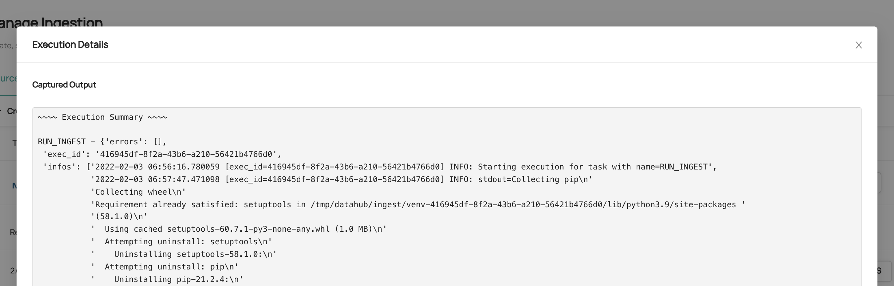

## FAQ

### I tried to ingest metadata after running 'datahub docker quickstart', but ingestion is failing with 'Failed to Connect' errors. What do I do?

If not due to one of the reasons outlined above, this may be because the executor running ingestion is unable
to reach DataHub's backend using the default configurations. Try changing your ingestion recipe to make the `sink.config.server` variable point to the Docker
DNS name for the `datahub-gms` pod: 

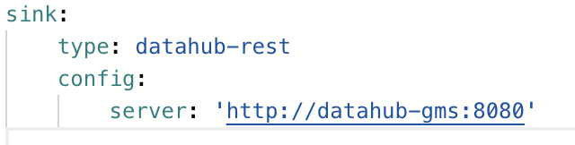

### I see 'N/A' when I try to run ingestion. What do I do?

If you see 'N/A', and the ingestion run state never changes to 'Running', this may mean 
that your executor (`datahub-actions`) container is down. 

This container is responsible for executing requests to run ingestion when they come in, either
on demand on a particular schedule. You can verify the health of the container using `docker ps`. Moreover, you can inspect the container logs using by finding the container id
for the `datahub-actions` container and running `docker logs <container-id>`.

### When should I NOT use UI Ingestion?

There are valid cases for ingesting metadata without the UI-based ingestion scheduler. For example,

- You have written a custom ingestion Source
- Your data sources are not reachable on the network where DataHub is deployed
- Your ingestion source requires context from a local filesystem (e.g. input files, environment variables, etc)
- You want to distribute metadata ingestion among multiple producers / environments

### How do I attach policies to the actions pod to give it permissions to pull metadata from various sources?

This varies across the underlying platform. For AWS, please refer to this [guide](./deploy/aws.md#iam-policies-for-ui-based-ingestion).

## Demo

Click [here](https://www.youtube.com/watch?v=EyMyLcaw_74) to see a full demo of the UI Ingestion feature.

## Feedback / Questions / Concerns

We want to hear from you! For any inquiries, including Feedback, Questions, or Concerns, reach out on [Slack](https://datahubspace.slack.com/join/shared_invite/zt-nx7i0dj7-I3IJYC551vpnvvjIaNRRGw#/shared-invite/email)!
