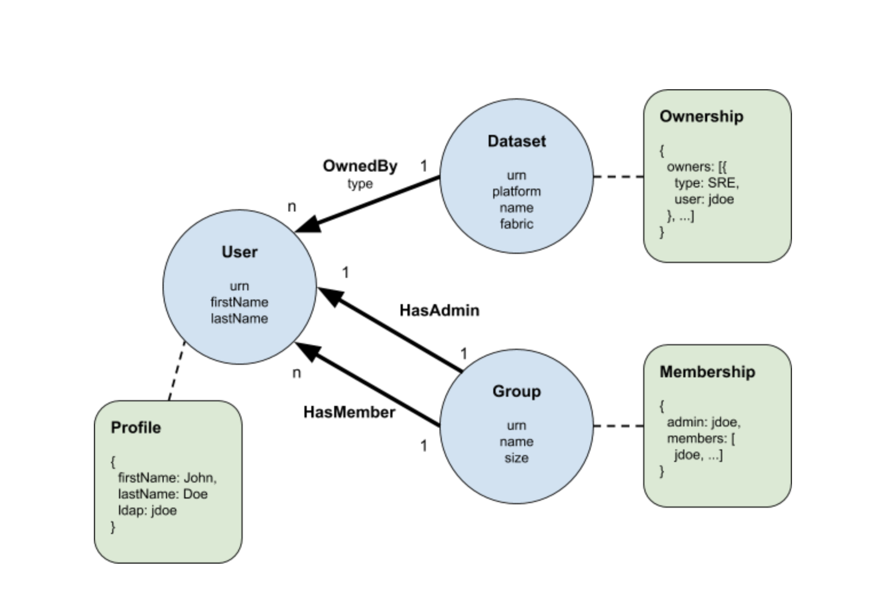

# What is an entity?

An entity is very similar to the concept of a [resource](https://linkedin.github.io/rest.li/user_guide/restli_server#writing-resources) in [Rest.li](http://rest.li/). Generally speaking, an entity should have a defined [URN](urn.md) and a corresponding [CRUD](https://en.wikipedia.org/wiki/Create,_read,_update_and_delete) API for the metadata associated with a particular instance of the entity. A particular instance of an entity is essentially a node in the [metadata graph](graph.md). 



In the above example graph, `Dataset`, `User`, and `Group` are entities. A specific dataset, e.g. `/data/tracking/ImportantEvent`, is an instance of `Dataset` entity, much like how the LDAP group `datahub-team` is an instance of Group entity.

Unlike rest.li, there’s no concept of sub-entity ([sub-resource](https://github.com/linkedin/rest.li/wiki/Rest.li-User-Guide#sub-resources) in rest.li). In other words, entities are always top-level and non-nesting. Instead, nestedness is modeled using [relationships](relationship.md), e.g. `Contains`, `IsPartOf`, `HasA`.

Entities may also contain attributes, which are in the form of key-value pairs. Each attribute is indexed to support fast attribute-based querying, e.g. find all the `Users` that have the job title "Software Engineer". There may be a size limitation on the value imposed by the underlying indexing system, but it suffices to assume that the values should kept at relatively small in size, say less than 1KB.

The value of each attribute is expected to be derived from either the entity’s URN or 
from the metadata associated with the entity. Another way to understand the attributes of an entity is to treat them as a complex virtual view over the URN and metadata with indexing support on each column of the view. Just like a virtual view where one is not supposed to store data in the view directly, but to derive it from the underlying tables, the value for the attributes should also be derived. How the actual derivation happens is covered in the [Metadata Serving](../architecture/architecture.md#metadata-serving) section.

There’s no need to explicitly create or destroy entity instances. An entity instance will be automatically created in the graph whenever a new relationship involving the instance is formed, or when a new metadata aspect is attached to the instance. 
Each entity has a special boolean attribute `removed`, which is used to mark the entity as "soft deleted", 
without destroying existing relationships and attached metadata. See [How to delete an entity?](#how-to-delete-an-entity) for more details.

An example [PDL](https://linkedin.github.io/rest.li/pdl_schema) schema for the `Dataset` entity is shown below. Note that:
1. Each entity is expected to have a `urn` field with an entity-specific URN type.
2. The optional `removed` field is captured in BaseEntity, which is expected to be included by all entities.
3. All other fields are expected to be of primitive types or enum only. 
While it may be possible to support other complex types, namely array, union, map, and record, 
this mostly depends on the underlying indexing system. For simplicity, we only allow numeric or string-like values for now.
4. The `urn` field is non-optional, while all other fields must be optional. 
This is to support "partial update" when only a selective number of attributes need to be altered.

```
namespace com.linkedin.metadata.entity

/**
 * Common fields that apply to all entities
 */
record BaseEntity {

  /** Whether the entity has been removed or not */
  removed: optional boolean = false
}
```

```
namespace com.linkedin.metadata.entity

import com.linkedin.common.DataPlatformUrn
import com.linkedin.common.DatasetUrn
import com.linkedin.common.FabricType

/**
 * Data model for a dataset entity
 */
record DatasetEntity includes BaseEntity {

  /** Urn of the dataset */
  urn: DatasetUrn

  /** Dataset native name */
  name: optional string

  /** Platform urn for the dataset */
  platform: optional DataPlatformUrn

  /** Fabric type where dataset belongs to */
  origin: optional FabricType
}
```

# When to model something as an entity?

A lot of time it may not be obvious if something should be modeled as an entity, a [metadata aspect](aspect.md), or even a field in a metadata aspect. One way to think of it is using the concept of [Third Normal Form](https://en.wikipedia.org/wiki/Third_normal_form). We'll use the example from the Wikipedia entry to illustrate the idea.

**Tournament Table**
| Tournament | Year | Winner |
| ------- | --------- | --------- |
| Indiana Invitational | 1998 | Al Fredrickson 
| Cleveland Open | 1999 | Bob Albertson
| Des Moines Masters | 1999 | Al Fredrickson
| Indiana Invitational | 1999 | Chip Masterson

**Winner Table**
| Winner | Date of birth |
| ------- | --------- |
| Chip Masterson | 14 March 1977 
| Al Fredrickson | 21 July 1975
| Bob Albertson | 28 September 1968

When fully normalized, it becomes clear that each table corresponds to an entity (`Tournament` and `Winner`) and is identifiable by its respective key (`{Tournament, Year}` and `Winner`). `Date of birth` column in the second table is the "metadata aspect" of the `Winner` entity. There also exists a relationship between `Tournament` and `Winner` through the `Winner` column in the first table.

In other words, when you start asking yourself "Should I normalize this thing so it doesn't end up repeated data that can potentially become inconsistent?", chances are that "thing" should probably be made an entity. For example, if we need to associate a specific birthday with additional facts, such as the corresponding star sign or [birth flower](https://en.wikipedia.org/wiki/Birth_flower), we'll end up introducing the `Birthday` table & entity and further denormalize the `Winner` table.

**Winner Table**
| Winner | Birthday | Birth year |
| ------- | --------- | --------- |
| Chip Masterson | 14 March | 1977 
| Al Fredrickson | 21 July | 1975
| Bob Albertson | 28 September | 1968

**Birthday Table**
| Birthday | Star sign | Birth flower |
| ------- | --------- | --------- |
| 1 January | Capricorn | Carnation
| ... | ... |
| 1 July | Cancer | Larkspur  
| ... | ... |
| 31 December | Capricorn | Poinsettia

# How to delete an entity?

We purposely made all [metadata aspects](aspect.md) immutable, i.e. each edit results in a new version created with no easy way to remove a specific version. However, since the existance of an entity is determined by the existance of its associated metadata aspects, it seems that there's no easy way to delete an entity. In fact, this is echoed by the fact that [GMS](gms.md) doesn't actually provide any [DELETE](https://linkedin.github.io/rest.li/user_guide/restli_server#delete) API!

The main reason for choosing this append-only design is that a lot of metadata is valuable and irrecoverable once lost, e.g. information curated by human or a lineage produced by a one-off pipeline. Audit trail is also extremely important when it comes to sensitive metadata such as privacy settings, access control etc. We really don't want to wipe out the metadata aspects thinking that the entity is no longer needed—to then regret the decision a year later.

Having said that, cluterring your catalog or graph with deleted entities is also undesirable and can lead to a lot of confusion. To strike a balance, we decided to introduce a special [`Status`](https://github.com/linkedin/datahub/blob/master/metadata-models/src/main/pegasus/com/linkedin/common/Status.pdl) aspect to indicate if the entity is deleted or not. All aspects of an entity can now live forever, while the entity itself can be "soft deleted" by flipping a flag in the `Status` aspect. The flag is then respected by the search index & graph builders when populating the indicies. To keep the storage space in check, one can even implement a garbage collector, which reguarly clears out aspects of entities that have been soft-deleted for a long time. 

