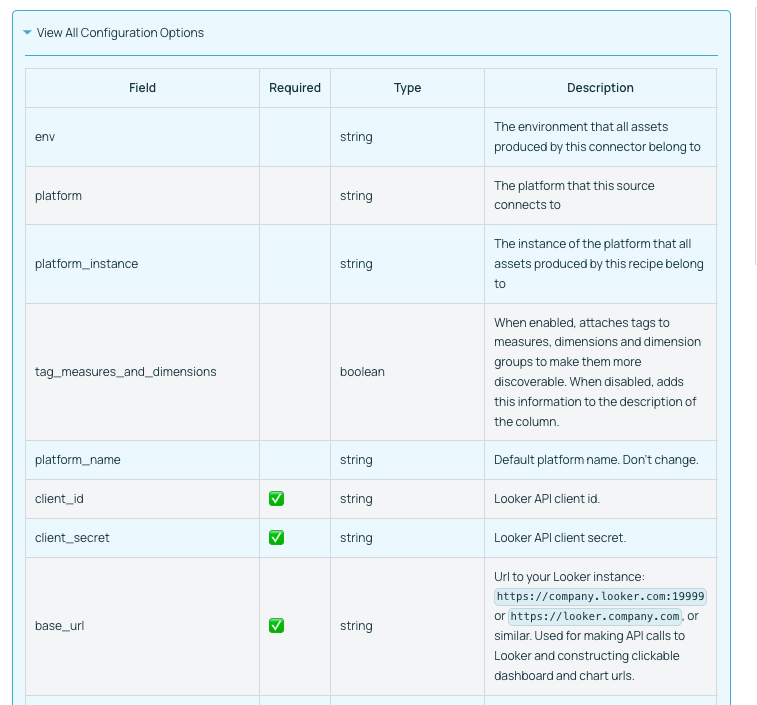

# Adding a Metadata Ingestion Source

There are two ways of adding a metadata ingestion source.

1. You are going to contribute the custom source directly to the Datahub project.
2. You are writing the custom source for yourself and are not going to contribute back (yet).

If you are going for case (1) just follow the steps 1 to 9 below. In case you are building it for yourself you can skip
steps 4-9 (but maybe write tests and docs for yourself as well) and follow the documentation
on [how to use custom ingestion sources](../docs/how/add-custom-ingestion-source.md)
without forking Datahub.

:::note

This guide assumes that you've already followed the metadata ingestion [developing guide](./developing.md) to set up
your local environment.

:::

### 1. Set up the configuration model

We use [pydantic](https://pydantic-docs.helpmanual.io/) for configuration, and all models must inherit
from `ConfigModel`. The [file source](./src/datahub/ingestion/source/file.py) is a good example.

#### Documentation for Configuration Classes

We use [pydantic](https://pydantic-docs.helpmanual.io) conventions for documenting configuration flags. Use the `description` attribute to write rich documentation for your configuration field.

For example, the following code:
```python
from pydantic import Field
from datahub.api.configuration.common import ConfigModel

class LookerAPIConfig(ConfigModel):
    client_id: str = Field(description="Looker API client id.")
    client_secret: str = Field(description="Looker API client secret.")
    base_url: str = Field(
        description="Url to your Looker instance: `https://company.looker.com:19999` or `https://looker.company.com`, or similar. Used for making API calls to Looker and constructing clickable dashboard and chart urls."
    )
    transport_options: Optional[TransportOptionsConfig] = Field(
        default=None,
        description="Populates the [TransportOptions](https://github.com/looker-open-source/sdk-codegen/blob/94d6047a0d52912ac082eb91616c1e7c379ab262/python/looker_sdk/rtl/transport.py#L70) struct for looker client",
    )
```

generates the following documentation:


:::note
Inline markdown or code snippets are not yet supported for field level documentation.
:::


### 2. Set up the reporter

The reporter interface enables the source to report statistics, warnings, failures, and other information about the run.
Some sources use the default `SourceReport` class, but others inherit and extend that class.

### 3. Implement the source itself

The core for the source is the `get_workunits` method, which produces a stream of metadata events (typically MCP objects) wrapped up in a MetadataWorkUnit.
The [file source](./src/datahub/ingestion/source/file.py) is a good and simple example.

The MetadataChangeEventClass is defined in the metadata models which are generated
under `metadata-ingestion/src/datahub/metadata/schema_classes.py`. There are also
some [convenience methods](./src/datahub/emitter/mce_builder.py) for commonly used operations.

### 4. Set up the dependencies

Declare the source's pip dependencies in the `plugins` variable of the [setup script](./setup.py).

### 5. Enable discoverability

Declare the source under the `entry_points` variable of the [setup script](./setup.py). This enables the source to be
listed when running `datahub check plugins`, and sets up the source's shortened alias for use in recipes.

### 6. Write tests

Tests go in the `tests` directory. We use the [pytest framework](https://pytest.org/).

### 7. Write docs

#### 7.1 Set up the source class for automatic documentation

- Indicate the platform name that this source class produces metadata for using the `@platform_name` decorator. We prefer using the human-readable platform name, so e.g. BigQuery (not bigquery).
- Indicate the config class being used by the source by using the `@config_class` decorator.
- Indicate the support status of the connector by using the `@support_status` decorator.
- Indicate what capabilities the connector supports (and what important capabilities it does NOT support) by using the `@capability` decorator.
- Add rich documentation for the connector by utilizing docstrings on your Python class. Markdown is supported.

See below a simple example of how to do this for any source.

```python

from datahub.ingestion.api.decorators import (
    SourceCapability,
    SupportStatus,
    capability,
    config_class,
    platform_name,
    support_status,
)

@platform_name("File")
@support_status(SupportStatus.CERTIFIED)
@config_class(FileSourceConfig)
@capability(
    SourceCapability.PLATFORM_INSTANCE,
    "File based ingestion does not support platform instances",
    supported=False,
)
@capability(SourceCapability.DOMAINS, "Enabled by default")
@capability(SourceCapability.DATA_PROFILING, "Optionally enabled via configuration")
@capability(SourceCapability.DESCRIPTIONS, "Enabled by default")
@capability(SourceCapability.LINEAGE_COARSE, "Enabled by default")
class FileSource(Source):
   """
   
   The File Source can be used to produce all kinds of metadata from a generic metadata events file. 
   :::note
   Events in this file can be in MCE form or MCP form.
   :::
   
   """

   ... source code goes here

```


#### 7.2 Write custom documentation

- Create a copy of [`source-docs-template.md`](./source-docs-template.md) and edit all relevant components. 
- Name the document as `<plugin.md>` and move it to `metadata-ingestion/docs/sources/<platform>/<plugin>.md`. For example for the Kafka platform, under the `kafka` plugin, move the document to `metadata-ingestion/docs/sources/kafka/kafka.md`.
- Add a quickstart recipe corresponding to the plugin under `metadata-ingestion/docs/sources/<platform>/<plugin>_recipe.yml`. For example, for the Kafka platform, under the `kafka` plugin, there is a quickstart recipe located at `metadata-ingestion/docs/sources/kafka/kafka_recipe.yml`.
- To write platform-specific documentation (that is cross-plugin), write the documentation under `metadata-ingestion/docs/sources/<platform>/README.md`. For example, cross-plugin documentation for the BigQuery platform is located under `metadata-ingestion/docs/sources/bigquery/README.md`.

#### 7.3 Viewing the Documentation

Documentation for the source can be viewed by running the documentation generator from the `docs-website` module. 

##### Step 1: Build the Ingestion docs
```console
# From the root of DataHub repo
./gradlew :metadata-ingestion:docGen
```

If this finishes successfully, you will see output messages like:
```console
Ingestion Documentation Generation Complete
############################################
{
  "source_platforms": {
    "discovered": 40,
    "generated": 40
  },
  "plugins": {
    "discovered": 47,
    "generated": 47,
    "failed": 0
  }
}
############################################
```

You can also find documentation files generated at `./docs/generated/ingestion/sources` relative to the root of the DataHub repo. You should be able to locate your specific source's markdown file here and investigate it to make sure things look as expected.

#### Step 2: Build the Entire Documentation
To view how this documentation looks in the browser, there is one more step. Just build the entire docusaurus page from the `docs-website` module. 

```console
# From the root of DataHub repo
./gradlew :docs-website:build
```

This will generate messages like:
```console
...
> Task :docs-website:yarnGenerate
yarn run v1.22.0
$ rm -rf genDocs/* && ts-node -O '{ "lib": ["es2020"], "target": "es6" }' generateDocsDir.ts && mv -v docs/* genDocs/
Including untracked files in docs list:
docs/graphql -> genDocs/graphql
Done in 2.47s.

> Task :docs-website:yarnBuild
yarn run v1.22.0
$ docusaurus build

╭──────────────────────────────────────────────────────────────────────────────╮│                                                                              ││                Update available 2.0.0-beta.8 → 2.0.0-beta.18                 ││                                                                              ││       To upgrade Docusaurus packages with the latest version, run the        ││                             following command:                               ││                    yarn upgrade @docusaurus/core@latest                      ││   @docusaurus/plugin-ideal-image@latest @docusaurus/preset-classic@latest    ││                                                                              │╰──────────────────────────────────────────────────────────────────────────────╯


[en] Creating an optimized production build...
Invalid docusaurus-plugin-ideal-image version 2.0.0-beta.7.
All official @docusaurus/* packages should have the exact same version as @docusaurus/core (2.0.0-beta.8).
Maybe you want to check, or regenerate your yarn.lock or package-lock.json file?
Browserslist: caniuse-lite is outdated. Please run:
  npx browserslist@latest --update-db
  Why you should do it regularly: https://github.com/browserslist/browserslist#browsers-data-updating
ℹ Compiling Client
ℹ Compiling Server
✔ Client: Compiled successfully in 1.95s
✔ Server: Compiled successfully in 7.52s
Success! Generated static files in "build".

Use `npm run serve` command to test your build locally.

Done in 11.59s.

Deprecated Gradle features were used in this build, making it incompatible with Gradle 7.0.
Use '--warning-mode all' to show the individual deprecation warnings.
See https://docs.gradle.org/6.9.2/userguide/command_line_interface.html#sec:command_line_warnings

BUILD SUCCESSFUL in 35s
36 actionable tasks: 16 executed, 20 up-to-date
```

After this you need to run the following script from the `docs-website` module. 
```console
cd docs-website
npm run serve
```

Now, browse to http://localhost:3000 or whichever port npm is running on, to browse the docs. 
Your source should show up on the left sidebar under `Metadata Ingestion / Sources`. 


### 8. Add SQL Alchemy mapping (if applicable)

Add the source in `get_platform_from_sqlalchemy_uri` function
in [sql_common.py](./src/datahub/ingestion/source/sql/sql_common.py) if the source has an sqlalchemy source

### 9. Add logo for the platform

Add the logo image in [images folder](../datahub-web-react/src/images) and add it to be ingested at [startup](../metadata-service/war/src/main/resources/boot/data_platforms.json)
