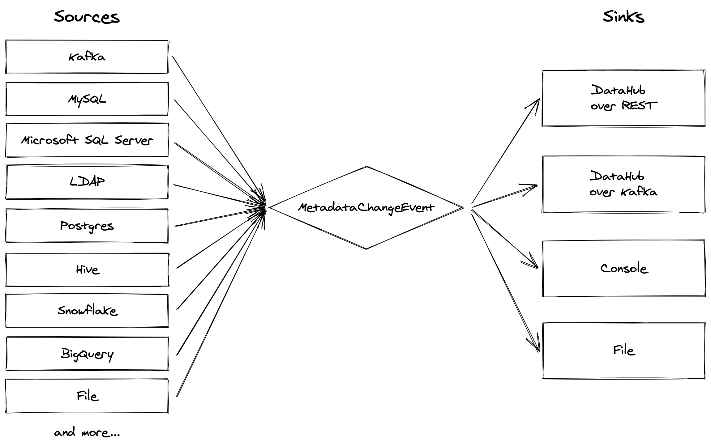

# Developing on Metadata Ingestion

If you just want to use metadata ingestion, check the [user-centric](./README.md) guide.

## Architecture



The architecture of this metadata ingestion framework is heavily inspired by [Apache Gobblin](https://gobblin.apache.org/) (also originally a LinkedIn project!). We have a standardized format - the MetadataChangeEvent - and sources and sinks which respectively produce and consume these objects. The sources pull metadata from a variety of data systems, while the sinks are primarily for moving this metadata into DataHub.

## Getting Started

### Requirements

1. Python 3.6+ must be installed in your host environment.
2. On MacOS: `brew install librdkafka`
3. On Debian/Ubuntu: `sudo apt install librdkafka-dev python3-dev python3-venv`
4. On Fedora (if using LDAP source integration): `sudo yum install openldap-devel`

### Set up your Python environment

From the repository root: 

```shell
cd metadata-ingestion
../gradlew :metadata-ingestion:installDev
source venv/bin/activate
datahub version  # should print "version: unavailable (installed via git)"
```

### Common setup issues

Common issues (click to expand):

<details>
  <summary>datahub command not found with PyPI install</summary>

If you've already run the pip install, but running `datahub` in your command line doesn't work, then there is likely an issue with your PATH setup and Python.

The easiest way to circumvent this is to install and run via Python, and use `python3 -m datahub` in place of `datahub`.

```shell
python3 -m pip install --upgrade acryl-datahub
python3 -m datahub --help
```

</details>

<details>
  <summary>Wheel issues e.g. "Failed building wheel for avro-python3" or "error: invalid command 'bdist_wheel'"</summary>

This means Python's `wheel` is not installed. Try running the following commands and then retry.

```shell
pip install --upgrade pip wheel setuptools
pip cache purge
```

</details>

<details>
  <summary>Failure to install confluent_kafka: "error: command 'x86_64-linux-gnu-gcc' failed with exit status 1"</summary>

This sometimes happens if there's a version mismatch between the Kafka's C library and the Python wrapper library. Try running `pip install confluent_kafka==1.5.0` and then retrying.

</details>

### Using Plugins in Development

The syntax for installing plugins is slightly different in development. For example:

```diff
- pip install 'acryl-datahub[bigquery,datahub-rest]'
+ pip install -e '.[bigquery,datahub-rest]'
```

## Code layout

- The CLI interface is defined in [entrypoints.py](./src/datahub/entrypoints.py).
- The high level interfaces are defined in the [API directory](./src/datahub/ingestion/api).
- The actual [sources](./src/datahub/ingestion/source) and [sinks](./src/datahub/ingestion/sink) have their own directories. The registry files in those directories import the implementations.
- The metadata models are created using code generation, and eventually live in the `./src/datahub/metadata` directory. However, these files are not checked in and instead are generated at build time. See the [codegen](./scripts/codegen.sh) script for details.
- Tests live in the [`tests`](./tests) directory. They're split between smaller unit tests and larger integration tests.

## Contributing

Contributions welcome!

Also take a look at the guide to [adding a source](./adding-source.md).

### Testing

```shell
# Follow standard install from source procedure - see above.

# Install, including all dev requirements.
pip install -e '.[dev]'

# For running integration tests, you can use 
pip install -e '.[integration-tests]'

# Run unit tests.
pytest -m 'not integration and not slow_integration'

# Run Docker-based integration tests.
pytest -m 'integration'

# Run Docker-based slow integration tests.
pytest -m 'slow_integration'
```

### Sanity check code before committing

```shell
./scripts/codegen.sh
```

This will generate some schema related files. These are auto-generated in docker containers. Do not commit these files in source code.


```shell
# Assumes: pip install -e '.[dev]' and venv is activated
black src/ tests/
isort src/ tests/
flake8 src/ tests/
mypy src/ tests/

# If you want to run only the quicker subtests
pytest -m 'not integration and not slow_integration' -vv
# Run the full testing suite
pytest -vv

# You can also run these steps via the gradle build:
../gradlew :metadata-ingestion:lint
../gradlew :metadata-ingestion:lintFix
../gradlew :metadata-ingestion:testQuick
../gradlew :metadata-ingestion:testFull
../gradlew :metadata-ingestion:check
# Run all tests in a single file
../gradlew :metadata-ingestion:testSingle -PtestFile=tests/unit/test_airflow.py
# Run all tests under tests/unit
../gradlew :metadata-ingestion:testSingle -PtestFile=tests/unit
```
