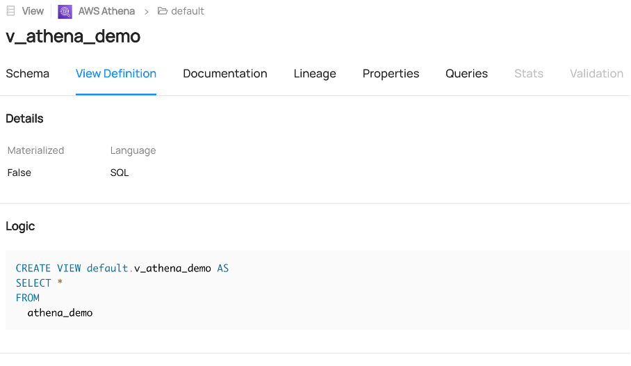

### View Definition

If you want the view definition to be displayed in the DataHub like this
you must ensure that the following additional dependency requirements are met:

* `pyAthena >= 3.0.7`
* `SQLAlchemy >= 2.0.0`

 

