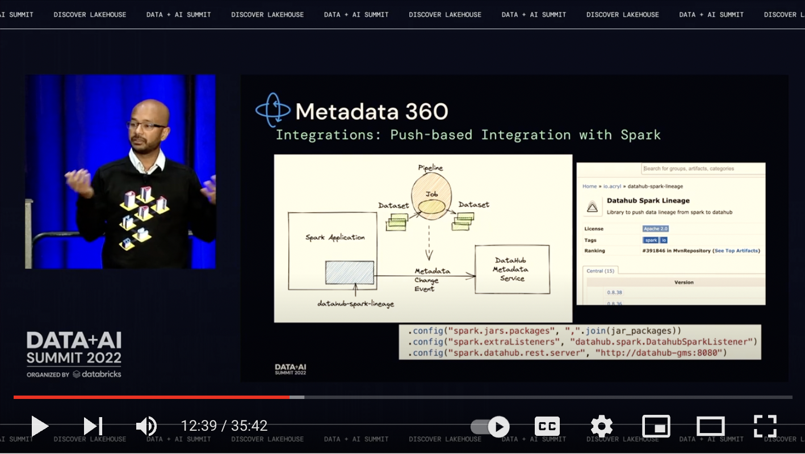

DataHub supports integration with Databricks ecosystem using a multitude of connectors, depending on your exact setup. 

## Databricks Hive

The simplest way to integrate is usually via the Hive connector. The [Hive starter recipe](http://datahubproject.io/docs/generated/ingestion/sources/hive#starter-recipe) has a section describing how to connect to your Databricks workspace.

## Databricks Unity Catalog (new)

The recently introduced [Unity Catalog](https://www.databricks.com/product/unity-catalog) provides a new way to govern your assets within the Databricks lakehouse. If you have enabled Unity Catalog, you can use the `unity-catalog` source (see below) to integrate your metadata into DataHub as an alternate to the Hive pathway. 

## Databricks Spark

To complete the picture, we recommend adding push-based ingestion from your Spark jobs to see real-time activity and lineage between your Databricks tables and your Spark jobs. Use the Spark agent to push metadata to DataHub using the instructions [here](../../../../metadata-integration/java/spark-lineage/README.md#configuration-instructions-databricks).

## Watch the DataHub Talk at the Data and AI Summit 2022

For a deeper look at how to think about DataHub within and across your Databricks ecosystem, watch the recording of our talk at the Data and AI Summit 2022. 

