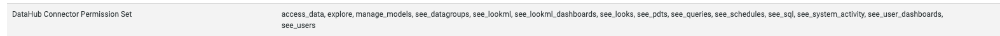

# Looker dashboards

For context on getting started with ingestion, check out our [metadata ingestion guide](../README.md).

## Setup

To install this plugin, run `pip install 'acryl-datahub[looker]'`.

## Capabilities

This plugin extracts the following:

- Looker dashboards, dashboard elements (charts) and explores
- Names, descriptions, URLs, chart types, input explores for the charts
- Schemas and input views for explores
- Owners of dashboards

**_NOTE:_** To get complete Looker metadata integration (including Looker views and lineage to the underlying warehouse tables), you must ALSO use the LookML source. Documentation for that is [here](./lookml.md)

| Capability | Status | Details | 
| -----------| ------ | ---- |
| Platform Instance | 🛑 | [link](../../docs/platform-instances.md) |

## Configuration Notes

See the [Looker authentication docs](https://docs.looker.com/reference/api-and-integration/api-auth#authentication_with_an_sdk) for the steps to create a client ID and secret. 
You need to provide the following permissions for ingestion to work correctly. 
```
access_data
explore
manage_models
see_datagroups
see_lookml
see_lookml_dashboards
see_looks
see_pdts
see_queries
see_schedules
see_sql
see_system_activity
see_user_dashboards
see_users
```
Here is an example permission set after configuration. 



## Quickstart recipe


Check out the following recipe to get started with ingestion! See [below](#config-details) for full configuration options.

For general pointers on writing and running a recipe, see our [main recipe guide](../README.md#recipes).

```yml
source:
  type: "looker"
  config:
    # Coordinates
    base_url: https://company.looker.com:19999

    # Credentials
    client_id: admin
    client_secret: password


sink:
  # sink configs
```

## Config details

Note that a `.` is used to denote nested fields in the YAML recipe.

| Field                     | Required | Default                 | Description                                                                                                  |
| ------------------------- | -------- | ----------------------- | ------------------------------------------------------------------------------------------------------------ |
| `client_id`               | ✅       |                         | Looker API3 client ID.                                                                                       |
| `client_secret`           | ✅       |                         | Looker API3 client secret.                                                                                   |
| `base_url`                | ✅       |                         | Url to your Looker instance: `https://company.looker.com:19999` or `https://looker.company.com`, or similar. Used for making API calls to Looker and constructing clickable dashboard and chart urls. |
| `external_base_url`   |          | value of `base_url`                  | Optional URL to use when constructing external URLs to Looker if the `base_url` is not the correct one to use. For example, `https://looker-public.company.com`. If not provided, the external base URL will default to `base_url`.  | 
| `platform_name`           |          | `"looker"`              | Platform to use in namespace when constructing URNs.                                                         |
| `extract_owners`                     |          | `True`                | When enabled, extracts ownership from Looker directly. When disabled, ownership is left empty for dashboards and charts.                                                      |
| `strip_user_ids_from_email`                     |          | `False`                | When enabled, converts Looker user emails of the form name@domain.com to urn:li:corpuser:name when assigning ownership                                                    |
| `actor`                |      ⛔️ Deprecated     | `"urn:li:corpuser:etl"` | This config is deprecated in favor of `extract_owners`. Previously, was the actor to use in ownership properties of ingested metadata              |
| `dashboard_pattern.allow` |          |                         | List of regex patterns for dashboards to include in ingestion.                                                        |
| `dashboard_pattern.deny`  |          |                         | List of regex patterns for dashboards to exclude from ingestion.                                                      |
| `dashboard_pattern.ignoreCase`  |          | `True` | Whether to ignore case sensitivity during pattern matching.                                                                                                                                  |
| `chart_pattern.allow`     |          |                         | List of regex patterns for charts to include in ingestion.                                                            |
| `chart_pattern.deny`      |          |                         | List of regex patterns for charts to exclude from ingestion.                                                          |
| `chart_pattern.ignoreCase`  |          | `True` | Whether to ignore case sensitivity during pattern matching.                                                                                                                                  |
| `include_deleted`         |          | `False`                 | Whether to include deleted dashboards.                                                                       |
| `skip_personal_folders`         |          | `False`                 | Whether to skip ingestion of dashboards in personal folders. Setting this to True will only ingest dashboards in the Shared folder space. |
| `tag_measures_and_dimensions`   |          | `True`    | When enabled, attaches tags to measures, dimensions and dimension groups to make them more discoverable. When disabled, adds this information to the description of the column. |
| `env`                     |          | `"PROD"`                | Environment to use in namespace when constructing URNs.                                                      |
| `view_naming_pattern` |   | `{project}.view.{name}` | Pattern for providing dataset names to views. Allowed variables are `{project}`, `{model}`, `{name}` | 
| `view_browse_pattern` |   | `/{env}/{platform}/{project}/views/{name}` | Pattern for providing browse paths to views. Allowed variables are `{project}`, `{model}`, `{name}`, `{platform}` and `{env}` | 
| `explore_naming_pattern` |   | `{model}.explore.{name}` | Pattern for providing dataset names to explores. Allowed variables are `{project}`, `{model}`, `{name}` | 
| `explore_browse_pattern` |   | `/{env}/{platform}/{project}/explores/{model}.{name}` | Pattern for providing browse paths to explores. Allowed variables are `{project}`, `{model}`, `{name}`, `{platform}` and `{env}` | 
| `transport_options`                                |          |        |  Populates the [TransportOptions](https://github.com/looker-open-source/sdk-codegen/blob/94d6047a0d52912ac082eb91616c1e7c379ab262/python/looker_sdk/rtl/transport.py#L70) struct for looker client |
| `max_threads`                                |          | `os.cpuCount or 40` |  Max parallelism for Looker API calls                   |


## Compatibility

Coming soon!

## Questions

If you've got any questions on configuring this source, feel free to ping us on [our Slack](https://slack.datahubproject.io/)!
