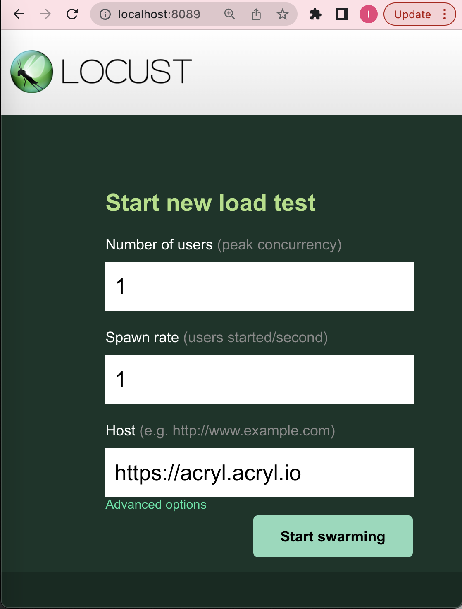

# Load testing with Locust

[Locust](https://locust.io/) is an open-source, python-based, easy-to-use load testing tool. It provides an interface to
spawn multiple users (swarm) that behave according to pre-defined python code.

In this directory, we provide some example locust configs that send common requests to DataHub GMS (ingest, search,
browse, and graph).

## Prerequisites

To run the example configs, you need to first install locust by running

```shell
pip3 install locust
```

Note that it supports python versions 3.6 and up. Refer to
this [guide](https://docs.locust.io/en/stable/installation.html) for more details.

If you will be running tests against a customer instance (not your local deployment), you will also need AWS credentials to access Acryl servers. To get these, make sure you have awscli v2 installed.

```shell
brew install awscli@2
```

Then, use the SSO login to be able to access instances.

```shell
aws configure sso
```

Finally, install kubectl if it is not already installed, and set the environment to the namespace you will be running the perf tests against.

```shell
kubectl config get-contexts  # To see available contexts
kubectl config use-context arn:aws:eks:<region>:<account number>:cluster/<cluster>  # Name from above list
```

Once the access is set up, the scripts will read the credentials for you, so you will not need to authenticate in the instance you are running the perf tests against.

You will also need to import requirements in order to run the Locustfile scripts:

```shell
pip3 install -r requirements.txt
```

## Locustfiles

[Locustfiles](./locustfiles) define how the users will behave once they are spawned. Refer to
this [doc](https://docs.locust.io/en/stable/writing-a-locustfile.html) on how to write one.

Here, we have defined several common requests:

- Ingest: ingests a dataset with a random URN with properties, browse paths, and ownership aspects filled out
- Search: searches datasets with query "test"
- Browse: browses datasets with path "/perf/test"
- Graph: gets datasets owned by user "common"
- Search GraphQL: Searches datasets using breadth{randInt} assuming the graph ingest has been used with 100 children
- Get Entities: Fetches random entities using URNs from mock data
- Scroll Across Lineage: Queries lineage with random URNs and directions against ~1M mock tables to test cache behavior

We will continue adding more as more use cases arise, but feel free to play around with the default behavior to create a
load test that matches your request pattern.

### Using MockDataHelper for Realistic Load Tests

To avoid cache pollution and simulate realistic access patterns, use the `MockDataHelper` utility when writing locustfiles that test against mock data ingested via the `datahub ingest` CLI.

**Example usage:**

```python
from test_utils.mock_data_helper import default_mock_data

@task
def my_task(self):
    # Get a random URN from the ~1M table mock dataset
    urn = default_mock_data.get_random_urn()

    # Use the URN in your API request
    self.client.get(f"/api/gms/entities/{urn}")
```

**Key benefits:**

- **Diverse URN selection**: Spans the full mock dataset (~1 million tables)
- **Avoids cache hits**: Each request can use a different URN
- **Realistic load patterns**: Simulates random access patterns
- **Easy configuration**: Matches the mock data source configuration automatically

**Configuration:**
By default, `default_mock_data` uses these parameters matching common perf test setups:

- `prefix="attempt001"`
- `lineage_hops=10000`
- `lineage_fan_out=100`
- `platform="fake"`
- `env="PROD"`

For custom configurations, create your own instance:

```python
from test_utils.mock_data_helper import MockDataHelper

custom_mock = MockDataHelper(
    prefix="custom",
    lineage_hops=5000,
    lineage_fan_out=50
)
urn = custom_mock.get_random_urn()
```

## Load testing

There are two ways to run locust. One is through the web interface, and the other is on the command line.

### Web interface

To run through the web interface, you can run the following

```shell
locust -f <<path-to-locustfile>>
```

For instance, to run ingest load testing, run the following from root of repo.

```shell
locust -f perf-test/locustfiles/ingest.py
```

This will set up the web interface in http://localhost:8089 (unless the port is already taken). Once you click into it,
you should see the following

<p align="center">
  
</p>

Input the number of users you would like to spawn and the spawn rate. Point the host to the deployed DataHub GMS.
Locally, it should be http://localhost:8080. For a customer instance, it should be the base URL of the customer instance, e.g. https://acryl.acryl.io/.

Click on the "Start swarming" button to start the load test.

The web interface should give you statistics on number of requests, latency, response rate, etc.

### Command Line

To run on the command line, run the following

```shell
locust -f <<path-to-locustfile>> --headless -H <<host>> -u <<num-users>> -r <<spawn-rate>>
```

For instance, to replicate the setting in the previous section, run the following

```shell
locust -f perf-test/locustfiles/ingest.py --headless -H http://localhost:8080 -u 100 -r 100
```

It should start the load test and print out statistics on the command line.

## Reference

For more details on how to run locust and various configs, refer to
this [doc](https://docs.locust.io/en/stable/configuration.html)

To customize the user behavior by modifying the locustfiles, refer to
this [doc](https://docs.locust.io/en/stable/writing-a-locustfile.html)
