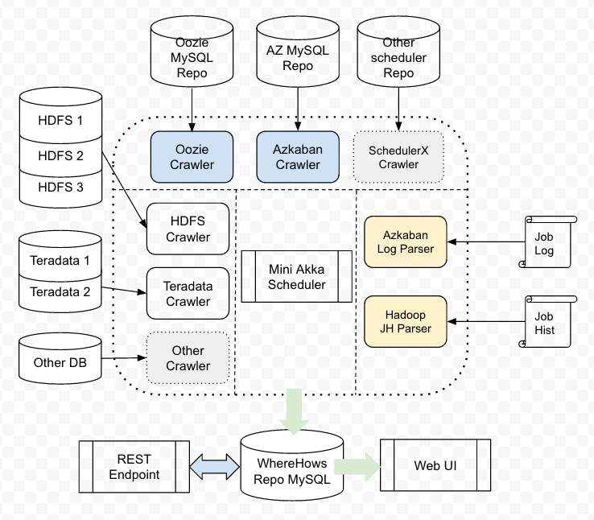
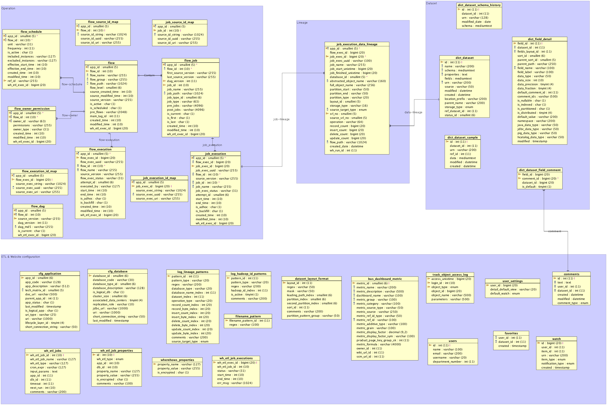
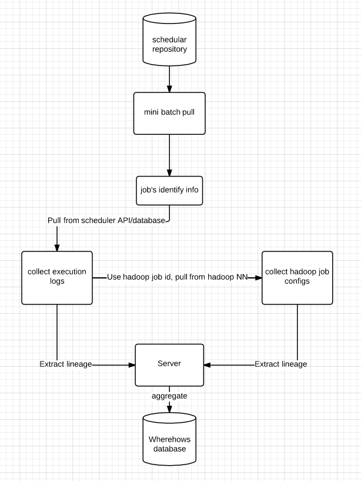

# Architecture

> Note: The info here may be outdated.

1. [Overview](#overview)
1. [Data model](#data-model)
1. [Backend ETL](#backend-ETL)
    1. [Technology stacks](#technology-stacks)
    1. [Dataset ETL](#dataset-etl)
    1. [Operation data ETL](#operation-data-etl)
    1. [Lineage ETL](#lineage-etl)
1. [UI](#ui)
    1. [Web Framework](#web-framework)
    1. [Search](#search-advanced-search-index)
    1. [Web Analytics](#web-analytics)

## Overview

On a high level view, WhereHows system can be divided into three parts: data model, backend ETL, and Web Service. We have  periodical jobs fetching metadata from different systems that is then transformed and stored in the WhereHows repository. These jobs can be scheduled through our internal AKKA scheduler, which can be run independently or scheduled through any other schedulers. Our storage currently is a MySQL Database. We also provide a UI and APIs to interact with users.

## Data model

Four data components:
* Datasets: Dataset schema, comments, sample data...
* Operational data: flow group, flow, job, job dependency, execution, id map tables (helper tables to generate unique IDs)
* Lineage data: input and output of jobs, dependency, partition, high watermark
* WhereHows ETL and Web UI/Service: configurations

The datasets and Operation data are just like two endpoints, and the lineage data is the bridge that connects the two nodes. In this way, a user can either start from a dataset to explore which jobs produce or consume it, or start from a job to check what datasets it reads from or writes to.

One key point of the design of the data model is we want to keep it as general as possible, so datasets, operation data, and lineage data from different system can fit in the same schema, and query by the same strategy.

## Backend ETL

### Technology Stacks
We used Java + Jython + MySQL

When doing data analysis, most people’s first choice is Python, because it’s easy and intuitive. But in our project, because we communicate directly and frequently with the Hadoop ecosystem, and we have to deal with some security issues, we needed something more powerful/intuitive in these areas than Python. We chose Java + Jython as our major language. We took advantage of the maturity and standardization of Java, as well as the agility of Python.

The other reason for choosing this combination is to better support ETL, which depends on the source structure. When a user wants to extend for more source systems, most situations require that they rewrite the ETL process based on their requirements. We use Java to build the _framework_, defining the inputs and outputs of each ETL step. We then use Jython as resource files to handle the ETL process. This makes the structure more clear, allowing better visibility into what needs to be customized.

Also, because we communicate extensively with the relational database, we heavily use SQL.

### Dataset ETL

We collect dataset metadata and store this into WhereHows repository. Dataset metadata includes schema, path, partition, sample data, high watermark, and so on.
Currently we are collecting both Hadoop and Teradata dataset metadata.

HDFS: We have a program that scans all the folders in a whitelist, collecting the information on dataset level. The program can be run remotely on a Hadoop gateway and copies back the results into the WhereHows database. Note that we need an account with a high read permission to read all datasets.

Teradata: Query from DBC tables

### Operation data ETL
Operational data include: flow group definition, flow definition, job definition, ownership info, schedule info, flow execution info, job execution info.
Our operational data ETL is a periodic process that fetches this information from the scheduler database to WhereHows database. This uses a standard data model, which ensures that there is a unified way to find operation information.

* Pain Point 1:
Different scheduler systems have different data models. So we need to transform them into a uniform data model.
For example, Azkaban is executed on a flow level and it has a unique key for flow execution, but it doesn’t have a unique key for job execution. On the other hand, Oozie has a uuid for each job execution. To handle this, we generate a smart key for Azkaban job execution by combining the execution id and the order of the job inside this execution, and we generate an integer id by mapping the uuid to a integer. This way they can fit in the same model. As more schedulers are added, different mapping can be used to map the data model into the WhereHows data model.

* Pain Point 2:
Many source metadata systems do not track version/revision, or track version at the less intuitive level. WhereHows uses the mapping logic to track the changes at more human-friendly level:
For example, WhereHows derived flow version: certain schedulers, such as Oozie, do not keep a version of a flow, and even Azkaban lacks a flow level version. In these cases, after we collect the flow metadata, we compare it with the old DAG structure, retaining the version number internally. WhereHows uses the derived DAG version as the general version for all operation data. 

### Lineage ETL
Lineage information refers to the dependency of jobs and datasets. It also includes some operation data, such as whether this is a read or write operation, and how many records it can read/write.

#### How

Basic strategy is to collect the lineage information from logs and configuration files. For example, one Pig job had many Hadoop jobs, and in Hadoop job configure files we can see fields such as “mapreduce.input.fileinputformat.inputdir”, which refers to this specific Hadoop job’s lineage. We collect all children Hadoop jobs’ input and output, aggregate them to parent level jobs, and store them in the WhereHows database.

#### When
The lineage ETL jobs need to have an entry point. At this point, we need to have (a list of) job identity information so we can retrieve the lineage information.

Our previous version was using an offline MapReduce job to analyze a batch of execution logs and Hadoop job configuration files. This method has a significant delay, because it depends on the dump of execution logs and job configuration files.

The MapReduce job is a completely offline solution, but on the other side, we can have a strictly real-time solution. We can trigger from the executor/scheduler once a job is finished, but this needs some installation on the executor/scheduler side.
Actually, as a knowledge-based metadata repository, the latency is not critical for WhereHows. A latency of 5-10 minutes is acceptable for us, so we chose a “minibatch pull” solution.

We have a pull job pull from the scheduler's repository, check which jobs finished in the last 30 minutes (a configurable window), and then use this as an entry point to pull their logs and configuration files to analyze their lineage.

## UI
### Web and JavaScript Framework

Play + Ember.js

The Play Framework is a framework for building frontend and mid-tier services at LinkedIn. Play is an open source, lightweight, fully reactive, stateless framework that supports hot reload for Java and Scala.
Ember.js is designed to help developers build ambitiously large web applications that are competitive with native applications.

### Search/Advanced Search and Index
MySQL Full Text Index

Full-text searching is commonly performed by specialized search engines whose aim is to extract interesting and nontrivial information from free-form text. Full-text searches tend to produce better search results by the use of specialized techniques such as pattern recognition, natural language processing, and text analysis to provide quick retrieval of information that otherwise would remain concealed.

### Web Analytics
Google Analytics + Internal user activity tracking.
We have the table track_object_access_log to record user’s each activity.
